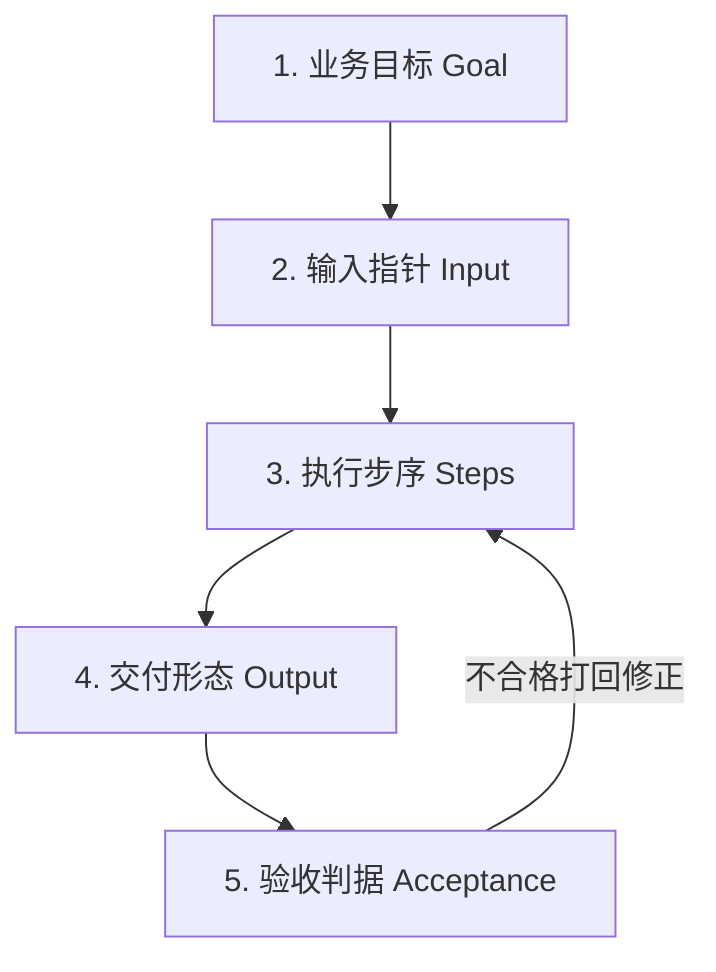
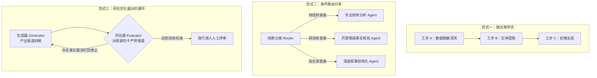
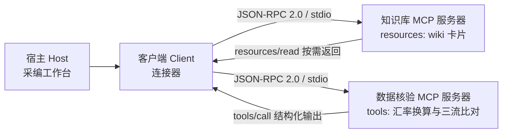
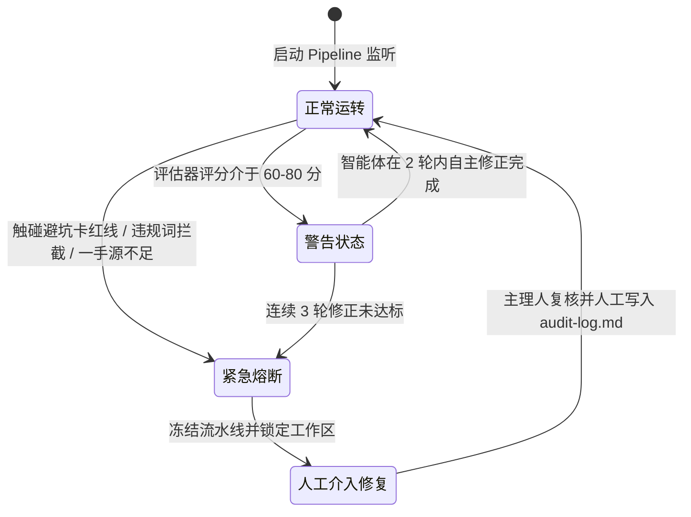
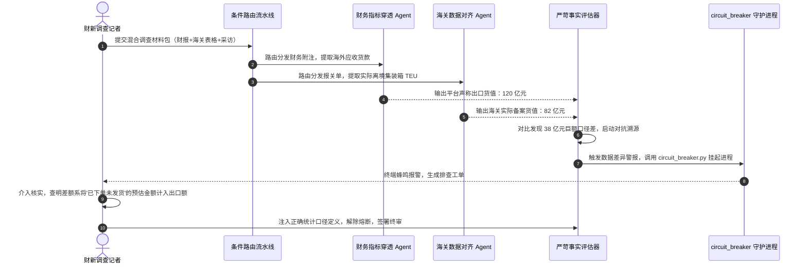

## 学习要点

- 掌握卡片盒笔记法（Zettelkasten）在新闻专业知识沉淀中的应用，建立包含概念卡、配方卡与避坑卡的三层原子化事实底座，并理解双向链接局部检索降低注意力衰减的物理机制。
- 掌握复杂采编任务的五要素工程拆解法（Goal, Input, Steps, Output, Acceptance Criteria），编写消除歧义的工业级任务工单（Task Contract）。
- 熟练开发现代智能体三大核心工作流范式：链式顺序流、条件路由分发与评估优化器对抗流，并理解模型上下文协议（Model Context Protocol, MCP）在工具面标准化中的作用。
- 掌握智能体流水线的熔断机制、中间状态透明化规程与纠错台账，实现人机协同采编的高可靠性交付。
- 能够以财经调查与跨境虚假贸易核验为场景，独立完成从知识卡片入库、任务工单下发、流水线执行到人工终审签署的完整工程闭环。

## 本章引言

随着全媒体调查报道向深层财经财务穿透、海量跨境贸易追踪以及复杂社会网络分析不断延展，采编团队面临的信息加工体量呈几何级数递增。在财新数据新闻中心针对上市公司财务造假的长期调查中，记者需要同时处理数十家关联企业的招股说明书、审计报告附注、工商变更记录以及多方诉讼判决书。面对此类高密度专业材料，把大语言模型当作单问单答的检索窗口，采编人员依然会陷入低效核验与无序修补的困境。

实现智能媒体生产力质变的关键路径，是将记者的调查经验与离散事实解构为可计算、可编排、可溯源的模块化内容工程。这条工程路线由两个互相咬合的支撑面构成。原子化知识工程为智能体筑牢事实与理论底座，阻断网络快餐信息与算法幻觉的渗透。智能体工作流编排技术（Agentic Workflows）把繁复的线索清洗、事实提取、草稿生成与合规审查串联为端到端自动化流水线。知识库提供可信上下文，流水线负责调度与留痕，二者共同支撑高保真产出。

这条路线在两类生产主体中已经落地。以影视飓风、晚点 LatePost、差评为代表的头部数字内容工作室，人数精干，一人身兼选题、脚本、拍摄与剪辑多职，它们把选题判断、技术参数与踩坑教训写成本地笔记反复复用。以财新、澎湃新闻“明查”栏目、路透社（Reuters）、美联社（Associated Press）为代表的严肃采编机构，把信源分级、核验工步与合规红线沉淀为团队共享的操作规范。两类主体共享同一套工程逻辑：经验写成卡片，流程写成工单，判断留给人。

本章系统阐明三层原子化知识库构建、五要素任务工单编写、三大核心编排范式的功能开发、模型上下文协议接入以及人工熔断把关的系统设计，为高保真新闻生产提供工程化实施底座。


## 第一节 原子化知识库与一手事实底座

### 一、学理背景与二手信息降级风险

在计算机科学与新闻传播工程中，基本定律“垃圾进，垃圾出”（Garbage In, Garbage Out）表现得极为显著。部分采编人员习惯从社交媒体碎片化解读、未经核实的自媒体营销号文章中复制粘贴材料，将其作为知识背景输入给模型。这种输入方式极易诱发严重的算法幻觉。模型基于充满逻辑断层与虚假数据的语料进行概率续写，产出的文本必然充斥伪因果推论与错位事实。概率续写的机制决定了这一点：模型在给定前文的条件下挑选下一个高概率词元，它无法区分前文中的断言经过法定审计，还是来自匿名账号的揣测。

新闻传播领域的专业知识库必须建立严格的准入防线。所有沉淀入库的知识原材料，必须溯源至现场一手调查采访笔录、国家统计局官方公报、经过同行评议的核心期刊文献以及上市公司正式披露的法定财报。为便于机器校验，本章确立四级信源等级，卡片元数据头必须逐条标注：

- **S1 法定披露与官方统计**：上市公司定期报告、审计报告、海关总署统计、裁判文书、政府公报。
- **S2 一手现场材料**：采访录音整理稿、实地探访笔记、可核验的原始单据与提单存根。
- **S3 多源交叉印证报道**：至少两家权威机构独立报道且事实口径一致的内容。
- **S4 未核实转述**：自媒体解读、匿名爆料、二手摘编。此类材料仅可作为线索登记，严禁作为事实断言入库。

澎湃“明查”栏目的公开操作规程、路透社与美联社的生成式人工智能使用准则，都把“每一条断言对应可查证的原始出处”列为发布前的硬性要求。这一要求在卡片化知识工程中被固化为机器可校验的字段。

### 二、卡片盒笔记法与三层原子化知识架构

德国社会学家尼克拉斯·卢曼（Niklas Luhmann）在数十年学术生涯中积累了约九万张纸质卡片，卡片之间以编号互相引用，形成一张自底向上生长的思考网络。申克·阿伦斯（Sönke Ahrens）在《卡片笔记写作法》中将这套方法概括为三条操作原则：一次只写一个想法，用自己的话写下来，写下想法之间的关联。这三条原则恰好对应了知识工程的原子性、转译性与图结构要求。

融媒体知识工程借鉴这一思想，将非结构化原始素材解构为三类独立的纯文本 Markdown 原子卡片，存放于本地 `wiki/` 目录中：

```text
wiki/                              # 本地原子化知识库根目录
├── concepts/                      # 【概念卡】定义专业范畴、理论模型与机理
│   ├── agenda-setting.md          # 网络化议程设置理论
│   ├── circular-trading.md        # 循环贸易与虚假自融判定标准
│   └── revenue-recognition.md     # 收入确认时点与出口货值统计口径
├── recipes/                       # 【配方卡】固化采编生产 SOP 与工程工步
│   ├── audit-report-extract.md    # 财报审计附注提取标准作业规程
│   └── cross-border-tracing.md    # 跨境离岸公司穿透核验工步
└── pitfalls/                      # 【避坑卡】收录高频事实漏洞、伦理红线与逻辑谬误
    ├── currency-mixing.md         # 多币种混算避坑卡
    ├── false-correlation.md       # 伪因果推论避坑卡
    └── unverified-source.md       # 单一匿名源采纳避坑卡
```

概念卡（Concepts）用于定义专业核心范畴与理论框架，回答“是什么”的问题。每张概念卡记录唯一核心概念，标明学术理论出处、核心运作机制以及易混淆概念的辨析边界。

配方卡（Recipes）用于固化成熟的采编作业规程，回答“怎么做”的问题。每张配方卡对应一项具体的工业化动作，声明前置依赖条件、所需输入材料、标准化执行步骤与输出交付成果形态。

避坑卡（Pitfalls）用于归纳采编流程中的高频缺陷与法务红线，回答“绝不能做什么”的问题。每张避坑卡记录典型的采编失误案例、触发条件、事故危害以及对应的机器防御检查点。

两类生产主体使用这套体系的侧重点存在差异。超级个体的内容工作室把卡片盒当作个人外脑，卡片覆盖选题库、脚本结构模板、设备参数、剪辑节奏与商务合规要点，单人即完成入库、检索、复用的全闭环，卡片的首要价值在于把重复搜索的时间成本压缩为一次链接跳转。严肃采编团队把卡片盒当作跨记者的语义基座，卡片写明责任人、核验日期与信源等级，由模块主理人定期审查，卡片的首要价值在于让不同记者对同一专业术语持有同一判定基准，避免口径漂移。

原子性是这套体系的工程前提。一张卡片承载一条断言，正文控制在八百字以内，脱离上下文依然可读，头部必须携带机器可校验的元数据。字段规范见表 2-1。

**表 2-1 原子卡片元数据字段规范（三线表）**

| 字段名 | 含义 | 示例值 | 机器校验规则 |
| :--- | :--- | :--- | :--- |
| `id` | 卡片唯一标识 | `concept-circular-trading` | 全库唯一，不得重复 |
| `title` | 卡片标题 | 循环贸易与虚假自融判定标准 | 与文件名主干保持一致 |
| `type` | 卡片类型 | `concepts` | 仅允许 concepts、recipes、pitfalls 三值 |
| `status` | 生命周期状态 | `active` | active 与 deprecated 二值，deprecated 必须附归档说明 |
| `version` | 语义化版本 | `1.2.0` | 语义化版本格式，事实口径变更必须升版 |
| `updated` | 最近核验日期 | `2026-09-05` | ISO 8601 日期，超过三百六十五天触发复核提醒 |
| `source_level` | 信源等级 | `S1` | 仅允许 S1 至 S4 四值 |
| `summary` | 一句话摘要 | 同批货物在关联方闭环流转的判定口径 | 四十字以内，供检索列表展示 |
| `refs` | 学理与事实出处 | `GB/T 7714 著录条目编号` | 至少一条，S1 与 S2 等级必须给出原始页码或单据号 |

三类卡片的实例如下。概念卡写判定标准，配方卡写可执行工步，避坑卡写机器拦截点：

```markdown
---
id: concept-circular-trading
title: 循环贸易与虚假自融判定标准
type: concepts
status: active
version: 1.2.0
updated: 2026-09-05
source_level: S1
summary: 同批货物在关联方闭环流转且缺少真实货权交割的判定口径
refs: 上交所《上市公司自律监管指引》财务类退市指标说明；某省高院(2024)民终字第1187号判决书
---

# 循环贸易与虚假自融判定标准

循环贸易指同一批货物在两家以上关联企业之间闭环流转，合同流、资金流与票据流齐备，货物流却缺少真实的仓储出入库记录与提单交割。判定需同时满足三项条件：交易对手在股权或高管层面存在关联；同一货值在十二个月内多次转手且毛利率显著偏离行业均值；物流仓储单据缺失或无法与报关单核对。

易混淆概念辨析：循环贸易以虚构交易背景套取资金为主，虚增收入以做大报表规模为主，两者在收入确认时点的操纵手法上存在交集，在资金流向上存在分野。

关联卡片：[[revenue-recognition]]、[[cross-border-tracing]]、[[currency-mixing]]。
```

```markdown
---
id: pitfall-currency-mixing
title: 多币种混算避坑卡
type: pitfalls
status: active
version: 1.0.1
updated: 2026-09-08
source_level: S2
summary: 跨币种表格数值直接相加会放大数据差额
refs: 本课程第 2 章审计台账 AUDIT-FINANCE-20250909-002
---

# 多币种混算避坑卡

触发条件：输入材料包含美元、离岸人民币或港币多列数值，且任务要求计算差额或合计。

事故危害：智能体在缺乏币种标识识别时会直接对数值绝对值求和，把 5 亿美元与 20 亿元人民币累加为 75 亿的虚假合计，差额被放大数倍。

机器防御检查点：`circuit_breaker.py` 校验每张输出表格必须携带 `currency` 字段；任何跨币种运算必须显式给出汇率来源与换算日；缺少汇率标注的合计行一律打回。

关联卡片：[[circular-trading]]、[[audit-report-extract]]。
```

### 三、工程契约与双链局部检索的物理机制

三类卡片通过 Markdown 双向链接语法（`[[链接目标]]`）交织为自底向上的网状认知图谱。配方卡在调用具体工步时，显式引用对应的概念卡作为学理依据，同时挂载避坑卡作为质量拦截防线。链接语法支持三种形态：基础形态 `[[circular-trading]]`、锚点形态 `[[circular-trading#易混淆概念辨析]]`、别名形态 `[[currency-mixing|币种混算红线]]`。

双向链接在工程上承担导航与图结构两项功能。导航面向人与智能体，读者沿链接在卡片之间跳转，随时核对学理依据与拦截红线。图结构面向流水线，解析器扫描全库后得到邻接表，任一任务只要声明起点卡片，就能以两跳为半径拉取局部子图，替代把整库语料塞进提示词的做法。

图结构功能直接对应大语言模型的物理约束。Transformer 自注意力层对每个词元分配注意力权重，权重由查询向量与键向量的点积经 Softmax 归一化得到：

$$
\alpha_i = \frac{\exp(q \cdot k_i / \sqrt{d})}{\sum_{j=1}^{N} \exp(q \cdot k_j / \sqrt{d})}
$$

上下文长度 $N$ 增大时，分母项随之膨胀，与当前推理步骤真正相关的词元分得的注意力权重被稀释。刘（Liu N F）等人在《迷失在中部》一文中给出了直接证据：当检索目标位于长上下文的中部位置时，模型的抽取准确率呈 U 形下陷，两端位置的准确率显著高于中部。这一现象的物理解释是位置相关的注意力衰减与无关词元的相互干扰，它们共同推高了有效信息被检索到的难度。

长上下文还带来直接的计算成本。自注意力预填充阶段的计算量随序列长度按平方增长，键值缓存（KV Cache）的显存占用随序列长度线性增长，商业接口按词元计费。把三十万字行业报告整体注入提示词，付出的是数倍的延迟与费用，换回的是中部信息抽取准确率的下降。

局部检索机制针对这两项约束设计。解析器依据 `[[wikilink]]` 构建的邻接表，把与任务相关的三至八张卡片注入上下文，每张卡片正文控制在六百词元以内，注入总量控制在五千词元以内。此时查询与证据的相对距离缩短，证据多数落在上下文的首尾注意优势区，无关词元的干扰面收窄，注意力权重得以集中在有效断言上。

卡片盒的确定性链接检索与向量语义检索互为补充。链接检索解决“作者明确声明过关联”的场景，召回精确且可审计；向量检索解决“作者尚未建立链接”的近义召回场景，覆盖广但需要人工确认。生产实践中的通行做法是先跑链接检索拉取邻域子图，再用向量检索补齐候选，最后按信源等级过滤。

为使智能体能够自动化检索并穿透验证卡片间的链接关系，编写知识库卡片解析脚本 `ingest_knowledge_card.py`。该脚本扫描本地知识库，解析元数据头，提取所有卡片链接，校验死链与孤岛卡片，并导出可供模型上下文协议注册的资源清单：

```python
"""本地原子化知识库解析器。

职责：
1. 扫描 wiki/ 目录下的 Markdown 卡片，解析元数据头与正文；
2. 提取 [[wikilink]] 双向链接，兼容别名语法 [[目标|标签]] 与锚点语法 [[目标#小节]]；
3. 校验坏链、孤岛卡片、卡片类型与信源等级；
4. 导出模型上下文协议（MCP）资源清单 mcp_resources.json，供流水线按需拉取。
"""

from __future__ import annotations

import argparse
import json
import logging
import re
import sys
import tempfile
from dataclasses import dataclass, field
from pathlib import Path
from typing import Any

logger = logging.getLogger("ingest_knowledge_card")

# 双向链接正则：目标、锚点、别名三段均可省略
LINK_PATTERN = re.compile(r"\[\[([^\]|#]+)(?:#([^\]|]+))?(?:\|([^\]]+))?\]\]")
# 元数据头正则：匹配文件首部以 --- 包裹的键值块
FRONTMATTER_PATTERN = re.compile(r"\A---\s*\n(?P<meta>.*?)\n---\s*\n", re.DOTALL)
# 允许的卡片目录与信源等级
CARD_TYPES: frozenset[str] = frozenset({"concepts", "recipes", "pitfalls"})
SOURCE_LEVELS: frozenset[str] = frozenset({"S1", "S2", "S3", "S4"})


@dataclass(frozen=True)
class CardMeta:
    """卡片元数据头的强类型表示。"""

    title: str
    card_type: str
    status: str
    version: str
    updated: str
    source_level: str
    summary: str


@dataclass
class Card:
    """单张原子卡片的解析结果。"""

    path: str
    stem: str
    meta: CardMeta
    body: str
    outbound: list[tuple[str, str, str]] = field(default_factory=list)

    @property
    def char_count(self) -> int:
        """返回卡片正文字符数，用于原子性（八百字以内）校验。"""
        return len(self.body)


@dataclass
class WikiGraph:
    """知识库图谱与完整性校验报告。"""

    cards: dict[str, Card] = field(default_factory=dict)
    inbound: dict[str, set[str]] = field(default_factory=dict)
    broken_links: list[dict[str, str]] = field(default_factory=list)
    orphan_cards: list[str] = field(default_factory=list)
    type_violations: list[str] = field(default_factory=list)

    def summary(self) -> dict[str, Any]:
        """输出控制台与流水线共用的汇总结构。"""
        type_counts: dict[str, int] = {}
        for card in self.cards.values():
            type_counts[card.meta.card_type] = type_counts.get(card.meta.card_type, 0) + 1
        return {
            "total_cards": len(self.cards),
            "type_counts": type_counts,
            "broken_links_count": len(self.broken_links),
            "broken_links": self.broken_links,
            "orphan_cards": self.orphan_cards,
            "type_violations": self.type_violations,
        }


def parse_frontmatter(text: str) -> tuple[dict[str, str], str]:
    """拆分元数据头与正文，返回键值字典与正文文本。"""
    match = FRONTMATTER_PATTERN.match(text)
    if match is None:
        return {}, text

    meta: dict[str, str] = {}
    for raw_line in match.group("meta").splitlines():
        line = raw_line.strip()
        if not line or line.startswith("#") or ":" not in line:
            continue
        key, _, value = line.partition(":")
        meta[key.strip()] = value.strip().strip("'\"")

    return meta, text[match.end():]


def extract_links(body: str) -> list[tuple[str, str, str]]:
    """提取正文中的双向链接，返回 (目标, 锚点, 别名) 三元组列表。"""
    links: list[tuple[str, str, str]] = []
    for target, anchor, alias in LINK_PATTERN.findall(body):
        links.append((target.strip(), anchor.strip(), alias.strip()))
    return links


def build_graph(wiki_dir: Path) -> WikiGraph:
    """遍历本地知识库，构建卡片图谱并执行完整性校验。"""
    if not wiki_dir.is_dir():
        raise FileNotFoundError(f"知识库目录不存在: {wiki_dir}")

    graph = WikiGraph()
    for md_file in sorted(wiki_dir.rglob("*.md")):
        rel_path = md_file.relative_to(wiki_dir).as_posix()
        raw_text = md_file.read_text(encoding="utf-8")
        meta_dict, body = parse_frontmatter(raw_text)
        parent_type = md_file.parent.name

        if parent_type not in CARD_TYPES:
            graph.type_violations.append(f"{rel_path}: 目录 {parent_type} 不属于合法卡片类型")
        if meta_dict.get("type", parent_type) not in CARD_TYPES:
            graph.type_violations.append(f"{rel_path}: 元数据 type 字段非法")
        if meta_dict.get("source_level", "S1") not in SOURCE_LEVELS:
            graph.type_violations.append(f"{rel_path}: 元数据 source_level 字段非法")

        card = Card(
            path=rel_path,
            stem=md_file.stem,
            meta=CardMeta(
                title=meta_dict.get("title", md_file.stem),
                card_type=meta_dict.get("type", parent_type),
                status=meta_dict.get("status", "active"),
                version=meta_dict.get("version", "0.0.0"),
                updated=meta_dict.get("updated", "1970-01-01"),
                source_level=meta_dict.get("source_level", "S1"),
                summary=meta_dict.get("summary", ""),
            ),
            body=body,
            outbound=extract_links(body),
        )
        graph.cards[rel_path] = card
        graph.inbound.setdefault(rel_path, set())

    # 校验链接有效性与入度统计
    known_stems = {card.stem for card in graph.cards.values()}
    stem_to_path = {card.stem: card.path for card in graph.cards.values()}
    for source_path, card in graph.cards.items():
        for target, anchor, alias in card.outbound:
            if target not in known_stems:
                graph.broken_links.append({
                    "source": source_path,
                    "missing_target": target,
                    "anchor": anchor,
                    "alias": alias,
                })
                continue
            graph.inbound[stem_to_path[target]].add(source_path)

    # 孤岛卡片：既无出链也无入链，无法接入知识网络
    for rel_path, card in graph.cards.items():
        if not card.outbound and not graph.inbound.get(rel_path):
            graph.orphan_cards.append(rel_path)

    return graph


def build_mcp_manifest(graph: WikiGraph) -> list[dict[str, str]]:
    """把卡片图谱转换为 MCP 资源清单，供智能体按需读取。

    资源 URI 采用 wiki:// 前缀，与模型上下文协议的 resources/list、
    resources/read 接口一一对应，避免整库注入提示词。
    """
    manifest: list[dict[str, str]] = []
    for card in graph.cards.values():
        uri = "wiki://" + card.path[:-3] if card.path.endswith(".md") else "wiki://" + card.path
        manifest.append({
            "uri": uri,
            "name": card.stem,
            "description": card.meta.summary or card.meta.title,
            "mimeType": "text/markdown",
            "cardType": card.meta.card_type,
            "sourceLevel": card.meta.source_level,
            "version": card.meta.version,
        })
    return manifest


def write_manifest(manifest: list[dict[str, str]], output_path: Path) -> None:
    """把 MCP 资源清单写入 JSON 文件。"""
    output_path.parent.mkdir(parents=True, exist_ok=True)
    payload = {"protocol": "model-context-protocol", "resources": manifest}
    output_path.write_text(
        json.dumps(payload, ensure_ascii=False, indent=2), encoding="utf-8"
    )
    logger.info("MCP 资源清单已写入 %s，共 %d 条资源", output_path, len(manifest))


def run(wiki_dir: Path, manifest_path: Path) -> dict[str, Any]:
    """执行一次完整的知识库解析与校验流程。"""
    graph = build_graph(wiki_dir)
    manifest = build_mcp_manifest(graph)
    write_manifest(manifest, manifest_path)
    return graph.summary()


def build_demo_wiki(root: Path) -> Path:
    """在指定目录下生成一套最小可用的示例知识库。"""
    (root / "concepts").mkdir(parents=True, exist_ok=True)
    (root / "recipes").mkdir(parents=True, exist_ok=True)
    (root / "pitfalls").mkdir(parents=True, exist_ok=True)

    (root / "concepts" / "circular-trading.md").write_text(
        "---\n"
        "id: concept-circular-trading\n"
        "title: 循环贸易与虚假自融判定标准\n"
        "type: concepts\n"
        "status: active\n"
        "version: 1.2.0\n"
        "updated: 2026-09-05\n"
        "source_level: S1\n"
        "summary: 同批货物在关联方闭环流转的判定口径\n"
        "---\n\n"
        "# 循环贸易与虚假自融判定标准\n\n"
        "同批货物在关联企业闭环流转且缺少真实货权交割。\n\n"
        "关联卡片：[[revenue-recognition]]、[[cross-border-tracing]]。\n",
        encoding="utf-8",
    )
    (root / "concepts" / "revenue-recognition.md").write_text(
        "---\ntitle: 收入确认时点\ntype: concepts\nstatus: active\n"
        "version: 1.0.0\nupdated: 2026-09-05\nsource_level: S1\n"
        "summary: 出口货值统计口径与收入确认时点\n---\n\n"
        "# 收入确认时点\n\n以报关离境日与提单交割日为收入确认基准。\n",
        encoding="utf-8",
    )
    (root / "recipes" / "cross-border-tracing.md").write_text(
        "---\ntitle: 跨境离岸公司穿透核验工步\ntype: recipes\nstatus: active\n"
        "version: 1.1.0\nupdated: 2026-09-06\nsource_level: S2\n"
        "summary: 三流合一核验标准作业规程\n---\n\n"
        "# 跨境离岸公司穿透核验工步\n\n"
        "依据 [[circular-trading#易混淆概念辨析]] 核对合同流、资金流与货物流，"
        "红线见 [[currency-mixing|币种混算红线]]。\n",
        encoding="utf-8",
    )
    (root / "pitfalls" / "currency-mixing.md").write_text(
        "---\ntitle: 多币种混算避坑卡\ntype: pitfalls\nstatus: active\n"
        "version: 1.0.1\nupdated: 2026-09-08\nsource_level: S2\n"
        "summary: 跨币种数值直接相加会放大数据差额\n---\n\n"
        "# 多币种混算避坑卡\n\n跨币种合计必须显式给出汇率来源与换算日。\n",
        encoding="utf-8",
    )
    return root


def main(argv: list[str] | None = None) -> int:
    """命令行入口，返回进程退出码。"""
    parser = argparse.ArgumentParser(description="解析本地知识库并导出 MCP 资源清单")
    parser.add_argument("--wiki-dir", type=Path, default=Path("wiki"), help="知识库根目录")
    parser.add_argument(
        "--manifest", type=Path, default=Path("working/mcp_resources.json"),
        help="MCP 资源清单输出路径",
    )
    parser.add_argument("--fail-on-broken", action="store_true", help="发现坏链时以非零码退出")
    parser.add_argument("--demo", action="store_true", help="在临时目录生成示例知识库并解析")
    parser.add_argument("--verbose", action="store_true", help="输出调试日志")
    args = parser.parse_args(argv)

    logging.basicConfig(
        level=logging.DEBUG if args.verbose else logging.INFO,
        format="[%(levelname)s] %(message)s",
    )

    if args.demo:
        with tempfile.TemporaryDirectory(prefix="wiki_demo_") as tmp:
            wiki_dir = build_demo_wiki(Path(tmp))
            report = run(wiki_dir, args.manifest)
    else:
        try:
            report = run(args.wiki_dir, args.manifest)
        except FileNotFoundError as exc:
            logger.error("%s", exc)
            return 2

    print(
        f"知识库索引完成：共收录 {report['total_cards']} 篇原子卡片，"
        f"坏链数：{report['broken_links_count']}，"
        f"孤岛卡片数：{len(report['orphan_cards'])}，"
        f"类型分布：{report['type_counts']}"
    )
    if report["type_violations"]:
        print("字段校验告警：")
        for item in report["type_violations"]:
            print(f"  - {item}")

    if args.fail_on_broken and report["broken_links_count"] > 0:
        return 1
    return 0


if __name__ == "__main__":
    sys.exit(main())
```

脚本的输出示例如下，坏链数为零是知识库进入流水线的准入门槛：

```text
[INFO] MCP 资源清单已写入 working/mcp_resources.json，共 4 条资源
知识库索引完成：共收录 4 篇原子卡片，坏链数：0，孤岛卡片数：0，类型分布：{'concepts': 2, 'pitfalls': 1, 'recipes': 1}
```

### 四、边界约束与外部知识准入边界

知识库具备高度的动态演进属性。任何沉淀入库的事实陈述必须标注明确的时间戳与信源版本号。随着经济环境变迁与法律政策更新，过期的行业统计数据与失效的行政法规必须及时打上废除标记或移入历史归档目录，严禁新旧版本事实混杂。采编团队应指派专业记者作为模块主理人，定期审查知识卡片之间的逻辑一致性，维护底层事实库的准确性。

三条边界约束值得在制度层面固化。卡片正文的事实断言超过三百六十五天未复核，解析器在索引时输出复核提醒，超过七百三十天自动置为 `deprecated`。废止卡片保留出链，供历史稿件溯源，禁止从活跃卡片指向废止卡片。卡片更新后必须同步刷新 MCP 资源清单，流水线拉取到的资源版本与本地版本保持一致，避免运行时读到陈旧口径。

## 第二节 复杂采编任务的五要素工程拆解

### 一、认知负荷理论下的任务解构必要性

约翰·斯威勒（John Sweller）开创的认知负荷理论把学习与作业中的心智负担分为三类：由材料本身复杂度决定的内在负荷，由材料呈现方式不当造成的外在负荷，以及用于建构图式的相关负荷。工程优化的目标集中在削减外在负荷，把有限的工作记忆容量留给推理本身。内森·考恩（Nelson Cowan）对工作记忆容量的测算显示，成人即时保持的独立组块约为四个，超出部分会迅速衰减或互相干扰。

当采编人员面对“撰写一篇关于新能源汽车出海贸易壁垒与供应链重构的深度调查特稿”这一宏大命题时，若试图单次交互完成跨国政策梳理、财报数据透视、国际运价对比以及叙事文本起草，必然产生极高的外在认知负荷。超级个体在内容工作室里承受的负荷尤为沉重，一人身兼数职意味着同一段工作记忆要在政策口径、数据校验与镜头脚本之间频繁切换。

大语言模型在本质上同样受到单次注意力窗口与推理深度的制约。直接向模型输入宽泛宏大的任务指令，模型只能在表层语义网络中进行泛化概率续写，产出充斥口号套话的平庸文本。只有将复杂任务分解为一系列粒度受控、输入明确、判据严密的子工序，人机协同才能产生高质量成果。

### 二、五要素工程拆解模型

专业采编工程将复杂的采编任务解构为具备完备定义性的五要素模型（Goal, Input, Steps, Output, Acceptance Criteria）：



1. 目标（Goal）：明确声明该工步所要达成的核心采编业务目标，用一句话精准界定问题边界，剔除模糊诉求。
2. 输入（Input）：通过显式文件路径或指针变量，列出本工步计算所需的一切原始材料，严禁模型访问未经声明的外部上下文。
3. 步骤（Steps）：将处理逻辑拆解为具备先后时序依赖的动作序列，明确每一动作的计算重点。
4. 输出（Output）：约定交付产物的物理保存路径、文本格式层级以及字段架构。
5. 验收（Acceptance Criteria）：设立明确的质量判据与量化指标，作为人工终审与机器对抗校验的判决标准。

每个要素在工程上都有必须声明的字段与对应的失效模式，详见表 2-2。

**表 2-2 五要素的工程字段与失效模式（三线表）**

| 要素 | 必须声明的字段 | 典型失效模式 | 机器校验点 |
| :--- | :--- | :--- | :--- |
| Goal | 一句话目标、问题边界、排除项 | 目标包含多个并列诉求，模型平均用力 | 目标句长度与并列连词计数 |
| Input | 文件指针、信源等级、版本号、MCP 资源 URI | 隐式依赖未声明材料，模型自行网络补全 | 指针存在性校验、信源等级校验 |
| Steps | 编号工步、时序依赖、每步检查点 | 工步粒度过粗，失败后无法定位 | 工步数与检查点字段完整性 |
| Output | 保存路径、格式层级、字段架构 | 输出落盘位置随意，下游无法接管 | 路径合法性、JSON Schema 校验 |
| Acceptance | 量化指标、红线条款、责任签署人 | 判据主观，验收流于形式 | 判据可执行性与阈值数值存在性 |

### 三、契约化任务工单的工业级编写规程

基于五要素模型，采编团队在发起具体工作时，统一在 `tasks/` 目录下编写符合规范的 Markdown 任务工单。工单由机器可读的头部与人机共读的正文两部分组成，头部声明工单编号、责任人、依赖卡片与熔断策略，正文承载五要素全文。流水线引擎 `agent_pipeline.py` 解析头部派发任务，人类主理人阅读正文实施终审。

虚假贸易核验是财经调查中的高难度场景。以下工单对应“跨境出口货值虚增”的事实要素穿透任务，输入材料覆盖审计附注、现场笔录与海关报关存根，卡片挂载概念、配方与避坑三类知识：

```markdown
# 任务工单：跨境出口货值虚增事实要素穿透提取 (tasks/financial-fraud-extract.md)

---
id: TASK-FINANCE-20250909-007
owner: 杨志宏
due: 2026-09-12
depends_on: [concept-circular-trading, concept-revenue-recognition, recipe-audit-report-extract]
pitfalls: [pitfall-currency-mixing, pitfall-false-correlation]
mcp_resources: [mcp://wiki/concepts/circular-trading, mcp://wiki/concepts/revenue-recognition]
breaker_policy: config/safety_policy.json
---

## 1. 业务目标 (Goal)
从涉事企业 2025 年半年度财务报告审计附注、现场调查笔录与海关报关存根中，精准提取前五大供应商关联关系、应收账款账龄异常、物流仓储单据缺失三类事实，形成结构化线索事实表。本工单排除对涉事人员主观动机的任何定性判断，排除对未公开司法进程的推测。

## 2. 输入指针 (Input)
- 财报审计附注文本：`@data/sanitized/corp_audit_notes_2025.txt`（信源等级 S1，版本 2025-08-31）
- 现场调查采访笔录：`@data/sanitized/warehouse_interview_clean.txt`（信源等级 S2，版本 2026-09-06）
- 报关存根结构化表：`@data/sanitized/customs_2025H1.csv`（信源等级 S1，字段含 currency、customs_date、container_teu）
- 业务概念支撑规范：`@wiki/concepts/circular-trading.md`、`@wiki/concepts/revenue-recognition.md`
- 事实提炼防呆规范：`@wiki/pitfalls/currency-mixing.md`、`@wiki/pitfalls/false-correlation.md`

## 3. 执行步序 (Steps)
1. 遍历财报审计附注第五节，提取应收账款余额前五大客户名称、期末余额、账龄结构及坏账准备计提比例，逐条标注附注条目编号与 PDF 页码。
2. 比对工商穿透数据，核查前五大客户与涉事企业控股股东是否存在共同高管、共同注册电话或注册地重合，记录国家企业信用信息公示系统的查询时间戳。
3. 检索采访笔录中涉及核心保税物流园实地探访记录，摘录仓库管理人员关于“仅有提单流转无实际货物出入库”的原生态引语，标注录音时间码。
4. 对齐报关存根与审计附注口径，按 currency 字段分币种汇总离境货值，统一换算至人民币并注明汇率来源与换算日，计算平台宣称货值与实际报关货值的差额。
5. 三流合一核对：将合同流、资金流与货物流逐笔配对，标记无法配对的交易，并给出缺失环节的具体名称。
6. 对三类事实做交叉印证，凡两源口径不一致处，双列数据并标注偏差率，禁止取舍后单列。

## 4. 交付形态 (Output)
保存为规范 Markdown 报告，输出路径：`working/briefs/financial-fraud-facts.md`，必须包含三张结构化表格：【客户关联穿透表】【应收账款账龄对比表】【物流实证矛盾核对表】。同时输出机器可读文件 `working/briefs/financial-fraud-facts.json`，字段架构为 `{"fact_id", "claim", "source_level", "source_locator", "currency", "amount", "as_of", "verification_status"}`，`verification_status` 仅允许 `verified`、`pending`、`conflict` 三值。

## 5. 验收判据 (Acceptance Criteria)
1. 每一笔异常账款必须精确标注出处在财报 PDF 中的页码与附注条目编号，缺页码的条目一律标记 `pending`。
2. 关联公司高管重合信息必须列出国家企业信用信息公示系统的查询核验时间，超过三十天的查询结果必须重新核验。
3. 凡口头采访中存疑的表述，必须在备注栏标记“待第三方提单哈希比对”，严禁模型自行补全肯定性结论。
4. 严禁出现未经证实的定性情绪词（如“恶劣造假”“惊天内幕”），违例词条数量必须为零。
5. 跨币种计算必须逐行标注 currency 字段、汇率来源与换算日，合计行币种为 CNY，缺任一标注即判不合格。
6. 三流合一核对表的配对覆盖率必须达到百分之九十，未配对交易必须逐笔列出缺失环节。
7. 报告由主理记者逐字通读后签署姓名与时间，方可流转至发布区。
```

财经调查的另一类高频任务是财务指标异常测算。以下工单以“关联方资金占用与应收账款账龄迁移”为对象，给出可直接执行的计算规程：

```markdown
# 任务工单：关联方资金占用与应收账款账龄迁移测算 (tasks/receivable-aging-audit.md)

---
id: TASK-FINANCE-20250910-002
owner: 杨志宏
due: 2026-09-15
depends_on: [concept-circular-trading, recipe-audit-report-extract]
pitfalls: [pitfall-currency-mixing]
breaker_policy: config/safety_policy.json
---

## 1. 业务目标 (Goal)
基于涉事企业连续三年年报与审计附注，测算应收账款账龄迁移率、坏账准备计提缺口与关联方资金占用规模，判断财务指标变动是否具备真实经营支撑。本工单输出量化测算结果与口径说明，禁止给出“财务造假”一类定性结论。

## 2. 输入指针 (Input)
- 连续三年年报附注：`@data/sanitized/corp_notes_2023_2025.txt`（信源等级 S1）
- 关联方清单：`@data/sanitized/related_parties.csv`（信源等级 S1，字段含 party_name、relation_type、shareholding_pct）
- 同行业可比公司毛利率中位数：`@data/sanitized/industry_margin_benchmark.csv`（信源等级 S1）
- 测算规程依据：`@wiki/recipes/audit-report-extract.md`

## 3. 执行步序 (Steps)
1. 抽取三年期末应收账款余额按账龄分档数据，计算相邻年度的账龄迁移率，迁移率等于本年该账龄档余额除以上年相邻账龄档余额。
2. 按账龄档计提比例与行业惯例计算应计提坏账准备，减去年报已计提金额，得到计提缺口。
3. 关联方资金占用规模等于对关联方其他应收款期末余额与预付款项期末余额之和，与营业收入做比率。
4. 将毛利率与同行业可比公司中位数比较，偏差超过十个百分点的年度单独列出。
5. 交叉比对经营性现金流净额与净利润的三年比值，比值持续低于一的年度标记为存疑年度。

## 4. 交付形态 (Output)
输出 `working/briefs/receivable-aging-report.md`，包含【账龄迁移表】【计提缺口测算表】【关联方资金占用表】【毛利率与现金流对照表】四表，并在文末给出公式清单与数据出处页码。

## 5. 验收判据 (Acceptance Criteria)
1. 全部计算必须给出公式与代入数值，保留两位小数，单位统一为万元人民币。
2. 每张表格必须标注数据出处的年报页码与附注编号。
3. 偏差超过十个百分点的年度必须并列展示同业中位数与本企业数值。
4. 严禁在结果章节出现“造假”“操纵”等定性词，相关表述只能出现在待核线索清单中。
5. 测算结果必须与 `working/briefs/financial-fraud-facts.json` 中的对应字段交叉核对，口径不一致处必须显式标注。
```

### 四、模糊指令消除策略

采编指令中的主观形容词（如“生动的”“深刻的”“高质量的”）属于高熵信息，在大语言模型的隐空间映射中存在巨大的语义弥散度。模型为了迎合这些形容词，往往会调高文学性词汇的生成概率，导致事实浓度被严重稀释。

消除模糊性的工程手段，是将定性期望转化为定量的物理指标与结构约束。例如，将“语言生动”转化为“必须包含至少三处受访者带有行业方言特征的原生态引语”；将“深刻分析”转化为“必须依照经济学要素成本模型对原材料开采成本与运费差价进行分项财务比率测算”。常见改写对照见表 2-3。

**表 2-3 模糊指令与物理指标对照表（三线表）**

| 模糊表述 | 高熵风险 | 物理化改写 | 可校验判据 |
| :--- | :--- | :--- | :--- |
| 语言生动 | 模型堆砌华丽形容词，事实稀释 | 含至少三处受访者原生态引语 | 引语计数与录音时间码存在 |
| 深度分析 | 泛化议论，无计算支撑 | 给出三项分项财务比率测算 | 公式、代入数值、出处页码齐备 |
| 全面梳理 | 主题发散，边界失控 | 覆盖指定六类材料并给出排除清单 | 输入指针数量与排除项字段 |
| 客观公正 | 以语气掩饰口径缺失 | 双列口径不一致数据并标注偏差率 | 偏差率字段非空 |
| 高质量稿件 | 判据空泛，验收流于形式 | 达到熔断策略全部硬指标 | `circuit_breaker.py` 报告通过 |
| 简洁明了 | 信息被裁剪到不可核验 | 正文控制在一千二百字，事实表全保留 | 字数统计与表格行数 |

## 第三节 智能体编排的三大核心工作流范式与模型上下文协议

### 一、从单次交互到流水线编排的演进

单次提示词交互属于无状态的单点运算，其处理上限受限于大模型的即时推理深度与单次输出长度。面对复杂的长周期融媒体策划，必须将单点交互升级为基于有向无环图（DAG）的智能体工作流编排。通过解耦业务环节，让专用智能体在不同工位上执行针对性计算，实现流水线级的高效生产。

Anthropic 在《构建有效智能体》（*Building Effective Agents*）技术报告中区分了两类系统：工作流（Workflow）由预定义的代码路径编排大模型与工具，智能体（Agent）由大模型自行决定过程与工具调用。报告的工程建议是先穷尽工作流范式，在确需运行时自适应时才引入自主智能体。报告同时给出五种常见模式：链式顺序流（Prompt Chaining）、条件路由分发（Routing）、并行化（Parallelization）、编排者与工人（Orchestrator-Workers）、评估优化器（Evaluator-Optimizer）。本章聚焦新闻采编中复用率最高的三种：链式顺序流、条件路由分发与评估优化器对抗流。



链式顺序流把复杂任务切成时序确定的工步，每一步的输出严格作为下一步的输入，中间可插入程序化门禁检查。财经调查中的“脱敏、提取、测算、成稿”是典型链式结构。条件路由分发先对输入分类，再派发给专精处理函数，分类维度决定了专精化程度。评估优化器对抗流由生成器与评估器迭代博弈，评估器依据可度量的判据输出结构化反馈，生成器据此重写，直至达标或触发熔断。

财新、澎湃“明查”、路透社与美联社的公开实践，都把“自动化批量处理、人工逐字终审”的双层结构写进内部规程。头部数字内容工作室的做法与之呼应，影视飓风在长视频工程中把脚本校对、素材归档与发布检查拆成固定工位，晚点 LatePost 与差评的选题库以本地笔记维护事实口径与选题排期。工程分层与新闻专业主义在这里指向同一套结构。

### 二、模型上下文协议（MCP）与工具面标准化

模型上下文协议（Model Context Protocol, MCP）由 Anthropic 于 2024 年 11 月发布，为大模型应用与外部数据源、工具之间提供统一接口，业界将其类比为人工智能应用的通用串行总线。协议以 JSON-RPC 2.0 为消息层，定义三类角色：宿主（Host，发起连接的大模型应用）、客户端（Client，宿主内管理连接的连接器）与服务器（Server，暴露资源与工具的独立服务）。

协议定义三类服务端原语。资源（Resources）以 URI 形式暴露文件、数据库记录等只读上下文，客户端通过 `resources/list` 与 `resources/read` 按需拉取。工具（Tools）通过 `tools/list` 声明能力、`tools/call` 执行计算或改写外部状态。提示词模板（Prompts）提供可复用的多步工作流模板。2025 年 6 月 18 日版规范新增三项关键能力：`resource_link` 让工具返回结构化 URI 而非内联大段文本，`structuredContent` 让工具输出类型化 JSON，`elicitation` 允许服务器在流程中途向用户发起结构化询问。传输层支持标准输入输出（stdio）与流式超文本传输（Streamable HTTP），后者按 OAuth 2.1 做授权绑定。



在本章流水线中，`ingest_knowledge_card.py` 导出的清单把每张卡片注册为 `wiki://` 前缀的 MCP 资源，`agent_pipeline.py` 的各个工步通过资源读取接口按需拉取卡片，替代把整库语料塞进提示词的旧做法。工具面由数据核验服务器提供汇率换算、报关单比对等确定性计算，模型负责组装与论证，确定性计算交给代码，两类能力在协议层解耦。

### 三、`agent_pipeline.py` 轻量编排引擎功能开发

为了在 WorkBuddy 工作台底层实现三种编排范式，编写轻量级流水线引擎 `agent_pipeline.py`。该脚本不依赖庞大的外部重型框架，纯粹采用标准 Python 类型注解、数据类与函数组织，具备极高的执行透明度。引擎内置三类能力：分步检查点落盘、指数退避重试、JSONL 结构化运行日志，并附带符合模型上下文协议消息格式的标准输入输出客户端：

```python
"""融媒体智能体编排流水线引擎。

覆盖三种核心工作流范式：
1. 链式顺序流（Prompt Chaining）：上一步输出严格作为下一步输入，工步之间落盘检查点；
2. 条件路由分发（Routing）：依据工单分类派发给专精处理函数，支持默认兜底路由；
3. 评估优化器对抗流（Evaluator-Optimizer）：生成器与评估器迭代博弈，未达标打回重写。

引擎另附模型上下文协议（MCP）标准输入输出客户端，按 JSON-RPC 2.0 消息格式
与知识库服务器、数据核验服务器通信，实现上下文的按需拉取。
"""

from __future__ import annotations

import argparse
import json
import logging
import queue
import subprocess
import threading
import time
from dataclasses import asdict, dataclass, field
from pathlib import Path
from typing import Any, Callable, Mapping, Sequence

logger = logging.getLogger("agent_pipeline")

# 工步函数与处理器的类型别名，保证调用面一致
StepFn = Callable[[str], str]
HandlerFn = Callable[[dict[str, Any]], dict[str, Any]]
GeneratorFn = Callable[[str, str], str]
EvaluatorFn = Callable[[str], tuple[bool, str]]


class PipelineError(RuntimeError):
    """流水线执行过程中不可恢复的错误。"""


class McpTimeoutError(PipelineError):
    """MCP 请求在超时窗口内未收到响应。"""


@dataclass
class StepRecord:
    """单个工步的执行留痕，用于事后审计与复盘。"""

    step_name: str
    attempt: int
    preview: str
    passed: bool
    feedback: str = ""


@dataclass
class RunReport:
    """一次流水线运行的汇总报告。"""

    run_id: str
    paradigm: str
    records: list[StepRecord] = field(default_factory=list)
    status: str = "running"
    started_at: float = field(default_factory=time.time)

    def to_json(self) -> str:
        """序列化为 JSON 字符串，供 JSONL 运行日志写入。"""
        payload = asdict(self)
        return json.dumps(payload, ensure_ascii=False)


class McpStdioClient:
    """模型上下文协议标准输入输出客户端。

    实现 initialize、resources/list、resources/read、tools/call 四个方法，
    消息按 JSON-RPC 2.0 单行格式收发，读取线程负责解帧，主线程按请求编号配对。
    """

    def __init__(self, command: Sequence[str], timeout: float = 10.0) -> None:
        self._command = list(command)
        self._timeout = timeout
        self._process: subprocess.Popen[str] | None = None
        self._incoming: queue.Queue[str] = queue.Queue()
        self._reader: threading.Thread | None = None
        self._request_id = 0

    def start(self) -> None:
        """启动服务器子进程与读取线程，并完成能力协商握手。"""
        self._process = subprocess.Popen(
            self._command,
            stdin=subprocess.PIPE,
            stdout=subprocess.PIPE,
            stderr=subprocess.DEVNULL,
            text=True,
            encoding="utf-8",
            bufsize=1,
        )
        self._reader = threading.Thread(target=self._read_loop, daemon=True)
        self._reader.start()
        self._request("initialize", {
            "protocolVersion": "2025-06-18",
            "capabilities": {"resources": {}, "tools": {}},
            "clientInfo": {"name": "agent_pipeline", "version": "1.0.0"},
        })

    def _read_loop(self) -> None:
        """后台线程持续读取服务器响应行。"""
        assert self._process is not None and self._process.stdout is not None
        for line in self._process.stdout:
            self._incoming.put(line.strip())

    def _request(self, method: str, params: dict[str, Any]) -> dict[str, Any]:
        """发送一次 JSON-RPC 请求并等待配对的响应。"""
        assert self._process is not None and self._process.stdin is not None
        self._request_id += 1
        message = {
            "jsonrpc": "2.0",
            "id": self._request_id,
            "method": method,
            "params": params,
        }
        self._process.stdin.write(json.dumps(message, ensure_ascii=False) + "\n")
        self._process.stdin.flush()

        deadline = time.time() + self._timeout
        while time.time() < deadline:
            try:
                raw = self._incoming.get(timeout=0.1)
            except queue.Empty:
                continue
            payload = json.loads(raw)
            if payload.get("id") == self._request_id:
                if "error" in payload:
                    raise PipelineError(f"MCP 调用失败: {payload['error']}")
                return payload.get("result", {})
        raise McpTimeoutError(f"MCP 方法 {method} 在 {self._timeout} 秒内无响应")

    def list_resources(self) -> list[dict[str, Any]]:
        """列出服务器暴露的全部资源。"""
        result = self._request("resources/list", {})
        return list(result.get("resources", []))

    def read_resource(self, uri: str) -> str:
        """按 URI 读取单个资源的文本内容。"""
        result = self._request("resources/read", {"uri": uri})
        contents = result.get("contents", [])
        if not contents:
            raise PipelineError(f"资源 {uri} 返回空内容")
        return str(contents[0].get("text", ""))

    def call_tool(self, name: str, arguments: dict[str, Any]) -> dict[str, Any]:
        """调用服务器工具并返回结构化结果。"""
        result = self._request("tools/call", {"name": name, "arguments": arguments})
        structured = result.get("structuredContent")
        return dict(structured) if isinstance(structured, dict) else {"raw": result}

    def close(self) -> None:
        """关闭服务器子进程，释放文件句柄。"""
        if self._process is not None:
            self._process.stdin.close()
            self._process.wait(timeout=5)
            self._process = None

    def __enter__(self) -> "McpStdioClient":
        self.start()
        return self

    def __exit__(self, exc_type: Any, exc: Any, tb: Any) -> None:
        self.close()


class NewsroomPipeline:
    """融媒体智能体工作流编排引擎，负责范式执行、检查点落盘与运行留痕。"""

    def __init__(self, run_id: str, checkpoint_dir: Path, run_log: Path) -> None:
        self.run_id = run_id
        self.checkpoint_dir = checkpoint_dir
        self.run_log = run_log
        self.checkpoint_dir.mkdir(parents=True, exist_ok=True)
        self.run_log.parent.mkdir(parents=True, exist_ok=True)

    def _log_event(self, report: RunReport) -> None:
        """追加一行 JSONL 运行记录。"""
        with self.run_log.open("a", encoding="utf-8") as handle:
            handle.write(report.to_json() + "\n")

    def _save_checkpoint(self, stage: str, content: str) -> Path:
        """把中间结果落盘，支持中断后的人工接管与续跑。"""
        path = self.checkpoint_dir / f"{self.run_id}-{stage}.json"
        path.write_text(
            json.dumps({"run_id": self.run_id, "stage": stage, "content": content},
                       ensure_ascii=False, indent=2),
            encoding="utf-8",
        )
        logger.debug("检查点已落盘: %s", path)
        return path

    @staticmethod
    def _call_with_retry(
        fn: Callable[..., Any], *args: Any, retries: int = 2, backoff: float = 1.0
    ) -> Any:
        """带指数退避的调用封装，用于抵御第三方接口瞬时抖动。"""
        last_error: Exception | None = None
        for attempt in range(retries + 1):
            try:
                return fn(*args)
            except Exception as exc:  # noqa: BLE001 - 工步异常统一在此归口
                last_error = exc
                if attempt < retries:
                    sleep_seconds = backoff * (2 ** attempt)
                    logger.warning("第 %d 次调用失败: %s，%.1f 秒后重试", attempt + 1, exc, sleep_seconds)
                    time.sleep(sleep_seconds)
        raise PipelineError(f"重试 {retries} 次后仍失败: {last_error}")

    def chain_workflow(self, initial_data: str, steps: Sequence[StepFn]) -> str:
        """范式一：链式顺序流水线，上一步输出严格作为下一步输入。"""
        report = RunReport(run_id=self.run_id, paradigm="chain")
        current_data = initial_data
        for index, step_fn in enumerate(steps, start=1):
            step_name = getattr(step_fn, "__name__", f"step_{index}")
            logger.info("[流水线] 正在执行工步 %d: %s", index, step_name)
            try:
                current_data = self._call_with_retry(step_fn, current_data)
            except PipelineError as exc:
                report.records.append(StepRecord(step_name, 1, current_data[:80], False, str(exc)))
                report.status = "failed"
                self._log_event(report)
                self._save_checkpoint(f"step{index}", current_data)
                raise
            self._save_checkpoint(f"step{index}", current_data)
            report.records.append(StepRecord(step_name, 1, current_data[:80], True))
        report.status = "succeeded"
        self._log_event(report)
        return current_data

    def router_workflow(
        self,
        input_ticket: Mapping[str, Any],
        route_map: Mapping[str, HandlerFn],
        default_route: str = "default",
    ) -> dict[str, Any]:
        """范式二：条件路由流水线，依据工单分类分发至专精处理器。"""
        category = str(input_ticket.get("category", default_route))
        handler = route_map.get(category, route_map.get(default_route))
        if handler is None:
            raise PipelineError(f"路由表缺少分类 {category} 且未配置兜底路由")
        handler_name = getattr(handler, "__name__", "handler")
        logger.info("[路由器] 识别任务分类为: 【%s】，分派至处理函数: %s", category, handler_name)

        report = RunReport(run_id=self.run_id, paradigm="routing")
        result = self._call_with_retry(handler, dict(input_ticket))
        report.records.append(StepRecord(handler_name, 1, category, True))
        report.status = "succeeded"
        self._log_event(report)
        return result

    def evaluator_optimizer_loop(
        self,
        generator_fn: GeneratorFn,
        evaluator_fn: EvaluatorFn,
        initial_prompt: str,
        max_retries: int = 3,
    ) -> tuple[str, bool, list[StepRecord]]:
        """范式三：评估优化器对抗循环，生成器与严苛评估器动态博弈。"""
        report = RunReport(run_id=self.run_id, paradigm="evaluator-optimizer")
        feedback = ""
        draft = ""
        for attempt in range(1, max_retries + 1):
            logger.info("[对抗循环] 正在进行第 %d 轮生成与对抗检验", attempt)
            draft = generator_fn(initial_prompt, feedback)
            passed, feedback = evaluator_fn(draft)
            report.records.append(
                StepRecord("evaluator", attempt, draft[:80], passed, feedback)
            )
            self._save_checkpoint(f"attempt{attempt}", draft)
            if passed:
                report.status = "succeeded"
                self._log_event(report)
                logger.info("[对抗循环] 验收通过，于第 %d 轮满足发布标准", attempt)
                return draft, True, report.records
            logger.info("[对抗循环] 第 %d 轮未通过，错误原因: %s", attempt, feedback)

        report.status = "halted"
        self._log_event(report)
        logger.warning("[对抗循环] 达到最大重试次数仍未达标，触发熔断，转交人工介入")
        return draft, False, report.records


# 模拟采编业务测试工步，用于脚本自检
def mock_clean_step(text: str) -> str:
    """脱敏清洗工步：去除机密标记与首尾空白。"""
    return text.strip().replace("【机密】", "")


def mock_extract_step(text: str) -> str:
    """实体提取工步：抽取涉案金额与涉案企业。"""
    return f"提取事实要素：涉案金额 3200 万元，涉案企业：A公司。原始摘要：{text}"


def mock_financial_handler(ticket: dict[str, Any]) -> dict[str, Any]:
    """财经财报类工单的专精处理函数。"""
    return {"category": "financial", "facts": ["应收账款账龄异常"], "ticket_id": ticket.get("ticket_id")}


def mock_factcheck_handler(ticket: dict[str, Any]) -> dict[str, Any]:
    """辟谣核查类工单的专精处理函数。"""
    return {"category": "factcheck", "facts": ["单据缺失"], "ticket_id": ticket.get("ticket_id")}


def mock_generator(prompt: str, feedback: str) -> str:
    """生成器：依据评估反馈重写初稿。"""
    if "未引用一手公报" in feedback:
        return "依据市财政局2025年公报，A公司存在3200万元资金异常往来，附注凭证完整。[信源: 市财政局2025年公报, P12]"
    return "A公司涉及巨额资金异常。（初稿未包含一手信源编号）"


def mock_evaluator(draft: str) -> tuple[bool, str]:
    """评估器：对照发布规范严苛挑错。"""
    if "公报" not in draft:
        return False, "不符合发布规范：文稿中未引用一手公报作为证据。"
    return True, "验收合格"


def main(argv: list[str] | None = None) -> int:
    """命令行入口：执行一次链式、路由与对抗循环的联合自检。"""
    parser = argparse.ArgumentParser(description="融媒体智能体编排流水线引擎自检")
    parser.add_argument("--run-id", default="RUN-20260909-001", help="运行编号")
    parser.add_argument("--checkpoint-dir", type=Path, default=Path("working/checkpoints"))
    parser.add_argument("--run-log", type=Path, default=Path("working/pipeline_run.jsonl"))
    args = parser.parse_args(argv)

    logging.basicConfig(level=logging.INFO, format="[%(levelname)s] %(message)s")
    engine = NewsroomPipeline(args.run_id, args.checkpoint_dir, args.run_log)

    clean_out = engine.chain_workflow(
        "【机密】涉案原始线索文本", [mock_clean_step, mock_extract_step]
    )
    print(f"链式产出: {clean_out}")

    routed = engine.router_workflow(
        {"ticket_id": "TASK-FINANCE-20250909-007", "category": "financial"},
        {"financial": mock_financial_handler, "factcheck": mock_factcheck_handler,
         "default": mock_factcheck_handler},
    )
    print(f"路由产出: {routed}")

    final_draft, success, records = engine.evaluator_optimizer_loop(
        generator_fn=mock_generator,
        evaluator_fn=mock_evaluator,
        initial_prompt="起草涉案企业资金分析短讯",
        max_retries=3,
    )
    print(f"对抗结果: {'成功' if success else '熔断'}，最终文稿: {final_draft}")
    print(f"审计留痕条数: {len(records)}")
    return 0 if success else 1


if __name__ == "__main__":
    raise SystemExit(main())
```

### 四、流水线状态监控与异常处理

在真实内容流水线运行中，智能体可能面临第三方接口抖动、JSON 解析截断或特定长文本超时等异常。编排引擎必须配备优雅降级（Graceful Degradation）机制。当子智能体发生连续三次运算超限或输出格式破坏时，流水线自动挂起当前状态，保存检查点快照至 `working/checkpoints/` 目录，并向人类主理人发出终端蜂鸣或系统通知，防止无效重试耗尽接口配额或掩盖深层错误。

工程上的配套措施保证中间状态透明。重试采用指数退避，退避窗口从一秒起按二的幂次递增，重试次数封顶为两次。工步输出必须通过字段架构校验，缺少必要字段的输出判为格式破坏。运行日志采用 JSONL 结构，每行记录运行编号、范式、工步名、尝试轮次与结果预览，供事后逐条回放。检查点文件包含完整中间文本，人工接管时可从任意工步续跑，无需从头执行。

## 第四节 熔断机制与人工把关卡点

### 一、自动化流水线的失控风险与机器偏见放大

智能体编排流水线在极大解放生产力的同时，也带来了风险传导的隐蔽性。在纯自动化的串联工序中，前端子智能体产生的轻微幻觉如果未被及时捕获，会被后续负责修辞润色、分发适配的智能体当作确凿前置事实进行加工，最终在交付件中演变为颠倒黑白的严重失实。

帕拉苏拉曼（Raja Parasuraman）与莱利（Victor Riley）对人机自动化关系的研究给出过经典结论：操作者在自动化系统表现良好时倾向于降低警觉，出现自动化偏倚（Automation Bias），对系统输出照单全收。新闻采编中的人机协同同样受这一机制支配，评估器给出的高分会让主理人放松逐字核对的强度。因此，人工终审环节必须以制度强制执行，不得因机器判分良好而豁免。

必须在流水线中设置刚性的“机器熔断”（Circuit Breaking）卡点与“人工终审”（Human-in-the-loop）拦截面。机器负责高并发过滤与规则对齐，人类负责价值判断与终极签署。熔断模式的工程原型来自迈克尔·尼加德（Michael T. Nygard）在《Release It!》一书中描述的断路器模式，其核心思想是连续失败达到阈值后切断调用链，把故障隔离在局部，防止雪崩式扩散。

### 二、底层机制与三级熔断状态机

采编流水线确立三级熔断状态机架构：



1. 一级警告（Yellow Alert）：当评估器对稿件的事实完整度评分介于 60 至 80 分之间时触发。流水线允许智能体在局部上下文内进行最多 2 轮自主反思与优化。
2. 二级熔断（Red Circuit Breaker）：当检测到文稿触发避坑卡中的严重违规项（如未经证实的名誉指控、未成年人敏感信息、一手证据覆盖率低于 80%）或连续 3 轮优化失败时触发。流水线强行终止，锁定当前中间状态。
3. 三级人工接管（Human Override）：主理记者介入调试视窗，查验错误断言，手动修正文稿，并在 `audit-log.md` 中签署责任归属，方可解除熔断。

一手证据覆盖率定义为已标注信源的断言数与断言总数之比：

$$
C = \frac{N_{\text{cited}}}{N_{\text{cited}} + N_{\text{unverified}}}
$$

其中 $N_{\text{cited}}$ 为标注 `[信源: …]` 的断言数，$N_{\text{unverified}}$ 为标记“待核”的断言数。覆盖率低于阈值 0.8 时，机器判定证据链不足以支撑发布。

### 三、工程契约与熔断拦截器功能开发

编写熔断拦截模块 `circuit_breaker.py`，作为流水线执行的守护进程。该模块采用纯函数评估加副作用落盘的分层设计，评估逻辑可独立单测，拦截动作负责写日志、写纠错台账并抛出熔断异常：

```python
"""采编流水线熔断拦截器。

职责：
1. 对稿件执行违规词、敏感实体、篇幅、信源密度与证据覆盖率五类硬指标检查；
2. 生成结构化安全评估报告，违规即写入运行日志与 audit-log.md 纠错台账；
3. 抛出 CircuitBreakerException，强制流水线挂起并转交人类主理人。
"""

from __future__ import annotations

import argparse
import json
import logging
import re
import sys
from dataclasses import asdict, dataclass, field
from datetime import datetime
from pathlib import Path

logger = logging.getLogger("circuit_breaker")

# 信源标注与待核标记的识别规则
CITATION_PATTERN = re.compile(r"\[信源:[^\]]+\]")
UNVERIFIED_PATTERN = re.compile(r"待核|待第三方比对")


class CircuitBreakerException(RuntimeError):
    """当采编流水线触发致命事实缺陷或合规红线时抛出的熔断异常。"""


@dataclass(frozen=True)
class SafetyPolicy:
    """熔断策略参数，可由 config/safety_policy.json 覆盖。"""

    prohibited_terms: tuple[str, ...] = ()
    min_word_count: int = 500
    min_source_citations: int = 2
    min_evidence_coverage: float = 0.8
    sensitive_entities: tuple[str, ...] = ("未成年人", "身份证号", "家庭住址")

    @classmethod
    def from_json(cls, path: Path) -> "SafetyPolicy":
        """从 JSON 文件加载策略，缺省字段沿用类内默认值。"""
        payload = json.loads(path.read_text(encoding="utf-8"))
        return cls(
            prohibited_terms=tuple(payload.get("prohibited_terms", ())),
            min_word_count=int(payload.get("min_word_count", 500)),
            min_source_citations=int(payload.get("min_source_citations", 2)),
            min_evidence_coverage=float(payload.get("min_evidence_coverage", 0.8)),
            sensitive_entities=tuple(
                payload.get("sensitive_entities", ("未成年人", "身份证号", "家庭住址"))
            ),
        )


@dataclass(frozen=True)
class Violation:
    """单条违规记录。"""

    code: str
    severity: str
    message: str


@dataclass
class SafetyReport:
    """安全评估报告，passed 为假时禁止进入下游工步。"""

    passed: bool
    violations: list[Violation] = field(default_factory=list)
    metrics: dict[str, float] = field(default_factory=dict)


def evaluate_safety(draft_text: str, policy: SafetyPolicy) -> SafetyReport:
    """纯函数式安全评估，返回结构化报告，不产生任何副作用。"""
    violations: list[Violation] = []

    # 违规词硬拦截：未经证实的定性指控会引发名誉侵权风险
    for term in policy.prohibited_terms:
        if term in draft_text:
            violations.append(Violation(
                "PROHIBITED_TERM", "critical", f"检测到高危未定性指控词汇: 【{term}】"
            ))

    # 敏感实体硬拦截：未成年人与个人身份信息受法律特别保护
    for entity in policy.sensitive_entities:
        if entity in draft_text:
            violations.append(Violation(
                "SENSITIVE_ENTITY", "critical", f"检测到敏感实体表述: 【{entity}】"
            ))

    char_count = len(draft_text)
    if char_count < policy.min_word_count:
        violations.append(Violation(
            "SHORT_DRAFT", "major",
            f"稿件字数不足（当前 {char_count} 字，最低要求 {policy.min_word_count} 字）"
        ))

    # 引用溯源硬指标：每条断言都应有可查证的原始出处
    citation_count = len(CITATION_PATTERN.findall(draft_text))
    if citation_count < policy.min_source_citations:
        violations.append(Violation(
            "SPARSE_CITATION", "major",
            f"一手信源标注不足（当前 {citation_count} 处，至少需 {policy.min_source_citations} 处）"
        ))

    unverified_count = len(UNVERIFIED_PATTERN.findall(draft_text))
    denominator = citation_count + unverified_count
    evidence_coverage = citation_count / denominator if denominator else 0.0
    if evidence_coverage < policy.min_evidence_coverage:
        violations.append(Violation(
            "LOW_COVERAGE", "major",
            f"一手证据覆盖率 {evidence_coverage:.2f} 低于阈值 {policy.min_evidence_coverage:.2f}"
        ))

    return SafetyReport(
        passed=not violations,
        violations=violations,
        metrics={
            "char_count": float(char_count),
            "citation_count": float(citation_count),
            "unverified_count": float(unverified_count),
            "evidence_coverage": evidence_coverage,
        },
    )


def append_audit_entry(
    audit_log_path: Path,
    item_id: str,
    draft_text: str,
    report: SafetyReport,
    auditor: str,
) -> None:
    """向 audit-log.md 追加符合三线表规范的纠错台账条目。"""
    timestamp = datetime.now().strftime("%Y-%m-%d %H:%M:%S")
    violation_lines = "\n".join(
        f"| **违规项 {index}** | {item.code}（{item.severity}）：{item.message} |"
        for index, item in enumerate(report.violations, start=1)
    ) or "| **违规项** | 无 |"

    entry = f"""
### 熔断条目编号: {item_id}

- **记录时间**: {timestamp}
- **责任把关人**: {auditor}
- **机器评估结论**: {"通过" if report.passed else "熔断"}
- **指标快照**: 字数 {report.metrics.get("char_count", 0):.0f}，信源数 {report.metrics.get("citation_count", 0):.0f}，待核数 {report.metrics.get("unverified_count", 0):.0f}，覆盖率 {report.metrics.get("evidence_coverage", 0):.2f}

| 字段名称 | 真实采编记录内容 |
| :--- | :--- |
| **稿件预览** | {draft_text[:60]} |
{violation_lines}

---
"""
    audit_log_path.parent.mkdir(parents=True, exist_ok=True)
    with audit_log_path.open("a", encoding="utf-8") as handle:
        handle.write(entry)
    logger.info("纠错台账条目 %s 已写入 %s", item_id, audit_log_path)


def halt_if_unsafe(
    draft_text: str,
    policy: SafetyPolicy,
    log_path: Path,
    audit_log_path: Path,
    auditor: str,
    item_id: str,
) -> SafetyReport:
    """条件不符时立即强制熔断当前进程，通过时准予进入下游工步。"""
    report = evaluate_safety(draft_text, policy)

    if not report.passed:
        timestamp = datetime.now().strftime("%Y-%m-%d %H:%M:%S")
        log_entry = (
            f"\n[ALERT - {timestamp}] 流水线被强制熔断！条目 {item_id}\n"
            + "\n".join(f"  - [{item.severity}] {item.message}" for item in report.violations)
            + "\n  状态：已挂起，等待人类主理人接入排查。\n"
        )
        log_path.parent.mkdir(parents=True, exist_ok=True)
        with log_path.open("a", encoding="utf-8") as handle:
            handle.write(log_entry)
        append_audit_entry(audit_log_path, item_id, draft_text, report, auditor)
        print(log_entry, file=sys.stderr)
        raise CircuitBreakerException("流水线已熔断，严禁自动向发布区推送！")

    logger.info("[PASS] 安全拦截检查通过，准予进入下游工步。")
    return report


def build_demo_policy() -> SafetyPolicy:
    """构建演示用策略，覆盖财经调查常见红线词。"""
    return SafetyPolicy(
        prohibited_terms=("恶意逃税", "性质极其恶劣", "惊天内幕"),
        min_word_count=40,
        min_source_citations=2,
        min_evidence_coverage=0.8,
    )


def main(argv: list[str] | None = None) -> int:
    """命令行入口：对指定稿件执行熔断检查。"""
    parser = argparse.ArgumentParser(description="采编流水线熔断拦截器")
    parser.add_argument("--draft", type=Path, help="待检查稿件路径")
    parser.add_argument("--policy", type=Path, default=Path("config/safety_policy.json"))
    parser.add_argument("--log", type=Path, default=Path("working/circuit_breaker.log"))
    parser.add_argument("--audit-log", type=Path, default=Path("working/audit-log.md"))
    parser.add_argument("--auditor", default="杨志宏", help="责任把关人")
    parser.add_argument("--item-id", default="AUDIT-BREAKER-001", help="台账条目编号")
    parser.add_argument("--demo", action="store_true", help="运行内置演示用例")
    args = parser.parse_args(argv)

    logging.basicConfig(level=logging.INFO, format="[%(levelname)s] %(message)s")

    if args.demo:
        policy = build_demo_policy()
        failing_draft = "某公司涉嫌恶意逃税，性质极其恶劣。（正文缺少详细信源标注）"
        passing_draft = (
            "依据市财政局2025年公报第12页，A公司存在3200万元资金异常往来。[信源: 市财政局2025年公报, P12]\n"
            "现场笔录第3段记载仓库仅有提单流转记录。[信源: 保税物流园访谈笔录, 2026-09-06]\n"
            "上述两源交叉印证的部分记为 verified，其余表述标记为待第三方提单哈希比对。"
        )
        try:
            halt_if_unsafe(failing_draft, policy, args.log, args.audit_log, args.auditor,
                           "AUDIT-BREAKER-DEMO-001")
        except CircuitBreakerException as exc:
            print(f"拦截生效: {exc}")
        halt_if_unsafe(passing_draft, policy, args.log, args.audit_log, args.auditor,
                       "AUDIT-BREAKER-DEMO-002")
        return 0

    if args.draft is None:
        parser.error("必须指定 --draft 或使用 --demo")
    policy = (
        SafetyPolicy.from_json(args.policy)
        if args.policy.exists()
        else build_demo_policy()
    )
    try:
        halt_if_unsafe(
            args.draft.read_text(encoding="utf-8"), policy,
            args.log, args.audit_log, args.auditor, args.item_id,
        )
    except CircuitBreakerException:
        return 1
    return 0


if __name__ == "__main__":
    raise SystemExit(main())
```

策略参数建议保存在 `config/safety_policy.json`，由主理人按报道领域调整阈值：

```json
{
  "prohibited_terms": ["恶意逃税", "性质极其恶劣", "惊天内幕"],
  "min_word_count": 500,
  "min_source_citations": 2,
  "min_evidence_coverage": 0.8,
  "sensitive_entities": ["未成年人", "身份证号", "家庭住址"]
}
```

### 四、边界约束与把关责任不可代理性

采编团队必须在制度与认知上恪守把关责任的不可代理性。熔断机制与评估器工具属于辅助报警探针，不能替代人类编辑对复杂社会伦理、公共舆情后果的综合权衡。任何经由流水线产出的作品，即便未触发任何机器熔断报警，人类主理人依然必须逐字通读，对客观报道效果承担终局责任。生成式人工智能服务管理暂行办法要求服务提供者对生成内容负责，真实姓名署名的记者对公开报道承担法律责任，这一归责结构在工程上对应“机器拦截、人工签署”的双层设计。

## 本章深度案例研析

### 一、背景与采编任务设定

2025 年国内某知名跨境电商平台陷入“通过空壳物流公司虚增百亿跨境出口货值”的重大舆情指责。财新数据新闻团队决定针对该事件展开全景式事实解构，采编任务按本章工程规程做教学重构，企业名称与部分数值经脱敏处理。团队需要处理海量多源数据：包括海关总署公开统计数据库、海外清关机构公开质询文件、涉事电商平台年报及 15 份匿名行业从业者的深度访谈录音。

任务难点集中在三处。公开数据口径存在跨境汇率与离岸离境时间差，极易诱发误判。涉事企业业务链条复杂，普通记者容易在离岸仓储与保税直邮的专业术语中迷失。报道一旦出现数据计算错误，将面临跨境法律诉讼风险。

团队在开工前完成三项准备。概念卡登记了循环贸易、收入确认时点、出口货值统计口径三组判定标准，配方卡固化了“三流合一”核验与审计附注提取工步，避坑卡登记了多币种混算、提前确认收入混入出口额两类高频错误。所有卡片经 `ingest_knowledge_card.py` 解析通过，坏链数为零，MCP 资源清单同步生成。

### 二、全链路工程推演

采编团队构建了“双链知识库 + 路由分发 + 对抗循环”的复合编排流水线：



流水线在三个环节体现了本章的工程要点。路由环节依据工单头部的 `category` 字段，把财报附注派发给财务指标穿透处理器，把报关存根派发给海关数据对齐处理器，两类计算各自调用 MCP 数据核验服务器的结构化工具完成币种归一与日期对齐。对抗环节由评估器对照 `concept-revenue-recognition` 卡片核查统计口径，发现差额后按 `pitfall-currency-mixing` 卡片的检查点规则生成排查工单。熔断环节记录指标快照，冻结工作区，等待主理人签署。

### 三、人工终审与核验台账

在主理记者介入排查后，发现智能体在初步归纳海关数据时，直接将美元与离岸人民币混同相加，导致差额计算被严重放大。人类主理人依托海关权威汇率基准完成手工纠偏，记录在 `audit-log.md` 审核台账中：

**表 2-4 跨境电商财务调查纠错台账（三线表）**

| 字段名称 | 真实采编记录内容 |
| :--- | :--- |
| **审计条目编号** | `AUDIT-FINANCE-20250909-002` |
| **核查事实断言** | “涉事平台通过虚假报关单虚增出口货值高达 55 亿元” |
| **一手比对源** | 中国海关统计数据在线查询平台（2025 年上半年特定商品编码离境货值表）与涉事企业纳税申报单据 |
| **智能体初稿缺陷** | 智能体在处理跨币种表格时，未能识别部分订单以美元结算的汇率标识，直接将 5 亿美元数值与 20 亿元人民币数值进行绝对值累加，算出了虚假的 55 亿元差额。 |
| **主理人修正方案** | 修正为：“依据中国海关总署商品编码统计，结合同期平均汇率 7.15 折算，涉事平台 2025 年上半年实际报关离境货值为 55.4 亿元人民币，与其向投资者宣称的‘百亿级出口’存在约 44.6 亿元的统计口径差异。差额主要源于其提前将海外仓预备库存确认为已出口。” |
| **最终审核结论** | 【准予发布】（币种折算错误已彻底消除，具备完备的海关商品编码原始查询截屏凭据） |
| **责任签署人** | 杨志宏（签发时间：2026-09-09 16:30） |

纠正币种口径后，评估器在同一份材料中再次报警，把第二类缺陷写入相邻台账条目：

**表 2-5 提前确认收入口径纠错台账（三线表）**

| 字段名称 | 真实采编记录内容 |
| :--- | :--- |
| **审计条目编号** | `AUDIT-FINANCE-20250910-003` |
| **核查事实断言** | “平台上半年出口货值虚增 44.6 亿元” |
| **一手比对源** | 涉事企业 2025 年半年报附注第 5.3 节海外仓库存明细、海关总署商品编码统计表、海外清关机构公开质询文件 |
| **智能体初稿缺陷** | 初稿把“已下单未发货”的海外仓预备库存一律计入虚增金额，未区分会计差错与主观操纵，混淆了收入确认时点争议与虚构交易两类性质。 |
| **主理人修正方案** | 修正为：“其中 31.2 亿元对应海外仓预备库存的提前确认，属于收入确认时点争议；剩余 13.4 亿元缺少报关单与提单支撑，构成待司法认定的疑似虚构出口。”两类金额分列，并标注后续核验计划。 |
| **最终审核结论** | 【准予发布，附核验计划】（分列口径已获会计师事务所复核意见支持） |
| **责任签署人** | 杨志宏（签发时间：2026-09-10 11:20） |

两次纠错共同说明了避坑卡的价值。`pitfall-currency-mixing` 与 `concept-revenue-recognition` 两类卡片在评估器提示词中被显式挂载，机器拦截点把缺陷挡在发布区之前，人类主理人则完成性质区分这类需要专业判断的工作。

## 关键概念辨析矩阵

**表 2-6 关键概念辨析矩阵（三线表）**

| 概念名称 | 学科理论渊源 | 工程承载实体 | 常见操作误读 | 专业判定基准 |
| :--- | :--- | :--- | :--- | :--- |
| **原子化知识库** | 卡片盒笔记法（卢曼，1981）与知识图谱理论 | 本地 `wiki/` 目录下的三层 Markdown 卡片 | 误以为把整本几十万字的行业报告塞给 AI 就是建立了知识库 | 必须解构为单一主题、边界清晰、具备双向链接的概念卡、配方卡与避坑卡 |
| **双向链接局部检索** | 图结构检索与注意力衰减研究（刘等，2024） | `[[wikilink]]` 邻接表与 MCP 资源清单 | 误以为上下文窗口越大越好，整库注入效果最佳 | 以两跳半径拉取三至八张卡片，注入总量控制在五千词元以内 |
| **五要素任务工单** | 认知负荷理论（斯威勒，1988）与契约式设计 | `tasks/*.md` 结构化文件 | 以为在对话框里说得越多越详细就是好工单 | 具备严谨的 Goal、Input、Steps、Output、Acceptance 五大模块，杜绝主观模糊形容词 |
| **智能体编排流水线** | 有向无环图（DAG）与有效智能体架构（Anthropic，2024） | `agent_pipeline.py` 执行脚本 | 以为只能使用复杂的商业多智能体重型框架才能编排 | 通过轻量级 Python 函数调用，解耦链式、路由与对抗优化循环，实现确定性流转 |
| **模型上下文协议** | 客户端服务器架构与 JSON-RPC 2.0 协议规范（Anthropic，2025） | MCP 资源、工具与提示词三类原语 | 误把提示词里粘贴工具返回的长文本当作协议接入 | 服务器以 URI 暴露资源，客户端按需拉取，工具输出类型化 JSON |
| **评估优化器对抗流** | 生成对抗思想与新闻反思性把关 | Generator 生成器与 Evaluator 评估器协同循环 | 误以为模型生成的初稿只要通顺就可以直接采用 | 设立专门的严苛评估智能体，对照避坑卡实施负向严苛挑错，未达标打回重写 |
| **机器熔断机制** | 断路器模式（尼加德，2007）与新闻伦理红线 | `circuit_breaker.py` 进程拦截器 | 以为机器可以一直自动重试直到蒙混过关 | 触发高危法务红线或连续多次优化失败时，必须硬性挂起流水线，强制要求人类介入 |

## 本章思考与工程实训

### 一、学术思辨题

在引入“评估优化器对抗循环”（Evaluator-Optimizer Workflow）后，生成智能体与评估智能体之间是否存在“合谋共识”风险？即模型在多轮迭代中倾向于相互迎合彼此的词语概率分布，从而掩盖深层次的虚假事实。请结合算法审校与新闻认知理论展开思辨，并给出两类可用于降低该风险的工程措施（例如引入外部确定性计算器或独立信源比对服务器）。

### 二、案例诊断题

某采编团队编写了一份任务工单：“请深度分析某上市公司财务报表，找出所有可疑之处，写出一篇引起轰动的调查报道。”请对照本章五要素任务工程拆解标准，逐一指出该工单在目标界定、输入指针、执行步骤、输出形态与验收标准上的严重缺陷，并重写一份工业级合规工单，要求挂载至少两张知识卡片并给出量化验收判据。

### 三、工程实战题

1. 在本地创建符合规范的 `wiki/` 知识库，编写至少 1 张概念卡、1 张配方卡和 1 张避坑卡，卡片之间建立正确的 `[[wikilink]]` 双向链接，元数据字段完整覆盖表 2-1 的全部校验项。
2. 运行本章提供的 `ingest_knowledge_card.py` 脚本，解析该知识库图谱，确保控制台输出坏链数为 0，并检查 `working/mcp_resources.json` 中的资源 URI 是否与卡片一一对应。
3. 运行 `agent_pipeline.py` 脚本，模拟完成一次包含链式顺序流、条件路由与评估优化器对抗循环的数据提取与初稿生成任务，查阅 `working/checkpoints/` 与 `working/pipeline_run.jsonl`，说明检查点与运行日志如何支撑人工接管。
4. 运行 `circuit_breaker.py --demo`，观察违规稿件被拦截与合规稿件放行的两种路径，向 `working/audit-log.md` 追加一条符合三线表规范的纠错台账，并把主理人姓名签署在条目末尾。

## 参考文献与延伸阅读

本节参考文献依 GB/T 7714—2015《信息与文献 参考文献著录规则》著录，文献类型与载体标识采用 [M]、[M/OL]、[J]、[R/OL]、[EB/OL]、[Z]、[S] 七类。

[1] 卢曼（Luhmann N）. 与卡片盒对话：一份经验报告（Kommunikation mit Zettelkästen: Ein Erfahrungsbericht）[M/OL]. 库恩（Kuehn M）, 英译. 1981[2026-09-28]. https://zettelkasten.de/communications-with-zettelkastens/.

[2] 阿伦斯（Ahrens S）. 卡片笔记写作法：如何实现从阅读到写作[M]. 北京: 人民邮电出版社, 2021.

[3] 斯威勒（Sweller J）. Cognitive Load During Problem Solving: Effects on Learning[J]. Cognitive Science, 1988, 12(2): 257-285.

[4] 考恩（Cowan N）. The Magical Number 4 in Short-Term Memory: A Reconsideration of Mental Storage Capacity[J]. Behavioral and Brain Sciences, 2001, 24(1): 87-114.

[5] 刘（Liu N F）, 林（Lin K）, 休伊特（Hewitt J）, 等. Lost in the Middle: How Language Models Use Long Contexts[J]. Transactions of the Association for Computational Linguistics, 2024, 12: 157-173.

[6] Anthropic. Building Effective Agents[R/OL]. (2024-12-19)[2026-09-28]. https://www.anthropic.com/engineering/building-effective-agents.

[7] Anthropic. Introducing the Model Context Protocol[EB/OL]. (2024-11-25)[2026-09-28]. https://www.anthropic.com/news/model-context-protocol.

[8] Anthropic. Model Context Protocol Specification (Version 2025-06-18)[EB/OL]. (2025-06-18)[2026-09-28]. https://modelcontextprotocol.io/specification/2025-06-18.

[9] 帕拉苏拉曼（Parasuraman R）, 莱利（Riley V）. Humans and Automation: Use, Misuse, Disuse, Abuse[J]. Human Factors, 1997, 39(2): 230-253.

[10] 尼加德（Nygard M T）. Release It! Design and Deploy Production-Ready Software[M]. Raleigh: Pragmatic Bookshelf, 2007.

[11] 国家互联网信息办公室, 中华人民共和国科学技术部, 等. 生成式人工智能服务管理暂行办法[Z]. 2023-07-13.

[12] 全国信息与文献标准化技术委员会. GB/T 7714—2015 信息与文献 参考文献著录规则[S]. 北京: 中国标准出版社, 2015.
