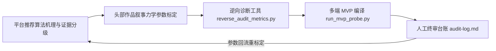
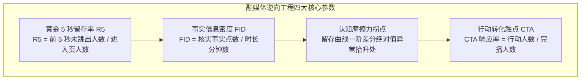
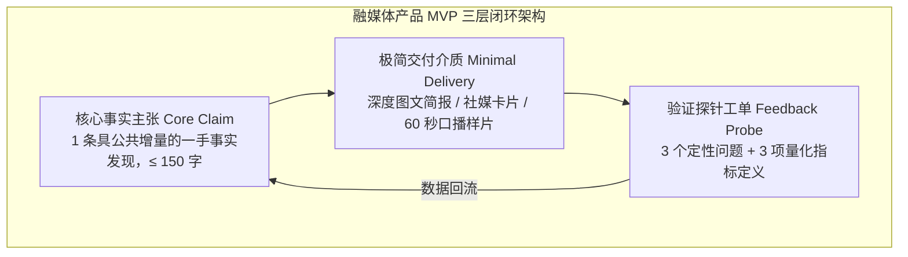
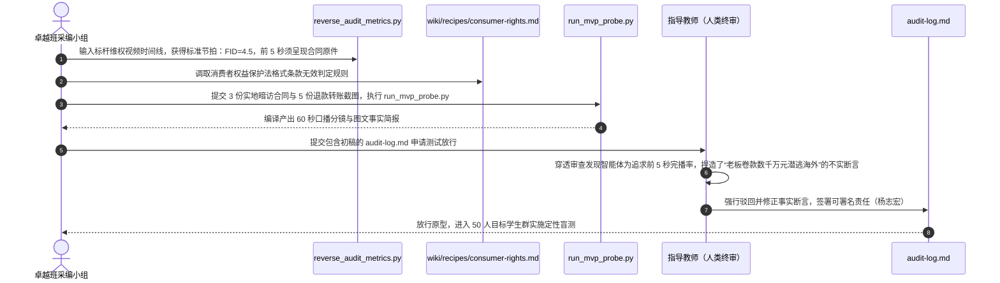

## 学习要点

- 掌握抖音、小红书、哔哩哔哩、微信视频号推荐算法的可观察参数与证据分级方法，辨析平台官方披露、行业拆解共识与本地标定工作值三类口径的效力边界。
- 掌握黄金 5 秒留存率、事实信息密度（FID）、视觉切换节拍与行动转化触点（CTA）的量化核算规程，将模糊的“内容吸引力”换算为可复算的工程指标。
- 掌握逆向诊断脚本 `reverse_audit_metrics.py` 与多端原型编译器 `run_mvp_probe.py` 的开发、调用与验收，独立产出深度图文、社媒卡片与 60 秒口播分镜三类原型。
- 掌握人在回路终审与审核台账制度，建立针对生成式模型虚构极端情节的熔断规则，守住事实真实与法律合规底线。

## 本章引言

在全媒体内容矩阵的长周期运营中，采编团队经常陷入高投入与弱传播的效能断层。部分投入数周采编工时的严肃深度报道在社交网络反响寥寥，部分敏捷型数字内容却能凭借精准的信息抓手与视听节奏迅速引发全网共鸣。面对这一现象，传统的采编复盘往往停留在“提高文采”“加强网感”“优化剪辑”等定性评价层面，无法为下一次生产提供确定性的工程参照。

传播效果的差异有着可拆解的物理成因。主流平台的推荐系统以完播率、互动率、社交背书等可观察行为信号评估作品价值，作品的信息投放时序与视听节拍直接决定这些信号的取值。采编团队若对算法信号的构成一无所知，复盘便只能诉诸印象；若对信号口径过度迷信，生产又会滑向迎合指标的噱头堆砌。

突破困境的路径，在于把融媒体产品策划建立在可复现的逆向工程（Reverse Engineering）与精益最小可行原型（Minimum Viable Product, MVP）方法论之上。逆向工程阶段解构平台推荐信号的口径与证据等级，解构头部严肃媒体（如澎湃明查事实核验专栏、新京报我们视频调查短视频）与优质数字内容生态（如影视飓风、晚点 LatePost、差评）的叙事节拍，提炼为带证据标签的标定参数。MVP 阶段依据标定参数，用最小工程成本编译出深度图文简报、社媒卡片与 60 秒口播分镜三类原型，向小规模真实受众投放验证。全流程的每一处事实断言都经过人工终审，审核台账 `audit-log.md` 记录生成内容的失实生成、熔断修正与责任签署。本章依次阐释平台算法机理、叙事参数体系、逆向诊断与原型编译工具开发、人工终审闭环，为融媒体产品策划提供工程化研发范式。



## 第一节 平台推荐算法机理与账号逆向工程方法论

### 一、学理背景与现实困境

罗杰·菲德勒（Roger Fidler）在《媒介形态变化》（*Mediamorphosis*）中提出，新媒介从旧媒介的形态演变与社会互动中逐步催生[1]。保罗·莱文森（Paul Levinson）的数字媒介补偿进化论进一步指出，传播媒介的技术演进遵循满足人类感官与认知效率的人性化趋势[2]。两位学者的判断在推荐分发时代获得新的工程注脚：作品的抵达路径由平台算法与社交关系共同决定，采编团队必须理解这条路径的信号构成。彭兰在《网络传播概论》中对网络新闻分发机制与用户参与方式的系统梳理，为算法分发环境下的采编策略提供了基础框架[12]。

软件工程中的逆向工程，指通过解剖既有成熟系统的输入输出映射、内部调用关系与状态机逻辑，反向推导其底层设计规范。新闻传播工程引入这一方法，针对全网同类题材的标杆作品与平台分发机制展开结构化解构。逆向工程的目的在于穿透表层的辞藻修辞与包装形式，掌握高传播力作品在信息投放时序、受众注意力维持与证据呈现逻辑上的底层参数，为自主原创报道构筑方法论支撑。

现实的困难在于算法权重的披露程度有限。《互联网信息服务算法推荐管理规定》第十五条要求算法推荐服务提供者以显著方式公示算法推荐服务的基本原理、目的意图和主要运行机制[11]。条款约束了公示义务，权重参数本身仍属于平台未公开的商业实现细节。采编团队能够合法获取的材料有三类：平台创作者后台公开的指标口径与数据面板，平台负责人公开演讲、技术论文与专利文献，第三方运营机构基于大量账号实测形成的行业拆解共识。三类材料的可靠性存在显著落差，必须以证据分级制度约束使用方式。

本章采用的证据分级为：A 级指平台公开文档、后台指标口径或官方公开演讲，可直接引用；B 级指行业拆解共识、技术论文佐证，引用时须标注“行业拆解口径，待自有数据验证”；C 级指采编团队依据自有账号历史作品标定的工作值，用于内部排期与验收，对外表述时须注明标定来源。任何未标注证据等级的“平台潜规则”表述都缺乏事实基础，禁止写入采编规程。

### 二、底层机制：四类平台的推荐信号与权重口径

#### （一）抖音：完播率与转评赞加权的逐级流量池

抖音创作者中心向作者公开 5 秒完播率、整体完播率、平均播放时长、点赞率、评论率、转发率与收藏率等指标面板，这些口径属于 A 级证据。作品发布后进入小规模冷启动曝光，系统依据完播与互动信号的综合表现决定是否将其推入更大曝光池，逐级晋级的流量池模型属于行业拆解共识（B 级），平台未公开逐级阈值的具体数值。

字节跳动工程团队发表的 Monolith 实时推荐系统论文提供了技术层面的佐证：用户行为序列通过消息队列实时回流模型参数服务器，无冲突嵌入表与在线训练架构使点赞、评论、转发、完播等行为在分钟级影响后续分发[6]。这意味着“转评赞加权”具有可验证的工程实现基础，权重的具体数值仍需以自有账号投放实验测定。

对叙事结构的工程约束集中在四处。开场 5 秒必须投放核心事实冲突或核心信息增量，直接决定 5 秒完播率。中段每 30 秒安排一次景别或音画元素切换，维持观看新鲜度。每 90 秒安排一个反常识验证点（如微距拆解、数据实测、原声证据），抬升留存曲线的斜率表现。片尾 15 秒设置行动转化触点，引导转评赞与线索提供。

#### （二）小红书：CES 交互分模型

小红书的社区交互分（Community Engagement Score, CES）是笔记进入更大推荐池的核心评估量。行业拆解共识（B 级）给出的权重口径为：点赞计 1 分、收藏计 1 分、评论计 4 分、转发计 4 分、关注计 8 分。平台从未公开完整公式，该组权重随平台策略调整持续漂移，采编团队引用时必须标注口径来源，并以自有笔记的投放数据季度重标定。

CES 之外，笔记的点击率（封面与标题决定）、完读率、负反馈率（举报、不感兴趣）构成并行评估面。评论与转发的高权重意味着“可讨论性”与“可收藏性”对分发的贡献大于单纯点赞。

对图文叙事的工程约束由此确定。封面图与首屏 120 字符必须交付明确的信息增量承诺，例如一条可核查的数据、一处被揭露的合同条款。正文需嵌入可收藏的结构化组件，如证据清单、条款摘录、维权流程图。文末设置提问式 CTA，征集读者的同类经历与补充线索，激活评论与转发的高权重信号。

#### （三）哔哩哔哩：完播与互动留存曲线斜率

哔哩哔哩创作中心后台向作者公开观众留存曲线、播放完成度、弹幕数量与“一键三连”（点赞、投币、收藏）数据，这些属于 A 级证据。留存曲线以秒为单位记录仍在观看的观众比例，其一阶差分即为留存斜率，反映单位时间内的跳出强度。

留存曲线的用法是定位认知摩擦点。将整条曲线按 15 秒窗口切分，计算各窗口斜率的绝对值，斜率绝对值显著高于本账号近 10 条作品中位数的窗口，即标记为认知摩擦点。该阈值属于 C 级本地标定值，禁止表述为平台官方阈值。摩擦点上常见的内容病灶有三类：复杂概念缺少可视化过渡、专业术语缺少解释、论证链条缺少事实锚点。

弹幕密度与三连行为构成互动信号（B 级权重口径），其中投币与收藏的稀缺性使其区分度高于点赞。对长视频叙事的工程约束为：在摩擦点窗口内插入拆解动画或图表，每 90 秒安排一次反常识验证，利用弹幕互动点（如提问、投票）拉升互动曲线。

#### （四）微信视频号：完播跳出点与社交点赞推荐

微信视频号的推荐模型融合社交推荐与机器推荐，这一结构由微信创始人张小龙在 2021 微信公开课 PRO 演讲中公开说明：2020 年 5 月改版后转向以实名社交推荐为主、机器推荐为辅，理想的流量分配比例约为关注 1 份、朋友点赞的社交推荐 2 份、机器推荐 10 份[5]。该比例出自公开演讲（A 级），实际分配随内容池规模调整。

“朋友点赞”构成强社交背书信号，一度好友的点赞与转发行为显著提升内容被推荐的概率。完播跳出点的定位方法与哔哩哔哩留存曲线一致：以观看时长分布的一阶差分绝对值聚类，聚类中心即为跳出点。视频号后台公开完播率、平均播放时长、点赞与转发数据（A 级）。

对叙事的工程约束强调社交货币设计。作品需要提供让转发者获得形象增益的公共价值点，如可操作的防骗清单、可引用的条款解释、可核验的数据结论。开场与结尾各设置一次社交引导，片尾 CTA 侧重“转发给需要的人”与线索征集，与平台的社交推荐结构对齐。

表 3-1 汇总四类平台的信号口径与证据等级，供采编团队在立项阶段选型与标定。

**表 3-1　四类平台推荐信号口径与证据分级（三线表）**

| 平台 | 公开后台指标（A 级） | 权重口径（B 级） | 本地标定值（C 级） | 对叙事的工程约束 |
| :--- | :--- | :--- | :--- | :--- |
| 抖音 | 5 秒完播率、整体完播率、平均播放时长、转评赞藏率 | 完播与转评赞加权、逐级流量池晋级 | 开场钩子事实点 ≥ 1，切换间隔 ≤ 30 秒 | 前 5 秒投放核心冲突，每 90 秒一个反常识验证点 |
| 小红书 | 笔记曝光、点击率、阅读完成率、互动数据 | CES 交互分（赞 1、藏 1、评 4、转 4、关 8） | 首屏 120 字符信息增量承诺，可收藏组件 ≥ 2 处 | 封面定性、清单化证据、提问式 CTA |
| 哔哩哔哩 | 观众留存曲线、播放完成度、弹幕与三连数据 | 完播与互动信号加权，投币收藏区分度高 | 摩擦点阈值取近 10 条作品斜率中位数 | 摩擦点窗口插入可视化，互动点拉升弹幕 |
| 微信视频号 | 完播率、平均播放时长、点赞与转发数据 | 社交推荐为主、机器推荐为辅（1:2:10 公开比例） | 跳出点聚类窗口取 15 秒，社交货币点 ≥ 2 处 | 设计可转发的公共价值点，片尾社交引导 |

### 三、受众注意力停留的四大物理参数

平台信号的采集对象是受众的注意力行为。逆向工程将模糊的“内容吸引力”拆解为四项可量化的工程指标，每项指标都给出定义式与核算口径。



1. 黄金 5 秒留存率（R5）：视频前 5 秒或图文首屏 120 字符内未跳出的受众比例。抖音后台直接公开 5 秒完播率口径（A 级），其他平台以首屏停留时长折算。该参数决定推荐系统对作品的首轮价值判定，开场必须交付核心悬念或核心事实冲突。
2. 事实信息密度（Factual Information Density, FID）：作品每分钟（视频）或每千字（图文）包含的经核实一手事实要素、数据图表与专业术语解释数量。定义式为 FID = 核实事实点数 ÷ 时长（分钟）。本章的标定区间为视频 3.5 至 7.0 点每分钟，图文 6 至 8 个独立物证索引每千字，低于下限呈现注水拖沓，高于上限引发认知过载[9]。
3. 认知摩擦力拐点：叙事推进到核心矛盾或复杂学理背景时，受众理解难度陡增的位置，在留存曲线上表现为斜率绝对值的异常抬升。降低摩擦的手段包括三维动图、拆解图表、原声录音与类比说明。
4. 行动转化触点（Call to Action, CTA）：作品末尾驱动受众表达观点、提供线索或二次转发的心理契约点，核算口径为 CTA 响应率 = 完成指定行动人数 ÷ 完播（完读）人数。CTA 必须与核心公共议题共振，措辞以提供公共价值为出发点。

四项参数构成同一套核算体系。黄金 5 秒留存率衡量开场的信息抓手强度，FID 衡量全程的事实供给密度，认知摩擦力拐点衡量中段的解释平滑度，CTA 衡量结尾的社会动员效能。逆向诊断脚本将四项参数一次性算出，并输出留存健康度综合评分。

### 四、工程契约：`reverse_audit_metrics.py` 逆向指标核算工具

工具的输入为标杆作品的分秒时间线标注（JSON 格式），每条标注包含分段起点、终点、分段类型、事实点数、景别与核验状态。工具输出 JSON 诊断报告，可选输出三线表风格的 Markdown 报告。完整代码如下，具备字段校验、重叠检测、平台参数集切换与异常处理能力。

```python
"""reverse_audit_metrics.py: 融合新闻作品逆向指标核算工具。

命令行用法：
    python reverse_audit_metrics.py --input config/reverse_spec_template.json \
        --platform douyin --output working/reverse_report.json
"""

from __future__ import annotations

import argparse
import json
import sys
from dataclasses import dataclass, field
from pathlib import Path
from typing import Any, Mapping, Sequence

# 合法分段类型集合，标注越界即报错，防止脏数据被静默吞掉。
SEGMENT_TYPES: frozenset[str] = frozenset(
    {
        "hook",
        "onsite_footage",
        "interview",
        "data_visualization",
        "audio_evidence",
        "counterintuitive",
        "cta",
        "transition",
    }
)

# 黄金窗口时长（秒）。图文口径在正文中换算为首屏 120 字符。
GOLDEN_WINDOW_SEC: float = 5.0


@dataclass(frozen=True)
class Segment:
    """时间线上的一段标注。"""

    sec_start: float
    sec_end: float
    segment_type: str
    factual_points: int
    shot_type: str = "medium"
    verified: bool = True
    note: str = ""

    @property
    def duration_sec(self) -> float:
        """返回该分段时长（秒）。"""
        return self.sec_end - self.sec_start

    @classmethod
    def from_mapping(cls, raw: Mapping[str, Any], index: int) -> "Segment":
        """解析并校验单条标注，字段缺失或越界时抛出 ValueError。"""
        if not isinstance(raw, Mapping):
            raise ValueError(f"第 {index} 条标注必须是对象: {raw!r}")
        required = ("sec_start", "sec_end", "segment_type", "factual_points")
        missing = [key for key in required if key not in raw]
        if missing:
            raise ValueError(f"第 {index} 条标注缺少必填字段: {', '.join(missing)}")
        try:
            sec_start = float(raw["sec_start"])
            sec_end = float(raw["sec_end"])
            factual_points = int(raw["factual_points"])
        except (TypeError, ValueError) as exc:
            raise ValueError(f"第 {index} 条标注的数值字段无法解析: {dict(raw)}") from exc

        segment_type = str(raw["segment_type"]).strip().lower()
        if segment_type not in SEGMENT_TYPES:
            raise ValueError(
                f"第 {index} 条标注类型非法: {segment_type!r}，合法取值为 {sorted(SEGMENT_TYPES)}"
            )
        if sec_end <= sec_start:
            raise ValueError(f"第 {index} 条标注时长非法: sec_end 必须大于 sec_start")
        if factual_points < 0:
            raise ValueError(f"第 {index} 条标注事实点数为负: {factual_points}")

        return cls(
            sec_start=sec_start,
            sec_end=sec_end,
            segment_type=segment_type,
            factual_points=factual_points,
            shot_type=str(raw.get("shot_type", "medium")).strip().lower(),
            verified=bool(raw.get("verified", True)),
            note=str(raw.get("note", "")),
        )


@dataclass(frozen=True)
class PlatformProfile:
    """平台标定参数集，证据等级见表 3-1。"""

    platform: str
    display_name: str
    evidence_grade: str
    hook_window_sec: float
    switch_cadence_sec: float
    counterintuitive_cadence_sec: float
    fid_target_min: float
    fid_target_max: float
    hook_concentration_min: float
    signal_notes: tuple[str, ...] = field(default_factory=tuple)


PROFILES: dict[str, PlatformProfile] = {
    "douyin": PlatformProfile(
        platform="douyin",
        display_name="抖音",
        evidence_grade="B 级权重口径，后台指标为 A 级",
        hook_window_sec=GOLDEN_WINDOW_SEC,
        switch_cadence_sec=30.0,
        counterintuitive_cadence_sec=90.0,
        fid_target_min=3.5,
        fid_target_max=7.0,
        hook_concentration_min=0.25,
        signal_notes=(
            "创作者中心公开 5 秒完播率、整体完播率、平均播放时长",
            "逐级流量池与转评赞加权属行业拆解口径，需以自有账号数据重标定",
        ),
    ),
    "xhs": PlatformProfile(
        platform="xhs",
        display_name="小红书",
        evidence_grade="B 级 CES 权重口径，点击率与完读率为 A 级",
        hook_window_sec=GOLDEN_WINDOW_SEC,
        switch_cadence_sec=30.0,
        counterintuitive_cadence_sec=90.0,
        fid_target_min=3.5,
        fid_target_max=7.0,
        hook_concentration_min=0.30,
        signal_notes=(
            "CES 权重口径：赞 1、藏 1、评 4、转 4、关 8，平台未公开完整公式",
            "图文口径的 FID 按每千字 6 至 8 个独立物证索引另行核算",
        ),
    ),
    "bilibili": PlatformProfile(
        platform="bilibili",
        display_name="哔哩哔哩",
        evidence_grade="A 级留存曲线与三连数据，权重口径为 B 级",
        hook_window_sec=GOLDEN_WINDOW_SEC,
        switch_cadence_sec=30.0,
        counterintuitive_cadence_sec=90.0,
        fid_target_min=3.0,
        fid_target_max=6.5,
        hook_concentration_min=0.20,
        signal_notes=(
            "创作中心公开观众留存曲线、播放完成度与三连数据",
            "摩擦点阈值取本账号近 10 条作品斜率中位数（C 级）",
        ),
    ),
    "wechat_channels": PlatformProfile(
        platform="wechat_channels",
        display_name="微信视频号",
        evidence_grade="A 级社交推荐结构（公开演讲），跳出点聚类为 C 级",
        hook_window_sec=GOLDEN_WINDOW_SEC,
        switch_cadence_sec=30.0,
        counterintuitive_cadence_sec=90.0,
        fid_target_min=3.5,
        fid_target_max=7.0,
        hook_concentration_min=0.25,
        signal_notes=(
            "社交推荐为主、机器推荐为辅，公开比例约 1:2:10（关注:朋友点赞:机器）",
            "片尾 CTA 侧重社交转发与线索征集",
        ),
    ),
}


def validate_timeline(segments: Sequence[Segment], total_duration_sec: float) -> None:
    """校验时间线的时长、顺序与重叠情况，发现问题立即抛出 ValueError。"""
    if not segments:
        raise ValueError("时间线为空，至少需要一条标注分段")
    if total_duration_sec <= 0:
        raise ValueError(f"作品总时长必须为正数: {total_duration_sec}")

    ordered = sorted(segments, key=lambda seg: (seg.sec_start, seg.sec_end))
    if ordered[0].sec_start < 0:
        raise ValueError("标注起点出现负值")
    if ordered[-1].sec_end > total_duration_sec + 1e-6:
        raise ValueError("标注终点超出作品总时长")
    for prev, cur in zip(ordered, ordered[1:]):
        if cur.sec_start < prev.sec_end - 1e-6:
            raise ValueError(
                f"标注区间重叠: [{prev.sec_start}, {prev.sec_end}] 与 [{cur.sec_start}, {cur.sec_end}]"
            )


def calculate_reverse_metrics(
    segments: Sequence[Segment],
    total_duration_sec: float,
    profile: PlatformProfile,
) -> dict[str, Any]:
    """核算逆向视听参数，返回 JSON 可序列化的诊断字典。"""
    validate_timeline(segments, total_duration_sec)
    ordered = sorted(segments, key=lambda seg: (seg.sec_start, seg.sec_end))

    total_facts = sum(seg.factual_points for seg in ordered)
    verified_facts = sum(seg.factual_points for seg in ordered if seg.verified)
    unverified_facts = total_facts - verified_facts

    duration_min = total_duration_sec / 60.0
    fid_score = round(total_facts / duration_min, 2) if duration_min > 0 else 0.0

    golden_end = min(GOLDEN_WINDOW_SEC, total_duration_sec)
    golden_facts = sum(seg.factual_points for seg in ordered if seg.sec_start < golden_end)
    hook_covers_opening = any(
        seg.segment_type == "hook" and seg.sec_start <= 0.0 and seg.sec_end >= golden_end
        for seg in ordered
    )
    hook_concentration = round(golden_facts / total_facts, 3) if total_facts else 0.0

    # 视觉切换节拍：相邻分段景别变化即计一次切换点。
    switch_points: list[float] = []
    previous_shot: str | None = None
    for seg in ordered:
        if previous_shot is None or seg.shot_type != previous_shot:
            switch_points.append(seg.sec_start)
        previous_shot = seg.shot_type
    switch_intervals = [
        round(b - a, 2) for a, b in zip(switch_points, switch_points[1:])
    ]
    if switch_intervals:
        mean_switch_interval = round(sum(switch_intervals) / len(switch_intervals), 2)
        max_switch_interval = max(switch_intervals)
        cadence_hit_rate = round(
            sum(1 for gap in switch_intervals if gap <= profile.switch_cadence_sec)
            / len(switch_intervals),
            3,
        )
    else:
        mean_switch_interval = 0.0
        max_switch_interval = 0.0
        cadence_hit_rate = 0.0

    counterintuitive_points = sum(
        1 for seg in ordered if seg.segment_type == "counterintuitive"
    )
    expected_counterintuitive = max(
        1, int(total_duration_sec // profile.counterintuitive_cadence_sec) + 1
    )
    counterintuitive_coverage = round(
        min(1.0, counterintuitive_points / expected_counterintuitive), 3
    )

    cta_segments = [seg for seg in ordered if seg.segment_type == "cta"]
    cta_present = bool(cta_segments)
    cta_start_ratio = (
        round(cta_segments[0].sec_start / total_duration_sec, 3) if cta_segments else None
    )

    warnings: list[str] = []
    if unverified_facts > 0:
        warnings.append(f"存在 {unverified_facts} 个未核实事实点，投放前必须补齐信源")
    if fid_score > profile.fid_target_max:
        warnings.append(
            f"FID={fid_score} 超出标定上限 {profile.fid_target_max}，注意认知过载"
        )
    if fid_score < profile.fid_target_min:
        warnings.append(
            f"FID={fid_score} 低于标定下限 {profile.fid_target_min}，事实供给不足"
        )
    if not hook_covers_opening:
        warnings.append("开场 5 秒缺少 hook 分段，黄金 5 秒留存率存在结构性风险")
    if hook_concentration < profile.hook_concentration_min:
        warnings.append(
            f"开场抓手浓度 {hook_concentration} 低于标定值 {profile.hook_concentration_min}"
        )
    if not cta_present:
        warnings.append("缺少行动转化触点（CTA）分段")
    if switch_intervals and max_switch_interval > profile.switch_cadence_sec:
        warnings.append(
            f"最大视觉切换间隔 {max_switch_interval} 秒超出节拍上限 {profile.switch_cadence_sec} 秒"
        )

    # 留存健康度综合评分：黄金抓手 30、事实密度 25、切换节拍 20、反常识点 15、CTA 10。
    hook_score = (
        30.0 if hook_covers_opening and golden_facts >= 1 else (15.0 if golden_facts >= 1 else 0.0)
    )
    fid_ratio = (
        min(1.0, fid_score / profile.fid_target_min) if profile.fid_target_min > 0 else 0.0
    )
    retention_health_score = round(
        hook_score
        + 25.0 * fid_ratio
        + 20.0 * cadence_hit_rate
        + 15.0 * counterintuitive_coverage
        + (10.0 if cta_present else 0.0),
        1,
    )

    if retention_health_score >= 80:
        verdict = "参数达标，可进入小流量盲测"
    elif retention_health_score >= 60:
        verdict = "参数基本达标，按警告项修订后复测"
    else:
        verdict = "参数未达标，须重新标定叙事节拍"

    return {
        "platform": profile.platform,
        "platform_display_name": profile.display_name,
        "evidence_grade": profile.evidence_grade,
        "diagnostics": {
            "total_duration_sec": round(total_duration_sec, 2),
            "total_factual_points": total_facts,
            "verified_factual_points": verified_facts,
            "unverified_factual_points": unverified_facts,
            "facts_per_minute_fid": fid_score,
            "golden_window_sec": round(golden_end, 2),
            "golden_window_facts": golden_facts,
            "hook_covers_golden_window": hook_covers_opening,
            "opening_hook_concentration": hook_concentration,
            "visual_switch_count": len(switch_points),
            "mean_switch_interval_sec": mean_switch_interval,
            "max_switch_interval_sec": max_switch_interval,
            "cadence_hit_rate": cadence_hit_rate,
            "counterintuitive_points": counterintuitive_points,
            "expected_counterintuitive_points": expected_counterintuitive,
            "counterintuitive_coverage": counterintuitive_coverage,
            "cta_present": cta_present,
            "cta_start_ratio": cta_start_ratio,
        },
        "warnings": warnings,
        "retention_health_score": retention_health_score,
        "verdict": verdict,
    }


def calculate_text_fid(factual_points: int, total_chars: int) -> float:
    """图文口径的事实信息密度：每千字的核实事实点数。"""
    if factual_points < 0:
        raise ValueError(f"事实点数为负: {factual_points}")
    if total_chars <= 0:
        raise ValueError(f"图文字符数必须为正数: {total_chars}")
    return round(factual_points * 1000.0 / total_chars, 2)


def report_to_markdown(report: Mapping[str, Any]) -> str:
    """把诊断字典渲染为三线表风格的 Markdown 报告。"""
    diag = report["diagnostics"]
    rows: list[tuple[str, str, str]] = [
        ("事实信息密度 FID", f"{diag['facts_per_minute_fid']} 点/分钟", "3.5 至 7.0 点/分钟"),
        ("黄金窗口事实点", f"{diag['golden_window_facts']} 点", "≥ 1 点且覆盖前 5 秒"),
        ("开场抓手浓度", f"{diag['opening_hook_concentration']}", "≥ 0.25"),
        ("视觉切换平均间隔", f"{diag['mean_switch_interval_sec']} 秒", "≤ 30 秒"),
        ("认知反常识点", f"{diag['counterintuitive_points']} 个", f"期望 {diag['expected_counterintuitive_points']} 个"),
        ("行动转化触点 CTA", "存在" if diag["cta_present"] else "缺失", "必须存在"),
    ]
    lines = [
        f"# 逆向诊断报告：{report['platform_display_name']}",
        "",
        f"> 证据等级：{report['evidence_grade']}",
        "",
        "| 诊断项 | 实测值 | 标定基准 |",
        "| :--- | :--- | :--- |",
    ]
    lines.extend(f"| {name} | {value} | {base} |" for name, value, base in rows)
    lines.extend(
        [
            "",
            f"留存健康度综合评分：{report['retention_health_score']}。结论：{report['verdict']}。",
        ]
    )
    if report["warnings"]:
        lines.append("")
        lines.append("警告项：" + "；".join(report["warnings"]))
    return "\n".join(lines) + "\n"


def load_timeline(path: Path) -> tuple[list[Segment], str | None]:
    """读取 JSON 时间线，兼容规格文件（含 timeline 字段）与纯数组两种输入。"""
    if not path.exists():
        raise FileNotFoundError(f"未找到时间线文件: {path}")
    try:
        payload = json.loads(path.read_text(encoding="utf-8"))
    except json.JSONDecodeError as exc:
        raise ValueError(f"时间线文件 JSON 解析失败: {path}（{exc}）") from exc

    platform_hint: str | None = None
    if isinstance(payload, Mapping):
        hint = payload.get("platform_target")
        platform_hint = str(hint) if hint else None
        raw_items = payload.get("timeline")
        if raw_items is None:
            raise ValueError(f"规格文件缺少 timeline 字段: {path}")
    elif isinstance(payload, list):
        raw_items = payload
    else:
        raise ValueError(f"时间线文件顶层结构必须是对象或数组: {path}")

    if not isinstance(raw_items, list):
        raise ValueError("timeline 字段必须是数组")
    segments = [Segment.from_mapping(item, index) for index, item in enumerate(raw_items)]
    return segments, platform_hint


def main(argv: Sequence[str] | None = None) -> int:
    """命令行入口，成功返回 0，输入错误返回 2。"""
    parser = argparse.ArgumentParser(description="融合新闻作品逆向指标核算工具")
    parser.add_argument("--input", required=True, type=Path, help="时间线 JSON 或 reverse_spec 规格文件")
    parser.add_argument("--platform", default=None, choices=sorted(PROFILES), help="平台参数集，缺省时取规格文件 platform_target")
    parser.add_argument("--duration", type=float, default=None, help="作品总时长（秒），缺省时取标注终点最大值")
    parser.add_argument("--output", type=Path, default=None, help="JSON 诊断报告输出路径")
    parser.add_argument("--markdown", type=Path, default=None, help="Markdown 报告输出路径")
    args = parser.parse_args(argv)

    try:
        segments, platform_hint = load_timeline(args.input)
        platform_key = args.platform or platform_hint or "douyin"
        if platform_key not in PROFILES:
            raise ValueError(f"未知平台参数集: {platform_key}，合法取值为 {sorted(PROFILES)}")
        total_duration_sec = args.duration or max(seg.sec_end for seg in segments)
        report = calculate_reverse_metrics(segments, total_duration_sec, PROFILES[platform_key])
    except (FileNotFoundError, ValueError) as exc:
        print(f"[逆向核算失败] {exc}", file=sys.stderr)
        return 2

    payload = json.dumps(report, ensure_ascii=False, indent=2)
    if args.output:
        args.output.parent.mkdir(parents=True, exist_ok=True)
        args.output.write_text(payload + "\n", encoding="utf-8")
    if args.markdown:
        args.markdown.parent.mkdir(parents=True, exist_ok=True)
        args.markdown.write_text(report_to_markdown(report), encoding="utf-8")
    print(payload)
    return 0


if __name__ == "__main__":
    raise SystemExit(main())
```

输入示例（`config/reverse_spec_template.json` 的 `timeline` 字段，60 秒 MVP 样片标注）：

```json
{
  "platform_target": "douyin",
  "timeline": [
    {"sec_start": 0, "sec_end": 5, "segment_type": "hook", "factual_points": 2, "shot_type": "close_up", "verified": true},
    {"sec_start": 5, "sec_end": 18, "segment_type": "onsite_footage", "factual_points": 2, "shot_type": "medium", "verified": true},
    {"sec_start": 18, "sec_end": 33, "segment_type": "data_visualization", "factual_points": 1, "shot_type": "wide", "verified": true},
    {"sec_start": 33, "sec_end": 48, "segment_type": "counterintuitive", "factual_points": 1, "shot_type": "macro", "verified": true},
    {"sec_start": 48, "sec_end": 60, "segment_type": "cta", "factual_points": 0, "shot_type": "medium", "verified": true}
  ]
}
```

输出示例（诊断报告片段）：

```json
{
  "platform": "douyin",
  "platform_display_name": "抖音",
  "diagnostics": {
    "total_duration_sec": 60.0,
    "total_factual_points": 6,
    "facts_per_minute_fid": 6.0,
    "golden_window_facts": 2,
    "hook_covers_golden_window": true,
    "opening_hook_concentration": 0.333,
    "cadence_hit_rate": 1.0,
    "counterintuitive_points": 1,
    "cta_present": true
  },
  "warnings": [],
  "retention_health_score": 100.0,
  "verdict": "参数达标，可进入小流量盲测"
}
```

验收判据覆盖三项内容。时间线字段缺失、区间重叠或类型越界时，脚本必须以非零退出码报错，错误信息指向具体标注序号。诊断输出必须同时包含实测值与标定基准的对照，便于采编团队判断达标情况。未核实事实点必须被单独计数并写入警告项，防止草稿数据流入发布环节。

在 WorkBuddy 工作台中，该脚本可封装为模型上下文协议（Model Context Protocol, MCP）工具供智能体调用[13]。工具描述须写明输入 schema、合法枚举值与错误返回格式，使智能体在工具报错后能自行修正输入重试[7]。

### 五、边界约束：规律借鉴与版权红线

逆向工程学习的对象是结构、节奏与机制。抄袭洗稿指对他人文本表达作同义词替换，或对音画分镜作机械搬运；合法的逆向工程提炼作品的结构拓扑与叙事节拍，产出的参数表属于方法论资产。采编人员运用逆向参数时，必须注入本团队独立田野调查获得的一手事实材料与原创表达，引述他人作品观点时显式标注信源出处，音画素材取得授权后使用。

算法口径的引用同样受证据边界约束。B 级行业拆解共识随时可能因平台策略调整而失效，C 级本地标定值只在本账号的内容垂类与粉丝结构下有效。采编团队在季度复盘时重标定参数，把旧参数标注失效日期，禁止将单次实测结论外推为平台通用规律。

## 第二节 头部作品叙事力学的参数化解构

### 一、学理背景：从观感评价到参数标定

叙事学对故事时间与叙事时间的区分，为节拍标定提供了学理工具。热拉尔·热奈特（Gérard Genette）在《叙事话语》中提出时序、时距与频率三组概念，说明叙事节奏取决于故事素材在文本中的展开速度与重复方式[10]。融媒体作品的“节奏感”可以还原为这三组变量：核心事实的出现时序、单位时间的事实供给量、关键证据的重复曝光次数。

认知负荷理论补充了受众端的约束。约翰·斯威勒（John Sweller）的实验证据表明，学习材料的组织方式直接影响认知负荷的高低，内在负荷过高会显著损害理解效果[9]。新闻作品承担着事实传递与公共教育功能，复杂概念必须通过可视化、类比与分段解释降低受众的理解门槛，这项工程要求与留存曲线上的摩擦点位置高度对应。

头部作品的节拍规律由此可以参数化解构。本章的解构方法为：选取标杆作品的代表样本，逐段标注分秒时间线、景别类型与事实点数，运行逆向诊断脚本获得量化参数，再与团队自有作品对比定位差距。参数表属于抽样标注的工作结果，各团队须按自身题材与受众结构重标定。

### 二、底层机制：五家标杆的叙事节拍标定

#### （一）澎湃明查：四步闭环的事实核验结构

澎湃新闻“澎湃明查”事实核验专栏采用高度标准化的四步闭环模型：

```text
[核心传言定性标签] → [一手溯源调查过程] → [多维证据链交叉印证] → [事实裁定结论与防伪建议]
```

导语前 80 字符内直接交代争议来源与定性结论，例如“明查：相关指控纯属拼接造谣”。正文分节展开图片元数据（EXIF）审查、当事机构官方回函、地理空间卫星定位比对等独立物证。整篇作品的 FID 稳定在每千字 6 至 8 个独立物证索引，构成可逐条复核的事实防线。片尾 CTA 采取线索征集形式，邀请读者提供待核传言与补充证据。

#### （二）新京报我们视频：调查短视频的现场优先结构

新京报“我们视频”的消费维权调查短视频遵循现场优先原则。前 5 秒呈现核心冲突现场画面，配以字幕定性，例如“报名费 3 万 8，退费要等半年”。中段由当事人同期声、现场暗访画面与合同单据特写交替推进，每 30 秒完成一次景别切换。片尾 10 至 15 秒由记者出镜或字幕给出维权路径与线索通道，CTA 形态为线索征集加服务信息。

#### （三）影视飓风：硬件拆解的节拍规程

视频创作团队“影视飓风”在硬核技术拆解作品中执行严格的节拍规程：每 30 秒引入一次镜头景别或音画元素切换，每 90 秒提供一个反常识物理实验验证，例如微距特写展示元件差异、实测数据推翻厂商宣传口径。参数表、实测曲线与微距镜头构成三类常驻证据形态，把复杂计算带来的认知摩擦降到最低。

#### （四）晚点 LatePost：财务异动的生计叙事

“晚点 LatePost”的商业深度报道遵循三层递进结构：关键财务指标引导、高管战略博弈还原、行业微观从业者痛点投射。开篇将关键财务异动换算为具有社会共鸣的生计故事，例如把供应链账期变化换算为具体工人的工资到账时间。中段还原高管决策的博弈逻辑，结尾落回从业者处境，CTA 形态为订阅引导与线索征集。

#### （五）差评：反常识切口与梗密度控制

科技消费内容团队“差评”在产品评测与行业调查中大量使用反常识切口，例如“这台设备的宣传参数与实测数据相差 40%”。叙事推进采用硬核拆解段与轻量梗点交替的编排，每 30 秒左右安排一次情绪或视角转换，维持中段留存。CTA 常以评论区投票、征集下期选题的形式出现，激活 CES 模型中高权重的评论信号。

表 3-2 汇总五家标杆的叙事参数标定结果，数值取自公开代表作品的抽样标注，供立项阶段对照使用。

**表 3-2　五家标杆叙事力学参数标定（三线表）**

| 标杆 | 黄金 5 秒策略 | FID 参考区间 | 视觉与结构切换节拍 | 认知反常识点 | CTA 形态 |
| :--- | :--- | :--- | :--- | :--- | :--- |
| 澎湃明查 | 80 字符内定性标签加核心结论 | 6 至 8 点/千字 | 四步闭环分节推进 | 多维证据交叉印证处 | 待核传言与线索征集 |
| 新京报我们视频 | 现场冲突画面加字幕定性 | 3.5 至 5.5 点/分钟 | 每 30 秒景别切换 | 当事人同期声反差处 | 维权路径加线索通道 |
| 影视飓风 | 核心争议参数前置抛出 | 4.0 至 6.0 点/分钟 | 每 30 秒景别或音画元素切换 | 每 90 秒物理实验验证 | 讨论引导与实测数据征集 |
| 晚点 LatePost | 财务异动换算为生计故事 | 5 至 7 点/千字 | 三层递进结构分段 | 博弈逻辑还原处 | 订阅引导与线索征集 |
| 差评 | 反常识结论直接抛出 | 3.5 至 6.0 点/分钟 | 每 30 秒情绪或视角转换 | 实测数据推翻宣传口径处 | 评论区投票与选题征集 |

参数提炼的落点在于可控性。黄金 5 秒策略决定开场脚本的写作顺序，FID 区间决定素材采集的最低数量，切换节拍决定分镜表的时间切分，反常识点决定实测环节的排期，CTA 形态决定结尾的互动设计。五个参数写入逆向规格文件，成为新选题的工程契约。

### 三、工程契约：`config/reverse_spec_template.json` 规格模板

采编团队在发起新选题时，使用 `config/reverse_spec_template.json` 固化目标参数契约。该文件同时服务两类工具：`reverse_audit_metrics.py` 读取其中的 `timeline` 字段核算标杆参数，`run_mvp_probe.py` 读取其中的 `target_parameters`、`evidence_register`、`mvp_gate` 与 `probe_plan` 编译多端原型。完整模板如下。

```json
{
  "schema_version": "reverse-spec/1.0",
  "project_name": "大学生消费诈骗调查：考研寄宿机构虚假宣传与退费陷阱",
  "editorial_owner": "融合新闻产品策划与制作卓越班采编组",
  "audit_log": "audit-log.md",
  "platform_target": "douyin",
  "reference_benchmarks": [
    {
      "media_source": "澎湃明查",
      "feature_borrowed": "四步闭环事实定性结构与第三方溯源日志引用格式",
      "evidence_grade": "A"
    },
    {
      "media_source": "新京报我们视频",
      "feature_borrowed": "前 5 秒现场冲突画面与字幕定性规范",
      "evidence_grade": "A"
    },
    {
      "media_source": "影视飓风",
      "feature_borrowed": "30 秒视觉切换节拍与 90 秒反常识验证点规范",
      "evidence_grade": "B"
    }
  ],
  "target_parameters": {
    "total_target_duration_sec": 360,
    "minimum_factual_points": 24,
    "target_fid_score": 4.5,
    "fid_target_range": [3.5, 7.0],
    "max_intro_hook_sec": 5,
    "switch_cadence_sec": 30,
    "counterintuitive_cadence_sec": 90,
    "cta_type": "线索征集",
    "mandatory_elements": [
      "学员缴费与退费转账流水脱敏单据",
      "涉事机构培训服务协议中的格式条款截屏",
      "属地市场监督管理部门现场调解备忘录",
      "消费者权益保护法与消防法规对应条款"
    ]
  },
  "evidence_register": [
    {
      "evidence_id": "EV-01",
      "title": "学员缴费与退费转账流水脱敏单据",
      "source_type": "物证",
      "obtained_at": "2026-09-08",
      "verification": "已核实",
      "desensitized": true
    },
    {
      "evidence_id": "EV-02",
      "title": "培训服务协议中的格式条款截屏",
      "source_type": "书证",
      "obtained_at": "2026-09-08",
      "verification": "已核实",
      "desensitized": true
    },
    {
      "evidence_id": "EV-03",
      "title": "属地市场监督管理所现场调解备忘录",
      "source_type": "官方记录",
      "obtained_at": "2026-09-12",
      "verification": "已核实",
      "desensitized": true
    },
    {
      "evidence_id": "EV-04",
      "title": "涉事机构停业整顿通知书",
      "source_type": "官方记录",
      "obtained_at": "2026-09-13",
      "verification": "待核实",
      "desensitized": true
    }
  ],
  "mvp_gate": {
    "min_verified_evidence": 3,
    "max_claim_chars": 150,
    "max_intro_hook_sec": 5,
    "require_disclaimer": true,
    "cta_type": "线索征集"
  },
  "mvp_outputs": [
    "mvp_brief.md",
    "mvp_social_card.txt",
    "mvp_video_script.md",
    "mvp_probe.md"
  ],
  "probe_plan": {
    "sample_size_min": 20,
    "sample_size_max": 50,
    "questions": [
      "看完这份材料，你能用一句话说出涉事机构的具体问题吗？",
      "材料中哪一项证据让你最信服，哪一项仍存疑？",
      "如果身边同学遇到同类情况，你会转发这份材料并建议他做什么？"
    ],
    "metrics": {
      "golden_5s_retention": "前 5 秒未跳出人数 / 进入页人数",
      "completion_rate": "完播或完读人数 / 进入页人数",
      "cta_response_rate": "完成指定行动人数 / 完播或完读人数"
    }
  },
  "audit_rules": [
    {
      "trigger": "开场文案出现“卷款”“潜逃”“血本无归”等极端定性词",
      "check": "对照接处警工作台账、调解备忘录与官方通报逐句核对",
      "human_confirm": "主理人签发后方可进入投放",
      "log_target": "audit-log.md"
    },
    {
      "trigger": "任何事实断言缺少证据登记编号",
      "check": "回查 evidence_register，补齐编号或删除断言",
      "human_confirm": "主理人确认证据链完整",
      "log_target": "audit-log.md"
    }
  ],
  "timeline": [
    {"sec_start": 0, "sec_end": 5, "segment_type": "hook", "factual_points": 2, "shot_type": "close_up", "verified": true, "note": "合同原件特写与核心定性"},
    {"sec_start": 5, "sec_end": 18, "segment_type": "onsite_footage", "factual_points": 2, "shot_type": "medium", "verified": true, "note": "现场探访与学员陈述"},
    {"sec_start": 18, "sec_end": 33, "segment_type": "data_visualization", "factual_points": 1, "shot_type": "wide", "verified": true, "note": "退费金额与人数对账图表"},
    {"sec_start": 33, "sec_end": 48, "segment_type": "counterintuitive", "factual_points": 1, "shot_type": "macro", "verified": true, "note": "格式条款与法规条文对照"},
    {"sec_start": 48, "sec_end": 60, "segment_type": "cta", "factual_points": 0, "shot_type": "medium", "verified": true, "note": "线索征集与维权路径"}
  ]
}
```

字段语义与验收判据如下。`target_parameters` 描述成片阶段的目标值，`mvp_gate` 描述原型阶段的最低放行门槛，两套数值在项目不同阶段分别生效。`evidence_register` 是事实断言的唯一合法来源，任何写入原型的事实都必须携带证据编号。`probe_plan.questions` 为定性验证问题，配合 `metrics` 的量化定义共同构成验证探针工单。`audit_rules` 把常见失实风险固化为触发条件、检查动作与人工确认三段式规则，直接对接审核台账。验收时须核查三项：证据登记条目全部具备来源类型与核验状态，`timeline` 与 `target_parameters` 的时长口径一致，`audit_rules` 覆盖本项目识别出的全部失实风险。

### 四、边界约束与同质化警惕

机械化套用逆向参数会引发内容同质化风险。当所有团队遵循同样的“5 秒黄金抓手”与“戏剧化反转节拍”时，受众迅速产生审美疲劳与心理防御。采编团队在借鉴工业节奏的同时，保留严肃新闻对复杂社会现实的敬畏感，对多因一果的社会议题如实呈现不确定性，为完播指标牺牲事实多样性的做法会侵蚀媒体公信力。

参数失效风险同样需要管理。平台调整推荐权重、垂类竞争格局变化、受众媒介习惯迁移都会使标定值漂移。工程上的对策是把参数表纳入版本管理，标注标定日期与样本量，季度复盘时用新样本重算并更新基准区间。

## 第三节 融合新闻产品最小可行原型（MVP）构建与验证

### 一、学理背景：精益创业与敏捷新闻学

埃里克·莱斯（Eric Ries）在《精益创业》中提出以构建、测量、学习为核心的迭代模型，主张用最小成本制作可验证的产品版本，依据真实用户数据决定继续投入或调整方向[3]。史蒂夫·布兰克（Steve Blank）的客户开发理论进一步要求，在投入完整开发资源之前先完成对客户需求的实证检验[4]。

传统新闻生产常采用长周期运作：记者闭门采写数月，编辑反复打磨，最终一次性推向市场。若初期的选题切角或受众需求预判存在偏差，这类沉没成本极高的大型策划将面临巨大的传播挫败。敏捷新闻学引入 MVP 理念，在投入完整制作资源之前，以最低工程成本开发出承载核心事实增量与核心价值主张的最小实体，向目标受众定向投放，收集真实反馈，验证或修正报道假设。

MVP 方法与新闻真实性之间存在清晰的责任分工。工程成本可以压缩，事实核查不可压缩，这构成下一小节架构设计的前提。

### 二、底层机制：融媒体 MVP 的三层闭环架构

融媒体产品最小可行原型具备完整的价值验证闭环。其最小系统由三层构成。



1. 核心事实主张：用不超过 150 字的严密陈述，交代报道要揭示的核心真相或核心观点，建立在一手证据之上，具备清晰的独占性。
2. 极简交付介质：不追求 4K 渲染、多机位特效或复杂前端代码，以精排 Markdown 简报、单页社媒卡片或手机实拍配合字幕的 60 秒粗剪样片为承载。
3. 验证探针工单：随原型同步设计测试问题，投放至 20 至 50 名真实目标受众组成的焦点小组，测量事实理解度、信任度与传播意愿。

多端原型的交付规格如表 3-3 所示，三类形态共享同一份核心事实主张与证据登记表，杜绝不同端口之间的事实漂移。

**表 3-3　三类 MVP 交付物规格（三线表）**

| 交付物 | 承载平台 | 核心参数 | 验收判据 |
| :--- | :--- | :--- | :--- |
| 深度图文简报 `mvp_brief.md` | 微信公众号、端内精读 | 首屏 120 字符交付核心事实，证据清单三线表 ≥ 3 行 | 每条事实带证据编号，免责声明置顶 |
| 社媒卡片文案 `mvp_social_card.txt` | 小红书、微博首屏 | 标题 ≤ 20 字，正文 ≤ 1000 字，话题标签 ≤ 5 个 | 首屏含信息增量承诺，CTA 明确可执行 |
| 60 秒口播分镜 `mvp_video_script.md` | 抖音、视频号、哔哩哔哩 | 前 5 秒钩子，30 秒内景别切换，45 秒后 CTA | 时间码连续无空档，口播文案每句对应证据编号 |

### 三、工程契约：`run_mvp_probe.py` 多端原型编译器

原型编译器读取逆向规格文件与核心事实主张文件，执行最小事实门槛校验后编译三类原型与验证探针工单，输出编译清单供人工终审。完整代码如下。

```python
"""run_mvp_probe.py: 融合新闻产品最小可行原型多端编译器。

读取 config/reverse_spec_template.json 规格与核心事实主张文件，编译生成深度图文
简报（mvp_brief.md）、社媒卡片文案（mvp_social_card.txt）、60 秒口播分镜脚本
（mvp_video_script.md）与验证探针工单（mvp_probe.md），并在编译前执行最小事实
门槛校验，输出编译清单供人工终审。

命令行用法：
    python run_mvp_probe.py --spec config/reverse_spec_template.json \
        --claim working/briefs/fraud_core_claim.txt --output-dir working/mvp_outputs
"""

from __future__ import annotations

import argparse
import json
import sys
from dataclasses import dataclass
from pathlib import Path
from typing import Any, Mapping, Sequence

# 规格文件必填字段，缺失即拒绝编译。
REQUIRED_SPEC_KEYS: tuple[str, ...] = (
    "schema_version",
    "project_name",
    "platform_target",
    "target_parameters",
    "evidence_register",
    "mvp_gate",
    "probe_plan",
    "mvp_outputs",
)

# 原型声明文案，任何投放形态都必须携带。
DISCLAIMER: str = "本内容为小范围验证原型，结论尚在核实中。"


@dataclass(frozen=True)
class EvidenceItem:
    """证据登记条目，verification 取值为“已核实”或“待核实”。"""

    evidence_id: str
    title: str
    source_type: str
    obtained_at: str
    verification: str
    desensitized: bool = True

    @classmethod
    def from_mapping(cls, raw: Mapping[str, Any], index: int) -> "EvidenceItem":
        """解析并校验单条证据登记。"""
        if not isinstance(raw, Mapping):
            raise ValueError(f"第 {index} 条证据登记必须是对象: {raw!r}")
        required = ("evidence_id", "title", "source_type", "obtained_at", "verification")
        missing = [key for key in required if key not in raw]
        if missing:
            raise ValueError(f"第 {index} 条证据登记缺少字段: {', '.join(missing)}")
        verification = str(raw["verification"]).strip()
        if verification not in {"已核实", "待核实"}:
            raise ValueError(f"第 {index} 条证据核验状态非法: {verification!r}")
        return cls(
            evidence_id=str(raw["evidence_id"]).strip(),
            title=str(raw["title"]).strip(),
            source_type=str(raw["source_type"]).strip(),
            obtained_at=str(raw["obtained_at"]).strip(),
            verification=verification,
            desensitized=bool(raw.get("desensitized", True)),
        )


def load_spec(path: Path) -> dict[str, Any]:
    """读取并校验逆向规格文件，返回可直接使用的规格字典。"""
    if not path.exists():
        raise FileNotFoundError(f"未找到规格文件: {path}")
    try:
        spec = json.loads(path.read_text(encoding="utf-8"))
    except json.JSONDecodeError as exc:
        raise ValueError(f"规格文件 JSON 解析失败: {path}（{exc}）") from exc
    return validate_spec(spec)


def validate_spec(spec: Mapping[str, Any]) -> dict[str, Any]:
    """校验规格结构与门槛字段，返回规范化后的字典副本。"""
    missing = [key for key in REQUIRED_SPEC_KEYS if key not in spec]
    if missing:
        raise ValueError(f"规格文件缺少必填字段: {', '.join(missing)}")

    gate = spec["mvp_gate"]
    if not isinstance(gate, Mapping):
        raise ValueError("mvp_gate 必须是对象")
    for key in ("min_verified_evidence", "max_claim_chars", "max_intro_hook_sec", "cta_type"):
        if key not in gate:
            raise ValueError(f"mvp_gate 缺少字段: {key}")
    if int(gate["min_verified_evidence"]) <= 0:
        raise ValueError("mvp_gate.min_verified_evidence 必须为正整数")

    probe_plan = spec["probe_plan"]
    if not isinstance(probe_plan, Mapping):
        raise ValueError("probe_plan 必须是对象")
    questions = probe_plan.get("questions")
    if not isinstance(questions, list) or len(questions) != 3:
        raise ValueError("probe_plan.questions 必须是恰好 3 个定性问题的数组")

    evidence_raw = spec["evidence_register"]
    if not isinstance(evidence_raw, list) or not evidence_raw:
        raise ValueError("evidence_register 必须是非空数组")
    normalized = dict(spec)
    normalized["evidence_register"] = [
        EvidenceItem.from_mapping(item, index) for index, item in enumerate(evidence_raw)
    ]
    return normalized


def read_core_claim(path: Path, max_chars: int) -> str:
    """读取核心事实主张并校验字数上限。"""
    if not path.exists():
        raise FileNotFoundError(f"未找到核心事实主张文件: {path}")
    claim = path.read_text(encoding="utf-8").strip()
    if not claim:
        raise ValueError(f"核心事实主张为空: {path}")
    if len(claim) > max_chars:
        raise ValueError(f"核心事实主张 {len(claim)} 字超出上限 {max_chars} 字: {path}")
    return claim


def build_deep_brief(
    project_name: str,
    claim: str,
    evidence: Sequence[EvidenceItem],
    cta_type: str,
) -> str:
    """编译深度图文简报，事实条目一律携带证据编号。"""
    rows = "\n".join(
        f"| {item.evidence_id} | {item.title} | {item.source_type} | {item.verification} | "
        f"{'是' if item.desensitized else '否'} |"
        for item in evidence
    )
    return (
        f"# 【深度事实简报】{project_name}（MVP 原型 v0.1）\n\n"
        f"> {DISCLAIMER}\n\n"
        "## 核心事实主张\n\n"
        f"{claim}\n\n"
        "## 证据清单\n\n"
        "| 证据编号 | 证据名称 | 来源类型 | 核验状态 | 已脱敏 |\n"
        "| :--- | :--- | :--- | :--- | :--- |\n"
        f"{rows}\n\n"
        "## 事实与证据对照\n\n"
        + "\n".join(
            f"- 断言引用 {item.evidence_id}：{item.title}（{item.verification}）。"
            for item in evidence
        )
        + "\n\n"
        "## 行动转化触点\n\n"
        f"{cta_type}：欢迎提供同类经历与补充线索，材料将纳入后续核查。\n\n"
        "## 合规提示\n\n"
        "本原型涉及的个人信息与资金记录均已脱敏处理，未经核实的推断不写入正文。\n"
    )


def build_social_card(
    project_name: str,
    claim: str,
    evidence: Sequence[EvidenceItem],
    cta_type: str,
    max_chars: int = 1000,
) -> str:
    """编译社媒卡片文案，控制在平台字数上限内。"""
    evidence_line = "、".join(f"{item.evidence_id} {item.title}" for item in evidence[:3])
    title = project_name if len(project_name) <= 20 else project_name[:19] + "…"
    card = (
        f"《{title}》\n"
        f"【原型声明】{DISCLAIMER}\n"
        f"【核心速览】{claim}\n"
        f"【已核证据】{evidence_line}\n"
        f"【行动征集】{cta_type}，请在评论区留言或私信提供线索。\n"
        "#调查报道 #数据新闻 #消费者权益 #校园防骗 #真相追踪"
    )
    if len(card) > max_chars:
        raise ValueError(f"社媒卡片 {len(card)} 字超出平台上限 {max_chars} 字")
    return card + "\n"


def build_video_script(
    project_name: str,
    claim: str,
    evidence: Sequence[EvidenceItem],
    hook_sec: float,
) -> str:
    """编译 60 秒口播分镜脚本，时间码连续且景别切换符合节拍。"""
    def timecode(seconds: float) -> str:
        """把秒数格式化为 MM:SS 形式的时间码。"""
        total = int(round(seconds))
        return f"{total // 60:02d}:{total % 60:02d}"

    # 5 秒钩子口播不超过 30 字，符合每秒 5 至 6 字的正常语速上限。
    first_fact = claim.split("。")[0]
    hook_line = first_fact if len(first_fact) <= 30 else first_fact[:30] + "……"
    beats: list[tuple[float, float, str, str, str, str]] = [
        (
            0.0,
            hook_sec,
            "特写",
            "合同原件与风险提示弹窗特写",
            f"开场定性：{hook_line}",
            evidence[0].evidence_id if evidence else "待补",
        ),
        (
            hook_sec,
            20.0,
            "中景",
            "现场探访画面与学员陈述",
            f"证据陈述：{evidence[0].title if evidence else '现场核实记录'}，来源类型为"
            f"{evidence[0].source_type if evidence else '待补'}。",
            evidence[0].evidence_id if evidence else "待补",
        ),
        (
            20.0,
            35.0,
            "全景",
            "退费金额与人数对账图表滚动",
            f"数据对账：{evidence[1].title if len(evidence) > 1 else '对账图表'}。",
            evidence[1].evidence_id if len(evidence) > 1 else "待补",
        ),
        (
            35.0,
            50.0,
            "微距",
            "服务协议格式条款与法规条文对照",
            f"反常识验证：{evidence[2].title if len(evidence) > 2 else '条款与法规对照'}。",
            evidence[2].evidence_id if len(evidence) > 2 else "待补",
        ),
        (
            50.0,
            60.0,
            "中景",
            "记者出镜给出维权路径",
            f"线索征集：欢迎提供更多缴费凭证与退费记录，材料将纳入后续核查。",
            "CTA",
        ),
    ]
    rows = "\n".join(
        f"| {timecode(start)}-{timecode(end)}s | {shot} | {visual} | {narration} | {evidence_id} |"
        for start, end, shot, visual, narration, evidence_id in beats
    )
    return (
        f"# 【60 秒口播分镜】{project_name}（MVP 原型 v0.1）\n\n"
        f"> {DISCLAIMER}\n\n"
        "| 时间码 | 景别 | 画面内容 | 口播文案 | 证据编号 |\n"
        "| :--- | :--- | :--- | :--- | :--- |\n"
        f"{rows}\n\n"
        "节拍校验：开场为钩子分段，20 秒、35 秒、50 秒各完成一次景别切换，"
        "相邻切换间隔均不超过 30 秒，50 秒进入行动转化触点。\n"
    )


def build_probe_plan(
    project_name: str,
    probe_plan: Mapping[str, Any],
    audit_log: str,
) -> str:
    """编译验证探针工单，绑定定性问题与量化指标定义。"""
    questions = "\n".join(f"{index}. {question}" for index, question in enumerate(probe_plan["questions"], 1))
    metrics = probe_plan.get("metrics", {})
    metric_lines = "\n".join(f"- {name}：{definition}" for name, definition in metrics.items())
    return (
        f"# 【验证探针工单】{project_name}\n\n"
        f"> {DISCLAIMER}\n\n"
        f"## 投放样本\n\n{probe_plan.get('sample_size_min', 20)} 至 "
        f"{probe_plan.get('sample_size_max', 50)} 名目标受众，采用盲测方式，"
        "反馈记录脱敏后归档。\n\n"
        "## 定性问题\n\n"
        f"{questions}\n\n"
        "## 量化指标定义\n\n"
        f"{metric_lines}\n\n"
        "## 记录与回流\n\n"
        f"反馈登记入 {audit_log} 的验证环节，"
        "数据回流核心事实主张后重新标定叙事参数。\n"
    )


def run_mvp_probe(spec_path: Path, claim_path: Path, output_dir: Path) -> dict[str, Any]:
    """执行多端原型编译，返回编译清单与门槛校验结果。"""
    spec = load_spec(spec_path)
    gate = spec["mvp_gate"]
    evidence: list[EvidenceItem] = list(spec["evidence_register"])
    verified_count = sum(1 for item in evidence if item.verification == "已核实")
    if verified_count < int(gate["min_verified_evidence"]):
        raise ValueError(
            f"已核实证据 {verified_count} 条低于门槛 {gate['min_verified_evidence']} 条，拒绝编译"
        )

    claim = read_core_claim(claim_path, int(gate["max_claim_chars"]))
    project_name = str(spec["project_name"])
    cta_type = str(gate["cta_type"])

    outputs = {
        "mvp_brief.md": build_deep_brief(project_name, claim, evidence, cta_type),
        "mvp_social_card.txt": build_social_card(project_name, claim, evidence, cta_type),
        "mvp_video_script.md": build_video_script(
            project_name, claim, evidence, float(gate["max_intro_hook_sec"])
        ),
        "mvp_probe.md": build_probe_plan(project_name, spec["probe_plan"], str(spec["audit_log"])),
    }
    if bool(gate.get("require_disclaimer", True)):
        for name, content in outputs.items():
            if DISCLAIMER not in content:
                raise ValueError(f"产出文件缺少原型声明: {name}")

    output_dir.mkdir(parents=True, exist_ok=True)
    generated_files: list[str] = []
    for name, content in outputs.items():
        target = output_dir / name
        target.write_text(content, encoding="utf-8")
        generated_files.append(str(target))

    warnings = [
        f"{item.evidence_id} 仍为待核实状态，投放前须补齐信源"
        for item in evidence
        if item.verification == "待核实"
    ]
    return {
        "status": "compiled",
        "project_name": project_name,
        "platform_target": spec["platform_target"],
        "generated_files": generated_files,
        "gate_checks": {
            "verified_evidence_count": verified_count,
            "min_verified_evidence": int(gate["min_verified_evidence"]),
            "claim_chars": len(claim),
            "max_claim_chars": int(gate["max_claim_chars"]),
            "disclaimer_attached": True,
        },
        "warnings": warnings,
        "next_step": f"提交 {spec['audit_log']} 申请人工终审后进入小流量盲测",
    }


def main(argv: Sequence[str] | None = None) -> int:
    """命令行入口，成功返回 0，校验失败返回 2。"""
    parser = argparse.ArgumentParser(description="融合新闻产品最小可行原型多端编译器")
    parser.add_argument("--spec", required=True, type=Path, help="reverse_spec 规格文件路径")
    parser.add_argument("--claim", required=True, type=Path, help="核心事实主张文本路径")
    parser.add_argument("--output-dir", required=True, type=Path, help="原型产出目录")
    args = parser.parse_args(argv)

    try:
        summary = run_mvp_probe(args.spec, args.claim, args.output_dir)
    except (FileNotFoundError, ValueError) as exc:
        print(f"[原型编译失败] {exc}", file=sys.stderr)
        return 2

    print(json.dumps(summary, ensure_ascii=False, indent=2))
    return 0


if __name__ == "__main__":
    raise SystemExit(main())
```

输入示例为核心事实主张文本 `working/briefs/fraud_core_claim.txt`：

```text
某考研寄宿机构以“保过班”名义收取高额培训费，协议中的格式条款限制退费权利，近半年已有 38 名学员登记退费诉求，涉及待退费金额约 24.6 万元。
```

输出示例为编译清单（节选）：

```json
{
  "status": "compiled",
  "project_name": "大学生消费诈骗调查：考研寄宿机构虚假宣传与退费陷阱",
  "platform_target": "douyin",
  "generated_files": [
    "working/mvp_outputs/mvp_brief.md",
    "working/mvp_outputs/mvp_social_card.txt",
    "working/mvp_outputs/mvp_video_script.md",
    "working/mvp_outputs/mvp_probe.md"
  ],
  "gate_checks": {
    "verified_evidence_count": 3,
    "min_verified_evidence": 3,
    "claim_chars": 74,
    "max_claim_chars": 150,
    "disclaimer_attached": true
  },
  "warnings": ["EV-04 仍为待核实状态，投放前须补齐信源"],
  "next_step": "提交 audit-log.md 申请人工终审后进入小流量盲测"
}
```

验收判据覆盖四项。证据门槛不足时编译必须拒绝执行并返回非零退出码，防止事实供给不足的原型流入测试。核心事实主张超出 150 字时编译报错，强制压缩表述。四类产出文件必须全部携带原型声明文案。待核实证据必须生成警告项，进入人工终审清单。

编译器在 WorkBuddy 中同样可封装为 MCP 工具，与逆向诊断工具共同注册为智能体的工具集。工单调度采用链式流（prompt chaining）模式：先执行逆向诊断获得参数基线，再执行原型编译，最后进入人工终审环节。评估环节采用评估器与生成器分离的模式，评估器的判定准则以“每条事实断言是否携带证据编号”为首要条款[7]。

### 四、边界约束与原型降级底线

最小可行原型与粗制滥造失实文本之间存在本质区别。MVP 允许在音画包装、特效渲染与排版华丽程度上做极简降级，事实真实性、法律合规性与版权合法性不允许任何妥协。测试样稿中的每一项数据、每一句引语必须经过完整的事实核查。未经证实的假设性陈述标注“本内容为小范围验证原型，结论尚在核实中”，禁止作为已定论新闻推向公共社交舆论场。

素材合规要求同步执行。受访者录音录像取得知情同意，身份证号、手机号、银行卡号与精确住址作脱敏处理，涉及未成年人的材料隐去可识别信息。引用他人作品的音画素材取得授权，无法取得授权时以自制图表与实拍替代。

## 本章深度案例研析：大学生消费诈骗调查实战

### 一、背景与采编任务设定

2026 年秋季，卓越班采编小组策划一次针对“高校周边考研寄宿机构虚假宣传与退费陷阱”的融合深度调查，受害群体以在校大学生为主，属于典型的大学生消费诈骗与退费纠纷选题。项目启动初期，小组成员产生严重意见分歧：部分同学主张耗时两个月拍摄一部长达 30 分钟的高清纪录片，部分同学主张直接在短视频平台发布情景短剧进行情绪宣泄。

采编指导团队终止争论，要求小组按照逆向工程与 MVP 规范推进工作：先逆向拆解新京报“我们视频”消费维权调查短视频的节奏参数，随后在 72 小时内提炼核心事实主张，开发包含三项物证的最小可行原型，在校园社群内完成闭环验证。

### 二、全链路工程推演

采编小组依托 WorkBuddy 工作台协同推进敏捷研发。



### 三、人工终审与核验台账

主理人介入审读时，捕获到智能体在起草口播脚本 0 至 5 秒开场白时生成的句子：“涉事考研寄宿基地老板已经卷款数千万元连夜潜逃海外，数千名同学血本无归！”这句话具备典型的爆款模板特征：极端定性词、巨额数字、情绪化收尾。经核实一手访谈与公安机关调解记录，真实事实为机构因场地消防不合规被责令整改，法定代表人正在派出所接受调解并协商退款方案，并未潜逃。

人类主理人启动熔断修正，在 `audit-log.md` 审核台账中留下修正记录，如表 3-4 所示。

**表 3-4　审核台账条目 AUDIT-MVP-20260915-003（三线表）**

| 字段名称 | 真实采编记录内容 |
| :--- | :--- |
| **审计条目编号** | `AUDIT-MVP-20260915-003` |
| **核查事实断言** | “涉事寄宿基地负责人卷款数千万元潜逃海外” |
| **一手比对源** | 辖区派出所接处警工作台账记录凭据与属地市场监督管理所现场调解备忘录 |
| **智能体初稿缺陷** | 智能体在吸收短视频平台爆款文案风格时，错误匹配了网络诈骗的常见爽文模板，用莫须有的“携款潜逃”替代了客观的“行政整改与退费纠纷”，构成严重的名誉侵权风险 |
| **主理人修正方案** | 修正为：“记者在实地探访中获悉，涉事寄宿基地因存在重大消防安全隐患已被有关部门责令停业整顿。截至目前，已有 38 名学员向属地市场监督管理部门登记退费诉求，涉及待退费金额约为 24.6 万元。相关部门已介入协调退赔事宜。” |
| **最终审核结论** | 【准予发布测试】（消除了未经核实的极端定性，保留了真实的物证单据与监管进展） |
| **责任签署人** | 杨志宏（签发时间：2026-09-15 14:20） |

失实生成的机理值得单独剖析。生成模型的训练语料中，“卷款潜逃”“血本无归”等极端情节与高传播数据存在统计关联，当提示词同时强调“前 5 秒留存率最大化”时，模型倾向选择这些模板补全开场，即使输入材料中没有任何证据支持该断言。工程上的应对是把优化目标从“留存最大化”改为“留存与证据链双重约束”，并在评估器中把事实断言的证据编号核查设为一票否决项。

### 四、熔断规则沉淀与台账回流

修正完成后，采编小组把本次失实风险固化为可复用的熔断规则，写入逆向规格文件的 `audit_rules` 字段与审核台账的规则变更栏，如表 3-5 所示。

**表 3-5　失实生成熔断规则（三线表）**

| 触发条件 | 检查动作 | 人工确认 | 记录位置 |
| :--- | :--- | :--- | :--- |
| 开场文案出现“卷款”“潜逃”“血本无归”等极端定性词 | 对照接处警台账、调解备忘录与官方通报逐句核对 | 主理人签发后方可投放 | `audit-log.md` 规则变更栏 |
| 任一事实断言缺少证据登记编号 | 回查 `evidence_register`，补齐编号或删除断言 | 主理人确认证据链完整 | `audit-log.md` 纠错记录栏 |
| 引语未标注受访者身份与授权状态 | 补录知情同意记录，无法补录则删除引语 | 主理人确认授权合规 | `audit-log.md` 合规核查栏 |
| 数值结论缺少对账单据或官方记录 | 回查物证单据，标注数据来源与截止日期 | 主理人复核数值口径 | `audit-log.md` 数值复核栏 |

审核台账的字段结构沿用运行方式、人工纠错、决策确认、规则变更与交接回流五栏设计，台账不存储密钥与未脱敏个人信息。修正记录遵循三段式：触发条件、检查动作、人工确认，规则可被下一次智能体运行直接读取执行。

## 关键概念辨析矩阵

表 3-6 以三线表形式给出本章核心概念的辨析矩阵，供采编团队在策划与复盘阶段对照使用。

**表 3-6　关键概念辨析矩阵（三线表）**

| 概念名称 | 学科理论渊源 | 工程承载实体 | 常见操作误读 | 专业判定基准 |
| :--- | :--- | :--- | :--- | :--- |
| **账号逆向工程** | 媒介形态学（菲德勒，1997）与软件架构分析 | `reverse_audit_metrics.py` 诊断脚本 | 误以为逆向工程就是把同行爆款洗一遍重新发 | 提取结构规律、信息密度与留存节拍，填充一手调查事实 |
| **推荐算法逆向** | 平台治理法规与推荐系统工程 | 表 3-1 证据分级参数表 | 把行业拆解权重当作平台官方规则对外宣称 | A 级直接引用，B 级标注口径来源，C 级注明标定日期与样本量 |
| **黄金 5 秒留存率** | 推荐分发机制与认知心理学 | 开场钩子分段与首屏 120 字符设计 | 以为惊悚画面与耸动标题即可提升留存 | 必须交付客观事实核心增量，禁用虚假断言与震惊体噱头 |
| **事实信息密度 FID** | 信息论与注意力经济学 | 每分钟或每千字的核实事实点数 | 以为堆砌名词术语就是高密度 | 统计独立一手证据、物理物证与关键数据点的有效频次 |
| **视觉切换节拍** | 影视叙事学（热奈特，1980）与认知负荷理论 | 分镜表 30 秒切换点与 90 秒反常识点 | 以为快速剪辑等同于快节奏 | 切换服务于事实推进与理解负荷控制，间隔以标定值验收 |
| **行动转化触点 CTA** | 社会动员与转化率核算 | 片尾 15 秒与文末引导文案 | 以为乞求关注点赞即可提升转化 | CTA 与公共议题共振，响应率按完播人数折算考核 |
| **最小可行原型 MVP** | 精益创业（莱斯，2011）与敏捷新闻学 | `run_mvp_probe.py` 编译产出目录 | 以为 MVP 是粗制滥造、事实可以不准的借口 | 包装形态可极简，核心事实与法律边界必须 100% 准确真实 |
| **审核台账** | 人在回路把关与可署名责任 | `audit-log.md` 五栏记录结构 | 以为自动审核通过即可发布，台账只是留痕形式 | 每条事实断言可追溯到证据编号与责任签署人 |

## 本章思考与工程实训

### 一、学术思辨题

新媒体平台的完播率与停留时长推荐算法，在客观上对新闻作品的叙事结构施加了强烈的工程反作用力。请结合尼尔·波兹曼（Neil Postman）关于技术垄断的批判观点[8]，探讨专业新闻采编在运用逆向参数提升传播效率的同时，如何避免沦为算法流量操纵下的精神快餐生产商。请具体分析算法指标与公共价值之间的张力在哪几类报道题材中最为尖锐。

### 二、案例诊断题

某融媒体采编团队耗时三个月制作了一部长达 45 分钟的乡村非遗文化纪录片，发布后平均播放时长仅为 18 秒，评论区互动不足 5 条。团队负责人认为原因是“现代年轻受众浮躁、缺乏文化审美”。请运用本章所学的逆向工程与精益新闻学原理，对该负责人的归因进行专业诊断，指出其归因缺少哪些可核查的证据，并给出一份基于最小可行原型（MVP）的整改重构路线，路线须包含核心事实主张、三类原型的参数目标与验证探针设计。

### 三、工程实战题

1. 挑选一条你所在领域的标杆融合报道作品，对其前 300 秒进行分秒打点标注，记录时间、分段类型、景别与事实信息点数量，按 `reverse_spec_template.json` 的 `timeline` 字段格式保存。
2. 运行 `reverse_audit_metrics.py` 计算该作品的事实信息密度（FID）、黄金窗口抓手浓度、视觉切换节拍与反常识点覆盖，输出 JSON 诊断报告与 Markdown 报告，说明每项指标的证据等级。
3. 针对本学期的结课大作业选题，提炼不超过 150 字的核心事实主张，填写 `config/reverse_spec_template.json`，运行 `run_mvp_probe.py` 生成深度图文简报、社媒卡片与 60 秒口播分镜三类原型，连同验证探针工单一并归档备审。

## 参考文献（GB/T 7714-2015）

1. 菲德勒（Fidler R）. Mediamorphosis: Understanding New Media[M]. Thousand Oaks, CA: Pine Forge Press, 1997: 22-48.
2. 莱文森（Levinson P）. Digital McLuhan: A Guide to the Information Millennium[M]. London: Routledge, 1999: 85-110.
3. 莱斯（Ries E）. The Lean Startup: How Today's Entrepreneurs Use Continuous Innovation to Create Radically Successful Businesses[M]. New York: Crown Business, 2011: 75-108.
4. 布兰克（Blank S）, 多尔夫（Dorf B）. The Startup Owner's Manual: The Step-by-Step Guide for Building a Great Company[M]. Pescadero, CA: K&S Ranch, 2012: 45-78.
5. 张小龙. 2021 微信公开课 PRO“微信之夜”演讲：视频号的机器推荐与社交推荐[EB/OL]. (2021-01-19)[2026-09-28]. https://www.jiemian.com/article/5569636.html.
6. Monolith: Real Time Recommendation System With Collisionless Embedding Table[EB/OL]. (2022-09-26)[2026-09-28]. https://arxiv.org/abs/2209.07663.
7. Anthropic. Building Effective Agents[EB/OL]. (2024-12-19)[2026-09-28]. https://www.anthropic.com/engineering/building-effective-agents.
8. 波兹曼（Postman N）. Technopoly: The Surrender of Culture to Technology[M]. New York: Vintage Books, 1993: 107-133.
9. 斯威勒（Sweller J）. Cognitive Load During Problem Solving: Effects on Learning[J]. Cognitive Science, 1988, 12(2): 257-285.
10. 热奈特（Genette G）. Narrative Discourse: An Essay in Method[M]. Ithaca, NY: Cornell University Press, 1980: 33-65.
11. 国家互联网信息办公室, 工业和信息化部, 公安部, 国家市场监督管理总局. 互联网信息服务算法推荐管理规定[EB/OL]. (2022-01-04)[2026-09-28]. http://www.cac.gov.cn/2022-01/04/c_1642894606364259.htm.
12. 彭兰. 网络传播概论[M]. 4 版. 北京: 中国人民大学出版社, 2017: 89-115.
13. Anthropic. Model Context Protocol Specification[EB/OL]. (2025-03-26)[2026-09-28]. https://modelcontextprotocol.io/specification.
