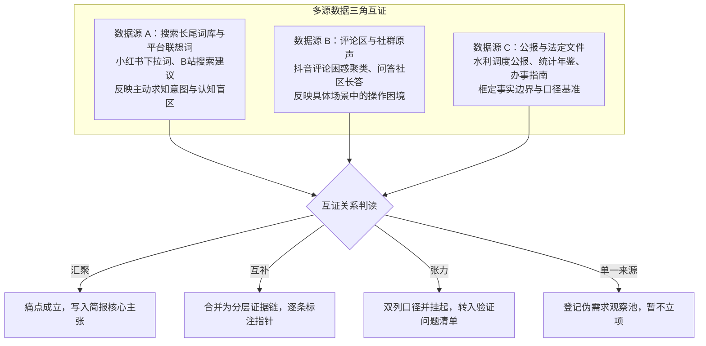
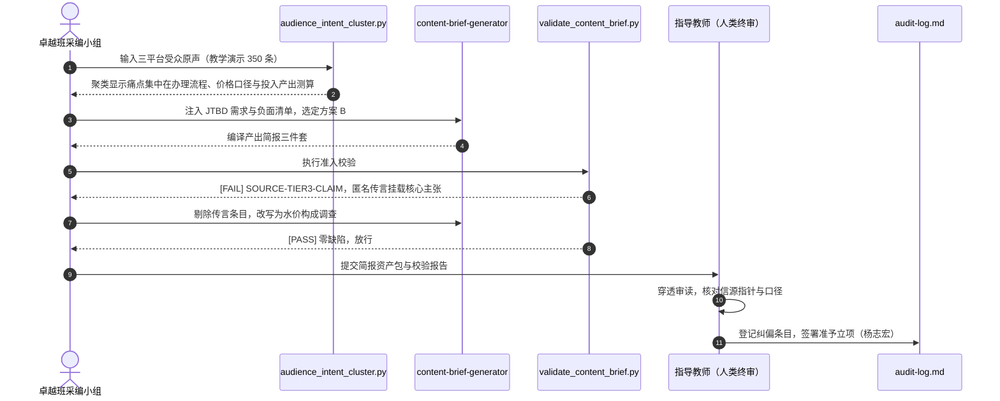

## 学习要点

- 掌握克莱顿·克里斯坦森（Clayton Christensen）受众雇佣理论（Jobs To Be Done, JTBD）与诺曼·邓津（Norman Denzin）数据三角互证方法，从自媒体平台原声与严肃媒体受众的功能属性切片中锚定真实需求基底。
- 掌握选题方案比较矩阵的加权评分规程、差异化证据链论证方法与“不做什么”（Non-goals）三层边界，产出可机读的选题决策规格 `config/topic_decision_spec.json`。
- 掌握出版级《内容执行简报》三件套（`content-brief.md`、`source-list.md`、`verification-questions.md`）的结构化规程，能用 WorkBuddy Skill 封装整套编译与自检流程。
- 掌握 `audience_intent_cluster.py` 与 `validate_content_brief.py` 两个工程脚本的开发、调用与工单化交付，能独立完成受众意图聚类、简报合规检测与信源闭环校验。
- 掌握人工终审与 `audit-log.md` 审核台账的签署规程，理解智能体产出的简报与信源在核查层面的效力边界。

## 本章引言

选题线索通过前置筛选之后，采编流程随即进入从抽象选题向具体内容产品转化的决策阶段。许多初学团队在此处失手。一类失手表现为把粗线条主题直接交给大语言模型要求一键写出通篇大稿，产出物充斥着空泛套话；另一类失手表现为凭个人感性直觉开工，缺少对受众真实痛点的实证调研，也缺少对证据缺口的预先审视，报道推进到中途便因证据链断裂而停工。

选题回答“为什么值得做”，简报工程回答“具体怎样做、需要哪些关键证据、如何分步验证、哪些内容坚决不碰”。内容产品在受众一侧承担着认知升级、决策参考、操作指南与情感确认等具体功能，采编团队若无法把这些功能定位到可观察的情境与可检验的证据之上，生产协同就失去了共同的判断基准。以影视飓风、晚点 LatePost、差评为代表的头部数字内容工作室，把选题判断、参数口径与踩坑教训写成本地工件反复复用；以澎湃新闻“明查”栏目、财新、美联社（Associated Press）、路透社（Reuters）为代表的严肃采编机构，把信源分级、核验工步与合规红线沉淀为团队共享的操作规范。两类主体在简报工序上共享同一套工程逻辑：受众痛点取证，方案差异论证，负面边界声明，证据编号闭环，人工终审签署。

本章系统阐述受众雇佣分析与多源数据三角互证、方案比较矩阵与边界控制、出版级内容简报三件套规程、自动化校验脚本开发与人工终审规程。工程实现遵循 Anthropic 提出的智能体编排模式（Agentic Workflows）[16]，以链式流生成简报、以评估器独立复核、以模型上下文协议（Model Context Protocol, MCP）[17] 暴露知识卡片与信源库资源，把智能体锁定在工具化的可审计轨道上。


## 第一节 受众雇佣理论与需求三角互证

### 一、学理背景：受众雇佣理论的传播学重构

克里斯坦森与合作者在《营销短视症的成因与解药》一文中指出，人口统计学特征与购买行为之间只有相关关系，因果解释来自购买者所处的具体情境以及他想完成的那件工作[1]。企业按年龄、职业、品类细分市场，往往把资源投向了错误的改进方向。快餐连锁奶昔销售案例把这套逻辑讲得透彻：门店请调研者驻店观察整日，发现近四成奶昔在清晨售出，买家几乎全是独自通勤的上班族。通勤者雇佣奶昔完成两件工作，一件是充当能撑到中午的便携早餐，另一件是充当漫长车程里单手可及的消遣。下午的奶昔承担的则是一件完全不同的工作，家长把它买给放学的孩子，充当奖励与亲子仪式[2]。同一产品在不同情境下被雇佣去完成不同的工作，改进方向自然随之分化。

把这套视角引入新闻传播学，内容生产的判断基准发生了位移。受众在信息流中点击并消费一篇融媒体报道，背后通常存在具体的生活或工作情境：政策调整引发缴费与申报决策焦虑，工作汇报需要一份可援引的公共数据，村社议事需要一笔算得清的公共账本，社交圈层需要可讨论的专业判断。这些情境催生的期待进步，构成报道被雇佣的功能基底。传播学的使用与满足研究早已确认受众按需求主动选择媒介内容[3]，受众雇佣理论把这一命题推进到工程层面：需求必须落到可观察的情境、可判定的进步与可测量的收益上，并由原声证据检验，被替代品覆盖得很好的需求属于冗余供给。

采编工程据此提炼雇佣陈述句模板：

> 当【情境】发生时，【目标受众】希望获得【进步】，以便【功能收益】，同时【情感或社交收益】。

陈述句的三段各有检验点。情境段须给出时间、场合与触发事件，进步段须描述受众想改变的现状，收益段须给出可测量的产出或可观察的行为。三段缺任意一段，需求陈述即判不合格。落到期刊版面上，受众的功能雇佣可归纳为六类功能属性切片，如表 5-1 所示。

**表 5-1 受众功能属性切片矩阵（三线表）**

| 功能属性 | 受众期待的进步 | 典型原声句式 | 证据形态 | 采编响应 |
| :--- | :--- | :--- | :--- | :--- |
| 认知决策型 | 完成一次缴费、申报或消费决策 | “水费一吨多少钱，标准在哪里查” | 价格文件、办事指南、官方问答 | 给出口径统一的政策与价格对照 |
| 操作执行型 | 独立走通一套办理或安装流程 | “办理流程怎么走，要带哪些材料” | 办事流程图、窗口记录、操作清单 | 产出分步骤服务型清单 |
| 效果评估型 | 判断一项投入是否划算 | “多少年能回本，有没有实测数据对比” | 试验台账、投入产出账本、对照数据 | 产出可核算的投入产出账 |
| 风险规避型 | 避开损失并取得维权抓手 | “被商家坑了，怎么维权退款” | 合同票据、鉴定报告、投诉记录 | 产出风险提示与维权路径 |
| 社交谈资型 | 在圈层中获得可讨论的公共材料 | “这个数据转给村里人看看” | 引用密度、转发与收藏轨迹 | 提供可引用的数据卡与图表 |
| 情感确认型 | 确认价值立场并获得共鸣 | “终于通水了，老人们等了一辈子” | 亲历者口述、影像记录、仪式现场 | 保留个体叙事与历史纵深 |

六类切片对应六种编辑响应，方案比较矩阵的“受众雇佣匹配度”维度将以此表为评分锚点。

### 二、自媒体生态的受众原声切片

自媒体平台的评论区、搜索联想词与笔记互动区构成公开的受众原声库，受众的节点化与媒介化生存状态决定了原声呈碎片化与场景化分布[14][15]。其采集遵循最小必要原则：仅采集公开可见文本，去除账号标识等个人信息，记录采集时间戳与页面存档链接，遵守平台服务协议与个人信息保护的法定要求。

B站（bilibili）的长视频评论区聚集着追问实测口径的硬核观众。影视飓风一类科技影像创作团队在视频中给出码率、色彩空间与镜头参数，评论区随即出现核对口径的长评，例如追问传感器型号、实测环境与对比条件。这类原声的功能属性偏向效果评估型与操作执行型，高赞长评的复现细节密度高，适合抽取评测口径与操作难点。

小红书的搜索联想词与下拉长尾词承载着私密性较强的主动求知意图。“避坑”“攻略”“求问”“怎么办”构成稳定的长尾词根，长尾分布特征意味着少量热门词之外还散布着大量具体而微的困惑[11]。笔记评论区的“还有没有后续”“求一个具体数字”等句式，指向受众尚未被满足的信息缺口。此处的噪声来自营销账号的种草软广，采集时须按账号历史内容比例与导流特征过滤。

抖音的评论区按热度排序，高频困惑以短句形式密集涌现。“蹲一个后续”“到底多少钱”“凭什么”等句式反复出现，情绪浓度高而细节密度低。提取时以疑问词为锚点截取困惑短语，情绪词单独降噪，方能把情绪表达还原为可调查的问题。

表 5-2 给出三个平台的原声切片示例，切片文本为教学演示样本，用于展示功能属性判定与证据效力分级的操作方法。

**表 5-2 自媒体平台受众原声切片示例（三线表，演示样本）**

| 平台与载体 | 原声切片（教学演示） | 功能属性 | 证据效力 | 主要偏差 |
| :--- | :--- | :--- | :--- | :--- |
| B站视频长评 | “滴灌带一亩地一年折旧算下来多少成本，跟大水漫灌比到底省多少水” | 效果评估型 | 中，可提取口径线索 | 硬核用户过表达，样本偏技术向 |
| 小红书搜索联想词 | “滴灌改造补贴怎么申请”“水费补贴资格怎么算” | 认知决策型、操作执行型 | 中高，反映主动求知意图 | 软广种草内容混杂，需账号过滤 |
| 抖音评论区高赞 | “水费到底一吨多少钱，怎么感觉比邻县贵好多” | 认知决策型 | 中，可定位争议焦点 | 情绪极化，具体数字需另行核实 |

### 三、严肃调查报道的受众功能属性对照

严肃采编机构的受众构成与自媒体观众差异显著，其功能属性切片为三角互证提供了另一条独立证据线。澎湃新闻“明查”栏目的读者雇佣核验结论，用途是规避被虚假信息误导的风险，栏目要求每条判定回溯至可公开查验的文件、影像与专家复核记录。财新的付费订阅读者以报道辅助投资与政策判断，其雇佣属性以认知决策型为主，报道中信源注释密度高、口径声明完整，成为决策参考型内容的样本。美联社与路透社的直接用户多为机构媒体与企业信息部门，通稿被当作事实基准再分发，路透社新闻手册把关键事实须经独立多源印证列为操作守则[20]。

**表 5-3 严肃媒体受众功能属性对照（三线表）**

| 媒体或栏目 | 主要受众主体 | 雇佣功能属性 | 证据规程 | 与自媒体原声的互证价值 |
| :--- | :--- | :--- | :--- | :--- |
| 澎湃新闻“明查”栏目 | 关注公共事件的普通读者 | 风险规避型、认知决策型 | 判定回溯公开文件与专家复核 | 提供真伪判定样本，校验原声中的传言成分 |
| 财新 | 专业与机构读者 | 认知决策型、效果评估型 | 信源注释密度高，口径声明完整 | 提供口径基准，校验自媒体数字的可比性 |
| 美联社（Associated Press） | 机构媒体与企业信息部门 | 认知决策型 | 关键事实多源印证，更正机制公开 | 提供事实基线，校验事件时间与主体 |
| 路透社（Reuters） | 机构媒体与金融数据终端 | 认知决策型、风险规避型 | 新闻手册规定独立多源印证与存证[20] | 提供核验规程样本，校验证据链结构 |

自媒体原声给出痛点的分布形态，严肃媒体给出证据的规程基准。两条证据线在同一议题上交汇，才能把“观众在抱怨什么”推进到“哪些抱怨有事实基础、值得投入采编资源”。

### 四、多源数据三角互证模型

邓津在《研究行动》中系统阐述了三角互证（triangulation）方法，主张用多个相互独立的观测角度抵消单一视角的局限[4]。互证分为四类：数据互证按时点、场合与人群抽取多组材料，研究者互证安排多位观察者独立采集，理论互证让同一材料接受不同理论框架的解释，方法互证把访谈、观察与文献分析并置比对。贾克把三角互证的判读关系归纳为汇聚、互补与张力三种形态[5]，三种形态对应三种不同的编辑动作。

在锁定受众雇佣需求时，团队搭建跨平台数据三角互证架构：数据源 A 为搜索长尾词库与平台联想词，反映主动求知意图与认知盲区；数据源 B 为评论区、问答社区与社群原声，反映具体场景中的操作困境与挫败；数据源 C 为权威公报、统计年鉴与法定文件，框定事实的宏观边界与口径基准。三源交汇处，方为受众亟待解决的真实认知痛点。



表 5-4 把四种判读形态的处理动作固化为可执行规则。互证门槛有三项：同类痛点至少出现在两个相互独立的平台或渠道；证据形态互异，例如原声与法定文件并存；采集时间窗口一致，例如同处一个季度。

**表 5-4 三角互证判读与处理规则（三线表）**

| 互证关系 | 判读含义 | 处理动作 | 简报落点 |
| :--- | :--- | :--- | :--- |
| 汇聚 | 多源指向同一痛点且口径可比 | 确认痛点成立，指定主证据源 | 核心事实主张 |
| 互补 | 多源各覆盖痛点的一个侧面 | 合并为分层证据链，逐条标注指针 | 信源清单与叙事结构 |
| 张力 | 多源在数字或结论上冲突 | 双列口径、标注偏差率，禁止取舍后单列 | 事实验证问题清单 |
| 单一来源 | 仅一个渠道出现该痛点 | 登记备用观察池，设定复核时点 | 暂不进入简报 |

### 五、工程契约与受众意图聚类脚本开发

从非结构化的社群文本中提取受众痛点，需要一条可复现的处理流水线。`audience_intent_cluster.py` 承担这道工序，模块划分如下。清洗模块剥离链接、提及与表情噪声，并按导流词过滤广告垃圾。语句切分模块按中英文句读切分，保留长度达标的碎片。意图判定模块以疑问词与困惑词为锚点，筛出承载疑问或困惑的语句。聚类模块按表 5-1 的六类功能属性词表加权打分，取最高分标签，平分时按词表顺序取先以保证可复现。痛点提取模块以提示词为锚点截取困惑短语，规避朴素 n-gram 统计的跨词边界噪声。互证判定模块统计每个聚类覆盖的独立平台数，达到门槛者判为已三角互证，未达标者转入单源观察池。输出模块同时生成机器可读的 JSON 报告与人工审读用的 Markdown 三线表。词表编码与归类沿用主题分析的编码规程[7]，开放语句的持续归纳借鉴扎根理论的比较思路[6]，编码复核按内容分析方法论的信度要求执行[8]。

```python
"""受众意图聚类与高频痛点提取工具。

本脚本服务选题阶段的受众原声分析工序，读取来自多个内容平台的公开评论
切片（JSONL 或 JSON 数组），依次执行文本清洗、广告噪声过滤、疑问语句切分、
功能属性意图加权聚类与高频痛点词组提取，并按平台维度给出三角互证判定，
为《内容执行简报》的“目标受众与功能雇佣”栏目提供可追溯的数据凭证。

用法示例::

    python audience_intent_cluster.py data/audience_voice.jsonl \
        --top-k 8 --min-platforms 2 \
        --output working/intent-report.json --report working/intent-report.md

输入记录字段约定::

    record_id  原声唯一编号（字符串，必填）
    platform   平台标识（bilibili/xiaohongshu/douyin/zhihu/weibo/other，必填）
    text       受众原声文本（必填）
    likes      点赞数（整数，可选，默认 0，用于代表句排序）
"""

from __future__ import annotations

import argparse
import json
import re
import sys
from collections import Counter, defaultdict
from dataclasses import dataclass, field
from pathlib import Path
from typing import Any, Iterable

# ---------------------------------------------------------------------------
# 词表与正则常量：集中定义，便于教研团队按专业方向扩展
# ---------------------------------------------------------------------------

SENTENCE_SPLIT_RE = re.compile(r"[。！？!?；;\n]+")
URL_RE = re.compile(r"https?://\S+|www\.\S+")
MENTION_RE = re.compile(r"@[\w\-_]{2,30}")
NOISE_RE = re.compile(r"[\U00010000-\U0010ffff]|[♡❤…～~]+")
SPAM_RE = re.compile(r"加微信|加微|私聊|代购|刷单|兼职|扫码|点击链接|领券|返利|招商|加盟")
PHRASE_STOP_RE = re.compile(r"[，,、；;：:？?！!。（）()【】\[\]「」“”\"']")

QUESTION_CUES: tuple[str, ...] = (
    "怎么办", "怎么", "如何", "为什么", "为何", "能不能", "凭啥", "凭什么",
    "能否", "是否", "是不是", "有没有", "多少钱", "多少", "几", "哪",
    "什么", "啥", "咋", "该不该", "值不值",
)
CONFUSION_CUES: tuple[str, ...] = (
    "不懂", "不明白", "搞不清", "分不清", "困惑", "求助", "怎么破",
    "踩坑", "上当", "没人管", "蹲一个后续",
)
# 提示词按长度降序排列，保证"多少钱"优先于"多少"命中
CUE_PATTERN = re.compile(
    "|".join(sorted(set(QUESTION_CUES + CONFUSION_CUES), key=len, reverse=True))
)

# 功能属性词表与本章表 5-1 的受众功能属性切片一一对应
INTENT_KEYWORDS: dict[str, tuple[str, ...]] = {
    "认知决策型": (
        "政策", "补贴", "资格", "条件", "标准", "规定", "多少钱", "价格",
        "收费", "涨", "降", "贵", "便宜", "一吨", "配额",
    ),
    "操作执行型": (
        "流程", "手续", "办理", "申请", "提交", "材料", "预约", "步骤",
        "操作", "安装", "登记", "上门", "报装", "怎么走",
    ),
    "效果评估型": (
        "增产", "节水", "效果", "产量", "收益", "划算", "值不值", "见效",
        "对比", "亩产", "利用率", "成本", "回本", "折旧", "省多少",
    ),
    "风险规避型": (
        "维权", "投诉", "退费", "退款", "赔偿", "被骗", "违规", "举报",
        "纠纷", "渗漏", "损坏", "质量", "坑", "避坑", "隐患",
    ),
    "社交谈资型": (
        "转发", "收藏", "关注", "博主", "科普", "聊聊", "讨论", "分享",
        "点赞", "评论区",
    ),
    "情感确认型": (
        "感动", "期待", "希望", "终于", "加油", "自豪", "心疼", "幸福",
        "骄傲", "真好",
    ),
}
UNCLASSIFIED = "未分类杂项"


# ---------------------------------------------------------------------------
# 数据模型
# ---------------------------------------------------------------------------


@dataclass(frozen=True)
class Utterance:
    """一条受众原声记录。"""

    record_id: str
    platform: str
    text: str
    likes: int = 0


@dataclass
class ClusterResult:
    """单个功能属性聚类的统计结果。"""

    intent: str
    sentence_count: int = 0
    platforms: Counter = field(default_factory=Counter)
    top_pain_phrases: list[tuple[str, int]] = field(default_factory=list)
    exemplars: list[str] = field(default_factory=list)

    @property
    def platform_count(self) -> int:
        """覆盖的独立平台数量，三角互证判定的直接依据。"""
        return len(self.platforms)


@dataclass
class IntentReport:
    """受众意图聚类总报告。"""

    total_records: int
    kept_records: int
    spam_dropped: int
    sentence_count: int
    intent_sentence_count: int
    clusters: list[ClusterResult]
    triangulated: list[str]
    single_source: list[str]
    top_pain_phrases: list[tuple[str, int]]

    def to_dict(self) -> dict[str, Any]:
        """序列化为机器可读结构，供简报编译环节消费。"""
        return {
            "statistics": {
                "total_records": self.total_records,
                "kept_records": self.kept_records,
                "spam_dropped": self.spam_dropped,
                "sentence_count": self.sentence_count,
                "intent_sentence_count": self.intent_sentence_count,
            },
            "clusters": [
                {
                    "intent": c.intent,
                    "sentence_count": c.sentence_count,
                    "platforms": dict(sorted(c.platforms.items())),
                    "platform_count": c.platform_count,
                    "top_pain_phrases": [{"phrase": t, "count": n} for t, n in c.top_pain_phrases],
                    "exemplars": c.exemplars,
                }
                for c in self.clusters
            ],
            "triangulated": self.triangulated,
            "single_source": self.single_source,
            "top_pain_phrases": [{"phrase": t, "count": n} for t, n in self.top_pain_phrases],
        }


# ---------------------------------------------------------------------------
# 文本处理函数
# ---------------------------------------------------------------------------


def normalize(text: str) -> str:
    """清洗链接、提及与表情噪声，统一空白。"""
    text = URL_RE.sub(" ", text)
    text = MENTION_RE.sub(" ", text)
    text = NOISE_RE.sub(" ", text)
    return re.sub(r"\s+", " ", text).strip()


def is_spam(text: str) -> bool:
    """识别广告导流与营销噪声，命中即整条丢弃。"""
    return SPAM_RE.search(text) is not None


def split_sentences(text: str) -> list[str]:
    """按中英文句读切分语句，丢弃过短碎片。"""
    return [s.strip() for s in SENTENCE_SPLIT_RE.split(text) if len(s.strip()) >= 4]


def is_intent_bearing(sentence: str) -> bool:
    """判定语句是否承载疑问或困惑意图。"""
    if sentence.endswith(("？", "?")):
        return True
    return any(cue in sentence for cue in QUESTION_CUES + CONFUSION_CUES)


def score_intents(sentence: str) -> dict[str, float]:
    """按命中关键词的去重个数为每个功能属性打分。"""
    return {
        intent: float(sum(1 for kw in keywords if kw in sentence))
        for intent, keywords in INTENT_KEYWORDS.items()
    }


def assign_intent(sentence: str) -> str:
    """返回得分最高的功能属性标签，平分时按词表顺序取先，保证可复现。"""
    scores = score_intents(sentence)
    best = max(scores.values())
    if best <= 0:
        return UNCLASSIFIED
    winners = sorted(intent for intent, score in scores.items() if score == best)
    return winners[0]


def extract_pain_phrases(sentences: Iterable[str], max_len: int = 12) -> Counter:
    """以疑问或困惑提示词为锚点截取困惑短语，统计高频痛点。"""
    counter: Counter = Counter()
    for sentence in sentences:
        for match in CUE_PATTERN.finditer(sentence):
            span_end = len(sentence)
            for stop_match in PHRASE_STOP_RE.finditer(sentence, match.end()):
                span_end = stop_match.start()
                break
            phrase = sentence[match.start() : span_end].strip()
            if 2 <= len(phrase) <= max_len:
                counter[phrase] += 1
    return counter


def rank_phrases(counter: Counter, limit: int) -> list[tuple[str, int]]:
    """剔除被同等或更高频长短语包含的短语，返回稳定的 Top-K 列表。"""
    ranked = sorted(counter.items(), key=lambda kv: (-kv[1], -len(kv[0]), kv[0]))
    kept: list[tuple[str, int]] = []
    for phrase, count in ranked:
        if any(phrase in longer and counter[longer] >= count for longer, _ in kept):
            continue
        kept.append((phrase, count))
        if len(kept) >= limit:
            break
    return kept


# ---------------------------------------------------------------------------
# 数据加载
# ---------------------------------------------------------------------------


def load_utterances(path: Path) -> tuple[list[Utterance], dict[str, int]]:
    """读取 JSONL 或 JSON 数组数据集，返回有效记录与清洗统计。"""
    if not path.exists():
        raise FileNotFoundError(f"输入数据文件不存在: {path}")
    raw = path.read_text(encoding="utf-8").strip()
    if not raw:
        raise ValueError(f"输入数据文件为空: {path}")

    if path.suffix.lower() == ".jsonl":
        payloads = [json.loads(line) for line in raw.splitlines() if line.strip()]
    else:
        payloads = json.loads(raw)
        if not isinstance(payloads, list):
            raise ValueError("JSON 输入必须是数组格式")

    records: list[Utterance] = []
    stats = {"total": len(payloads), "invalid": 0, "duplicate_id": 0}
    seen_ids: set[str] = set()
    for index, payload in enumerate(payloads):
        if not isinstance(payload, dict):
            stats["invalid"] += 1
            continue
        record_id = str(payload.get("record_id", "")).strip()
        platform = str(payload.get("platform", "")).strip().lower()
        text = str(payload.get("text", "")).strip()
        try:
            likes = int(payload.get("likes", 0) or 0)
        except (TypeError, ValueError):
            likes = 0
        if not record_id or not platform or not text:
            stats["invalid"] += 1
            continue
        if record_id in seen_ids:
            stats["duplicate_id"] += 1
            continue
        seen_ids.add(record_id)
        records.append(Utterance(record_id, platform, text, likes))
    return records, stats


# ---------------------------------------------------------------------------
# 主分析流水线
# ---------------------------------------------------------------------------


def analyze(utterances: list[Utterance], top_k: int, min_platforms: int) -> IntentReport:
    """执行意图聚类、痛点词提取与跨平台三角互证判定。"""
    cluster_sentences: dict[str, list[str]] = defaultdict(list)
    cluster_platforms: dict[str, Counter] = defaultdict(Counter)
    cluster_exemplars: dict[str, list[tuple[int, str]]] = defaultdict(list)
    spam_dropped = 0
    sentence_total = 0

    for utterance in utterances:
        if is_spam(utterance.text):
            spam_dropped += 1
            continue
        for sentence in split_sentences(normalize(utterance.text)):
            sentence_total += 1
            if not is_intent_bearing(sentence):
                continue
            intent = assign_intent(sentence)
            cluster_sentences[intent].append(sentence)
            cluster_platforms[intent][utterance.platform] += 1
            cluster_exemplars[intent].append((utterance.likes, sentence))

    clusters: list[ClusterResult] = []
    for intent in list(INTENT_KEYWORDS) + [UNCLASSIFIED]:
        sentences = cluster_sentences.get(intent, [])
        if not sentences:
            continue
        exemplars = [
            text for _, text in sorted(cluster_exemplars[intent], key=lambda kv: (-kv[0], kv[1]))[:3]
        ]
        clusters.append(
            ClusterResult(
                intent=intent,
                sentence_count=len(sentences),
                platforms=cluster_platforms[intent],
                top_pain_phrases=rank_phrases(extract_pain_phrases(sentences), top_k),
                exemplars=exemplars,
            )
        )

    clusters.sort(key=lambda c: (-c.sentence_count, c.intent))
    intent_total = sum(c.sentence_count for c in clusters)
    triangulated = sorted(c.intent for c in clusters if c.platform_count >= min_platforms)
    single_source = sorted(c.intent for c in clusters if c.platform_count < min_platforms)

    return IntentReport(
        total_records=len(utterances),
        kept_records=len(utterances) - spam_dropped,
        spam_dropped=spam_dropped,
        sentence_count=sentence_total,
        intent_sentence_count=intent_total,
        clusters=clusters,
        triangulated=triangulated,
        single_source=single_source,
        top_pain_phrases=rank_phrases(
            extract_pain_phrases(
                sentence for cluster in clusters for sentence in cluster_sentences[cluster.intent]
            ),
            top_k,
        ),
    )


def render_markdown(report: IntentReport, min_platforms: int) -> str:
    """渲染三线表风格的 Markdown 报告，供人工终审使用。"""
    lines = [
        "# 受众意图聚类与高频痛点报告",
        "",
        f"有效原声 {report.kept_records} 条，过滤广告噪声 {report.spam_dropped} 条，"
        f"切分语句 {report.sentence_count} 句，其中承载疑问或困惑意图 {report.intent_sentence_count} 句。"
        f"三角互证门槛为覆盖不少于 {min_platforms} 个独立平台。",
        "",
        "## 功能属性聚类汇总",
        "",
        "| 功能属性 | 有效语句数 | 覆盖平台 | 代表原声 | 互证判定 |",
        "| :--- | :--- | :--- | :--- | :--- |",
    ]
    for cluster in report.clusters:
        platform_text = "、".join(sorted(cluster.platforms)) or "无"
        exemplar = cluster.exemplars[0] if cluster.exemplars else "无"
        verdict = "已三角互证" if cluster.intent in report.triangulated else "单源挂起观察池"
        lines.append(
            f"| {cluster.intent} | {cluster.sentence_count} | {platform_text} | {exemplar} | {verdict} |"
        )
    lines += [
        "",
        "## 高频困惑短语排行",
        "",
        "| 排名 | 词组 | 出现次数 |",
        "| :--- | :--- | :--- |",
    ]
    for rank, (phrase, count) in enumerate(report.top_pain_phrases, start=1):
        lines.append(f"| {rank} | {phrase} | {count} |")
    lines.append("")
    return "\n".join(lines)


def build_parser() -> argparse.ArgumentParser:
    """构建命令行参数解析器。"""
    parser = argparse.ArgumentParser(description="受众意图聚类与高频痛点提取工具")
    parser.add_argument("input", type=Path, help="受众原声数据集（.jsonl 或 .json）")
    parser.add_argument("--top-k", type=int, default=8, help="每组高频痛点词组数量上限")
    parser.add_argument("--min-platforms", type=int, default=2, help="三角互证所需独立平台数下限")
    parser.add_argument("--output", type=Path, help="JSON 报告输出路径")
    parser.add_argument("--report", type=Path, help="Markdown 报告输出路径")
    return parser


def main(argv: list[str] | None = None) -> int:
    """命令行入口，返回进程退出码。"""
    args = build_parser().parse_args(argv)
    if args.top_k < 1 or args.min_platforms < 1:
        print("[ERROR] --top-k 与 --min-platforms 必须为正整数。", file=sys.stderr)
        return 2
    try:
        utterances, load_stats = load_utterances(args.input)
    except (OSError, ValueError, json.JSONDecodeError) as exc:
        print(f"[ERROR] 数据读取失败: {exc}", file=sys.stderr)
        return 2

    report = analyze(utterances, top_k=args.top_k, min_platforms=args.min_platforms)
    payload = report.to_dict()
    payload["statistics"].update(load_stats)

    if args.output:
        args.output.parent.mkdir(parents=True, exist_ok=True)
        args.output.write_text(
            json.dumps(payload, ensure_ascii=False, indent=2), encoding="utf-8"
        )
    if args.report:
        args.report.parent.mkdir(parents=True, exist_ok=True)
        args.report.write_text(render_markdown(report, args.min_platforms), encoding="utf-8")

    print(f"[PASS] 聚类完成：有效语句 {report.intent_sentence_count} 句，"
          f"已三角互证功能属性 {len(report.triangulated)} 组，"
          f"单源挂起 {len(report.single_source)} 组。")
    for cluster in report.clusters:
        verdict = "三角互证" if cluster.intent in report.triangulated else "单源挂起"
        print(f"  - {cluster.intent}: {cluster.sentence_count} 句 / "
              f"{cluster.platform_count} 个平台 / {verdict}")
    return 0


if __name__ == "__main__":
    sys.exit(main())
```

输入数据采用 JSONL 格式，每行一条原声记录，字段约定见脚本模块文档串。样例如下：

```json
{"record_id": "CM0000", "platform": "bilibili", "text": "滴灌带一亩地一年折旧算下来多少成本，跟大水漫灌比到底省多少水？", "likes": 0}
{"record_id": "CM0001", "platform": "xiaohongshu", "text": "求问水费补贴政策今年还有吗，申请要准备哪些材料？", "likes": 13}
{"record_id": "CM0002", "platform": "douyin", "text": "水费到底一吨多少钱，怎么感觉比邻县贵好多？", "likes": 26}
{"record_id": "CM0003", "platform": "bilibili", "text": "膜下滴灌设备坏了走什么维修流程，镇上有没有售后网点？", "likes": 39}
{"record_id": "CM0004", "platform": "xiaohongshu", "text": "避坑！买滴灌带被商家坑了，管壁薄得跟纸一样，怎么维权退款？", "likes": 52}
{"record_id": "CM0005", "platform": "douyin", "text": "我们村的管网跑冒滴漏没人管，该向哪个部门投诉？", "likes": 65}
```

控制台输出以聚类摘要收束，供记者判断痛点分布与互证状态：

```text
[PASS] 聚类完成：有效语句 331 句，已三角互证功能属性 4 组，单源挂起 0 组。
  - 操作执行型: 117 句 / 3 个平台 / 三角互证
  - 认知决策型: 97 句 / 3 个平台 / 三角互证
  - 效果评估型: 77 句 / 3 个平台 / 三角互证
  - 风险规避型: 40 句 / 2 个平台 / 三角互证
```

脚本运行情况登记进任务工单，成为简报“目标受众与功能雇佣”栏目的数据凭证。配套工单如下，格式沿用第 2 周确立的五要素契约：

```markdown
# 任务工单：受众意图聚类与高频痛点提取 (tasks/audience-intent-cluster.md)

---
id: TASK-BRIEF-20260930-001
owner: 杨志宏
due: 2026-10-02
depends_on: [concept-jtbd, concept-triangulation]
pitfalls: [pitfall-self-indulgent-demand, pitfall-single-source]
mcp_resources: [mcp://wiki/concepts/jtbd, mcp://wiki/concepts/triangulation]
breaker_policy: config/safety_policy.json
---

## 1. 业务目标 (Goal)
从三个自媒体平台的公开受众原声切片中提取疑问与困惑语句，按六类功能属性聚类并输出高频困惑短语，判定哪些痛点已获跨平台三角互证。本工单输出数据报告，禁止在报告中给出任何未经核实的政策、价格或工程安全结论。

## 2. 输入指针 (Input)
- 受众原声数据集：`@data/audience_voice.jsonl`（公开文本，已去标识化，采集时间戳 2026-09-28，记录数 350）
- 功能属性词表：`@wiki/concepts/jtbd.md` 表 5-1 对应的六类词表
- 互证门槛配置：至少覆盖 2 个相互独立平台（命令行参数 `--min-platforms 2`）

## 3. 执行步序 (Steps)
1. 运行 `scripts/audience_intent_cluster.py`，检查统计字段 `invalid` 与 `duplicate_id` 均为 0。
2. 核对四组聚类的平台覆盖数，记录每组高频困惑短语前三项。
3. 将单源聚类登记至 `working/backlog-pool.md`，标注复核时点。
4. 抽读每组代表原声 3 条，剔除语义被误分类的样本并记录原因。
5. 把聚类结论转写为雇佣陈述句，写入简报草案的“目标受众与功能雇佣”栏目。

## 4. 交付形态 (Output)
保存 JSON 报告 `working/intent-report.json` 与 Markdown 报告 `working/intent-report.md`，另存执行日志 `working/logs/audience-intent-cluster.log`，三件文件均进入 Git 版本管理。

## 5. 验收判据 (Acceptance Criteria)
1. 数据集记录数与统计字段 `total_records` 一致，缺字段或重复编号记录数必须为 0。
2. 每组聚类必须给出代表原声与高频困惑短语，缺任一项判不合格。
3. 凡判定为“已三角互证”的痛点，必须注明覆盖平台名称与各自样本量。
4. 报告中禁止出现无原声支撑的推断性痛点描述，出现即判不合格。
5. 抽读样本的误分类率超过一成时，须调整词表后重跑，两次运行结果一并留档。
6. 报告由主理记者逐字通读后签署姓名与时间，方可流转至简报编译环节。
```

### 六、边界约束：警惕自嗨式伪需求

创作者把自身兴趣投射为受众需求，是选题阶段最顽固的系统性偏差。表 5-5 给出五类高频伪需求信号与处理动作，凡命中信号的需求陈述，一律不得直接进入简报。

**表 5-5 伪需求识别信号与处理动作（三线表）**

| 伪需求信号 | 判据 | 处理动作 |
| :--- | :--- | :--- |
| 同行自嗨 | 仅同专业师生感兴趣，受众原声库中查无对应疑问句 | 降级为备课素材，移出选题队列 |
| 情境缺位 | 雇佣陈述句写不出具体触发事件与时间场合 | 要求补写情境段，补写不出即剔除 |
| 替代品饱和 | 问答社区与官方问答已完整覆盖该困惑 | 改为整合型服务清单，放弃深度调查 |
| 情感投射 | 需求陈述全为形容词，无一条可测量收益 | 要求给出收益测量口径，否则剔除 |
| 无原声可采 | 三个平台采集窗口内均为零命中 | 登记备用观察池，设定复核时点 |

进入简报的每条受众需求须携带四件凭证：采样平台与渠道、样本量、代表原声、互证判定结果。凭证缺任一项，简报校验脚本按规则 `CLAIM-NO-EVIDENCE` 拦截。

## 第二节 选题决策模型与边界控制

### 一、方案比较矩阵与加权评分规程

面对同一新闻事件，切入角度的差异会导致生产成本、法律风险与公共价值的巨大分化。新闻社会学对编辑部决策的研究表明，新闻选择是组织惯例、职业判断与资源约束共同作用的产物[9][10]，工程化的比较矩阵把这些约束显式写进评分表。专业采编工程要求团队在开工前至少提出两套差异化实施方案，每套方案写明叙事主线、证据需求、成本与风险，再按统一维度评分比较。

表 5-6 给出七个评估维度及其权重与评分锚点。权重之和为 1.00，评分取 0 至 5 的整数，锚点描述给出各分值的判定依据，评分须注明数据来源，例如“证据可得性”得分由证据可得性核查清单的通过率折算。加权总分按下式计算：

$$S=\sum_{i=1}^{n} w_i s_i$$

其中 $w_i$ 为第 $i$ 个维度的权重，$s_i$ 为该维度得分。红线否决条款独立于加权分：任何一套方案若触碰红线，无论得分高低一律否决。红线通常包括未获许可进入受限区域采访、预设未经证实的定性结论、采集手段违反平台协议或法定要求。

**表 5-6 方案比较维度与权重（三线表）**

| 评估维度 | 权重 | 评分锚点（0 至 5） |
| :--- | :--- | :--- |
| 受众雇佣匹配度 | 0.25 | 5 分对应雇佣陈述句三段齐备且功能属性命中聚类前三 |
| 证据可得性 | 0.20 | 5 分对应全部证据可在两周内合法取得并留存指针 |
| 差异化信息增量 | 0.15 | 5 分对应全网同题报道均未覆盖的核心事实 |
| 制作成本可控性 | 0.15 | 5 分对应单人一周内可交付且无需额外设备 |
| 法务与伦理风险可控性 | 0.10 | 5 分对应无隐私、侵权与失实风险敞口 |
| 分发适配度 | 0.10 | 5 分对应三类平台载体均有成熟形态模板 |
| 可迭代延展性 | 0.05 | 5 分对应可持续跟踪形成系列专题 |

表 5-7 以引洮工程节水调查为场景给出三套方案的评分结果。方案 A 为成就综述路线，成本最低而信息增量最弱；方案 B 为农户用水账本与调水调度数据双线穿透，雇佣匹配度与差异化增量领先，成本与证据压力较大；方案 C 为补贴申报服务清单，分发适配度高而差异化中等。加权总分分别为 3.00、3.85 与 3.70，方案 B 入选，其证据压力由简报三件套与验证问题清单承接。

**表 5-7 三套方案加权评分对照（引洮案例，三线表）**

| 评估维度 | 权重 | 方案 A 成就综述 | 方案 B 双线穿透 | 方案 C 服务清单 |
| :--- | :--- | :--- | :--- | :--- |
| 受众雇佣匹配度 | 0.25 | 2 | 5 | 4 |
| 证据可得性 | 0.20 | 4 | 3 | 4 |
| 差异化信息增量 | 0.15 | 1 | 5 | 2 |
| 制作成本可控性 | 0.15 | 5 | 2 | 3 |
| 法务与伦理风险可控性 | 0.10 | 4 | 3 | 5 |
| 分发适配度 | 0.10 | 3 | 4 | 5 |
| 可迭代延展性 | 0.05 | 2 | 5 | 3 |
| 加权总分 | 1.00 | 3.00 | 3.85 | 3.70 |

评分表随选题决策规格一并归档，评分人、评分时点与数据依据写入表注。团队评分分歧按双列处理，两组得分与各自理由并存，留待终审裁决。

### 二、差异化证据链论证

方案的价值主张必须落成一条可检验的证据链。证据链采用四段结构：事实主张、证据内容、物理指针、核验状态。四段逐级收窄，主张描述“说了什么”，证据描述“凭什么说”，指针描述“到哪里查”，状态描述“查到哪一步”。

证据可得性核查在立项前完成，核查项有四类：文件能否合法取得，包括公开查询、依申请公开与当事人授权；当事人是否可采访，包括联系方式、时间窗口与受访意愿；数据口径是否统一，包括计量单位、统计周期与地域范围；时间戳是否覆盖报道窗口，包括查询时间与文件版本。核查结果记为证据缺口清单，缺口写明缺口内容、补齐途径与责任时点，缺口未闭合的主张在简报中一律标注待核状态。

反证搜索是证据链论证的义务性步骤。团队须主动检索能推翻本方主张的材料，波普尔的证伪主义提醒研究者，一个无法被推翻的断言没有信息量[13]；卡尼曼对确认偏差的实验研究提醒执行者，人在既有立场下会系统性偏爱支持性证据[12]。工程上的对应做法是设立反证检索工步，指定专人检索相反口径的文件与数据，检索结果无论有利与否一律写入信源清单。证据留存遵循保管链规范：文件留存哈希值与获取时间戳，录音录像留存时间码，网页留存存档链接与截图，双人复核后签字封存。

### 三、“不做什么”（Non-goals）的三层边界

选题范围失控往往源于边界缺位。负面清单按题域、方法与结论三层声明，三层各自回答一类自查提问，写法上要求可判定、可执行、可追溯。可判定指条款含明确对象与动作，现场能判断是否违例；可执行指条款约束采访与写作的具体行为；可追溯指条款写入简报并随变更单进入审核台账。

**表 5-8 负面边界三层结构（三线表）**

| 边界层 | 自查提问 | 引洮案例条款 | 违例后果 |
| :--- | :--- | :--- | :--- |
| 题域边界 | 本次报道坚决不碰哪些题 | 不介入行政区域间尚未定论的取水配额历史争议 | 线索登记备用观察池，正文删除 |
| 方法边界 | 哪些采集与呈现手段禁用 | 不采集农户完整身份信息，不使用未授权的监控影像 | 素材作废，重新取证 |
| 结论边界 | 哪些结论禁止给出 | 不预测未开工工程的远期经济效益，不作动机定性评价 | 结论段落重写并复核 |

负面清单的最低条目数为 3 条，每条负面边界对应一条验收判据，验收时逐条对照。负面边界与红线条款的区别在于效力层级：负面边界约束报道内容与工作方法，违反后由记者整改；红线条款约束项目存续，触发后项目直接否决。执行期间偶发的新线索登记至备用观察池，登记格式为线索编号、发现时点、挂起原因与复核时点，当期报道严禁横向扩张。

### 四、工程契约：选题决策规格配置

把决策结论固化为 `config/topic_decision_spec.json`，作为项目立项的技术凭证与下游简报编译器的输入契约：

```json
{
  "spec_version": "1.0",
  "topic_id": "TOPIC-20260930-001",
  "topic_name": "引洮工程全线建成五周年：陇中旱塬的节水账本与生态水网实录",
  "decision_date": "2026-09-30",
  "owner": "杨志宏",
  "candidate_plans": [
    {
      "plan_id": "PLAN-A",
      "narrative": "梳理通稿与发布会声明，完成成就综述报道",
      "evidence_requirements": ["公开通稿", "发布会文字实录"],
      "cost_days": 1,
      "risk_level": "low"
    },
    {
      "plan_id": "PLAN-B",
      "narrative": "农户用水账本与调水调度数据双线穿透调查",
      "evidence_requirements": ["农户水费票据", "调度台账", "管护协会收费明细"],
      "cost_days": 5,
      "risk_level": "medium"
    },
    {
      "plan_id": "PLAN-C",
      "narrative": "节水设施改造补贴申报服务清单",
      "evidence_requirements": ["办事指南", "窗口咨询记录"],
      "cost_days": 3,
      "risk_level": "low"
    }
  ],
  "chosen_plan": "PLAN-B",
  "decision_rule": "按权重矩阵加权总分最高者入选，任一红线条款触发即否决",
  "target_audience_job": "当受水区农户在春灌前决定是否改造滴灌设施时，他们希望拿到一笔可核算的投入产出账，以便确定改造时机与补贴申报路径",
  "job_functional_attributes": ["认知决策型", "效果评估型", "操作执行型", "风险规避型"],
  "triangulation_sources": [
    {"source_id": "S1", "channel": "xiaohongshu", "form": "长尾搜索联想词", "slice_example": "滴灌改造补贴怎么申请"},
    {"source_id": "S2", "channel": "douyin", "form": "评论区高频困惑", "slice_example": "水费一吨多少钱"},
    {"source_id": "S3", "channel": "official", "form": "水利调度公报", "slice_example": "季度管网巡检日志"}
  ],
  "non_goals": [
    "不撰写通篇堆砌成就口号的宏大赞歌",
    "不介入不同行政区域之间尚未定论的取水配额历史争议",
    "不预测尚未开工规划工程的远期经济效益指标"
  ],
  "red_lines": [
    "未获当事人书面同意不得公开农户完整身份信息",
    "未经双源印证的伤亡、险情类断言不得进入正文"
  ],
  "backlog_pool": ["取水配额历史争议专题", "远期规划工程经济评估专题"],
  "acceptance": {
    "brief_package": "working/briefs/ 三件套齐备且通过 validate_content_brief.py 校验",
    "human_signoff": "主理人逐字通读后签署姓名与时间"
  }
}
```

表 5-9 给出字段规格与校验点，校验脚本 `validate_content_brief.py` 以 `--spec` 参数读取该文件，检查字段完备性与负面清单条目数。

**表 5-9 选题决策规格字段规格（三线表）**

| 字段 | 类型 | 约束 | 校验点 |
| :--- | :--- | :--- | :--- |
| `topic_id` | 字符串 | 形如 TOPIC-YYYYMMDD-NNN，全局唯一 | 与工单、台账编号互链 |
| `topic_name` | 字符串 | 含对象、区域与时点 | 能独立标识选题 |
| `candidate_plans` | 数组 | 至少 2 套差异化方案 | 每套含叙事主线与证据需求 |
| `chosen_plan` | 字符串 | 取值须在 `candidate_plans` 内 | 与评分表最高分方案一致 |
| `decision_rule` | 字符串 | 含加权规则与红线否决 | 与表 5-6 权重定义一致 |
| `target_audience_job` | 字符串 | 雇佣陈述句三段齐备 | 情境、进步、收益可判定 |
| `job_functional_attributes` | 数组 | 取值限于表 5-1 六类 | 与聚类报告前三组对应 |
| `triangulation_sources` | 数组 | 至少 3 条独立渠道 | 覆盖原声渠道与法定文件 |
| `non_goals` | 数组 | 至少 3 条 | 每条含明确对象与动作 |
| `red_lines` | 数组 | 至少 1 条否决条款 | 违例后果写明 |
| `backlog_pool` | 数组 | 记录挂起线索 | 含复核时点 |
| `acceptance` | 对象 | 含自动化校验与人工签署 | 与验收判据逐条对应 |

### 五、边界约束：资源物理边界与范围蔓延防控

采编团队须严守时间盒、人力与采访半径的物理边界。选题策划案通过终审并声明负面边界后，执行阶段严禁擅自横向膨胀范围。范围蔓延有三个征兆：采访对象数量持续超出计划表，证据缺口清单条目只增不减，叙事结构段落数随采访推进不断加码。出现任一征兆，主理人启动变更评审，决策规格的任何修改均须出具变更单，写明修改字段、修改理由与影响评估，并登记进 `audit-log.md`。范围控制的目的在于保住交付确定性：按期闭环的小切口调查，价值高于久拖不决的大盘子。

## 第三节 出版级内容简报（Content Brief）工程规范

### 一、内容简报的契约本质与三大交付件

在敏捷新闻生产体系中，《内容执行简报》（Content Brief）相当于建筑工程的施工图纸与软件开发的架构决策记录（Architecture Decision Record, ADR）。它是采编流水线的接口契约，上游承接选题决策规格，下游驱动采访、写作、制图与核验工序。不合格的简报会把采访重点带偏，让后期制作产出格式失配的素材，也让核验环节失去判断基准。

出版级内容简报工程确立“三件套”标准交付体系：

```text
working/briefs/                     # 内容简报工程目录
├── content-brief.md                # 【执行简报主文档】核心事实主张、受众雇佣、负面边界、结构与平台规格
├── source-list.md                  # 【信源与证据清单】逐条断言的一手来源、物理指针与核验状态
└── verification-questions.md       # 【事实验证问题清单】待核实疑点与穿透性采访问题
```

表 5-10 给出三件交付物的必填模块、阈值与对应校验规则编号，编号取自 `validate_content_brief.py` 的规则代码，脚本与简报共用同一套判据。

**表 5-10 简报三件套交付规格（三线表）**

| 交付件 | 必填模块 | 阈值 | 对应校验规则 |
| :--- | :--- | :--- | :--- |
| `content-brief.md` | 核心事实主张、目标受众与功能雇佣、负面边界、叙事结构规划、跨平台交付规格 | 主张单句 150 字以内且逐句挂证据编号；负面边界不少于 3 条；叙事节点不少于 3 个 | `BRIEF-SECTION-MISSING`、`CLAIM-NO-EVIDENCE`、`CLAIM-OVERLENGTH`、`NON-GOAL-INSUFFICIENT` |
| `source-list.md` | 序号、核心论点、信源机构与当事人、证据形态与物理指针、信源级别、核验状态 | 条目不少于 3 条；Tier-1 条目不少于 2 条；每条含可回溯指针与合法状态词 | `SOURCE-ROW-INSUFFICIENT`、`SOURCE-TIER1-INSUFFICIENT`、`SOURCE-LOCATOR-MISSING`、`SOURCE-STATUS-INVALID` |
| `verification-questions.md` | 采访对象标签、疑点描述、待核信源编号、问句收束 | 问题不少于 3 条；采访对象不少于 2 类；每条挂载信源编号 | `QUESTION-INSUFFICIENT`、`QUESTION-TARGET-MISSING`、`QUESTION-NO-EVIDENCE` |

### 二、执行简报主文档（`content-brief.md`）

以下模板中的数值、人名与页码为演示样例，用于展示字段结构，实际采编须填入可核验的真实物理指针：

```markdown
# 内容执行简报：引洮工程全线建成五周年陇中旱塬节水实录 (content-brief.md)

## 1. 核心事实主张 (Core Thesis)

引洮供水工程干支渠辐射甘肃中部五市十三县区，六百余万群众稳定告别靠天吃水的历史 [SRC-001]。工程通水以来，受水区农田灌溉由大水漫灌向膜下滴灌与水肥一体化改造，亩均用水与亩均水费同步下降 [SRC-002]。农户终端水价由原水价、管网折旧与管护协会人工费三段构成，加价明细的公开程度直接决定群众的账本信任度 [SRC-003]。

## 2. 目标受众与功能雇佣 (JTBD)

当受水区农户在春灌前决定是否改造滴灌设施时，他们希望拿到一笔可核算的投入产出账，以便确定改造时机与补贴申报路径，同时在村社议事中获得可援引的公共依据。雇佣功能属性以认知决策型与效果评估型为主，操作执行型与风险规避型为辅。

## 3. 负面边界 (Non-goals)

- 不撰写通篇堆砌成就口号的宏大赞歌，正文不得使用无数据支撑的抒情句；
- 不介入不同行政区域之间尚未定论的取水配额历史争议，配额议题登记至备用观察池；
- 不预测尚未开工规划工程的远期经济效益指标；
- 不对管护协会工作人员作动机层面的定性评价。

## 4. 叙事结构规划

- 第一部分【水之渴】：以泛黄水票与水窖影像开篇，交代陇中人均水资源约为全国三分之一的历史基线 [SRC-001]，配额 1200 字；
- 第二部分【水之变】：以五户农户年度用水账本为主线，对照滴灌改造前后的亩均用水与亩均水费 [SRC-002]，配额 1600 字；
- 第三部分【水之治】：走访水利调度中台与村级管护协会，逐段拆解终端水价加价构成 [SRC-003]，配额 1200 字。

## 5. 跨平台交付规格

- 微信端内深度特稿 4000 字，附三线表《农户用水成本对照表》；
- 短视频平台 180 秒现场纪实，以水表数字跳动与滴灌带特写开篇，字幕给出亩均用水对照数；
- 服务型图文卡片 6 张，输出滴灌改造补贴申报材料清单 [SRC-004]。
```

编写规范有五条要点。核心事实主张控制在 150 字以内，逐句挂载信源编号，主张句与证据编号的对应关系由校验脚本强制检查。目标受众栏目写成雇佣陈述句，情境、进步、收益三段齐备，功能属性取值与聚类报告对应。负面边界给出不少于 3 条可判定条款。叙事结构规划的每个段落节点标注素材来源编号与字数配额，配额之和即成稿篇幅。跨平台交付规格逐平台写明载体形态、时长或篇幅与必备要素，指标数值不得使用“尽量”“大幅”一类模糊词。

### 三、信源与证据清单（`source-list.md`）

信源按效力分三级，如表 5-11 所示。物理指针是信源清单的合规生命线，页码、时间码、查询时间戳、哈希值与存档链接五类指针至少出现一类，指针缺失的条目在核验环节无法回溯，一律判不合格。核验状态取四个封闭词值之一，自由文本写入括注。这套规程与《中国新闻工作者职业道德准则》对新闻真实性与准确性的要求同向[18]。

**表 5-11 信源分级与效力（三线表）**

| 信源级别 | 定义 | 证据效力 | 示例 | 核验要求 |
| :--- | :--- | :--- | :--- | :--- |
| Tier-1 一手源 | 法定文件、原始台账、当事人直接提供的原件 | 可直接支撑核心主张 | 调度年报、水费发票、办事指南 | 查验原件，留存哈希或时间戳 |
| Tier-2 交叉印证源 | 经多方比对的二手材料与专业机构记录 | 需与 Tier-1 并列支撑主张 | 试验台账、巡检日志、专家访谈 | 注明比对对象与偏差率 |
| Tier-3 线索源 | 网络传言、匿名爆料、未核实转述 | 仅作线索，禁入核心主张 | 匿名帖子、聊天截图 | 转入验证问题清单或剔除 |

```markdown
# 报道信源与证据核验清单 (source-list.md)

> 演示数据包：数值、页码与状态用于展示字段结构，实际采编须替换为可回溯的真实物理指针。

| 序号 | 核心论点/事实断言 | 信源机构与当事人 | 证据形态与物理指针 | 信源级别 | 核验状态 |
| :--- | :--- | :--- | :--- | :--- | :--- |
| SRC-001 | 工程干支渠辐射五市十三县区，六百余万群众受益 | 新华社通稿与省水利厅公开资料 | 新华网 2021-09-28 通稿存档链接与水利厅官网截图 | Tier-1 一手源 | verified（已查验存档页并留存截图） |
| SRC-002 | 膜下滴灌使亩均用水与亩均水费同步下降 | 定西市农科院马铃薯研究所与受水区农户 | 连续三年田野对比试验测产台账第 18 页与农户水费发票原件 | Tier-1 一手源 | verified（已查验台账原件并留存哈希） |
| SRC-003 | 终端水价由原水价、管网折旧与管护人工费三段构成 | 安定区内官营镇供水管护协会会计 | 协会年度收费明细台账第 6 页与农户缴费凭单原件 | Tier-2 交叉印证 | pending（待逐户拍照核实票据） |
| SRC-004 | 滴灌改造补贴申报需提交用地证明与设备购置发票 | 安定区水务局灌溉管理股办事窗口 | 办事指南 2026 年版第 3 页与窗口咨询录音时间码 00:12:36 | Tier-1 一手源 | verified（已比对办事指南并留存录音） |
| SRC-005 | 末端管网跑冒滴漏损耗率控制在百分之八以内 | 省水利厅大坝安全监测中心巡检日志 | 2026 年第三季度管网巡检日志第 22 页 | Tier-2 交叉印证 | conflict（与农户自测口径存在偏差，双列保留） |
```

### 四、事实验证问题清单（`verification-questions.md`）

验证问题承担证据缺口的闭合任务，设计规范有四条：每条问题标注采访对象标签，对象落在官方机构、当事群体与第三方专家三类之内；问题句式可证伪，回答要么坐实主张要么推翻主张；每条问题挂载待核信源编号，与信源清单形成回指；问题收束于问号，避免把结论伪装成提问。问题总数不低于 3 条，覆盖对象不低于 2 类。

```markdown
# 待核查疑点与采访穿透问题清单 (verification-questions.md)

1. 【针对水务调度部门】：末端管网的跑冒滴漏损耗率采用何种计量口径，巡检日志的第三方复核机制如何设定 [SRC-005]？
2. 【针对镇村干部】：由大水漫灌改为膜下滴灌后，滴灌带与施肥罐的改造成本由哪一级补贴承担，是否存在农户因折旧负担中途弃用 [SRC-004]？
3. 【针对供水管护协会】：终端水价中的管网折旧与管护人工费按什么标准计提，年度收费明细何时向用水户公示 [SRC-003]？
4. 【针对农业技术专家】：亩均用水下降数据的测产试验是否设置对照组，试验田与普通地块的土壤墒情差异如何校正 [SRC-002]？
5. 【针对走访农户】：水费发票与手写账本能否逐笔对应，账本口径与协会台账口径的差异如何解释 [SRC-003]？
```

### 五、WorkBuddy Skill 封装与智能体编排

把三件套的生成与自检流程封装为 WorkBuddy 技能，是把规程固化为可执行资产的关键一步。技能文件保存在 `.workbuddy/skills/content-brief-generator/SKILL.md`，YAML 信息头声明名称、用途、输入与输出，正文为模型读取的操作规程：

```markdown
---
name: content-brief-generator
version: 1.1.0
description: 融媒体内容简报三件套生成与信源闭环自检技能
tools:
  - python: scripts/audience_intent_cluster.py
  - python: scripts/validate_content_brief.py
inputs:
  topic_spec:
    type: string
    description: 位于 config/topic_decision_spec.json 的选题决策规格
  audience_report:
    type: string
    description: 位于 working/intent-report.json 的受众意图聚类报告
outputs:
  brief_package:
    type: string
    description: 位于 working/briefs/ 的简报资产包目录
  validation_report:
    type: string
    description: 位于 working/brief-validation.json 的校验报告
---

# 执行规程

1. 读取 `topic_spec` 的选题决策规格，校验字段完备性与负面清单条目数，缺项即挂起并报告。
2. 读取 `audience_report` 的聚类结论，按表 5-1 归纳功能属性，起草雇佣陈述句。
3. 按叙事结构规划起草三段式大纲与跨平台交付规格，每个事实句挂载信源编号。
4. 生成 `source-list.md`，强制标注信源级别、物理指针与核验状态，Tier-3 条目只允许出现在验证问题清单。
5. 生成 `verification-questions.md`，覆盖官方机构、当事群体与第三方专家，每条问题挂载待核信源编号。
6. 调用 `validate_content_brief.py` 自检，退出码非 0 时按规则编号逐条修复并重跑，最多迭代三次。
7. 自检通过后输出简报资产包与校验报告，等待人类主理人终审签署。

# 熔断条款

- 检测到 Tier-3 条目被挂载至核心事实主张，立即冻结输出并标记 `SOURCE-TIER3-CLAIM`。
- 自检连续三次未通过，停止迭代并生成缺陷报告，交人类主理人处置。
- 任何涉及伤亡、险情、司法进程的断言缺少双源印证，禁止写入简报正文。
```

编排层面遵循 Anthropic 智能体编排模式中的两条范式[16]。链式流把工序拆为意图分析、方案比较、简报编译、合规校验四步，每步输出进入下一步输入，中间结果落盘留痕；评估优化循环让独立评估器按简报规程挑错，未达标则打回生成器重写。知识卡片、信源库与选题决策规格以 MCP 资源形式暴露，客户端按 URI 拉取，工具输出类型化 JSON，长文本由调用方按需截取[17]。生成与校验由不同组件承担，人类主理人保留终审签署权。

### 六、工程契约：简报合规与信源闭环校验脚本

`validate_content_brief.py` 把准入判据固化为六类自动检查：文件完整性检查三件套物理存在且非空；结构完整性检查必填模块与负面边界条目数；断言与证据闭环检查核心事实主张逐句挂载证据编号，并核对引用编号在信源清单中真实存在；信源质量检查编号格式、级别标注、物理指针、状态词表与 Tier-1 数量门槛；验证问题质量检查对象标签、问句收束与信源挂载；文风红线检查对比式否定转折句、破折号分句、机械过渡词与绝对化断言词，命中即阻断。

```python
"""内容简报三件套合规与信源闭环校验工具。

本脚本面向《内容执行简报》的准入校验工序，对 `content-brief.md`、
`source-list.md`、`verification-questions.md` 三件套执行六类自动检查：
文件完整性、结构完整性、断言与证据闭环、信源质量、验证问题质量、
文风红线。校验结论以控制台摘要与 JSON 报告两种形态输出，供智能体自检
与人工终审共用同一套判据。

用法示例::

    python validate_content_brief.py working/briefs \
        --spec config/topic_decision_spec.json \
        --json working/brief-validation.json

退出码约定：0 表示通过校验，1 表示存在阻断性缺陷，2 表示调用或读取错误。
"""

from __future__ import annotations

import argparse
import json
import re
import sys
from dataclasses import dataclass, field
from pathlib import Path
from typing import Any

# ---------------------------------------------------------------------------
# 校验规则常量
# ---------------------------------------------------------------------------

REQUIRED_FILES: tuple[str, ...] = ("content-brief.md", "source-list.md", "verification-questions.md")
REQUIRED_BRIEF_SECTIONS: tuple[str, ...] = (
    "核心事实主张",
    "目标受众与功能雇佣",
    "负面边界",
    "叙事结构规划",
    "跨平台交付规格",
)
SOURCE_ID_RE = re.compile(r"^SRC-\d{3}$")
SOURCE_REF_RE = re.compile(r"\[(SRC-\d{3})\]")
BARE_ID_RE = re.compile(r"(?<![\[\w-])SRC-\d{3}(?![\]\w-])")
LOCATOR_RE = re.compile(
    r"第\s*\d+\s*[页篇章条款]|P\s*\d+|p\.\s*\d+|时间码|哈希|查询|存档|https?://|表\s*\d+|附注|原件|截图|台账"
)
TIER_RE = re.compile(r"Tier-([123])", re.IGNORECASE)
STATUS_TOKENS: dict[str, str] = {
    "verified": "verified",
    "pending": "pending",
    "conflict": "conflict",
    "debunked": "debunked",
    "已核验": "verified",
    "已查验": "verified",
    "待核实": "pending",
    "待查": "pending",
    "存疑": "conflict",
    "已证伪": "debunked",
    "已剔除": "debunked",
}
CLAIM_MAX_CHARS = 150
MIN_SOURCE_ROWS = 3
MIN_TIER1_ROWS = 2
MIN_QUESTIONS = 3
MIN_QUESTION_TARGETS = 2
MIN_NON_GOALS = 3

# 文风红线：先否定后肯定的对比转折句、破折号连接分句、机械过渡词、绝对化断言
STYLE_RULES: tuple[tuple[str, str, str], ...] = (
    (
        "STYLE-CONTRAST-NEGATION",
        r"(?:不[是]|并[非])[^。？！\n]{0,40}而[是]|不[在]于[^。？！\n]{0,40}而[在]于",
        "对比式否定转折句",
    ),
    ("STYLE-EM-DASH", r"─{2}|\u2014{1,2}", "破折号连接分句"),
    ("STYLE-TRANSITION", r"(?:^|[\n。！？])\s*(?:总(?:之)|第[一二三][，、])", "机械过渡词"),
    ("STYLE-ABSOLUTE", r"绝对|百分百|100%|全网第一|史上第一|最先进|颠覆一切", "绝对化断言词"),
)


# ---------------------------------------------------------------------------
# 数据模型
# ---------------------------------------------------------------------------


@dataclass(frozen=True)
class Issue:
    """一条校验发现，severity 取 error 或 warning。"""

    severity: str
    code: str
    message: str
    locator: str = ""

    def to_dict(self) -> dict[str, str]:
        """序列化为机器可读结构。"""
        return {
            "severity": self.severity,
            "code": self.code,
            "message": self.message,
            "locator": self.locator,
        }


@dataclass
class ValidationReport:
    """三件套校验总报告。"""

    brief_dir: str
    issues: list[Issue] = field(default_factory=list)
    stats: dict[str, Any] = field(default_factory=dict)

    @property
    def errors(self) -> list[Issue]:
        """阻断性缺陷列表。"""
        return [issue for issue in self.issues if issue.severity == "error"]

    @property
    def warnings(self) -> list[Issue]:
        """提示性发现列表。"""
        return [issue for issue in self.issues if issue.severity == "warning"]

    @property
    def passed(self) -> bool:
        """零阻断性缺陷即判定通过。"""
        return not self.errors

    def to_dict(self) -> dict[str, Any]:
        """序列化为机器可读结构，供流水线归档。"""
        return {
            "brief_dir": self.brief_dir,
            "passed": self.passed,
            "error_count": len(self.errors),
            "warning_count": len(self.warnings),
            "stats": self.stats,
            "issues": [issue.to_dict() for issue in self.issues],
        }


# ---------------------------------------------------------------------------
# Markdown 解析辅助函数
# ---------------------------------------------------------------------------


def split_sections(text: str) -> dict[str, tuple[int, str]]:
    """按二级至六级标题切分文档，返回标题关键词到 (层级, 正文) 的映射。"""
    headings: list[tuple[int, str, int]] = []
    for match in re.finditer(r"^(#{2,6})\s*(.+?)\s*$", text, flags=re.MULTILINE):
        headings.append((len(match.group(1)), match.group(2), match.start()))
    sections: dict[str, tuple[int, str]] = {}
    for index, (level, title, start) in enumerate(headings):
        body_start = text.find("\n", start)
        body_start = body_start + 1 if body_start != -1 else len(text)
        body_end = len(text)
        for next_level, _, next_start in headings[index + 1 :]:
            if next_level <= level:
                body_end = next_start
                break
        sections[title] = (level, text[body_start:body_end])
    return sections


def find_section(sections: dict[str, tuple[int, str]], keyword: str) -> tuple[str, str]:
    """按标题关键词定位章节，返回 (标题, 正文)；未命中返回空串。"""
    for title, (_, body) in sections.items():
        if keyword in title:
            return title, body
    return "", ""


def parse_source_table(text: str) -> tuple[list[dict[str, str]], list[Issue]]:
    """解析信源清单表格，返回行字典列表与解析缺陷。"""
    issues: list[Issue] = []
    rows: list[list[str]] = []
    for line in text.splitlines():
        stripped = line.strip()
        if not stripped.startswith("|"):
            continue
        cells = [cell.strip() for cell in stripped.strip("|").split("|")]
        if not cells or all(set(cell) <= set(":- ") for cell in cells):
            continue
        rows.append(cells)
    if not rows:
        issues.append(Issue("error", "SOURCE-TABLE-MISSING", "信源清单未发现任何表格行", "source-list.md"))
        return [], issues

    header = rows[0]

    def column(*keywords: str) -> int:
        for index, name in enumerate(header):
            if any(keyword in name for keyword in keywords):
                return index
        return -1

    columns = {
        "id": column("序号", "编号"),
        "claim": column("论点", "论断", "断言"),
        "locator": column("物理指针", "证据形态"),
        "tier": column("信源级别", "级别"),
        "status": column("核验状态", "状态"),
    }
    missing = [name for name, index in columns.items() if index < 0]
    if missing:
        issues.append(
            Issue("error", "SOURCE-COLUMN-MISSING", f"信源清单缺少必要列: {', '.join(missing)}", "source-list.md")
        )
        return [], issues

    parsed: list[dict[str, str]] = []
    for row in rows[1:]:
        if len(row) != len(header):
            issues.append(
                Issue("error", "SOURCE-ROW-SHAPE", f"表格行列数与表头不一致: {row[0][:20]}", "source-list.md")
            )
            continue
        parsed.append({name: row[index].strip() for name, index in columns.items()})
    return parsed, issues


def split_sentences(text: str) -> list[str]:
    """按中英文句读切分断言句。"""
    return [s.strip() for s in re.split(r"[。！？!?]", text) if s.strip()]


# ---------------------------------------------------------------------------
# 校验规程
# ---------------------------------------------------------------------------


def check_files(brief_dir: Path, report: ValidationReport) -> dict[str, str]:
    """检查三件套物理存在性与非空性。"""
    contents: dict[str, str] = {}
    for name in REQUIRED_FILES:
        path = brief_dir / name
        if not path.exists():
            report.issues.append(Issue("error", "FILE-MISSING", f"缺少关键交付文件: {name}", str(path)))
            continue
        text = path.read_text(encoding="utf-8")
        if not text.strip():
            report.issues.append(Issue("error", "FILE-EMPTY", f"交付文件为空: {name}", str(path)))
            continue
        contents[name] = text
    return contents


def check_brief_structure(brief_text: str, report: ValidationReport) -> None:
    """检查执行简报的模块完整性与负面边界条目数。"""
    sections = split_sections(brief_text)
    for keyword in REQUIRED_BRIEF_SECTIONS:
        title, body = find_section(sections, keyword)
        if not title:
            report.issues.append(
                Issue("error", "BRIEF-SECTION-MISSING", f"执行简报缺少核心模块: {keyword}", "content-brief.md")
            )
            continue
        if not body.strip():
            report.issues.append(
                Issue("error", "BRIEF-SECTION-EMPTY", f"核心模块正文为空: {keyword}", "content-brief.md")
            )
    _, non_goal_body = find_section(sections, "负面边界")
    bullets = [line for line in non_goal_body.splitlines() if re.match(r"^\s*[-*+]\s+", line)]
    if non_goal_body and len(bullets) < MIN_NON_GOALS:
        report.issues.append(
            Issue(
                "error",
                "NON-GOAL-INSUFFICIENT",
                f"负面边界条目不足（当前 {len(bullets)} 条，至少需要 {MIN_NON_GOALS} 条）",
                "content-brief.md",
            )
        )
    _, structure_body = find_section(sections, "叙事结构规划")
    parts = [
        line
        for line in structure_body.splitlines()
        if re.match(r"^\s*([-*+]|\d+[.、])\s+", line)
    ]
    if structure_body and len(parts) < 3:
        report.issues.append(
            Issue("error", "STRUCTURE-INSUFFICIENT", "叙事结构规划至少需要三个段落节点", "content-brief.md")
        )


def check_claim_closure(brief_text: str, source_rows: list[dict[str, str]], report: ValidationReport) -> None:
    """检查核心事实主张逐句挂载证据编号，并执行字数上限。"""
    source_ids = {row["id"] for row in source_rows}
    _, claim_body = find_section(split_sections(brief_text), "核心事实主张")
    cited_ids: set[str] = set()
    claim_sentences = 0
    for sentence in split_sentences(claim_body):
        if len(sentence) < 8:
            continue
        claim_sentences += 1
        refs = SOURCE_REF_RE.findall(sentence)
        if not refs:
            report.issues.append(
                Issue("error", "CLAIM-NO-EVIDENCE", f"断言未挂载证据编号: {sentence[:24]}", "content-brief.md")
            )
            continue
        cited_ids.update(refs)
        cleaned = SOURCE_REF_RE.sub("", sentence)
        cleaned = re.sub(r"\s+", "", cleaned)
        if len(cleaned) > CLAIM_MAX_CHARS:
            report.issues.append(
                Issue(
                    "error",
                    "CLAIM-OVERLENGTH",
                    f"单条事实主张超过 {CLAIM_MAX_CHARS} 字（当前 {len(cleaned)} 字）: {sentence[:16]}",
                    "content-brief.md",
                )
            )
    report.stats["claim_sentences"] = claim_sentences
    report.stats["cited_source_ids"] = sorted(cited_ids)

    for tier3_id in (row["id"] for row in source_rows if row.get("tier_level") == "3"):
        if tier3_id in cited_ids:
            report.issues.append(
                Issue(
                    "error",
                    "SOURCE-TIER3-CLAIM",
                    f"Tier-3 线索级信源 {tier3_id} 被挂载至核心事实主张",
                    "content-brief.md",
                )
            )


def check_source_quality(source_rows: list[dict[str, str]], report: ValidationReport) -> None:
    """检查信源分级、物理指针、状态词表与数量门槛。"""
    ids = [row["id"] for row in source_rows]
    duplicates = sorted({source_id for source_id in ids if ids.count(source_id) > 1})
    for source_id in duplicates:
        report.issues.append(Issue("error", "SOURCE-ID-DUPLICATE", f"信源编号重复: {source_id}", "source-list.md"))
    if len(source_rows) < MIN_SOURCE_ROWS:
        report.issues.append(
            Issue(
                "error",
                "SOURCE-ROW-INSUFFICIENT",
                f"信源条目不足（当前 {len(source_rows)} 条，至少需要 {MIN_SOURCE_ROWS} 条）",
                "source-list.md",
            )
        )

    tier1_count = 0
    for row in source_rows:
        source_id = row["id"]
        if not SOURCE_ID_RE.match(source_id):
            report.issues.append(
                Issue("error", "SOURCE-ID-FORMAT", f"信源编号格式应为 SRC-NNN: {source_id[:20]}", "source-list.md")
            )
        tier_match = TIER_RE.search(row["tier"])
        if not tier_match:
            report.issues.append(
                Issue("error", "SOURCE-TIER-MISSING", f"{source_id} 未标注 Tier 信源级别", "source-list.md")
            )
        else:
            row["tier_level"] = tier_match.group(1)
            if tier_match.group(1) == "1":
                tier1_count += 1
        if not LOCATOR_RE.search(row["locator"]):
            report.issues.append(
                Issue(
                    "error",
                    "SOURCE-LOCATOR-MISSING",
                    f"{source_id} 缺少可回溯物理指针（页码、时间码、查询时间戳、哈希或存档链接）",
                    "source-list.md",
                )
            )
        status_key = row["status"].split("（")[0].split("(")[0].strip().lower()
        if status_key not in STATUS_TOKENS:
            report.issues.append(
                Issue(
                    "error",
                    "SOURCE-STATUS-INVALID",
                    f"{source_id} 核验状态词非法: {row['status'][:16]}",
                    "source-list.md",
                )
            )
    if tier1_count < MIN_TIER1_ROWS:
        report.issues.append(
            Issue(
                "error",
                "SOURCE-TIER1-INSUFFICIENT",
                f"Tier-1 一手法定信源不足（当前 {tier1_count} 条，至少需要 {MIN_TIER1_ROWS} 条）",
                "source-list.md",
            )
        )
    report.stats["source_rows"] = len(source_rows)
    report.stats["tier1_rows"] = tier1_count


def check_reference_closure(
    brief_text: str,
    question_text: str,
    source_rows: list[dict[str, str]],
    report: ValidationReport,
) -> None:
    """检查简报与验证问题的信源引用闭环。"""
    source_ids = {row["id"] for row in source_rows}
    referenced = set(SOURCE_REF_RE.findall(brief_text)) | set(SOURCE_REF_RE.findall(question_text))
    for source_id in sorted(referenced - source_ids):
        report.issues.append(
            Issue("error", "SOURCE-REF-UNKNOWN", f"引用了不存在的信源编号: {source_id}", "content-brief.md")
        )
    for source_id in sorted(source_ids - referenced):
        report.issues.append(
            Issue("error", "SOURCE-ORPHAN", f"孤立信源条目未被简报或验证问题引用: {source_id}", "source-list.md")
        )
    for name, text in (("content-brief.md", brief_text), ("verification-questions.md", question_text)):
        for bare in BARE_ID_RE.findall(text):
            report.issues.append(
                Issue("warning", "SOURCE-REF-STYLE", f"信源引用未加方括号: {bare}", name)
            )
    report.stats["referenced_source_ids"] = sorted(referenced)


def check_verification_questions(question_text: str, report: ValidationReport) -> None:
    """检查验证问题的对象标签、可证伪句式与信源挂载。"""
    question_lines = [
        line.strip()
        for line in question_text.splitlines()
        if re.match(r"^\s*([-*+]|\d+[.、]|[一二三四五六七八九十]+[.、])\s+", line)
    ]
    if len(question_lines) < MIN_QUESTIONS:
        report.issues.append(
            Issue(
                "error",
                "QUESTION-INSUFFICIENT",
                f"验证问题不足（当前 {len(question_lines)} 条，至少需要 {MIN_QUESTIONS} 条）",
                "verification-questions.md",
            )
        )
    targets: set[str] = set()
    for line in question_lines:
        target_match = re.search(r"【([^】]{1,20})】", line)
        if not target_match:
            report.issues.append(
                Issue("error", "QUESTION-TARGET-MISSING", f"验证问题缺少采访对象标签: {line[:20]}", "verification-questions.md")
            )
        else:
            targets.add(target_match.group(1))
        if not re.search(r"[？?]\s*$", line):
            report.issues.append(
                Issue("error", "QUESTION-FORM-INVALID", f"验证问题须以问号收束: {line[:20]}", "verification-questions.md")
            )
        if not SOURCE_REF_RE.search(line):
            report.issues.append(
                Issue("error", "QUESTION-NO-EVIDENCE", f"验证问题未挂载待核信源编号: {line[:20]}", "verification-questions.md")
            )
    if question_lines and len(targets) < MIN_QUESTION_TARGETS:
        report.issues.append(
            Issue(
                "error",
                "QUESTION-TARGET-INSUFFICIENT",
                f"验证问题覆盖的采访对象不足（当前 {len(targets)} 类）",
                "verification-questions.md",
            )
        )
    report.stats["question_count"] = len(question_lines)


def check_style(contents: dict[str, str], report: ValidationReport) -> None:
    """执行文风红线扫描，命中即阻断。"""
    for name in ("content-brief.md", "verification-questions.md"):
        text = contents.get(name, "")
        for code, pattern, label in STYLE_RULES:
            for match in re.finditer(pattern, text):
                line_no = text[: match.start()].count("\n") + 1
                report.issues.append(
                    Issue("error", code, f"{label}: {match.group(0).strip()[:20]}", f"{name}:{line_no}")
                )


def check_spec(spec_path: Path | None, report: ValidationReport) -> None:
    """校验可选的选题决策规格文件与简报边界条款的一致性。"""
    if spec_path is None:
        return
    if not spec_path.exists():
        report.issues.append(Issue("error", "SPEC-MISSING", f"选题决策规格不存在: {spec_path}", str(spec_path)))
        return
    try:
        spec = json.loads(spec_path.read_text(encoding="utf-8"))
    except json.JSONDecodeError as exc:
        report.issues.append(Issue("error", "SPEC-INVALID", f"选题决策规格 JSON 解析失败: {exc}", str(spec_path)))
        return
    for key in ("topic_id", "topic_name", "chosen_plan", "target_audience_job", "non_goals"):
        if key not in spec:
            report.issues.append(Issue("error", "SPEC-FIELD-MISSING", f"选题决策规格缺少字段: {key}", str(spec_path)))
    non_goals = spec.get("non_goals", [])
    if isinstance(non_goals, list) and len(non_goals) < MIN_NON_GOALS:
        report.issues.append(
            Issue("error", "SPEC-NON-GOAL-INSUFFICIENT", f"选题决策规格负面清单不足 {MIN_NON_GOALS} 条", str(spec_path))
        )
    report.stats["spec_topic_id"] = spec.get("topic_id", "")


def validate_brief_package(brief_dir: Path, spec_path: Path | None = None) -> ValidationReport:
    """执行三件套全量校验并返回结构化报告。"""
    report = ValidationReport(brief_dir=str(brief_dir))
    if not brief_dir.is_dir():
        report.issues.append(Issue("error", "DIR-MISSING", f"简报目录不存在: {brief_dir}", str(brief_dir)))
        return report

    contents = check_files(brief_dir, report)
    if len(contents) < len(REQUIRED_FILES):
        return report

    brief_text = contents["content-brief.md"]
    question_text = contents["verification-questions.md"]
    source_rows, parse_issues = parse_source_table(contents["source-list.md"])
    report.issues.extend(parse_issues)
    if not source_rows:
        return report

    check_brief_structure(brief_text, report)
    check_source_quality(source_rows, report)
    check_claim_closure(brief_text, source_rows, report)
    check_reference_closure(brief_text, question_text, source_rows, report)
    check_verification_questions(question_text, report)
    check_style(contents, report)
    check_spec(spec_path, report)
    return report


def build_parser() -> argparse.ArgumentParser:
    """构建命令行参数解析器。"""
    parser = argparse.ArgumentParser(description="内容简报三件套合规与信源闭环校验工具")
    parser.add_argument("brief_dir", type=Path, help="简报三件套所在目录")
    parser.add_argument("--spec", type=Path, help="选题决策规格 JSON 路径（可选）")
    parser.add_argument("--json", type=Path, help="JSON 校验报告输出路径")
    return parser


def main(argv: list[str] | None = None) -> int:
    """命令行入口，返回进程退出码。"""
    args = build_parser().parse_args(argv)
    try:
        report = validate_brief_package(args.brief_dir, args.spec)
    except OSError as exc:
        print(f"[ERROR] 读取简报失败: {exc}", file=sys.stderr)
        return 2

    if args.json:
        args.json.parent.mkdir(parents=True, exist_ok=True)
        args.json.write_text(json.dumps(report.to_dict(), ensure_ascii=False, indent=2), encoding="utf-8")

    if report.passed:
        print(f"[PASS] 内容简报三件套校验通过（警告 {len(report.warnings)} 条），准予进入采访生产流水线。")
        for issue in report.warnings:
            print(f"  [WARN] {issue.code}: {issue.message} ({issue.locator})")
        return 0

    print(f"[FAIL] 内容简报未能通过准入校验，共 {len(report.errors)} 条缺陷：")
    for issue in report.errors:
        print(f"  - {issue.code}: {issue.message} ({issue.locator})")
    for issue in report.warnings:
        print(f"  [WARN] {issue.code}: {issue.message} ({issue.locator})")
    return 1


if __name__ == "__main__":
    sys.exit(main())
```

对合规资产包执行校验，控制台输出通过结论：

```text
[PASS] 内容简报三件套校验通过（警告 0 条），准予进入采访生产流水线。
```

校验器对缺陷包的拦截能力同样以实测为准。在演示包中植入五类缺陷，即断言缺证据编号、Tier-3 谣言挂载核心主张、验证问题缺对象标签、验证问题未以问句收束、正文中出现绝对化断言词，运行结果如下：

```text
[FAIL] 内容简报未能通过准入校验，共 5 条缺陷：
  - CLAIM-NO-EVIDENCE: 断言未挂载证据编号: 群众普遍反映工程效果非常好 (content-brief.md)
  - SOURCE-TIER3-CLAIM: Tier-3 线索级信源 SRC-006 被挂载至核心事实主张 (content-brief.md)
  - QUESTION-TARGET-MISSING: 验证问题缺少采访对象标签: 5. 水费发票与手写账本能否逐笔对应 [ (verification-questions.md)
  - QUESTION-FORM-INVALID: 验证问题须以问号收束: 5. 水费发票与手写账本能否逐笔对应 [ (verification-questions.md)
  - STYLE-ABSOLUTE: 绝对化断言词: 最先进 (content-brief.md:30)
```

机器可读的校验报告以 `--json` 参数落盘，字段含通过判定、缺陷计数、统计指标与逐条问题的规则编号、描述与定位，供流水线归档与人工终审共用。配套工单如下：

```markdown
# 任务工单：简报合规与信源闭环校验 (tasks/validate-content-brief.md)

---
id: TASK-BRIEF-20260930-002
owner: 杨志宏
due: 2026-10-04
depends_on: [concept-brief-contract, concept-source-tiering]
pitfalls: [pitfall-tier3-promotion, pitfall-orphan-source]
mcp_resources: [mcp://wiki/concepts/brief-contract, mcp://wiki/pitfalls/tier3-promotion]
breaker_policy: config/safety_policy.json
---

## 1. 业务目标 (Goal)
对简报三件套执行准入校验，确认结构完整、断言与证据闭环、信源分级合规、验证问题可证伪、文风符合规范，输出通过或缺陷结论。本工单输出校验结论，禁止修改采编判断与事实内容，缺陷修复由简报作者完成。

## 2. 输入指针 (Input)
- 简报资产包：`@working/briefs/`（content-brief.md、source-list.md、verification-questions.md）
- 选题决策规格：`@config/topic_decision_spec.json`（版本 1.0）
- 校验规则手册：`@wiki/concepts/brief-contract.md` 表 5-10 规则编号表

## 3. 执行步序 (Steps)
1. 运行 `scripts/validate_content_brief.py working/briefs --spec config/topic_decision_spec.json --json working/brief-validation.json`。
2. 退出码为 0 时，把通过结论与警告条目写入执行日志。
3. 退出码为 1 时，按规则编号分组生成缺陷清单，退回简报作者修复，修复后重跑。
4. 退出码为 2 时，检查路径、编码与 JSON 语法，排除环境故障后重新执行。
5. 将最终校验报告与简报版本号绑定归档，提交人类主理人终审。

## 4. 交付形态 (Output)
保存校验报告 `working/brief-validation.json` 与执行日志 `working/logs/validate-content-brief.log`，并在简报目录写入版本号文件 `working/briefs/VERSION`。

## 5. 验收判据 (Acceptance Criteria)
1. 正式放行以退出码 0 为准，且缺陷清单为空，警告条目须逐条注明处置意见。
2. 校验报告的 `stats` 字段必须记录断言句数、信源条目数、Tier-1 条目数与验证问题数。
3. 任一 `SOURCE-TIER3-CLAIM`、`CLAIM-NO-EVIDENCE` 缺陷存在时，简报禁止进入采访执行环节。
4. 缺陷修复须留存修复前后版本对照，禁止直接覆盖原始文件。
5. 校验报告由主理人签署姓名与时间后归档，签署缺失判不合格。
```

### 七、边界约束：简报不可替代一手核实

内容简报在工程中的定位是采访与求证的行动指南，它记录的是待验证的主张与取证计划。智能体在简报中生成的背景描述与趋势预判，在正式采写之前一律处于待核状态。记者在现场发现一手事实与简报预设冲突时，以现场取得的物理证据为准，出具变更单修改简报，冲突细节与修改理由写入审核台账。简报中由生成式模型产出的背景材料须留存来源说明与生成标识，标识义务依《人工智能生成合成内容标识办法》执行[19]。把现实裁剪以适配预设文本，属于本工序最严重的失职形态。

## 本章深度案例研析：甘肃引洮供水工程节水实录调查

### 一、工程背景与采编任务设定

引洮供水工程从黄河上游水量最大的一级支流洮河调水，起点位于九甸峡水库，干支渠辐射甘肃中部最缺水的 5 个地级市 13 个县（区），600 多万人从中受益，干支渠总长 1069.83 公里；以定西为代表的陇中地区人均水资源量约为全国的三分之一[21]。工程 2006 年 11 月启动、分两期建设，一期工程 2014 年 12 月建成通水，至 2021 年 9 月累计供水 5.75 亿立方米；二期工程作为国家确定的 172 项节水供水重大水利工程之一，骨干工程于 2021 年 9 月 28 日通水，工程全线建成[21]。2026 年 9 月 28 日恰逢全线建成五周年，卓越班采编团队拟围绕受水区节水改造与用水账本策划一次深度融媒体报道。

下列推演为教学场景，用于演示本章规程的完整执行链路，其中的评论样本、台账数值与签署记录均为课堂演练材料，官方事实以上述公开报道为准。初期选题会上出现过一份泛泛而谈的提纲，通篇充斥着“功在当代、利在千秋”一类宏大抒情，无数据、无口径、无信源。指导团队叫停该方案，要求小组重构：深入受水区做受众雇佣调研，明确群众关心的三件事，即水费贵不贵、用水方便不方便、农业效益提没提高，划定负面边界，按三件套规范编写出版级简报。

### 二、受众意图聚类实测

采集小组从三个平台整理了 350 条教学演示原声样本，覆盖 B站视频长评、小红书搜索联想词与笔记评论、抖音评论区高赞，全部去标识化并记录采集时间戳。运行命令与结果如下：

```text
python audience_intent_cluster.py data/audience_voice.jsonl --top-k 8 --min-platforms 2 \
    --output working/intent-report.json --report working/intent-report.md

[PASS] 聚类完成：有效语句 331 句，已三角互证功能属性 4 组，单源挂起 0 组。
```

**表 5-12 受众意图聚类实测结果（教学演示数据，三线表）**

| 功能属性 | 有效语句数 | 覆盖平台 | 高频困惑短语（前三） | 互证判定 |
| :--- | :--- | :--- | :--- | :--- |
| 操作执行型 | 117 | B站、小红书、抖音 | 有没有售后网点、什么维修流程、哪些材料 | 已三角互证 |
| 认知决策型 | 97 | B站、小红书、抖音 | 多少钱、什么型号、哪里查价格标准 | 已三角互证 |
| 效果评估型 | 77 | B站、小红书、抖音 | 多少成本、多少水、有没有实测数据对比 | 已三角互证 |
| 风险规避型 | 40 | 小红书、抖音 | 哪个部门投诉、怎么维权退款、没人管 | 已三角互证（两平台） |

聚类结果改写了选题方向。痛点集中在办理流程、价格口径与投入产出测算，风险规避型发声集中在水价争议与管网管护投诉。小组据此把核心事实主张从成就综述调整为“节水改造的账本与水价构成”，把“管网损耗率与水价加价明细”写入验证问题清单。

### 三、方案比较与负面边界决策

三套方案按表 5-6 权重评分，加权总分为方案 A 3.00、方案 B 3.85、方案 C 3.70，方案 B“农户用水账本与调水调度数据双线穿透”入选，评分表与理由写入 `config/topic_decision_spec.json`。负面清单声明四条：不撰写通篇堆砌成就口号的宏大赞歌；不介入行政区域间尚未定论的取水配额历史争议；不预测尚未开工工程的远期经济效益指标；不对管护协会工作人员作动机定性评价。取水配额争议与远期经济评估两条线索登记至备用观察池，设定复核时点为下一专题立项日。

### 四、简报三件套产出与自动化校验

WorkBuddy 技能按规程编译出三件套，`content-brief.md` 给出三段式叙事结构与跨平台交付规格，`source-list.md` 列出五条信源并标注级别、指针与状态，`verification-questions.md` 生成五条穿透性问题。校验命令与结论如下：

```text
python validate_content_brief.py working/briefs --spec config/topic_decision_spec.json \
    --json working/brief-validation.json

[PASS] 内容简报三件套校验通过（警告 0 条），准予进入采访生产流水线。
```

初稿版本曾在一次自检中被拦截，缺陷为 `SOURCE-TIER3-CLAIM`。智能体在全网检索线索时，把某贴吧匿名用户发布的“某水库大坝存在严重渗漏险情”直接挂载到核心事实主张，校验器按信源分级规则拒绝放行。全链路推演如图所示：



### 五、人工终审与 `audit-log.md` 审核台账

人工终审环节承担机器无法替代的责任判断。审核台账记录每一条风险拦截与纠偏动作，字段规范如表 5-13 所示，状态流转为 `submitted`、`risk-intercepted`、`corrected`、`approved` 四态，状态跃迁均需签署人与时间戳。

**表 5-13 `audit-log.md` 审核台账字段规范（三线表）**

| 字段 | 语义 | 约束 |
| :--- | :--- | :--- |
| 条目编号 | 审计条目唯一标识 | 形如 AUDIT-BRIEF-YYYYMMDD-NNN，与工单、选题编号互链 |
| 提交对象 | 被审文件与版本 | 记录文件路径与版本号 |
| 缺陷描述 | 拦截的具体内容 | 引用原文片段并标注行号或字段 |
| 一手核查证据 | 终审依据的物理证据 | 注明文件名、页码或查询时间戳 |
| 智能体缺陷归因 | 失误环节与原因 | 定位到具体工序或规则缺口 |
| 修正方案 | 纠偏动作 | 写明删除、改写或降级的具体范围 |
| 审核结论 | 放行、退回或否决 | 三选一，附条件须写明 |
| 状态 | 台账状态机取值 | `submitted`、`risk-intercepted`、`corrected`、`approved` |
| 责任签署人 | 终审责任人 | 姓名与签署时间，格式为 YYYY-MM-DD HH:MM |

本案例留下两条审计条目，如表 5-14 所示。首条为谣言拦截，主理人比对省水利厅大坝安全监测数据库与水利部大坝安全管理中心的安全鉴定公报，确认该水库安全鉴定等级为一类坝，无结构性渗漏异常，匿名帖内容判定为未经证实的传言，予以剔除，调查关注点回归合规的民生水价形成机制，即从水利枢纽原水出水价到农户终端水表之间各级管护成本的加价构成与公开明细。次条为口径纠偏，初稿把亩均用水口径与公顷均口径混排，又把原水价与终端水价并列比较，导致节水幅度被放大，主理人要求统一为亩均口径与终端水价口径，两套口径的数据双列保留并标注偏差率。两条均以准予立项收束，风险内容清除，签署人杨志宏。

**表 5-14 审核台账审计条目（三线表）**

| 审计条目编号 | 缺陷类型 | 一手核查证据 | 修正方案 | 审核结论 | 责任签署 |
| :--- | :--- | :--- | :--- | :--- | :--- |
| `AUDIT-BRIEF-20260930-001` | Tier-3 谣言挂载核心主张（对应 `SOURCE-TIER3-CLAIM`） | 省水利厅大坝安全监测在线数据库、水利部大坝安全管理中心安全鉴定公报，该水库鉴定等级为一类坝 | 剔除匿名传言条目，调查框架改写为水价加价构成与公开明细 | 准予立项执行 | 杨志宏（2026-09-30 16:50） |
| `AUDIT-BRIEF-20260930-002` | 计量口径与价格口径混用 | 农户水费缴费发票、管护协会收费明细台账、农科院测产台账 | 统一为亩均用水与终端水价口径，双列保留两套口径并标注偏差率 | 准予立项执行 | 杨志宏（2026-09-30 17:40） |

台账的工程价值在于三点：责任可追溯，签署人对每次放行承担署名责任；缺陷可复盘，规则缺口以条目形式回流到词表与校验规则的修订；流程可审计，状态机与时间戳构成完整的决策痕迹。台账只增不改，更正以追加条目方式完成。

## 关键概念辨析矩阵

本章表格在出版制版时统一采用三线表形式。三线表由顶线、栏目线与底线三条横线构成，不设竖线与斜线；表题以“表 5-序号 表题”格式居中置于表上方，表注以 a、b、c 上标标于表下方，注明数据来源与口径说明。Markdown 源文件以管道表格书写，排版阶段转制三线表。表 5-15 为本章关键概念辨析矩阵。

**表 5-15 关键概念辨析矩阵（三线表）**

| 概念名称 | 学理渊源 | 工程承载实体 | 常见操作误读 | 专业判定基准 |
| :--- | :--- | :--- | :--- | :--- |
| 受众雇佣理论 JTBD | 创新管理学（克里斯坦森，2005、2016）与使用与满足研究 | 雇佣陈述句与 `audience_intent_cluster.py` | 以为受众看新闻只为消遣 | 陈述句含情境、进步、收益三段且有原声凭证 |
| 功能属性切片 | 使用与满足理论与需求分类 | 表 5-1 六类切片词表 | 用人口学标签代替功能定位 | 属性由原声句式与证据形态判定 |
| 雇佣陈述句 | 情境化需求描述方法 | 简报“目标受众与功能雇佣”栏目 | 句中只有形容词与愿景 | 情境可观察、进步可判定、收益可测量 |
| 数据三角互证 | 质性研究方法论（邓津，1978；贾克，1979） | 跨源数据比对矩阵 | 以为找几条观点相近的评论即为互证 | 来自独立渠道且证据形态互异的材料交汇 |
| 互证关系判读 | 三角互证的汇聚、互补、张力分类 | 表 5-4 处理规则 | 只保留有利数据，回避张力 | 张力双列保留，单源挂起观察池 |
| 方案比较矩阵 | 决策分析与项目管理 | 表 5-6、表 5-7 评分表 | 评分无锚点，凭印象打分 | 每项得分注明数据依据与评分人 |
| 加权评分与红线否决 | 多准则决策与合规管理 | `config/topic_decision_spec.json` | 只看总分，忽略否决条款 | 触碰红线即否决，与得分无关 |
| 负面边界 Non-goals | 敏捷开发与项目范围管理 | 简报负面清单与变更单 | 以为题目越大越好、涉及越广越好 | 条款可判定、可执行、可追溯，且不少于三条 |
| 备用观察池 | 范围管理与线索管理 | `working/backlog-pool.md` | 新线索当场插入正文 | 线索登记挂起，设复核时点后另案跟进 |
| 内容执行简报 | 架构决策记录（ADR）与敏捷采编流水线 | `working/briefs/content-brief.md` | 以为简报是随手记要 | 必填模块齐备，主张逐句挂载证据编号 |
| 信源分级 | 新闻事实核查机制与证据规则 | `working/briefs/source-list.md` 表 | 以为写得通顺就不必附信源 | 每条断言标注级别、物理指针与核验状态 |
| 核验状态机 | 证据保管链与质量控制 | `verified`、`pending`、`conflict`、`debunked` | 状态自由书写，口径漂移 | 状态取封闭词值，变更留痕 |
| 证据闭环 | 可追溯性工程与审计规范 | `validate_content_brief.py` 校验规则 | 断言与信源各写各的 | 每条断言挂编号，每条信源被引用，孤儿条目为零 |
| 审核台账 | 责任签署与审计追踪 | `working/audit-log.md` | 事后补记，覆盖原始记录 | 只增不改，状态机流转并签署姓名与时间 |

## 本章思考与工程实训

### 一、学术思辨题

预先撰写详尽的《内容执行简报》是否会诱发记者的确认偏差（Confirmation Bias），使后续采访偏向搜集支持预设立场的证据，忽视相反的现实细节？请结合新闻客观性理论、波普尔的证伪主义原则[13]与卡尼曼的双系统认知研究[12]展开思辨，并给出两条可在简报工程中落地的制衡措施，例如设立反证检索工步与强制双列口径条款。

### 二、案例诊断题

某融媒体小组提交选题简报《全面揭秘人工智能对大学生未来就业的颠覆性冲击》，其目标包括分析全球人工智能技术进展、调研全国所有高校专业受冲击情况、采访百位跨国企业首席执行官并给出未来二十年就业避坑指南。请运用表 5-6 的七维度评分规程与表 5-8 的三层负面边界，对该简报逐项评分并诊断缺陷，指出其中触碰红线的条款，再将其重构为聚焦本校特定专业、两周内可交付的合格简报，要求给出加权总分、负面清单与雇佣陈述句。

### 三、工程实战题

1. 运行 `audience_intent_cluster.py`，对你自行采集或构造的受众问答数据执行意图聚类，输出 JSON 与 Markdown 双格式报告，说明前两大功能属性雇佣诉求的证据凭证与互证判定。
2. 为结课融媒体大作业撰写完整的简报三件套，即 `content-brief.md`、`source-list.md` 与 `verification-questions.md`，同步填写 `config/topic_decision_spec.json`。
3. 运行 `validate_content_brief.py` 完成准入校验，确保控制台输出 `[PASS]`；随后故意植入一条 Tier-3 谣言与一条无证据断言，观察 `[FAIL]` 输出的规则编号，修复后重跑至通过。
4. 依据表 5-13 的字段规范向 `audit-log.md` 追加一条本次实训的纠偏台账，写明缺陷描述、核查证据、修正方案与签署信息，以三线表形式提交。

## 参考文献（GB/T 7714-2015）

本节参考文献依 GB/T 7714-2015《信息与文献 参考文献著录规则》[22]著录，文献类型与载体标识采用 [M]、[J]、[R/OL]、[EB/OL]、[M/OL]、[Z]、[S] 七类。

1. 克里斯坦森（Christensen C M）, 库克（Cook S）, 霍尔（Hall T）. Marketing Malpractice: The Cause and the Cure[J]. Harvard Business Review, 2005, 83(12): 74-83.
2. 克里斯坦森（Christensen C M）, 霍尔（Hall T）, 狄伦（Dillon K）, 等. Competing Against Luck: The Story of Innovation and Customer Choice[M]. New York: HarperBusiness, 2016: 45-88.
3. 卡茨（Katz E）, 布卢姆勒（Blumler J G）, 古雷维奇（Gurevitch M）. Uses and Gratifications Research[J]. The Public Opinion Quarterly, 1974, 37(4): 509-523.
4. 邓津（Denzin N K）. The Research Act: A Theoretical Introduction to Sociological Methods[M]. 2nd ed. New York: McGraw-Hill, 1978: 291-307.
5. 贾克（Jick T D）. Mixing Qualitative and Quantitative Methods: Triangulation in Action[J]. Administrative Science Quarterly, 1979, 24(4): 602-611.
6. 格拉泽（Glaser B G）, 施特劳斯（Strauss A L）. The Discovery of Grounded Theory: Strategies for Qualitative Research[M]. Chicago: Aldine, 1967.
7. 布劳（Braun V）, 克拉克（Clarke V）. Using Thematic Analysis in Psychology[J]. Qualitative Research in Psychology, 2006, 3(2): 77-101.
8. 克里彭多夫（Krippendorff K）. Content Analysis: An Introduction to Its Methodology[M]. 4th ed. Thousand Oaks, CA: Sage, 2018: 267-298.
9. 甘斯（Gans H J）. Deciding What's News: A Study of CBS Evening News, NBC Nightly News, Newsweek, and Time[M]. New York: Pantheon, 1979: 78-114.
10. 舒德森（Schudson M）. The Sociology of News[M]. New York: W. W. Norton, 2003: 3-28.
11. 安德森（Anderson C）. The Long Tail: Why the Future of Business Is Selling Less of More[M]. New York: Hyperion, 2006: 51-78.
12. 卡尼曼（Kahneman D）. Thinking, Fast and Slow[M]. New York: Farrar, Straus and Giroux, 2011: 20-45.
13. 波普尔（Popper K R）. The Logic of Scientific Discovery[M]. London: Hutchinson, 1959: 8-31.
14. 彭兰. 新媒体用户研究：节点化、媒介化、赛博格化的人[M]. 北京: 中国人民大学出版社, 2020: 55-80.
15. 彭兰. 网络传播概论[M]. 4 版. 北京: 中国人民大学出版社, 2017: 89-115.
16. Anthropic. Building Effective Agents[R/OL]. (2024-12-19)[2026-09-28]. https://www.anthropic.com/engineering/building-effective-agents.
17. Anthropic. Model Context Protocol Specification (Version 2025-06-18)[EB/OL]. (2025-06-18)[2026-09-28]. https://modelcontextprotocol.io/specification/2025-06-18.
18. 中华全国新闻工作者协会. 中国新闻工作者职业道德准则[Z]. (2019-12-15)[2026-09-28]. https://www.xinhuanet.com/politics/2019-12/15/c_1125348618.htm.
19. 国家互联网信息办公室, 工业和信息化部, 公安部, 国家广播电视总局. 人工智能生成合成内容标识办法[Z]. 2025-03-14.
20. 路透社（Reuters）. 路透社新闻手册（The Reuters Handbook of Journalism）[M/OL]. [2026-09-28]. https://handbook.reuters.com/.
21. 新华社. 世纪“解渴”工程引洮工程全线建成[EB/OL]. (2021-09-28)[2026-09-28]. http://www.news.cn/2021-09/28/c_1127912581.htm.
22. 全国信息与文献标准化技术委员会. GB/T 7714-2015 信息与文献 参考文献著录规则[S]. 北京: 中国标准出版社, 2015.
