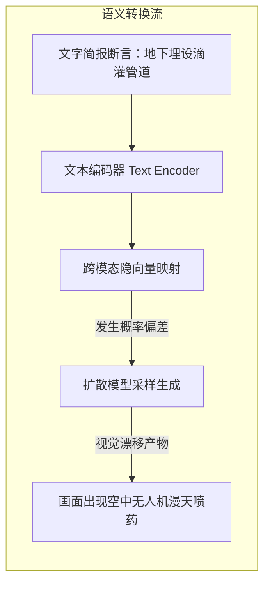
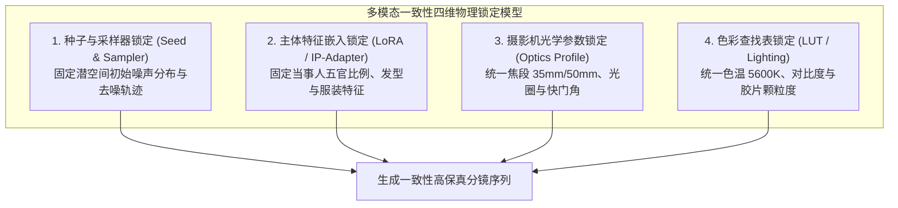
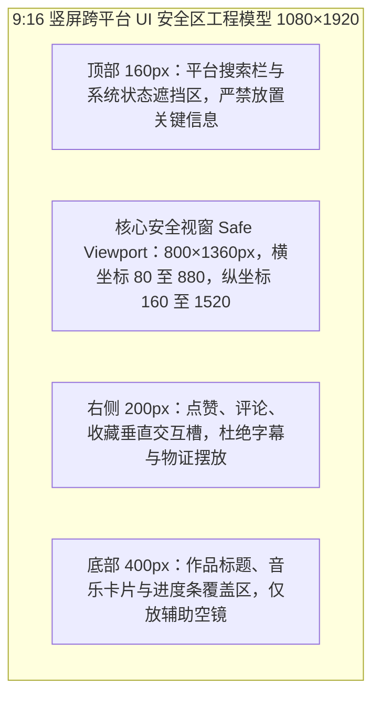
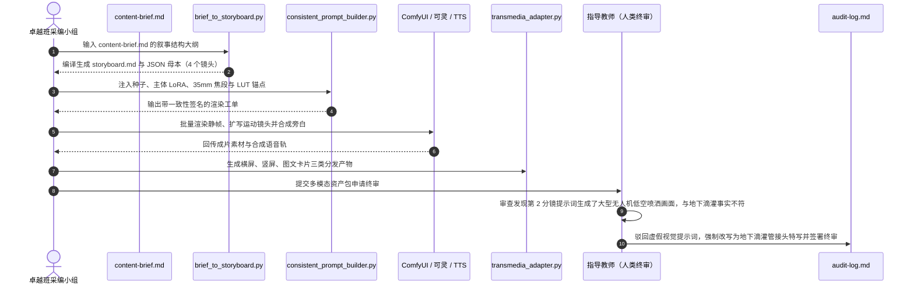

## 学习要点

- 掌握媒介延伸论、新媒介语言与蒙太奇理论的核心命题，能把理论判断转化为分镜字段与镜头参数。
- 描清自媒体多模态视听生产管线的七道工位，理解从文字简报、分镜生成、静帧出图、视频生成、TTS 配音到剪映（CapCut）模板自适应的完整工业链路。
- 理解扩散模型一致性崩塌的物理机理，熟练运用 Seed、主体特征 LoRA/IP-Adapter、镜头光学焦距与色彩查找表（LUT）四维参数实施物理锁定。
- 掌握 9:16 竖屏 UI 安全视窗的标定方法，能依据平台遮挡结构反推字幕字号、行长与关键信息摆位。
- 独立开发 `brief_to_storyboard.py`、`consistent_prompt_builder.py` 与 `transmedia_adapter.py` 三件套工具，实现一套母本向横竖多形态的可复现流转。
- 确立视听符号表征与新闻客观真实的刚性边界，落实深度合成显式标识合规，建立可追溯的人工终审台账与熔断规则。

## 本章引言

选题决策与内容简报确立之后，采编流程进入从文字向视听多模态资产转化的工程实施阶段。以文生图、文生视频、神经语音合成（TTS）与自动化剪辑为代表的多模态智能体技术，正在重构全媒体内容矩阵的生产节拍。美联社（Associated Press）、路透社（Reuters）与中央广播电视总台在突发快讯与数据报道中引入自动化视听渲染流水线，数分钟内即可产出符合多平台分发标准的动态图表与口播视频。头部数字自媒体的实践同样印证了这条链路的成熟度：影视飓风团队用可控生成技术完成镜头概念预演，晚点 LatePost 在深度访谈中用参数化分镜统一图文与视频的叙事节拍，差评等科技创作者用模板化剪辑把同一事实底座铺向横竖多个终端。

多模态生成的普及对新闻真实性造成了空前冲击。采编人员若缺乏视听语言工程素养，仅凭随意输入的提示词让模型盲目补全画面，极易诱发严重的视觉幻觉：跨分镜人物面部特征失真、场景道具前后断裂，甚至把虚构的灾难现场渲染得栩栩如生并误导公众。化解矛盾的路径，在于建立一套把严密的内容简报、参数化分镜脚本、跨模态一致性约束、跨平台格式适配与人工事实终审焊成一体的视听工程流水线。本章系统阐述视听语言参数化、自媒体多模态生产管线、扩散生成的一致性控制、跨平台自适应封装与深度合成标识合规，为融媒体产品提供工业级的视听生产范式。


## 第一节 媒介承载力与视听语法的参数化转换

### 一、学理背景：媒介延伸、新媒介语言与跨模态转码

传播学者马歇尔·麦克卢汉（Marshall McLuhan）在《理解媒介：论人的延伸》（*Understanding Media: The Extensions of Man*）中提出“媒介即讯息”的著名论断。麦克卢汉的论证指向媒介载体本身：一种媒介真正重塑社会认知的力量，来自它对感官的调动方式与它施加于信息的物理形态。文字媒介把人的感知压入视觉线性通道，广播复活了听觉的亲密感，电视则把图像、声音与运动打包成同时到达的感知流。媒介研究者据此追问的首要问题落在载体层面：这条信道调动哪些感官，压缩哪些感官，允许信息以多快的速度、多大的密度流动。落到分镜设计上，同一段调查事实放在长图文、口播短视频与横屏深度视频里，感官配额与信息切片方式必须分别标定。

媒介理论家列夫·曼诺维奇（Lev Manovich）在《新媒介的语言》（*The Language of New Media*）中把数字媒介的生成逻辑归纳为数值化表征、模块化、自动化、可变性与文化转码五项原则。数值化表征意味着任何视听素材在计算机内部都是一组可计算的数字，图像分辨率、帧率、色彩查找表都可以写成参数。模块化意味着视听作品由可独立替换的单元构成，一个镜头、一条字幕轨、一段音色配置都能单独抽换。自动化意味着脚本程序可以接管重复劳动，分镜编译、字幕切分、格式转换都可以交给工具链执行。可变性意味着同一份素材能被程序化地重排为多种版本，横屏母本与竖屏版本共享同一组参数字段。文化转码最为关键，它揭示了新媒介产品的双层结构：一层是人类可读的文化层，画面、旁白、情绪节奏；另一层是计算机可读的数据层，镜头编号、时长字段、种子值与色彩配置。曼诺维奇还把数据库称为数字时代的符号形式，叙事从一气呵成的线性文本，转为可寻址、可检索、可重组的记录集合。

融媒体多模态视听工程正是这套语言法则的集中体现。把一段文字调查简报转化为视频分镜，完成的是一次感官编码重构。文字媒介擅长承载高抽象度的因果论证、法律条款与统计口径；视听媒介擅长呈现现场物理空间的纵深、当事人的微表情张力与物证表面的质感。采编人员必须界定不同模态的优势边界，用最恰当的媒介形态承载最硬核的新闻事实。分镜脚本在这条链路中扮演文化层与数据层的接口：它用人话描述画面，同时用字段约束机器。

### 二、底层机制：自媒体多模态视听生产管线的七道工位

当代自媒体与融媒体工作室的视听生产，已经形成一条分工明确的工业管线。它从文字简报出发，经过七道工位抵达多平台分发形态。


工位链条的叙述从简报解析开始。内容简报中的核心事实主张、叙事断言与物证清单被解析为镜头条目，每个条目携带视觉动作、旁白口播与证据指针三个字段。分镜生成工位把镜头条目编译为带时间码的三线表，景别、运镜与时长按行业标定值取值。静帧出图工位负责生产每个镜头的参考画面，开源工作流界面 ComfyUI 以节点图方式把去噪模型、LoRA 权重、图像提示适配器（IP-Adapter）与 ControlNet 结构控制连成可复现的图，托管式文生图服务 Midjourney 则以风格化表现与角色参考能力见长。视频生成工位把静帧扩展为运动镜头，快手推出的可灵（Kling）提供首尾帧控制与运动笔刷，美国公司 Runway 的视频生成模型提供运动控制与视频到视频的风格迁移。TTS 配音工位把旁白文本合成为人声，剪映的文本朗读、微软 Azure 神经语音与 ElevenLabs 等服务提供多音色合成，涉及当事人音色克隆的情形须取得书面授权。剪辑合成工位在剪映或其国际版 CapCut 中完成模板套用、智能字幕识别、图文成片与画布比例切换。标识与封装工位给成片打上显式标识，把隐式标识写入文件元数据，并按平台安全区规格输出分发包。

把七道工位串成可调度的智能体系统，业界通行的做法来自 Anthropic 公司总结的智能体工作流模式（Agentic Workflows）。提示链把简报解析与分镜编译拆成串行工序，每道工序的输出接受校验；路由把不同景别的镜头分派给出图、出视频两个渲染分支；并行化让多个镜头同时渲染再汇总；评估器与优化器模式让一个模型生成画面、另一个模型对照物证清单打分，得分不合格的镜头回炉重做。工具层的互通依托模型上下文协议（MCP, Model Context Protocol），采编技能通过标准接口调用 ComfyUI 工作流接口、TTS 服务与剪映草稿生成器，把渲染参数与审计记录写回台账。这套架构里，人类主理人保有终审权，智能体负责加速重复劳动。

表 6-1 给出七道工位的工具矩阵与可控参数口径，供采编团队在立项阶段选型。

**表 6-1　自媒体多模态视听生产管线工位矩阵（三线表）**

| 工位 | 代表工具 | 关键可控参数 | 一致性控制手段 | 标识与版权注意 |
| :--- | :--- | :--- | :--- | :--- |
| 简报解析 | WorkBuddy 技能、Python 脚本 | 章节结构、证据指针、镜头条目 | 字段级校验，缺字段即报错 | 证据指针须指向脱敏后的物证文件 |
| 分镜生成 | 大语言模型、`brief_to_storyboard.py` | 景别、运镜、时长、时间码 | 运镜合法集合与时长区间校验 | 分镜表须标注实拍与生成素材的来源 |
| 静帧出图 | ComfyUI、Midjourney | 采样器、步数、引导尺度、LoRA 权重 | 主体 LoRA、IP-Adapter、ControlNet 构图锁定 | 生成图入库即写入来源标签 |
| 视频生成 | 可灵（Kling）、Runway | 首尾帧、运动幅度、时长、镜头稳定性 | 复用静帧锚点与相同种子区间 | 生成视频须留渲染工单与种子记录 |
| TTS 配音 | 剪映文本朗读、Azure 神经语音、ElevenLabs | 音色、语速、停顿、情绪强度 | 全片统一音色与语速标定值 | 音色克隆须书面授权，合成语音须标注 |
| 剪辑合成 | 剪映（CapCut） | 画布比例、字幕字号、模板、转场 | 模板字段透传一致性锚点 | 模板素材须核对商用授权范围 |
| 标识与封装 | `transmedia_adapter.py`、成片导出 | 安全边距、显式标识位置、元数据 | 跨平台参数透传与校验和登记 | 显式标识全程可见，隐式标识写入元数据 |

配音工位的工程细节值得单独标定。合成语音的语速直接决定字幕切分密度，纪录片口播的常用区间为每分钟 240 至 280 个汉字，竖屏短视频可放宽至每分钟 300 个汉字。数字读法、多音字与专有名词须在送入 TTS 前完成注音校对，引洮、什社、董志塬一类地名的读音错误会直接暴露生产环节的粗糙。停顿标点决定换气位置，长句须在逻辑转折处切分为两个短句。音色选定后全片保持一致，中途换音色会破坏观众对叙述者的信任感知。

### 三、工程契约：`brief_to_storyboard.py` 简报向三线表分镜脚本解析器

分镜转换工具承担管线的首道编译。它读取 `content-brief.md` 中的核心事实主张与叙事结构大纲，把每个叙事条目编译为带时间码的镜头工单，输出 Markdown 三线表与 JSON 母本。工具遵循严格的字段契约：叙事条目写作“视觉动作｜旁白口播｜证据指针”的三段式，景别、运镜与时长可用井号标签显式指定，缺省时按关键词规则判定。字段缺失、景别越界或证据指针留空一律报错，防止脏数据流进渲染工位。完整代码如下。

```python
"""brief_to_storyboard.py: 内容简报向三线表分镜脚本的结构化解析器。

命令行用法：
    python brief_to_storyboard.py --brief working/briefs/content-brief.md \
        --output working/storyboard.md --json working/storyboard.json

工程契约：
    简报“叙事结构大纲”下的每个条目对应一个镜头，条目格式为
    `- 视觉动作｜旁白口播｜证据指针 #景别=特写 #运镜=推 #时长=5`。
    井号标签可省略，缺省时按关键词规则判定景别与时长，运镜缺省为固定机位。
"""

from __future__ import annotations

import argparse
import json
import re
import sys
from dataclasses import asdict, dataclass
from pathlib import Path

# 合法景别集合，标注越界即报错，保持行业口径统一。
SHOT_TYPES: frozenset[str] = frozenset({"远景", "全景", "中景", "近景", "特写", "微距"})

# 合法运镜集合，覆盖推、拉、摇、移、跟、固定六类基本运镜。
CAMERA_MOVEMENTS: frozenset[str] = frozenset({"推", "拉", "摇", "移", "跟", "固定"})

# 景别时长区间（秒），依据电视新闻与纪录片的行业标定值设定。
SHOT_DURATION_RANGE: dict[str, tuple[float, float]] = {
    "远景": (3.0, 8.0),
    "全景": (3.0, 10.0),
    "中景": (2.0, 10.0),
    "近景": (2.0, 8.0),
    "特写": (1.5, 6.0),
    "微距": (1.5, 5.0),
}

# 景别缺省时长（秒），位于区间中部，保证节奏稳健。
DEFAULT_DURATION_SEC: dict[str, float] = {
    "远景": 5.0,
    "全景": 6.0,
    "中景": 6.0,
    "近景": 5.0,
    "特写": 4.0,
    "微距": 3.0,
}

# 物证类关键词优先微距或特写，人物言行取中景，地形数据取全景。
SHOT_TYPE_RULES: tuple[tuple[str, str], ...] = (
    ("水票", "微距"),
    ("收据", "微距"),
    ("单据", "微距"),
    ("接头", "微距"),
    ("管道", "特写"),
    ("水表", "特写"),
    ("仪表", "特写"),
    ("屏幕", "特写"),
    ("阀门", "特写"),
    ("农户", "中景"),
    ("受访者", "中景"),
    ("讲述", "中景"),
    ("操作", "中景"),
    ("农田", "全景"),
    ("灌区", "全景"),
    ("地形", "全景"),
    ("管网", "全景"),
)

# 运镜判定规则：优先匹配视觉动作中的行进线索，其次按景别补判。
MOVEMENT_RULES_BY_ACTION: tuple[tuple[str, str], ...] = (
    ("行走", "跟"),
    ("巡渠", "跟"),
    ("沿线", "移"),
    ("俯瞰", "摇"),
    ("推近", "推"),
)

# 景别缺省运镜规则：物证特写缓慢推近，微距静置拍摄保持稳定。
MOVEMENT_RULES_BY_SHOT_TYPE: tuple[tuple[str, str], ...] = (
    ("特写", "推"),
    ("微距", "固定"),
)

# 无行进线索且无景别规则命中时的缺省运镜。
DEFAULT_MOVEMENT: str = "固定"

# 井号参数标签，允许显式覆盖自动判定结果。
TAG_PATTERN = re.compile(r"#(景别|运镜|时长)=([^#\s]+)")

# 证据指针的字符契约：只允许路径、锚点类标识，杜绝含糊描述。
EVIDENCE_POINTER_PATTERN = re.compile(r"^[A-Za-z0-9_./#\-]+$")

# 核心事实主张长度上限（汉字），超长主张无法在成片中稳定呈现。
THESIS_MAX_CHARS: int = 120


class BriefParseError(ValueError):
    """简报结构或字段不符合工程契约时抛出。"""


@dataclass(frozen=True)
class Shot:
    """分镜脚本中的一个镜头工单。"""

    shot_id: str
    start_sec: float
    duration_sec: float
    shot_type: str
    camera_movement: str
    visual_action: str
    voiceover: str
    ambient_sound: str
    evidence_ref: str
    requires_ai_label: bool


def _extract_section(content: str, heading_keyword: str) -> str | None:
    """按二级标题关键词截取章节正文，找不到时返回 None。"""
    pattern = re.compile(
        rf"^##[^\n]*{re.escape(heading_keyword)}[^\n]*\n+(.+?)(?=^##|\Z)",
        re.MULTILINE | re.DOTALL,
    )
    match = pattern.search(content)
    return match.group(1) if match is not None else None


def _parse_tags(text: str) -> tuple[str, dict[str, str]]:
    """剥离井号参数标签，返回（净文本，标签字典）。"""
    tags = {key: value for key, value in TAG_PATTERN.findall(text)}
    clean = TAG_PATTERN.sub("", text).strip()
    return clean, tags


def _derive_shot_type(visual_action: str, explicit: str | None) -> str:
    """判定景别：显式标签优先，其次走关键词规则，均失败则报错。"""
    if explicit is not None:
        if explicit not in SHOT_TYPES:
            raise BriefParseError(
                f"景别标签越界: {explicit!r}，合法取值为 {sorted(SHOT_TYPES)}"
            )
        return explicit
    for keyword, shot_type in SHOT_TYPE_RULES:
        if keyword in visual_action:
            return shot_type
    raise BriefParseError(
        f"视觉动作无法判定景别，请显式标注 #景别=…: {visual_action!r}"
    )


def _derive_movement(visual_action: str, shot_type: str, explicit: str | None) -> str:
    """判定运镜：显式标签优先，其次匹配动作线索与景别规则，缺省固定机位。"""
    if explicit is not None:
        if explicit not in CAMERA_MOVEMENTS:
            raise BriefParseError(
                f"运镜标签越界: {explicit!r}，合法取值为 {sorted(CAMERA_MOVEMENTS)}"
            )
        return explicit
    for keyword, movement in MOVEMENT_RULES_BY_ACTION:
        if keyword in visual_action:
            return movement
    for keyword, movement in MOVEMENT_RULES_BY_SHOT_TYPE:
        if keyword in shot_type:
            return movement
    return DEFAULT_MOVEMENT


def _derive_duration(shot_type: str, explicit: str | None) -> float:
    """判定时长：显式标签优先，其次取景别缺省值，并校验落在区间内。"""
    if explicit is not None:
        try:
            duration = float(explicit)
        except ValueError as exc:
            raise BriefParseError(f"时长标签无法解析为数值: {explicit!r}") from exc
    else:
        duration = DEFAULT_DURATION_SEC[shot_type]
    low, high = SHOT_DURATION_RANGE[shot_type]
    if duration < low or duration > high:
        raise BriefParseError(
            f"{shot_type} 镜头时长 {duration}s 超出行业区间 [{low}, {high}]"
        )
    return duration


def _parse_bullet(index: int, line: str) -> dict[str, str]:
    """解析单条叙事条目，返回带标签的镜头字段字典。"""
    body = line.lstrip("-* ").strip()
    clean, tags = _parse_tags(body)
    parts = [part.strip() for part in re.split(r"[｜|]", clean)]
    if len(parts) != 3:
        raise BriefParseError(
            f"叙事大纲第 {index} 条须写作“视觉动作｜旁白口播｜证据指针”，"
            f"实得 {len(parts)} 段: {body!r}"
        )
    visual_action, voiceover, evidence_ref = parts
    if not visual_action:
        raise BriefParseError(f"叙事大纲第 {index} 条的视觉动作为空")
    if not voiceover:
        raise BriefParseError(f"叙事大纲第 {index} 条的旁白口播为空")
    if not evidence_ref or EVIDENCE_POINTER_PATTERN.match(evidence_ref) is None:
        raise BriefParseError(
            f"叙事大纲第 {index} 条的证据指针非法（须为路径或锚点标识）: {evidence_ref!r}"
        )
    return {
        "visual_action": visual_action,
        "voiceover": voiceover,
        "evidence_ref": evidence_ref,
        "tag_shot_type": tags.get("景别"),
        "tag_movement": tags.get("运镜"),
        "tag_duration": tags.get("时长"),
    }


def parse_brief(content: str) -> tuple[str, list[dict[str, str]]]:
    """解析简报正文，返回（核心事实主张，镜头条目列表）。"""
    thesis_block = _extract_section(content, "核心事实主张")
    if thesis_block is None:
        raise BriefParseError("简报缺少“核心事实主张”章节，无法绑定事实底座")
    thesis = " ".join(thesis_block.split())
    if not thesis:
        raise BriefParseError("核心事实主张为空")
    if len(thesis) > THESIS_MAX_CHARS:
        raise BriefParseError(
            f"核心事实主张 {len(thesis)} 字，超出 {THESIS_MAX_CHARS} 字上限，请压缩后再编译"
        )

    outline_block = _extract_section(content, "叙事结构")
    if outline_block is None:
        raise BriefParseError("简报缺少“叙事结构大纲”章节")
    bullet_lines = [
        line for line in outline_block.splitlines() if line.strip().startswith(("-", "*"))
    ]
    if len(bullet_lines) < 3:
        raise BriefParseError(f"叙事结构大纲至少需要 3 个镜头条目，实得 {len(bullet_lines)} 条")

    shots: list[dict[str, str]] = [
        _parse_bullet(index, line) for index, line in enumerate(bullet_lines, start=1)
    ]
    return thesis, shots


def build_storyboard(parsed: list[dict[str, str]]) -> list[Shot]:
    """把解析结果编译为带累计时间码的镜头序列。"""
    storyboard: list[Shot] = []
    cursor = 0.0
    for index, item in enumerate(parsed, start=1):
        shot_type = _derive_shot_type(item["visual_action"], item["tag_shot_type"])
        movement = _derive_movement(item["visual_action"], shot_type, item["tag_movement"])
        duration = _derive_duration(shot_type, item["tag_duration"])
        storyboard.append(
            Shot(
                shot_id=f"SHOT-{index:02d}",
                start_sec=round(cursor, 2),
                duration_sec=duration,
                shot_type=shot_type,
                camera_movement=movement,
                visual_action=item["visual_action"],
                voiceover=item["voiceover"],
                ambient_sound="现场同期声，环境底噪控制在 -30dB 以下",
                evidence_ref=item["evidence_ref"],
                # 生成画面一律要求显式标识，实拍素材由终审台账另行注销该标记。
                requires_ai_label=True,
            )
        )
        cursor += duration
    return storyboard


def render_markdown(thesis: str, shots: list[Shot]) -> str:
    """渲染 Markdown 三线表分镜脚本。"""
    total_sec = sum(shot.duration_sec for shot in shots)
    lines: list[str] = [
        "# 融媒体视听工程分镜脚本（storyboard.md）",
        "",
        f"> 依据简报自动编译生成｜关联事实主张：{thesis}",
        f"> 镜头总数 {len(shots)}｜总时长 {total_sec:.1f}s｜一致性锚点由 consistent_prompt_builder.py 注入",
        "",
        "| 镜号 | 起点 | 时长 | 景别 | 运镜 | 视觉动作（待注入一致性锚点） | 旁白口播 | 环境音 | 证据指针 | AI 标识 |",
        "| :--- | :--- | :--- | :--- | :--- | :--- | :--- | :--- | :--- | :--- |",
    ]
    for shot in shots:
        label = "须标注" if shot.requires_ai_label else "实拍免标"
        lines.append(
            f"| {shot.shot_id} | {shot.start_sec}s | {shot.duration_sec}s "
            f"| {shot.shot_type} | {shot.camera_movement} | {shot.visual_action} "
            f"| {shot.voiceover} | {shot.ambient_sound} | `{shot.evidence_ref}` | {label} |"
        )
    return "\n".join(lines) + "\n"


def write_outputs(
    thesis: str, shots: list[Shot], output_md: Path, output_json: Path
) -> dict[str, object]:
    """写出 Markdown 三线表与 JSON 母本，返回摘要信息。"""
    output_md.parent.mkdir(parents=True, exist_ok=True)
    output_json.parent.mkdir(parents=True, exist_ok=True)
    output_md.write_text(render_markdown(thesis, shots), encoding="utf-8")
    payload = {
        "metadata": {
            "core_thesis": thesis,
            "shot_count": len(shots),
            "total_duration_sec": round(sum(s.duration_sec for s in shots), 2),
        },
        "shots": [asdict(shot) for shot in shots],
    }
    output_json.write_text(
        json.dumps(payload, ensure_ascii=False, indent=2) + "\n", encoding="utf-8"
    )
    return {
        "total_shots": len(shots),
        "total_duration_sec": payload["metadata"]["total_duration_sec"],
        "markdown_file": str(output_md),
        "json_file": str(output_json),
    }


def main(argv: list[str] | None = None) -> int:
    """命令行入口，解析失败时向标准错误输出原因并返回非零退出码。"""
    parser = argparse.ArgumentParser(description="内容简报向三线表分镜脚本编译器")
    parser.add_argument("--brief", type=Path, required=True, help="内容简报 Markdown 路径")
    parser.add_argument("--output", type=Path, required=True, help="分镜三线表输出路径")
    parser.add_argument("--json", type=Path, required=True, help="分镜 JSON 母本输出路径")
    args = parser.parse_args(argv)

    if not args.brief.exists():
        print(f"[FAIL] 未找到简报文件: {args.brief}", file=sys.stderr)
        return 1
    try:
        thesis, parsed = parse_brief(args.brief.read_text(encoding="utf-8"))
        shots = build_storyboard(parsed)
        summary = write_outputs(thesis, shots, args.output, args.json)
    except BriefParseError as exc:
        print(f"[FAIL] 简报不符合工程契约: {exc}", file=sys.stderr)
        return 2

    print(
        f"[OK] 分镜编译完成：{summary['total_shots']} 个镜头，"
        f"总时长 {summary['total_duration_sec']}s"
    )
    print(f"[OK] 三线表: {summary['markdown_file']}")
    print(f"[OK] JSON 母本: {summary['json_file']}")
    return 0


if __name__ == "__main__":
    raise SystemExit(main())
```

编译产物的字段为后续两个工位提供了稳定接口：JSON 母本中的 `shots` 数组携带镜头编号、时间码、视觉动作与证据指针，一致性提示词构建器在这份母本上注入锚点，跨平台适配器再据此切分字幕与安全区。

### 四、边界约束：视听包装的事实增量判别

视听工程的目标是提升事实信息的传递效率。凡是不能提供有效事实增量、纯属迎合短视频快节奏算法而穿插的廉价表情包、惊悚音效与抖动特效，一律列入负面剔除范围。严肃新闻报道的视听语言应当克制、准确、严密，以物证的物理质感打动受众。

工程上可执行的判别标准是证据指针覆盖率。分镜表中的每个镜头必须挂载可核验的证据指针，指向现场实拍、物证扫描件或公开台账条目。挂不上证据指针的镜头属于示意图景，须在画面角标中标注“示意图”，并在台账中登记其用途。镜头数量的扩张须以事实增量为准绳，同一事实断言的重复渲染不计入增量。

## 第二节 扩散生成的一致性崩塌机理与四维物理锁定

### 一、学理背景：爱森斯坦蒙太奇与观看的认知连贯

苏联电影导演谢尔盖·爱森斯坦（Sergei Eisenstein）在《电影形式》（*Film Form: Essays in Film Theory*）中系统阐述了蒙太奇理论。爱森斯坦主张，两个独立镜头的并置在受众心理层面碰撞出一个全新的概念，意义诞生于镜头之间的撞击，观众在剪辑点上完成了对画面关系的主动缝合。他提出的杂耍蒙太奇进一步要求创作者把镜头当作可计量的刺激单元，精确编排刺激的强度与到达顺序。

经典电影语法为这种碰撞提供了连贯性保障。电影学者大卫·波德维尔（David Bordwell）与克里斯汀·汤普森（Kristin Thompson）在《电影艺术：形式与风格》（*Film Art: An Introduction*）中总结了轴线规则、视线匹配与动作接续三项连续性剪辑规范，保证观众在镜头切换后仍能维持统一的空间感与主体感。人类的面孔识别系统对身份特征高度敏感，眉眼间距、鼻唇轮廓与发际线的细微突变都会触发警觉。相邻镜头中当事人面孔一旦漂移，背景农田一旦从黄土变成热带植被，蒙太奇的认知缝合就会断裂，受众在察觉画面处于人造虚假状态的瞬间，对整篇报道的专业信任度将降至冰点。

### 二、底层机制：一致性崩塌的四类物理来源

生成式图像与视频模型在不同轮次生成中产生特征漂移，工程界称之为一致性崩塌（Consistency Collapse）。它的物理来源可以拆解为四类，每类都有对应的锁定手段。

初始噪声的独立采样构成最直接的漂移来源。潜空间扩散模型从纯高斯噪声出发，经过逐步去噪逼近图像分布。采样起点由种子值决定，两轮生成使用不同种子，等于从完全不同的起点爬下同一座概率山坡，落到人物长相、道具细节差异显著的两个局部极值上。

交叉注意力对长尾实体的稀释紧随其后。提示词中的高频词获得稳定的注意力权重，低频长尾实体如“左袖口的补丁”“水表铅封”在去噪中段被稀释，画面中时有时无。

有损变分自编码器（VAE）的重建误差在细节层面积累。潜空间压缩丢弃高频细节，超分辨率阶段由模型重新猜补，睫毛、织物纹理、金属刻度等微特征逐帧被重新发明。

视频模型时间注意力的长程衰减影响运动序列。序列越长，首帧锚定的权重越低，尾段镜头的面部与服装越容易漂移。

跨模态对齐模型的共现先验还提供了一类特殊的幻觉触发机制。对比语言图像预训练（CLIP, Contrastive Language-Image Pre-training）把图文映射进同一向量空间，训练语料中“农业现代化”与“植保无人机低空飞行”高频共现，模型接到“现代化节水农业”指令时容易优先提取无人机视觉先验，把埋入地下的滴灌管道替换成极具视觉冲击力的喷洒场面。这种视觉语义漂移构成视听报道中极易忽视的隐性失实。



针对四类来源，采编流水线采用四维物理参数锁定法。种子锁定复用同一初始噪声分布，从源头压缩身份漂移空间。主体特征锁定用低秩适配（LoRA）与图像提示适配器（IP-Adapter）把当事人五官比例与服装特征写入模型权重与注意力层。光学锁定统一指定镜头焦段、光圈与快门，让相邻镜头共享同一套透视与景深语言。色彩锁定用三维色彩查找表（LUT）与色温标定统一影调，防止相邻镜头在剪辑点上出现色彩跳变。



表 6-2 给出四维锁定的参数标定口径，团队可在立项时按题材微调，但须整片统一。

**表 6-2　多模态一致性四维物理锁定参数标定表（三线表）**

| 锁定维度 | 标定参数 | 推荐取值 | 校验方式 | 崩塌触发条件 |
| :--- | :--- | :--- | :--- | :--- |
| 种子与采样器 | seed、sampler、steps、cfg_scale | seed 固定整数；dpmpp_2m；28 步；引导尺度 6.5 | 工单签名与台账登记值比对 | 任一镜头种子变更且未登记 |
| 主体特征 | LoRA 权重、IP-Adapter 权重、参考帧 | LoRA 权重 0.7 至 0.9；IP-Adapter 权重 0.6 至 0.8 | 人脸身份余弦相似度不低于 0.55 | 相邻镜头身份相似度低于阈值 |
| 光学参数 | 焦段、光圈、快门 | 35mm 或 50mm 定焦；f/2.8；1/50s | 分镜表光学列全片一致 | 镜头间焦段混用导致透视跳变 |
| 色彩参数 | LUT、色温、颗粒度 | Kodak 2383 类电影 LUT；5600K；细颗粒 | 相邻镜头色差 ΔE 不超过 3 | 剪辑点色温突变或饱和度跃迁 |

人脸身份余弦相似度与色差 ΔE 为本章教学项目的内部标定阈值，各团队可按题材调整并在台账中登记口径。阈值的存在让一致性从观感评价转为可核算指标，渲染工位的输出在进剪辑台之前须先过这两道量化门槛。

### 三、工程契约：`consistent_prompt_builder.py` 一致性提示词构建器与 WorkBuddy 技能契约

一致性提示词构建器把分镜母本中的视觉动作包裹上全局统一的光学、色彩与人物特征锚点，并生成负向提示词与渲染参数工单。工具内置幻觉黑名单，命中黑名单词元的画面描述直接拒绝出单，把人工纠偏前移到渲染之前。工具还为每个镜头计算一致性签名，签名由种子、采样参数、锚点与光学配置哈希而成，供台账追溯比对。完整代码如下。

```python
"""consistent_prompt_builder.py: 多模态一致性提示词与渲染工单构建器。

命令行用法：
    python consistent_prompt_builder.py --storyboard working/storyboard.json \
        --profile config/consistency_profile.json --output working/multimodal_spec.json

工程契约：
    输入为 brief_to_storyboard.py 生成的分镜 JSON 母本与一致性配置文件，
    输出为每个镜头装配好正向提示词、负向提示词、渲染参数与一致性签名的工业资产包。
"""

from __future__ import annotations

import argparse
import hashlib
import json
import sys
from dataclasses import asdict, dataclass, field
from pathlib import Path
from typing import Any, Mapping, Sequence

# 允许的定焦焦段（毫米），混用焦段会破坏相邻镜头的透视连贯。
ALLOWED_FOCAL_LENGTHS_MM: tuple[int, ...] = (24, 35, 50, 85, 135)

# 幻觉黑名单：与 audit-log.md 熔断规则同步维护，命中即拒绝出工单。
HALLUCINATION_TOKENS: frozenset[str] = frozenset(
    {
        "无人机",
        "航拍",
        "喷药",
        "喷洒水雾",
        "漫天喷洒",
        "热带雨林",
        "绿洲",
        "drone",
        "aerial spraying",
        "spraying mist",
        "tropical rainforest",
    }
)

# 负向提示词基线：阻断动漫化、渲染感、肢体畸变与常见生成瑕疵。
NEGATIVE_PROMPT_BASE: str = (
    "anime, 3d render, cartoon, painting style, oversaturated, deformed hands, "
    "extra fingers, missing fingers, duplicated face, text artifacts, watermark, "
    "lowres, jpeg artifacts, waxy skin"
)

# 一致性签名的哈希长度（十六进制字符数）。
SIGNATURE_LENGTH: int = 12

# 运镜术语的英文对照，避免中文运镜口径直接混入英文提示词。
MOVEMENT_PROMPT_TERMS: dict[str, str] = {
    "推": "slow push in",
    "拉": "slow pull out",
    "摇": "pan",
    "移": "tracking shot",
    "跟": "following shot",
    "固定": "static locked-off shot",
}


class HallucinationRiskError(ValueError):
    """视觉描述命中幻觉黑名单时抛出，须回到人工纠偏流程处理。"""


@dataclass(frozen=True)
class ConsistencyProfile:
    """全局一致性锚点配置，整片复用同一份参数。"""

    project_id: str
    seed: int
    subject_anchor: str
    environment_anchor: str
    subject_lora: str
    subject_lora_weight: float
    ip_adapter_image: str
    ip_adapter_weight: float
    focal_length_mm: int
    aperture: str = "f/2.8"
    shutter: str = "1/50s"
    lut: str = "Kodak_2383.cube"
    color_temp_k: int = 5600
    sampler: str = "dpmpp_2m"
    steps: int = 28
    cfg_scale: float = 6.5

    @classmethod
    def from_mapping(cls, raw: Mapping[str, Any]) -> "ConsistencyProfile":
        """解析并校验配置文件，字段缺失或取值越界时抛出 ValueError。"""
        required = (
            "project_id",
            "seed",
            "subject_anchor",
            "environment_anchor",
            "subject_lora",
            "subject_lora_weight",
            "ip_adapter_image",
            "ip_adapter_weight",
            "focal_length_mm",
        )
        missing = [key for key in required if key not in raw]
        if missing:
            raise ValueError(f"一致性配置缺少必填字段: {', '.join(missing)}")
        try:
            profile = cls(
                project_id=str(raw["project_id"]).strip(),
                seed=int(raw["seed"]),
                subject_anchor=str(raw["subject_anchor"]).strip(),
                environment_anchor=str(raw["environment_anchor"]).strip(),
                subject_lora=str(raw["subject_lora"]).strip(),
                subject_lora_weight=float(raw["subject_lora_weight"]),
                ip_adapter_image=str(raw["ip_adapter_image"]).strip(),
                ip_adapter_weight=float(raw["ip_adapter_weight"]),
                focal_length_mm=int(raw["focal_length_mm"]),
                aperture=str(raw.get("aperture", "f/2.8")).strip(),
                shutter=str(raw.get("shutter", "1/50s")).strip(),
                lut=str(raw.get("lut", "Kodak_2383.cube")).strip(),
                color_temp_k=int(raw.get("color_temp_k", 5600)),
                sampler=str(raw.get("sampler", "dpmpp_2m")).strip(),
                steps=int(raw.get("steps", 28)),
                cfg_scale=float(raw.get("cfg_scale", 6.5)),
            )
        except (TypeError, ValueError) as exc:
            raise ValueError(f"一致性配置的数值字段无法解析: {dict(raw)}") from exc
        profile.validate()
        return profile

    def validate(self) -> None:
        """校验参数取值域，越界即抛出 ValueError。"""
        if self.seed < 0:
            raise ValueError(f"seed 须为非负整数: {self.seed}")
        if not self.subject_anchor or not self.environment_anchor:
            raise ValueError("主体锚点与环境锚点均不能为空")
        if not 0.0 < self.subject_lora_weight <= 2.0:
            raise ValueError(f"LoRA 权重须落在 (0, 2]: {self.subject_lora_weight}")
        if not 0.0 < self.ip_adapter_weight <= 2.0:
            raise ValueError(f"IP-Adapter 权重须落在 (0, 2]: {self.ip_adapter_weight}")
        if self.focal_length_mm not in ALLOWED_FOCAL_LENGTHS_MM:
            raise ValueError(
                f"焦段 {self.focal_length_mm}mm 不在允许集合 {ALLOWED_FOCAL_LENGTHS_MM}"
            )
        if not 1 <= self.steps <= 100:
            raise ValueError(f"采样步数须落在 [1, 100]: {self.steps}")
        if not 1.0 <= self.cfg_scale <= 15.0:
            raise ValueError(f"引导尺度须落在 [1.0, 15.0]: {self.cfg_scale}")
        if not 2000 <= self.color_temp_k <= 10000:
            raise ValueError(f"色温须落在 [2000, 10000]K: {self.color_temp_k}")


@dataclass(frozen=True)
class PromptTicket:
    """单个镜头的渲染工单。"""

    shot_id: str
    positive_prompt: str
    negative_prompt: str
    generation_params: dict[str, Any]
    consistency_signature: str
    requires_ai_label: bool


@dataclass
class MultimodalSpec:
    """整片多模态资产包。"""

    metadata: dict[str, Any]
    shots: list[dict[str, Any]] = field(default_factory=list)


def guard_against_hallucination(visual_action: str, shot_id: str) -> None:
    """对视觉动作做幻觉黑名单扫描，命中即拒绝出单。"""
    lowered = visual_action.lower()
    hits = sorted(token for token in HALLUCINATION_TOKENS if token.lower() in lowered)
    if hits:
        raise HallucinationRiskError(
            f"{shot_id} 的视觉描述命中幻觉黑名单词元 {hits}，"
            "须回到 audit-log.md 人工纠偏流程改写后再出单"
        )


def build_positive_prompt(
    visual_action: str, profile: ConsistencyProfile, camera_movement: str
) -> str:
    """按工程规范装配正向提示词，注入主体、环境、光学与色彩锚点。"""
    movement_term = MOVEMENT_PROMPT_TERMS.get(camera_movement, camera_movement)
    return (
        f"{visual_action}, featuring {profile.subject_anchor}, "
        f"set in {profile.environment_anchor}, camera movement: {movement_term}, "
        f"shot on {profile.focal_length_mm}mm prime lens, {profile.aperture}, {profile.shutter}, "
        f"color graded with {profile.lut} at {profile.color_temp_k}K, "
        "ultra-photorealistic documentary cinematography, authentic journalistic photography"
    )


def build_negative_prompt(visual_action: str) -> str:
    """装配负向提示词：基线瑕疵词元叠加幻觉黑名单词元。"""
    blacklist = ", ".join(sorted(HALLUCINATION_TOKENS))
    return f"{NEGATIVE_PROMPT_BASE}, {blacklist}"


def compute_signature(shot_id: str, prompt: str, profile: ConsistencyProfile) -> str:
    """计算一致性签名，供台账追溯参数是否被改动。"""
    canonical = json.dumps(
        {
            "shot_id": shot_id,
            "prompt": prompt,
            "seed": profile.seed,
            "sampler": profile.sampler,
            "steps": profile.steps,
            "cfg_scale": profile.cfg_scale,
            "focal_length_mm": profile.focal_length_mm,
            "lut": profile.lut,
            "subject_lora": profile.subject_lora,
            "ip_adapter_image": profile.ip_adapter_image,
        },
        ensure_ascii=False,
        sort_keys=True,
    )
    digest = hashlib.sha256(canonical.encode("utf-8")).hexdigest()
    return digest[:SIGNATURE_LENGTH]


def build_shot_ticket(shot: Mapping[str, Any], profile: ConsistencyProfile) -> PromptTicket:
    """为单个镜头装配渲染工单。"""
    for key in ("shot_id", "visual_action", "camera_movement", "requires_ai_label"):
        if key not in shot:
            raise ValueError(f"镜头缺少必填字段 {key}: {dict(shot)}")
    shot_id = str(shot["shot_id"])
    visual_action = str(shot["visual_action"])
    camera_movement = str(shot["camera_movement"])
    guard_against_hallucination(visual_action, shot_id)
    positive = build_positive_prompt(visual_action, profile, camera_movement)
    params = {
        "seed": profile.seed,
        "sampler": profile.sampler,
        "steps": profile.steps,
        "cfg_scale": profile.cfg_scale,
        "subject_lora": {"name": profile.subject_lora, "weight": profile.subject_lora_weight},
        "ip_adapter": {"image": profile.ip_adapter_image, "weight": profile.ip_adapter_weight},
        "camera": {
            "focal_length_mm": profile.focal_length_mm,
            "aperture": profile.aperture,
            "shutter": profile.shutter,
        },
        "color": {"lut": profile.lut, "color_temp_k": profile.color_temp_k},
    }
    return PromptTicket(
        shot_id=shot_id,
        positive_prompt=positive,
        negative_prompt=build_negative_prompt(visual_action),
        generation_params=params,
        consistency_signature=compute_signature(shot_id, positive, profile),
        requires_ai_label=bool(shot["requires_ai_label"]),
    )


def build_spec(storyboard: Mapping[str, Any], profile: ConsistencyProfile) -> MultimodalSpec:
    """读取分镜母本，输出整片多模态资产包。"""
    if "metadata" not in storyboard or "shots" not in storyboard:
        raise ValueError("分镜母本须包含 metadata 与 shots 两个顶层字段")
    shots_out: list[dict[str, Any]] = []
    for raw_shot in storyboard["shots"]:
        ticket = build_shot_ticket(raw_shot, profile)
        merged = dict(raw_shot)
        merged["prompt_ticket"] = asdict(ticket)
        shots_out.append(merged)
    metadata = dict(storyboard["metadata"])
    metadata.update(
        {
            "project_id": profile.project_id,
            "seed": profile.seed,
            "focal_length_mm": profile.focal_length_mm,
            "lut": profile.lut,
            "explicit_label": "【AI 辅助生成画面，非现场实拍】",
        }
    )
    return MultimodalSpec(metadata=metadata, shots=shots_out)


def main(argv: Sequence[str] | None = None) -> int:
    """命令行入口，出单失败时向标准错误输出原因并返回非零退出码。"""
    parser = argparse.ArgumentParser(description="多模态一致性提示词与渲染工单构建器")
    parser.add_argument("--storyboard", type=Path, required=True, help="分镜 JSON 母本路径")
    parser.add_argument("--profile", type=Path, required=True, help="一致性配置文件路径")
    parser.add_argument("--output", type=Path, required=True, help="多模态资产包输出路径")
    args = parser.parse_args(argv)

    for path in (args.storyboard, args.profile):
        if not path.exists():
            print(f"[FAIL] 未找到输入文件: {path}", file=sys.stderr)
            return 1
    try:
        storyboard = json.loads(args.storyboard.read_text(encoding="utf-8"))
        profile_raw = json.loads(args.profile.read_text(encoding="utf-8"))
        profile = ConsistencyProfile.from_mapping(profile_raw)
        spec = build_spec(storyboard, profile)
    except (ValueError, json.JSONDecodeError) as exc:
        print(f"[FAIL] 渲染工单构建失败: {exc}", file=sys.stderr)
        return 2

    args.output.parent.mkdir(parents=True, exist_ok=True)
    args.output.write_text(
        json.dumps(asdict(spec), ensure_ascii=False, indent=2) + "\n", encoding="utf-8"
    )
    signatures = [shot["prompt_ticket"]["consistency_signature"] for shot in spec.shots]
    print(f"[OK] 渲染工单已生成：{len(spec.shots)} 个镜头，签名 {signatures}")
    print(f"[OK] 资产包: {args.output}")
    return 0


if __name__ == "__main__":
    raise SystemExit(main())
```

把这套约束固化为 WorkBuddy 工作台的项目级技能，技能契约写入 `.workbuddy/skills/multimodal-storyboarder/SKILL.md`。技能通过模型上下文协议（MCP）挂接渲染、配音与剪辑工具，输出一律回写审核台账。契约文本如下。

```markdown
---
name: multimodal-storyboarder
version: 2.0.0
description: 视听分镜一致性参数装配、幻觉拦截与跨平台封装技能
mcp_servers:
  - comfyui-render
  - tts-voiceover
  - jianying-draft
tools:
  - python: scripts/brief_to_storyboard.py
  - python: scripts/consistent_prompt_builder.py
  - python: scripts/transmedia_adapter.py
inputs:
  brief_file:
    type: string
    description: 位于 working/briefs/content-brief.md 的内容简报
  consistency_profile:
    type: string
    description: 位于 config/consistency_profile.json 的全局一致性锚点
outputs:
  storyboard_table:
    type: string
    description: 位于 working/storyboard.md 的三线表分镜脚本
  render_ticket:
    type: string
    description: 位于 working/multimodal_spec.json 的参数化工业资产包
  transmedia_package:
    type: string
    description: 位于 working/transmedia_package/ 的跨平台分发包
guardrails:
  hallucination_blacklist: ["无人机", "航拍", "喷药", "喷洒水雾", "热带雨林"]
  evidence_required: true
  seed_lock_required: true
  explicit_label_required: true
  human_final_review: true
---

# 执行规程

1. 读取 `brief_file`，调用 `brief_to_storyboard.py` 编译三线表分镜，校验每个镜头的证据指针。
2. 读取 `consistency_profile`，调用 `consistent_prompt_builder.py` 装配正负向提示词与渲染参数。
3. 校验运镜取值必须落在推、拉、摇、移、跟、固定六类集合内，越界即报错退回。
4. 校验负向提示词包含幻觉黑名单词元，拦截无人机、喷洒水雾、热带植被一类脑补元素。
5. 校验全片种子、焦段、LUT 完全一致，任一镜头参数漂移即中止出单。
6. 调用 `transmedia_adapter.py` 生成 16:9、9:16 与图文卡片三类平台产物并登记校验和。
7. 在所有生成画面所在时间轴上装配显式标识，标识文本与位置写入分发包。
8. 把本次运行参数、签名与拦截记录回写 `audit-log.md`，等待主理人签署放行。
```

技能契约的约束条款带有拒绝语义。命中幻觉黑名单、缺少证据指针、种子未锁定或显式标识缺失的工单一律拒绝流转，把纠偏成本从成片阶段前移到出单阶段。

### 四、边界约束：深度合成显式标识的合规封装

采编团队运用多模态生成技术时，须遵守国家互联网信息办公室等部门发布的《互联网信息服务深度合成管理规定》。该规定要求深度合成服务提供者对生成或者编辑的信息内容进行标识，帮助公众区分真假。2025 年 9 月 1 日起施行的《人工智能生成合成内容标识办法》及配套强制性国家标准《网络安全技术 人工智能生成合成内容标识方法》（GB 45438-2025）把标识义务扩展到生成服务提供者、内容传播平台、应用程序分发平台与使用者四类主体，并把标识区分为两种形态。

显式标识以文字、声音、图形等方式呈现，用户能够明显感知，例如画面角标“【AI 辅助生成画面，非现场实拍】”、合成语音前后的提示音。隐式标识写入文件元数据或以数字水印形式嵌入内容，用于技术溯源与责任认定。新闻视听产品的合规口径高于一般合成内容：虚拟复原、概念图景与非现场实拍画面全程挂载显式标识，标识字号不低于正文字幕的七成，位置固定于安全视窗内的角部，全片不可移除。文件导出时按 GB 45438-2025 写入隐式标识，登记生成模型、渲染工单签名与操作者信息。

严禁使用生成式技术伪造国家领导人、突发事故现场、涉密军事演训或民事纠纷当事人的言行视频。任何利用技术篡改一手物理真实证据的行为，属于严重的新闻违纪与违法侵权行为。当事人音色克隆须取得书面授权，授权文件与音频成品一并归档备查。

## 第三节 跨媒介叙事与跨平台格式自适应封装

### 一、学理背景：詹金斯跨媒介叙事与扩散性媒介

媒介研究者亨利·詹金斯（Henry Jenkins）在《融合文化：新旧媒体碰撞之处》（*Convergence Culture: Where Old and New Media Collide*）中提出跨媒介叙事（Transmedia Storytelling）理论。詹金斯的观察对象是娱乐产业的故事世界建构：一个完整的世界观被拆解为多重入口，电影承载主线冲突，漫画补足前史，游戏让受众扮演角色，每个媒介贡献独特的内容层次，受众在跨平台游走中拼合出整体图景。叙事单元之间遵循连续性与互补性原则，任一入口都能独立成立，合在一起又构成更大的整体。

詹金斯与合著者在《扩散性媒介》（*Spreadable Media: Creating Value and Meaning in a Networked Culture*）中进一步讨论了内容在人际网络中的流转逻辑。内容的传播力取决于它被受众主动搬运、改写与再语境化的难易程度，创作方须为搬运预留接口：可独立成立的片段、可截图的图表、可引用的金句。这套理论对融媒体采编的启示落在结构设计层面。同一篇重大调查报道推向不同终端时，需要匹配不同的信息切片与交互形式，同时保持事实底座的完全一致。

融媒体采编团队必须摆脱“一稿通发”的生产惯性。三类终端的典型分工如下。微信公众号与深度阅读客户端承载长篇图文特稿、完整法理分析与三线表审计记录，满足系统化研读需求。微信视频号与抖音承载 9:16 竖屏短视频，首屏前 5 秒呈现最具冲突性的物证单据特写，配大字阶硬核字幕，满足移动碎片化场景下的快速信息获取。Bilibili 与电脑网页端承载 16:9 横屏中长视频，配备动图拆解、专家访谈与画中画多线比对，满足深度认知与弹幕交互需求。三个版本共享同一组事实主张与证据指针，差异集中在节奏、详略与摆位。

### 二、底层机制：9:16 竖屏 UI 安全视窗与字幕工效学

跨平台分发的工程难点，在于屏幕物理像素与平台用户界面（UI）遮挡区域的冲突。竖屏 9:16 内容在短视频平台上，顶部的系统状态栏与搜索栏、右侧的点赞评论收藏交互列、底部的标题文案区与音乐卡片会遮挡大量画面。以 1080×1920 像素画布为例，按本章标定的边距计算，可安全陈列关键信息的区域仅约占全画面面积的 52%。

直接把 16:9 横屏画面居中裁剪为 9:16，两侧的核心事实图表会被截断，底部的信源出处字幕会被交互组件覆盖。正确的工程做法是重新构图：把关键信息压入中央安全视窗，被裁掉的区域只保留氛围性的空镜素材，字幕基线抬离底部遮挡带，双构图方案则为横竖两版分别拍摄或生成构图。



字幕工效学参数须按平台分别标定。字号与行长决定阅读负荷，中文竖屏字幕的行长以 14 个汉字为上限，横屏可放宽至 22 个汉字。字幕与背景的对比度建议保持在 4.5:1 以上，保证强光环境下的可读性。字幕切换时长由语速推算，竖屏口播按每秒 5 个汉字、横屏深度片按每秒 4.5 个汉字标定，送入 TTS 的旁白字数若超过时长承载能力，须先删减文案再进剪辑台。

表 6-3 给出三类平台的标定参数，跨平台适配器读取同一份口径。

**表 6-3　跨平台画布与安全视窗参数标定表（三线表）**

| 平台形态 | 画布分辨率 | 安全边距（上/下/左/右） | 核心安全视窗 | 字幕字号 | 行长上限 | 标定语速 |
| :--- | :--- | :--- | :--- | :--- | :--- | :--- |
| 16:9 横屏深度中视频（Bilibili/桌面端） | 3840×2160 | 120/240/160/160 px | 3520×1800 px | 24pt | 22 汉字 | 4.5 字/秒 |
| 9:16 竖屏口播短视频（视频号/抖音） | 1080×1920 | 160/400/80/200 px | 800×1360 px | 38pt | 14 汉字 | 5.0 字/秒 |
| 1:1 图文卡片（小红书/公众号） | 1080×1080 | 80/120/80/80 px | 920×880 px | 30pt | 18 汉字 | 静态卡片 |

安全边距为本章教学项目标定值，团队在立项时可依据目标平台的界面版本微调，调整须整包统一并登记台账。参数的价值在于把“摆在哪里看得见”从经验判断转为可核算约束。

### 三、工程契约：`transmedia_adapter.py` 跨平台格式自适应封装工具

跨平台适配器读取多模态资产包，按三类平台规格重构字幕切分、安全视窗与显式标识摆位，输出各平台的分发配置、图文卡片文案与带校验和的分发清单。工具校验旁白字数与镜头时长的匹配度，语速溢出的镜头直接报错，防止字幕在成片中被迫加速播放。完整代码如下。

```python
"""transmedia_adapter.py: 跨平台格式自适应封装工具。

命令行用法：
    python transmedia_adapter.py --spec working/multimodal_spec.json \
        --output working/transmedia_package

工程契约：
    输入为 consistent_prompt_builder.py 生成的多模态资产包，
    输出为 16:9 横屏、9:16 竖屏与 1:1 图文卡片三类平台产物，
    以及记录校验和的 manifest.json 分发清单。
"""

from __future__ import annotations

import argparse
import hashlib
import json
import re
import sys
from dataclasses import asdict, dataclass
from pathlib import Path
from typing import Any, Mapping, Sequence

# 字幕切分的标点集合，切分后保留语义完整的短句。
SUBTITLE_SPLIT_PATTERN = re.compile(r"[，。；！？、,;!?]")

# 语速溢出容忍系数，超过 1.25 倍即判定旁白过长。
SPEECH_OVERFLOW_TOLERANCE: float = 1.25

# 显式标识文案，遵循深度合成内容标识合规要求。
EXPLICIT_LABEL_TEXT: str = "【AI 辅助生成画面，非现场实拍】"

# 隐式标识的登记口径，导出成片时按 GB 45438-2025 写入元数据与数字水印。
IMPLICIT_LABEL_POLICY: str = "按 GB 45438-2025 写入文件元数据与数字水印，登记渲染工单签名"


@dataclass(frozen=True)
class SafeMargin:
    """画布四边的安全边距（像素）。"""

    top: int
    bottom: int
    left: int
    right: int


@dataclass(frozen=True)
class Rect:
    """矩形区域，坐标原点位于画布左上角。"""

    x: int
    y: int
    width: int
    height: int


@dataclass(frozen=True)
class PlatformProfile:
    """单个分发平台的画布、安全区与字幕参数。"""

    platform_id: str
    title: str
    aspect_ratio: str
    canvas_width: int
    canvas_height: int
    margin: SafeMargin
    subtitle_font_pt: int
    max_chars_per_line: int
    speech_rate_chars_per_sec: float
    label_position: str


# 三类平台参数与表 6-3 的标定口径保持一致，改动须整包同步。
PLATFORM_PROFILES: tuple[PlatformProfile, ...] = (
    PlatformProfile(
        platform_id="desktop_16x9",
        title="Bilibili/桌面端深度中视频",
        aspect_ratio="16:9",
        canvas_width=3840,
        canvas_height=2160,
        margin=SafeMargin(top=120, bottom=240, left=160, right=160),
        subtitle_font_pt=24,
        max_chars_per_line=22,
        speech_rate_chars_per_sec=4.5,
        label_position="左上安全区内固定角标",
    ),
    PlatformProfile(
        platform_id="vertical_9x16",
        title="视频号/抖音竖屏口播短视频",
        aspect_ratio="9:16",
        canvas_width=1080,
        canvas_height=1920,
        margin=SafeMargin(top=160, bottom=400, left=80, right=200),
        subtitle_font_pt=38,
        max_chars_per_line=14,
        speech_rate_chars_per_sec=5.0,
        label_position="顶部安全线下方左侧常驻角标",
    ),
    PlatformProfile(
        platform_id="social_card_1x1",
        title="小红书/公众号图文卡片",
        aspect_ratio="1:1",
        canvas_width=1080,
        canvas_height=1080,
        margin=SafeMargin(top=80, bottom=120, left=80, right=80),
        subtitle_font_pt=30,
        max_chars_per_line=18,
        speech_rate_chars_per_sec=0.0,
        label_position="卡片底部固定角标",
    ),
)


def safe_viewport(profile: PlatformProfile) -> Rect:
    """依据边距计算核心安全视窗，视窗尺寸非法即抛出 ValueError。"""
    width = profile.canvas_width - profile.margin.left - profile.margin.right
    height = profile.canvas_height - profile.margin.top - profile.margin.bottom
    if width <= 0 or height <= 0:
        raise ValueError(
            f"{profile.platform_id} 的安全边距过大，安全视窗尺寸非法: {width}x{height}"
        )
    return Rect(x=profile.margin.left, y=profile.margin.top, width=width, height=height)


def check_speech_fit(text: str, duration_sec: float, profile: PlatformProfile) -> None:
    """校验旁白字数与镜头时长的匹配度，语速溢出即抛出 ValueError。"""
    if profile.speech_rate_chars_per_sec <= 0:
        return
    required_sec = len(text) / profile.speech_rate_chars_per_sec
    if required_sec > duration_sec * SPEECH_OVERFLOW_TOLERANCE:
        raise ValueError(
            f"{profile.platform_id} 旁白过长：{len(text)} 字需 {required_sec:.1f}s，"
            f"镜头时长仅 {duration_sec}s，请删减文案或延长镜头"
        )


def segment_subtitles(
    text: str, duration_sec: float, profile: PlatformProfile
) -> list[dict[str, Any]]:
    """把旁白按行宽与语速切成带时间码的字幕段。"""
    clauses = [part.strip() for part in SUBTITLE_SPLIT_PATTERN.split(text) if part.strip()]
    if not clauses:
        raise ValueError("旁白为空，无法生成字幕轨")

    packed: list[str] = []
    buffer = ""
    for clause in clauses:
        candidate = f"{buffer}{clause}" if buffer else clause
        if buffer and len(candidate) > profile.max_chars_per_line:
            packed.append(buffer)
            buffer = clause
        else:
            buffer = candidate
    if buffer:
        packed.append(buffer)

    total_chars = sum(len(segment) for segment in packed)
    cursor = 0.0
    segments: list[dict[str, Any]] = []
    for segment in packed:
        segment_sec = duration_sec * len(segment) / total_chars
        segments.append(
            {
                "start_sec": round(cursor, 2),
                "end_sec": round(cursor + segment_sec, 2),
                "text": segment,
                "char_count": len(segment),
            }
        )
        cursor += segment_sec
    return segments


def build_platform_payload(
    spec: Mapping[str, Any], profile: PlatformProfile
) -> dict[str, Any]:
    """生成单个平台的分发配置。"""
    viewport = safe_viewport(profile)
    shots_out: list[dict[str, Any]] = []
    for shot in spec.get("shots", []):
        for key in ("shot_id", "duration_sec", "voiceover", "prompt_ticket"):
            if key not in shot:
                raise ValueError(f"资产包中的镜头缺少必填字段 {key}: {dict(shot)}")
        duration_sec = float(shot["duration_sec"])
        voiceover = str(shot["voiceover"])
        check_speech_fit(voiceover, duration_sec, profile)
        ticket = shot["prompt_ticket"]
        params = ticket.get("generation_params", {})
        shots_out.append(
            {
                "shot_id": shot["shot_id"],
                "duration_sec": duration_sec,
                "subtitle_track": segment_subtitles(voiceover, duration_sec, profile),
                "evidence_ref": shot.get("evidence_ref", ""),
                "consistency_signature": ticket.get("consistency_signature", ""),
                "consistency_anchors": {
                    "seed": params.get("seed"),
                    "focal_length_mm": params.get("camera", {}).get("focal_length_mm"),
                    "lut": params.get("color", {}).get("lut"),
                },
            }
        )

    return {
        "platform": asdict(profile),
        "safe_viewport": asdict(viewport),
        "explicit_label": {
            "text": EXPLICIT_LABEL_TEXT,
            "position": profile.label_position,
            "visibility": "全片常驻，字号不低于正文字幕的 70%，禁止被 UI 组件遮挡",
            "implicit_policy": IMPLICIT_LABEL_POLICY,
        },
        "source_metadata": spec.get("metadata", {}),
        "shots": shots_out,
    }


def render_social_card(spec: Mapping[str, Any], payload: Mapping[str, Any]) -> str:
    """渲染 1:1 图文卡片文案，事实主张与证据指针直接透传。"""
    metadata = spec.get("metadata", {})
    thesis = str(metadata.get("core_thesis", "")).strip()
    evidence_refs = sorted(
        {
            str(shot.get("evidence_ref", "")).strip()
            for shot in spec.get("shots", [])
            if str(shot.get("evidence_ref", "")).strip()
        }
    )
    lines = [
        "# 图文卡片文案（1:1）",
        "",
        f"核心结论速览：{thesis}",
        "",
        "物证指针清单：",
    ]
    lines.extend(f"- `{ref}`" for ref in evidence_refs)
    lines.extend(
        [
            "",
            f"画面标注：{EXPLICIT_LABEL_TEXT}",
            "完整事实底座与信源清单见同题深度图文。",
        ]
    )
    return "\n".join(lines) + "\n"


def _write_text(path: Path, content: str) -> dict[str, Any]:
    """写出文本文件并登记 SHA-256 校验和。"""
    path.parent.mkdir(parents=True, exist_ok=True)
    path.write_text(content, encoding="utf-8")
    digest = hashlib.sha256(content.encode("utf-8")).hexdigest()
    return {"file": str(path.name), "sha256": digest}


def adapt_transmedia_package(spec_path: Path, output_dir: Path) -> dict[str, Any]:
    """读取多模态资产包，生成三类平台产物与分发清单。"""
    if not spec_path.exists():
        raise FileNotFoundError(f"未找到多模态资产包: {spec_path}")
    spec = json.loads(spec_path.read_text(encoding="utf-8"))
    if "metadata" not in spec or "shots" not in spec:
        raise ValueError("资产包须包含 metadata 与 shots 两个顶层字段")
    output_dir.mkdir(parents=True, exist_ok=True)

    artifacts: list[dict[str, Any]] = []
    payloads: dict[str, Any] = {}
    for profile in PLATFORM_PROFILES:
        payload = build_platform_payload(spec, profile)
        payloads[profile.platform_id] = payload
        artifacts.append(
            _write_text(
                output_dir / f"platform_{profile.platform_id}.json",
                json.dumps(payload, ensure_ascii=False, indent=2) + "\n",
            )
        )
    artifacts.append(
        _write_text(output_dir / "platform_social_card.md", render_social_card(spec, payloads["social_card_1x1"]))
    )

    manifest = {
        "generated_from": str(spec_path.name),
        "project_id": spec.get("metadata", {}).get("project_id", ""),
        "artifacts": artifacts,
        "compliance": {
            "explicit_label": EXPLICIT_LABEL_TEXT,
            "implicit_policy": IMPLICIT_LABEL_POLICY,
            "human_final_review": "required",
        },
    }
    artifacts.append(
        _write_text(
            output_dir / "manifest.json",
            json.dumps(manifest, ensure_ascii=False, indent=2) + "\n",
        )
    )
    return {"status": "success", "artifacts": artifacts}


def main(argv: Sequence[str] | None = None) -> int:
    """命令行入口，封装失败时向标准错误输出原因并返回非零退出码。"""
    parser = argparse.ArgumentParser(description="跨平台格式自适应封装工具")
    parser.add_argument("--spec", type=Path, required=True, help="多模态资产包 JSON 路径")
    parser.add_argument("--output", type=Path, required=True, help="分发包输出目录")
    args = parser.parse_args(argv)

    try:
        result = adapt_transmedia_package(args.spec, args.output)
    except (FileNotFoundError, ValueError, json.JSONDecodeError) as exc:
        print(f"[FAIL] 跨平台封装失败: {exc}", file=sys.stderr)
        return 2

    print("[OK] 跨平台封装完成，产物清单：")
    for artifact in result["artifacts"]:
        print(f"  - {artifact['file']}  sha256={artifact['sha256'][:12]}")
    return 0


if __name__ == "__main__":
    raise SystemExit(main())
```

三件套工具构成一条可复现的数据流：分镜 JSON 母本携带证据指针流向提示词构建器，资产包携带一致性签名流向跨平台适配器，分发清单携带校验和流向审核台账。任一环节参数被改动，签名校验与校验和比对都能把改动暴露出来。

### 四、边界约束：碎片化降智表达的防范

跨平台自适应生产须抵制把严肃新闻“降智化”“断章取义化”的倾向。竖屏短视频可以提炼核心冲突，删减冗余铺垫，把事实限定条件压缩为字幕注释，保证限定语义仍完整到达受众。视觉切换可以加快，严密的因果论证须保留其逻辑骨架，避免简化为极端情绪对立。多平台分发矩阵须形成事实回流通道，在短视频末尾引导受众查阅完整深度事实简报，守住专业新闻的公共理性底色。

工程上的把手是限定语覆盖率。核心事实主张中的限定词如“约”“截至”“据台账记载”属于语义骨架，跨平台改编时不允许删除。适配器输出的字幕轨保留限定词，删减发生在从句层面，断言层面的限定成分完整保留。

## 本章深度案例研析：陇东旱作滴灌水利调查的多模态视听实战

### 一、背景与采编任务设定

2026 年秋季，卓越班采编小组推进“陇东旱作滴灌水利调查”多模态视听制作。调查区域位于甘肃庆阳董志塬的旱作玉米种植区，报道主线是膜下滴灌技术推广十年来农田用水结构的变化。前方记者采回大量实地照片、老旧水费票据扫描件、泵房自动化计量屏的翻拍视频以及灌区用水台账的公开数据。采编任务要求在 48 小时内，把前一周定稿的《内容执行简报》转化为一套包含 16:9 横屏深度特稿视频分镜、9:16 竖屏口播短视频脚本与微信交互图文的融媒体资产包。

任务面临三重工程挑战。水利管网铺设米数与水压数据高度抽象，须转化为符合受众感官认知的视听镜头。文生图模型在渲染黄土高原农田时容易发生过度绿化与作物种类错误的视觉幻觉。全网分发时须保证所有视觉物证处于安全可视区域，不被平台交互组件遮挡。

### 二、全链路工程推演

采编小组依托 WorkBuddy 工作台协同推进多模态视听流水线，技能通过模型上下文协议调度渲染、配音与剪辑工具。



流水线在渲染前的幻觉扫描本应拦截无人机元素，本次提示词由智能体在渲染工单之外临时扩写，绕过了黑名单校验，构成流程漏洞。这一疏漏随后被固化为熔断规则，要求一切画面改写必须经过出单工位。

### 三、人工终审与核验台账

主理人介入审读时捕获到关键失实：智能体在处理第 2 个分镜时为追求“大国重器的壮阔感”，把提示词扩写为“A fleet of modern agricultural drones flying over green crops, spraying mist in the golden sunset”（数架现代农业无人机在日落下飞越农田喷洒水雾）。核对信源清单与现场采访记录后确认，董志塬旱作区推广的核心技术为膜下滴灌，水流在地下密闭管道中低压缓释渗入作物根部，田间不存在无人机空中喷水的作业场景。该画面属于典型的视觉虚假表征，一旦发布将引发专业水利与农业受众的信任崩塌。

人类主理人启动紧急纠偏，在 `audit-log.md` 审核台账中留下严整的记录，如表 6-4 所示。

**表 6-4　审核台账条目 AUDIT-VISUAL-20261014-001（三线表）**

| 字段名称 | 真实采编记录内容 |
| :--- | :--- |
| **审计条目编号** | `AUDIT-VISUAL-20261014-001` |
| **核查分镜编号** | `SHOT-02`（抗旱技术现场表征镜头） |
| **一手核查证据** | 采访现场高清实拍照片库（`data/raw/onsite_photos_202609/`）与庆阳市水务局节水灌溉技术验收规范。 |
| **智能体初稿缺陷** | 智能体在跨模态语义映射时匹配了商业图库中高频的“高科技无人机喷水”刻板印象，虚构出与现场物理事实相悖的视觉场景，构成严重的摆拍与虚假新闻嫌疑。 |
| **主理人修正方案** | 重写视觉提示词：“Macro photograph of authentic black polyethylene drip irrigation pipe buried under loess soil, small drops of water slowly permeating into maize roots, documentary cinematography, overcast soft daylight, no drones, no artificial mist”（微距摄影：埋入黄土的黑色低压滴灌管道，水珠缓慢渗入玉米根部，纪实摄影，柔和阴天光，无无人机与人造水雾）。 |
| **标识合规核查** | 生成画面全程挂载“【AI 辅助生成画面，非现场实拍】”显式标识，隐式标识按 GB 45438-2025 写入文件元数据。 |
| **最终审核结论** | 【准予进入渲染制作】（虚假视觉幻觉已清除，分镜参数与现场物证吻合） |
| **责任签署人** | 杨志宏（签发时间：2026-10-14 15:30） |

失实生成的机理值得单独剖析。训练语料中“农业现代化”与“植保无人机”存在强共现，商业图库中无人机喷洒画面的视觉冲击力使其获得更高传播权重，模型在收到“让画面更壮观”的补充指令时倾向选择这类模板补全场景，置地下滴灌这一物理事实于不顾。工程上的应对是把渲染工位的入口收束到唯一通道，任何画面改写必须重走出单工位，黑名单扫描与证据指针校验在出单时强制执行。

### 四、熔断规则沉淀与台账回流

修正完成后，采编小组把本次失实风险固化为可复用的熔断规则，写入技能契约的 `guardrails` 字段与审核台账的规则变更栏，如表 6-5 所示。

**表 6-5　视觉失实生成熔断规则（三线表）**

| 触发条件 | 检查动作 | 人工确认 | 记录位置 |
| :--- | :--- | :--- | :--- |
| 画面描述命中幻觉黑名单（无人机、喷药、热带雨林等） | 对照现场实拍照片库与技术验收规范逐项核对 | 主理人签署改写方案后放行 | `audit-log.md` 规则变更栏 |
| 生成画面出现埋设方式与现场不符的灌溉设施 | 回查物证扫描件与灌区台账，核对设施形态 | 主理人确认物证吻合 | `audit-log.md` 纠错记录栏 |
| 任一镜头缺少证据指针或指针无法解析 | 回查简报物证清单，补齐指针或降级为示意图并标注 | 主理人确认证据链完整 | `audit-log.md` 纠错记录栏 |
| 种子、焦段或 LUT 与全局配置不一致 | 比对渲染工单一致性签名，重出工单 | 主理人复核参数口径 | `audit-log.md` 数值复核栏 |
| 成片缺少显式标识或标识被 UI 组件遮挡 | 检查安全视窗摆位与标识常驻属性 | 主理人确认标识合规 | `audit-log.md` 合规核查栏 |
| 旁白字数超出镜头时长承载能力 | 重算语速标定值，删减文案或延长镜头 | 主理人确认口播节奏 | `audit-log.md` 数值复核栏 |

审核台账沿用运行方式、人工纠错、决策确认、规则变更与交接回流五栏设计，台账不存储密钥与未脱敏个人信息。修正记录遵循三段式：触发条件、检查动作、人工确认。规则可被下一次智能体运行直接读取执行，使单次纠偏沉淀为流水线的长期免疫力。

## 关键概念辨析矩阵

表 6-6 以三线表形式给出本章核心概念的辨析矩阵，供采编团队在策划与复盘阶段对照使用。

**表 6-6　关键概念辨析矩阵（三线表）**

| 概念名称 | 学科理论渊源 | 工程承载实体 | 常见操作误读 | 专业判定基准 |
| :--- | :--- | :--- | :--- | :--- |
| **媒介即讯息** | 媒介环境学（麦克卢汉，1964） | 分镜感官配额与模态选择表 | 以为媒介只是装内容的容器，换平台原样搬运即可 | 依据载体的感官调动与信息密度重新切片，同一事实各模态各有承载极限 |
| **新媒介文化转码** | 数字媒介理论（曼诺维奇，2001） | 分镜脚本的字段化设计 | 以为分镜表只是给摄像看的提示纸条 | 分镜须同时满足人读叙事与机器读参数，字段可寻址、可校验、可重组 |
| **跨模态语义对齐** | CLIP 对比预训练与认知多模态理论 | `brief_to_storyboard.py` 转换工具 | 以为文字写得详细，模型就能分毫不差地画出场景 | 概念映射存在高频共现偏见，具体物理动作、道具与光线须施加显式参数约束 |
| **蒙太奇连贯性** | 电影理论（爱森斯坦，1949）与连续性剪辑规范 | 分镜的景别序列、轴线与光线方向 | 以为镜头拼接越碎越有节奏感 | 相邻镜头须保持空间轴线、视线匹配与主体特征稳定，撞击产生意义的前提是缝合成立 |
| **一致性崩塌** | 扩散采样概率论与知觉恒常性 | `consistent_prompt_builder.py` 锚点锁 | 以为每个镜头单独写段优美提示词就能拼出连贯视频 | 全局锁定 Seed、LoRA/IP-Adapter、焦距与 LUT，人脸身份相似度与色差须过量化门槛 |
| **四维物理参数锁定** | 扩散模型可控生成工程 | 一致性配置文件与渲染工单签名 | 以为设个固定种子就万事大吉 | 种子、主体特征、光学参数、色彩查找表四维同时锁定，任一维度漂移即触发熔断 |
| **负向提示词** | 扩散模型引导采样工程 | 渲染工单的 negative 字段与幻觉黑名单 | 以为负向词写得越多越好，随手堆砌英文词元 | 负向词针对实际缺陷与历史幻觉来源维护，与台账熔断规则同步更新 |
| **跨媒介叙事** | 传播学跨媒介理论（詹金斯，2006） | `transmedia_adapter.py` 适配流水线 | 以为把横屏长视频切成几段发短视频平台就是全媒体 | 依据平台特性重构叙事节奏，短视频端提炼硬核抓手，事实底座与证据指针全平台一致 |
| **UI 安全视窗** | 界面工效学与移动视网膜排版 | 竖屏 9:16 安全区参数标定表 | 以为画面铺满手机屏幕，受众就能看清所有信息 | 预留顶部状态栏、右侧互动槽与底部文案区，关键数据图表与字幕须落入核心安全视窗 |
| **深度合成标识** | 新闻职业伦理与生成式 AI 监管规范 | 成片显式角标与文件元数据隐式标识 | 以为画面逼真就不必标注，标注会影响传播效果 | 生成或复原画面全程挂载显式标识，隐式标识按 GB 45438-2025 写入，保障受众知情权 |

## 本章思考与工程实训

### 一、学术思辨题

生成式模型能够轻易合成高保真影像，新闻摄影经典理论中“机械复制作为现实索引”（Indexicality）的客观性神话正在瓦解。请结合罗兰·巴特（Roland Barthes）在《明室》（*Camera Lucida*）中关于摄影“此存在”（ça-a-été）的论述，探讨当视听新闻的每一个像素都可被算法概率重构时，人类记者的现场肉身在场具有怎样不可替代的专业价值。请把论证落到具体场景：前方记者在灾区现场的取景选择、物证保全与在场见证，分别对应巴特论述中的哪一层现实指涉。

### 二、案例诊断题

某国际新闻团队制作突发大地震快讯视频时，前方记者尚未抵达震中，后期人员用文生视频模型输入“强震过后变成废墟的城市、街道上哭泣的平民”，把生成的 10 秒片段直接插入新闻片头作为现场纪实画面播出。视频播出后被海外事实核查机构证实为 AI 生成，引发媒体信誉危机。请对照本章规范，逐条指出该团队违背的视听工程标准与伦理法规红线，涵盖证据指针、一致性锁定、深度合成标识与人工终审四个维度，并给出规范的整改工步。

### 三、工程实战题

1. 运行 `brief_to_storyboard.py`，把你的结课大作业《内容执行简报》编译为不少于 3 个镜头的标准化视听分镜三线表，检查每个镜头的证据指针与景别判定结果。
2. 运行 `consistent_prompt_builder.py`，为其中两个连续镜头装配具备种子、主体 LoRA、焦段与 LUT 锁定的渲染工单，尝试向视觉动作中加入幻觉黑名单词元，观察拦截机制的输出。
3. 运行 `transmedia_adapter.py`，生成适配 16:9 横屏中视频与 9:16 竖屏短视频的跨平台封装资产包，核对安全视窗数值与字幕切分时间码，并把分发清单中的校验和登记进你自己的 `audit-log.md`。

## 参考文献（GB/T 7714-2015）

1. 麦克卢汉（McLuhan M）. Understanding Media: The Extensions of Man[M]. Cambridge, MA: MIT Press, 1994: 7-21.
2. 曼诺维奇（Manovich L）. The Language of New Media[M]. Cambridge, MA: MIT Press, 2001: 27-65.
3. 爱森斯坦（Eisenstein S）. Film Form: Essays in Film Theory[M]. San Diego: Harcourt Brace Jovanovich, 1949: 45-71.
4. 詹金斯（Jenkins H）. Convergence Culture: Where Old and New Media Collide[M]. New York: NYU Press, 2006: 93-130.
5. 詹金斯（Jenkins H）, 福特（Ford S）, 格林（Green J）. Spreadable Media: Creating Value and Meaning in a Networked Culture[M]. New York: NYU Press, 2013: 1-35.
6. 波德维尔（Bordwell D）, 汤普森（Thompson K）. Film Art: An Introduction[M]. 12th ed. New York: McGraw-Hill, 2020: 220-265.
7. 巴特（Barthes R）. Camera Lucida: Reflections on Photography[M]. New York: Hill and Wang, 1981: 25-60.
8. HO J, JAIN A, ABBEEL P. Denoising Diffusion Probabilistic Models[EB/OL]. (2020-06-19)[2026-09-28]. https://arxiv.org/abs/2006.11239.
9. ROMBACH R, BLATTMANN A, LORENZ D, 等. High-Resolution Image Synthesis with Latent Diffusion Models[EB/OL]. (2021-12-20)[2026-09-28]. https://arxiv.org/abs/2112.10752.
10. RADFORD A, KIM J W, HALLACY C, 等. Learning Transferable Visual Models From Natural Language Supervision[EB/OL]. (2021-02-26)[2026-09-28]. https://arxiv.org/abs/2103.00020.
11. HU E J, SHEN Y, WALLIS P, 等. LoRA: Low-Rank Adaptation of Large Language Models[EB/OL]. (2021-06-17)[2026-09-28]. https://arxiv.org/abs/2106.09685.
12. YE H, ZHANG J, LIU S, 等. IP-Adapter: Text Compatible Image Prompt Adapter for Text-to-Image Diffusion Models[EB/OL]. (2023-08-10)[2026-09-28]. https://arxiv.org/abs/2308.06721.
13. Anthropic. Building Effective Agents[EB/OL]. (2024-12-19)[2026-09-28]. https://www.anthropic.com/engineering/building-effective-agents.
14. Anthropic. Model Context Protocol Specification[EB/OL]. (2025-03-26)[2026-09-28]. https://modelcontextprotocol.io/specification.
15. 国家互联网信息办公室, 工业和信息化部, 公安部, 国家市场监督管理总局. 互联网信息服务深度合成管理规定[EB/OL]. (2022-11-25)[2026-09-28]. http://www.cac.gov.cn/2022-11/25/c_1671416223306076.htm.
16. 国家互联网信息办公室, 国家发展和改革委员会, 教育部, 等. 生成式人工智能服务管理暂行办法[EB/OL]. (2023-07-13)[2026-09-28]. http://www.cac.gov.cn/2023-07/13/c_1690898327029107.htm.
17. 国家互联网信息办公室, 工业和信息化部, 公安部, 国家广播电视总局. 人工智能生成合成内容标识办法[EB/OL]. (2025-03-14)[2026-09-28]. http://www.cac.gov.cn/2025-03/14/c_1743654685899683.htm.
18. 国家市场监督管理总局, 国家标准化管理委员会. 网络安全技术 人工智能生成合成内容标识方法: GB 45438-2025[S]. 北京: 中国标准出版社, 2025.
19. 彭兰. 网络传播概论[M]. 4 版. 北京: 中国人民大学出版社, 2017: 89-115.
20. 史蒂芬·平克（Pinker S）. The Sense of Style: The Thinking Person's Guide to Writing in the 21st Century[M]. New York: Penguin Books, 2014: 25-68.
