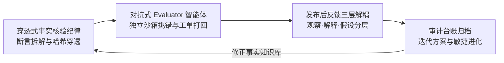
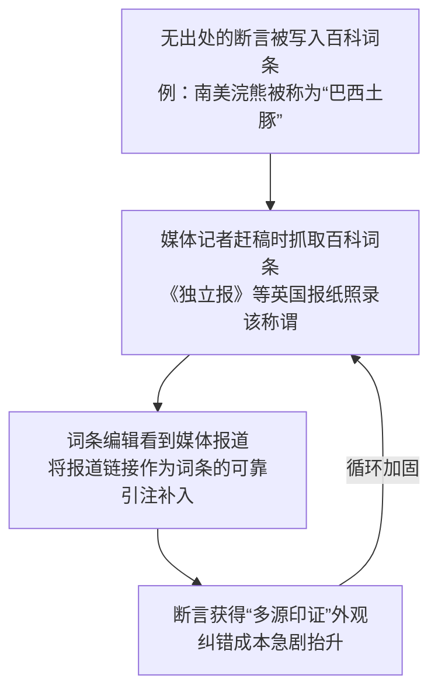
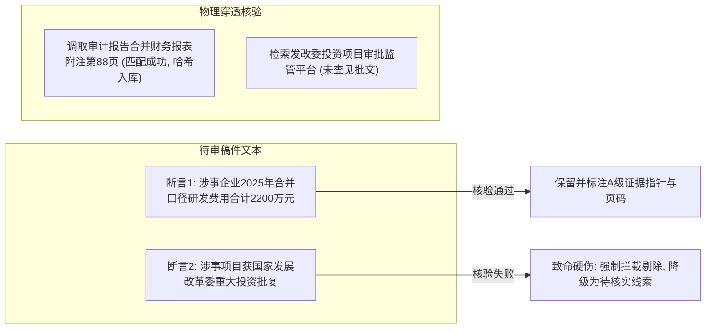
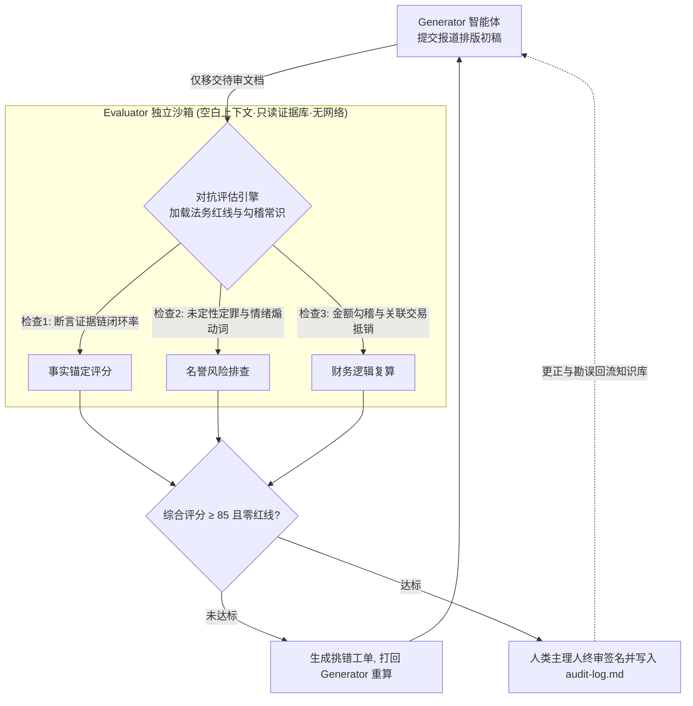
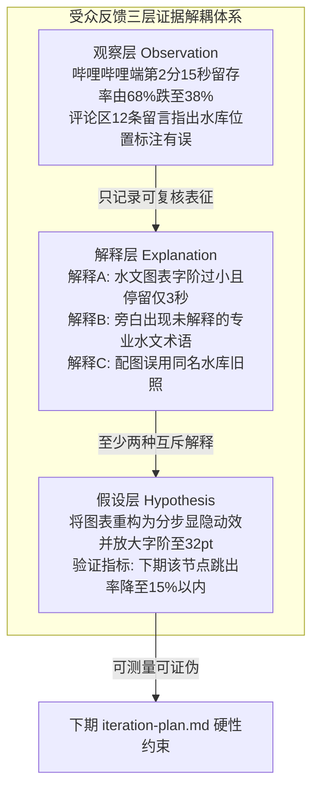
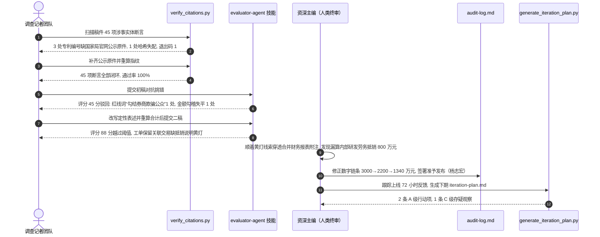

## 学习要点

- 掌握约瑟夫·普利策（Joseph Pulitzer）的事实纪律与比尔·科瓦奇（Bill Kovach）、汤姆·罗森斯蒂尔（Tom Rosenstiel）确立的核实纪律，能够用断言四要素与证据分级标准把稿件拆解为可复核的断言清单。
- 剖析循环引证（Circular Reporting）在自媒体信息生态与大模型语料中的生成机理，掌握信源谱系溯源与 SHA-256 哈希穿透校验的工程手段，独立开发 `verify_citations.py` 引用穿透校验脚本。
- 迁移生成对抗网络（Generative Adversarial Network, GAN）的博弈思想，开发与生成器彻底解耦、独立沙箱运行的对抗式 Evaluator 评估智能体 `evaluator_agent.py`，掌握自偏好偏差的识别与隔离方案。
- 依托诺伯特·维纳（Norbert Wiener）控制论建立受众反馈的三层解耦方法，把观察事实、多元可能解释与待验证迭代假设分层归档，独立开发 `generate_iteration_plan.py` 迭代方案生成脚本。
- 规范维护全链路 `audit-log.md` 审核台账与 `feedback-log.md` 传播反馈日志，交付带数据凭证的《敏捷迭代改进方案》，理解可署名终审责任在人机协同中的终局地位。

## 本章引言

多模态内容工程完成初稿与视听渲染之后，采编流程进入决定报道声誉与法律风险的核心闸门：发布前的人工穿透式审核把关，以及发布后的真实传播反馈闭环。信息供给端的现实压力在持续放大。路透新闻研究所（Reuters Institute for the Study of Journalism）《数字新闻报告 2025》（*Digital News Report 2025*）显示，全球受访者中约 7% 每周通过人工智能聊天机器人获取新闻，25 岁以下人群这一比例升至 15%[3]。当受众的新闻入口日益经过大模型转述，任何一处未经穿透核实的断言都会在模型语料与社交分发的双重放大下扩散。

约瑟夫·普利策 1904 年在《北美评论》（*The North American Review*）连载的《新闻学院》（*The College of Journalism*）中把记者定义为国家航船舰桥上的瞭望者，提出清晰思考、清晰表达、准确与公正是新闻工作的根本，这份自律是新闻业赢得公众托付的前提[1]。比尔·科瓦奇与汤姆·罗森斯蒂尔在《新闻的十大基本原则》（*The Elements of Journalism*）中把这套传统提炼为可操作的准则：新闻的第一义务是真实，新闻的精髓是核实的纪律（Discipline of Verification）[2]。在智能体深度渗透采编的今天，核实纪律必须转化为代码化、制度化的工程防线。

澎湃“明查”栏目以中英双语核查平台承接公众求证，路透社、美联社（Associated Press）把核查手册内化为编辑部规程，财新等机构媒体对财务数据执行会计口径复算，头部科技视频创作者“影视飓风”“差评”与深度报道工作室“晚点 LatePost”把脚本评审、数据核对、发布后复盘做成可交接的工单流水线。这些实践共同指向一条工程主线：核实动作要落到可执行脚本与可归档台账之上。本章系统阐述穿透式核验规程、对抗评估智能体开发、反馈三层解耦方法、全链路审计台账以及敏捷迭代方案工程，为融媒体产品提供高可靠性的质量控制中枢。



## 第一节 穿透式事实核验与可署名终审边界

### 一、学理背景：普利策的事实纪律与核实的纪律

普利策的新闻观建立在对新闻失实后果的清醒估计之上。他在《新闻学院》中写道，记者是国家航船舰桥上的瞭望者，要穿过浓雾与风暴为公众预警前方的危险，这份职责要求从业者把准确（accuracy）与公正（fairness）置于个人报酬与机构利润之上[1]。这套表述为哥伦比亚大学新闻学院的创办提供了思想基础，也让“事实优先”从职业伦理口号沉淀为编辑部的日常操作规程。中国新闻行业的规范文本延续了同样的纪律取向，《中国新闻工作者职业道德准则》第三条“坚持新闻真实性原则”要求新闻工作者把真实作为新闻的生命，努力到一线、到现场采访核实，坚持深入调查研究，报道做到真实、准确、全面、客观，并且明确网上网下一个标准、一把尺子、一条底线[5]。

科瓦奇与罗森斯蒂尔的贡献在于把“真实”拆解为可执行的工序。他们辨析了准确与真实的层级差异：人名拼写、日期、职务、统计数字与引语都正确，属于准确；一串准确的事实按误导性比例拼接起来，仍然会呈现失实的整体图景，新闻所追求的是实用而可操作的真实（a practical and functional form of truth）[2]。达成这一目标依靠的是核实的纪律，即一套透明、可复核、可复现的检验程序：记者公开信源与方法，让受众能够独立评估报道的可信度。汤姆·罗森斯蒂尔与比尔·科瓦奇在《模糊》（*Blur*）中进一步把这套程序推广到信息过载环境，主张受众与采编人员共用同一套来源检验清单来分辨可信信息[4]。

核实纪律的工程化落点可以归纳为三条硬约束。断言必须可拆解，长篇稿件中的每一处涉事实体表述都要能被单独拎出来检验。证据必须可穿透，任何引用链条都要回溯到具有法定证明效力的原始凭证。责任必须可署名，每一版定稿都要有人类主理人以真实姓名签发。三条约束共同构成自动化审核工具的判准来源，也是本章三个脚本的设计基线。

### 二、循环引证陷阱的生成机理与实证案例

互联网与大语言模型时代的信息生产面临一种结构性陷阱：同一条未经核实的信源在传播链条中被反复转述，制造出多源印证的假象。这种现象在文献中称为循环引证（Circular Reporting），也称虚假确认（false confirmation），指一条信息表面上得到多个独立来源支持，实际全部回溯到同一个源头[7]。漫画家兰德尔·芒罗（Randall Munroe）2011 年在 xkcd 第 978 号漫画中把维基百科参与的这类闭环命名为“引证生成”（Citogenesis）[6]，其运行环路有四个工步：



记录在案的三起事件展示了闭环的破坏力与纠错代价[7]：

**表 7-1　三起记录在案的循环引证事件（三线表）**

| 事件 | 首次植入的错误断言 | 循环路径 | 纠错代价 |
| :--- | :--- | :--- | :--- |
| 南美浣熊“巴西土豚”称谓（2008） | 百科词条被随手加上“又称巴西土豚” | 《独立报》《每日电讯报》等英国报纸照录，报导又被引注回词条 | 错误称谓进入芝加哥大学出版社、剑桥大学出版社的学术图书，逐本勘误 |
| 卡西欧 F-91W 手表上市年份 | 词条把 1989 年误写为 1991 年 | 英国广播公司（BBC）2011 年撰文沿用 1991 年，词条再以 BBC 为可靠来源锁定 | 与厂商原始文档对抗多年才纠正 |
| 萨莎·拜伦·科恩（Sacha Baron Cohen）任职高盛传闻 | 词条被编造“曾任职高盛” | 《独立报》报道后被回引为词条出处 | 背景核查方与经纪团队多方澄清 |

自媒体生态把这一环路压缩到小时级。聚合号抓取“据知情人士透露”的网帖发快讯，同行转载时把“据媒体报道”升级为“多家权威媒体证实”，大模型在训练与检索增强生成中把这些文本当作既定事实吸收，下一位创作者调用大模型写稿时又把模型输出当作独立信源。判断是否落入环路的判准是信源独立性：统计支持同一断言的报道数量毫无意义，必须追问这些报道是否各自抵达独立的一手凭证。凡所有引注最终指向同一份无法穿透的匿名爆料，该断言在专业上只能记为孤证，未经证实。

### 三、断言提取与证据图谱对齐机制

穿透式核验的底层逻辑，是把非结构化稿件解构为离散的涉事实体断言（Factual Claim），并建立断言与证据的双向映射图谱。一条合格的断言标记必须具备四个核心要素：主体（谁）、时间（何时）、核心指标或动作（发生了什么数量或行为）、判定性质（该表述属于已核实事实、当事人主张还是待证伪假设）。任何缺少时间范围或主体含糊的表述（如“某权威机构近期公布”），一律打回要求补全机构全称与发布日期。

证据按证明力分为三级，级别决定断言可以采用的措辞强度：

**表 7-2　证据分级与断言准入规则（三线表）**

| 证据级别 | 证据形态 | 典型示例 | 断言准入规则 |
| :--- | :--- | :--- | :--- |
| **A 级：一手物理凭证** | 具有法定证明效力或可复算的原始记录 | 司法公证卷宗、上市公司审计报告及附注原件、政府监管平台公开数据、当事人签署的书面凭证、原始录音录像 | 可作定论式陈述，稿件必须登记文件指针、页码定位与 SHA-256 指纹 |
| **B 级：可复核的二手材料** | 有明确出处、可回溯到一手材料的权威转述 | 官方新闻发布会实录、部委规章文本、同业机构公开统计报告 | 可陈述转述内容并注明来源层级，关键结论仍需至少一处 A 级证据支撑 |
| **C 级：未穿透传闻** | 匿名爆料、论坛网帖、聊天截屏、无法定位的“知情人士” | 社交平台贴文、聚合号“网传”快讯、大模型生成的二手综述 | 严禁作为定论引用，只能以“待核实”口径进入线索库，并注明核验状态 |



断言与证据的对齐不是一次性动作。稿件每修改一轮，`verify_citations.py` 就要重跑一轮，断言清单与证据指纹的比对结果直接写入 `audit-log.md`，形成可回溯的核验轨迹。

### 四、工程契约与 `verify_citations.py` 引用穿透校验工具

为防止采编人员在长稿件中漏检未标注出处的事实断言，工程上采用结构化断言标记 `[断言: 事实文本 | 信源: 证据文件指针 | 页码: 定位 | 证据等级: A]`。校验脚本 `verify_citations.py` 承担四项任务：扫描全部断言标记并校验字段完整性，核对信源指针是否落在本地证据库白名单之内，对证据文件重算 SHA-256 指纹并与登记表 `evidence_manifest.json` 穿透比对，扫描正文中的裸数字表述以揪出漏标注的断言候选。哈希比对是穿透校验的核心环节，任何证据文件在归档后被替换、截断或篡改，指纹立即失配，断言自动降级为待证伪状态。完整脚本如下，仅使用 Python 标准库：

```python
"""verify_citations.py: 稿件事实断言扫描与本地证据哈希穿透校验工具。

工程契约
    输入  working/drafts/<稿件>.md       含 [断言: … | 信源: …] 标记的待审稿件
    输入  data/sanitized/evidence_vault/ 本地一手证据库目录
    输入  data/sanitized/evidence_vault/evidence_manifest.json  证据登记表
    输出  working/verify_citations_report.md  三线表核验报告
    退出码 0 = 全部断言闭环; 1 = 存在阻断项; 2 = 输入文件或登记表异常

命令行用法
    python verify_citations.py \
        --article working/drafts/test_article.md \
        --evidence-dir data/sanitized/evidence_vault \
        --report-out working/verify_citations_report.md
"""
from __future__ import annotations

import argparse
import hashlib
import json
import re
import sys
from dataclasses import asdict, dataclass, field
from datetime import datetime
from pathlib import Path

# 断言标记: 方括号内为"键: 值"字段, 以竖线分隔, 禁止嵌套方括号
CLAIM_MARKER_RE = re.compile(r"\[断言:\s*(?P<body>[^\[\]]+?)\]")
# 裸数字断言候选: 数字 + 常见计量单位
BARE_NUMBER_RE = re.compile(r"\d+(?:\.\d+)?\s*(?:亿元|万元|元|%|％|人|项|倍|个百分点)")
# 阻断级问题的严重度集合
BLOCKING_SEVERITIES: frozenset[str] = frozenset({"fatal", "major"})


@dataclass(frozen=True)
class ClaimMarker:
    """一条结构化事实断言标记的解析结果。"""

    claim: str
    source_ref: str
    line_no: int
    page_ref: str = ""
    declared_hash: str = ""
    grade: str = ""
    raw: str = ""


@dataclass(frozen=True)
class EvidenceEntry:
    """证据登记表中的一条登记记录。"""

    filename: str
    sha256: str
    grade: str = "B"
    title: str = ""
    acquired: str = ""


@dataclass
class Problem:
    """核验过程中发现的一个问题。"""

    code: str
    severity: str  # fatal / major / minor
    line_no: int
    message: str
    claim: str = ""


@dataclass
class AuditReport:
    """一次穿透核验的完整结果。"""

    article: str
    evidence_dir: str
    checked_at: str
    total_claims_found: int = 0
    verified_claims: list[dict[str, str]] = field(default_factory=list)
    problems: list[Problem] = field(default_factory=list)
    unmarked_numeric_claims: list[dict[str, object]] = field(default_factory=list)
    evidence_fingerprints: dict[str, str] = field(default_factory=dict)
    pass_rate: float = 0.0

    @property
    def blocking_count(self) -> int:
        """统计 fatal 与 major 级问题的数量, 用于决定退出码。"""
        return sum(1 for p in self.problems if p.severity in BLOCKING_SEVERITIES)

    def to_dict(self) -> dict[str, object]:
        """输出 JSON 序列化友好的字典。"""
        payload = asdict(self)
        payload["blocking_count"] = self.blocking_count
        return payload


def sha256_file(path: Path, chunk_size: int = 1 << 16) -> str:
    """流式计算文件 SHA-256 指纹, 避免一次性读入大体积证据文件。"""
    digest = hashlib.sha256()
    with path.open("rb") as handle:
        for chunk in iter(lambda: handle.read(chunk_size), b""):
            digest.update(chunk)
    return digest.hexdigest()


def is_safe_relative_pointer(source_ref: str) -> bool:
    """信源指针必须是证据库内的裸文件名, 拒绝路径穿越与绝对路径。"""
    if not source_ref or "/" in source_ref or "\\" in source_ref:
        return False
    return Path(source_ref).name == source_ref and ".." not in source_ref


def _sentence_spans(text: str) -> list[tuple[int, int]]:
    """按中文句读切分句子并保留字符偏移, 便于与断言标记区间比对。"""
    spans: list[tuple[int, int]] = []
    start = 0
    for index, char in enumerate(text):
        if char in "。！？；":
            spans.append((start, index + 1))
            start = index + 1
    if start < len(text):
        spans.append((start, len(text)))
    return spans


def scan_unmarked_numeric_claims(content: str) -> list[dict[str, object]]:
    """扫描正文裸数字断言: 同句内以后置断言标记锚定的数量表述视为已标注。"""
    findings: list[dict[str, object]] = []
    for line_no, line in enumerate(content.splitlines(), start=1):
        marker_spans = [match.span() for match in CLAIM_MARKER_RE.finditer(line)]
        for sent_start, sent_end in _sentence_spans(line):
            sent_markers = [(s, e) for s, e in marker_spans if sent_start <= s < sent_end]
            for match in BARE_NUMBER_RE.finditer(line, sent_start, sent_end):
                start, end = match.span()
                inside_marker = any(s <= start and end <= e for s, e in sent_markers)
                anchored_by_marker = any(s >= end for s, _ in sent_markers)
                if inside_marker or anchored_by_marker:
                    continue
                findings.append({
                    "line_no": line_no,
                    "excerpt": line[sent_start:sent_end].strip()[:60],
                    "matched": match.group(0),
                })
    return findings


def parse_claim_markers(content: str) -> tuple[list[ClaimMarker], list[Problem]]:
    """解析稿件中的全部断言标记, 同时登记字段缺失问题。"""
    markers: list[ClaimMarker] = []
    problems: list[Problem] = []
    for line_no, line in enumerate(content.splitlines(), start=1):
        for match in CLAIM_MARKER_RE.finditer(line):
            raw = match.group(0)
            # 正则已吞掉"断言:"前缀, 首段即事实文本, 其余各段为"键: 值"扩展字段
            parts = [part.strip() for part in match.group("body").split("|")]
            claim_text = parts[0]
            fields: dict[str, str] = {}
            for part in parts[1:]:
                key_value = re.split(r"[:：]", part, maxsplit=1)
                if len(key_value) == 2:
                    fields[key_value[0].strip()] = key_value[1].strip()
                elif part:
                    problems.append(Problem("FIELD_UNPARSED", "minor", line_no,
                                            f"无法解析的标记字段: {part}", raw))
            source_ref = fields.get("信源", "").strip()
            if not claim_text:
                problems.append(Problem("CLAIM_TEXT_EMPTY", "fatal", line_no, "断言标记缺少事实文本", raw))
            if not source_ref:
                problems.append(Problem("SOURCE_REF_MISSING", "fatal", line_no, "断言标记缺少信源指针", raw))
            markers.append(
                ClaimMarker(
                    claim=claim_text,
                    source_ref=source_ref,
                    line_no=line_no,
                    page_ref=fields.get("页码", "").strip(),
                    declared_hash=fields.get("哈希", "").strip(),
                    grade=fields.get("证据等级", "").strip(),
                    raw=raw,
                )
            )
    return markers, problems


def load_evidence_manifest(manifest_path: Path) -> dict[str, EvidenceEntry]:
    """读取证据登记表, 返回以文件名为键的登记记录映射。"""
    if not manifest_path.exists():
        raise FileNotFoundError(f"证据登记表不存在: {manifest_path}")
    try:
        payload = json.loads(manifest_path.read_text(encoding="utf-8"))
    except json.JSONDecodeError as exc:
        raise ValueError(f"证据登记表 JSON 解析失败: {manifest_path}: {exc}") from exc
    entries: dict[str, EvidenceEntry] = {}
    for item in payload.get("evidence", []):
        filename = str(item.get("filename", "")).strip()
        sha256 = str(item.get("sha256", "")).strip().lower()
        if not filename or not sha256:
            raise ValueError(f"证据登记记录缺少 filename 或 sha256 字段: {item}")
        entries[filename] = EvidenceEntry(
            filename=filename,
            sha256=sha256,
            grade=str(item.get("grade", "B")).strip().upper(),
            title=str(item.get("title", "")).strip(),
            acquired=str(item.get("acquired", "")).strip(),
        )
    return entries


def audit_markdown_citations(
    article_path: Path,
    evidence_dir: Path,
    manifest_path: Path | None = None,
) -> AuditReport:
    """对稿件执行结构化断言扫描与本地证据哈希穿透校验。"""
    if not article_path.exists():
        raise FileNotFoundError(f"稿件不存在: {article_path}")
    if not evidence_dir.is_dir():
        raise FileNotFoundError(f"证据库目录不存在: {evidence_dir}")
    manifest_path = manifest_path or evidence_dir / "evidence_manifest.json"
    manifest = load_evidence_manifest(manifest_path)

    content = article_path.read_text(encoding="utf-8")
    markers, problems = parse_claim_markers(content)
    report = AuditReport(
        article=str(article_path),
        evidence_dir=str(evidence_dir),
        checked_at=datetime.now().isoformat(timespec="seconds"),
        total_claims_found=len(markers),
    )

    for marker in markers:
        if not is_safe_relative_pointer(marker.source_ref):
            report.problems.append(
                Problem("SRC_PATH_TRAVERSAL", "fatal", marker.line_no,
                        f"信源指针越出证据库白名单: {marker.source_ref}", marker.claim)
            )
            continue
        evidence_file = evidence_dir / marker.source_ref
        if not evidence_file.is_file():
            report.problems.append(
                Problem("EVIDENCE_MISSING", "fatal", marker.line_no,
                        f"证据库中不存在文件实体: {marker.source_ref}", marker.claim)
            )
            continue
        entry = manifest.get(marker.source_ref)
        if entry is None:
            report.problems.append(
                Problem("EVIDENCE_UNREGISTERED", "major", marker.line_no,
                        f"证据文件未登记入 evidence_manifest.json: {marker.source_ref}", marker.claim)
            )
            continue
        actual_hash = sha256_file(evidence_file)
        report.evidence_fingerprints[marker.source_ref] = actual_hash
        if actual_hash != entry.sha256:
            report.problems.append(
                Problem("HASH_MISMATCH", "fatal", marker.line_no,
                        f"哈希穿透失配: 登记 {entry.sha256[:16]}… 实测 {actual_hash[:16]}…",
                        marker.claim)
            )
            continue
        if marker.declared_hash and marker.declared_hash.lower() not in (entry.sha256, entry.sha256[:16]):
            report.problems.append(
                Problem("DECLARED_HASH_MISMATCH", "major", marker.line_no,
                        "断言标记内声明的哈希与登记表不一致", marker.claim)
            )
            continue
        if evidence_file.suffix.lower() == ".pdf" and not marker.page_ref:
            report.problems.append(
                Problem("PAGE_LOCATOR_MISSING", "major", marker.line_no,
                        "PDF 证据缺少页码定位字段, 复核人无法快速复现", marker.claim)
            )
            continue
        effective_grade = (marker.grade or entry.grade).upper()
        if effective_grade == "C":
            report.problems.append(
                Problem("GRADE_C_NEEDS_HEDGING", "major", marker.line_no,
                        "C 级未穿透证据只能支撑“待核实”口径, 禁止定论式引用", marker.claim)
            )
            continue
        report.verified_claims.append({
            "claim": marker.claim,
            "source_file": marker.source_ref,
            "evidence_grade": effective_grade,
            "sha256_head": actual_hash[:16],
            "file_size_bytes": str(evidence_file.stat().st_size),
        })

    for finding in scan_unmarked_numeric_claims(content):
        report.unmarked_numeric_claims.append(finding)
        report.problems.append(
            Problem("UNMARKED_NUMERIC_CLAIM", "minor", int(finding["line_no"]),
                    f"正文出现未标注信源的数量表述: {finding['matched']}")
        )

    total = report.total_claims_found
    report.pass_rate = round(len(report.verified_claims) / total, 2) if total else 0.0
    return report


def render_report(report: AuditReport) -> str:
    """把核验结果渲染为三线表规范的 Markdown 报告。"""
    lines: list[str] = [
        "# 引用穿透核验报告（verify_citations.py）",
        "",
        f"> 稿件指针：`{report.article}` ｜ 证据库：`{report.evidence_dir}` ｜ 核验时间：{report.checked_at}",
        f"> 结构化断言 {report.total_claims_found} 条，闭环 {len(report.verified_claims)} 条，"
        f"通过率 {report.pass_rate:.0%}，阻断项 {report.blocking_count} 个",
        "",
        "**表 A　断言与证据指纹闭环清单（三线表）**",
        "",
        "| 序号 | 事实断言 | 证据指针 | 证据等级 | SHA-256 前 16 位 |",
        "| :--- | :--- | :--- | :--- | :--- |",
    ]
    for index, item in enumerate(report.verified_claims, start=1):
        lines.append(
            f"| {index} | {_cell(item['claim'])} | `{item['source_file']}` | "
            f"{item['evidence_grade']} | `{item['sha256_head']}` |"
        )
    if not report.verified_claims:
        lines.append("| - | 无闭环断言 | - | - | - |")
    lines += [
        "",
        "**表 B　核验问题清单（三线表）**",
        "",
        "| 严重级 | 行号 | 问题代码 | 说明 |",
        "| :--- | :--- | :--- | :--- |",
    ]
    for problem in sorted(report.problems, key=lambda p: (p.severity, p.line_no)):
        lines.append(f"| {problem.severity} | {problem.line_no} | `{problem.code}` | {_cell(problem.message)} |")
    if not report.problems:
        lines.append("| - | - | `NONE` | 未检出问题 |")
    return "\n".join(lines) + "\n"


def _cell(text: str) -> str:
    """把字段内容约束为单行表格单元, 转义竖线与换行以防破坏三线表结构。"""
    return re.sub(r"\|", r"\\|", re.sub(r"[\r\n]+", " ", text)).strip()


def build_demo_fixtures(base_dir: Path) -> tuple[Path, Path]:
    """生成可复现的演示用稿件与证据库, 供实训环境一键起步。"""
    evidence_dir = base_dir / "data" / "sanitized" / "evidence_vault"
    evidence_dir.mkdir(parents=True, exist_ok=True)
    bulletin = evidence_dir / "energy_bureau_bulletin_2026.pdf"
    bulletin.write_bytes(b"%PDF-1.4 demo evidence bytes")
    annex = evidence_dir / "consolidated_annex_note_2025.txt"
    annex.write_text("合并财务报表附注: 关联方内部研发劳务交易 800 万元已全额抵销。", encoding="utf-8")
    manifest = {
        "version": 1,
        "evidence": [
            {"filename": bulletin.name, "sha256": sha256_file(bulletin), "grade": "A",
             "title": "国家能源局公报（模拟件）", "acquired": "2026-10-18"},
            {"filename": annex.name, "sha256": sha256_file(annex), "grade": "A",
             "title": "2025年度合并财务报表附注（模拟件）", "acquired": "2026-10-19"},
        ],
    }
    (evidence_dir / "evidence_manifest.json").write_text(
        json.dumps(manifest, ensure_ascii=False, indent=2), encoding="utf-8"
    )
    article = base_dir / "working" / "drafts" / "test_article.md"
    article.parent.mkdir(parents=True, exist_ok=True)
    article.write_text(
        "今年上半年我国高新技术产业用电保持稳健增长"
        "[断言: 高新技术产业用电量同比增长6.8% | 信源: energy_bureau_bulletin_2026.pdf | 页码: 第12页 | 证据等级: A]。"
        "涉事企业合并口径研发费用合计2200万元"
        "[断言: 合并口径研发费用2200万元 | 信源: consolidated_annex_note_2025.txt | 证据等级: A]。"
        "同时某跨国企业被曝全面裁员"
        "[断言: 裁员比例达40% | 信源: unverified_forum_post.txt]，"
        "行业整体薪酬水平约下降6个百分点。",
        encoding="utf-8",
    )
    return article, evidence_dir


def main() -> int:
    """命令行入口: 参数解析、执行核验、落盘报告并返回退出码。"""
    parser = argparse.ArgumentParser(description="稿件断言扫描与证据哈希穿透校验")
    parser.add_argument("--article", type=Path, help="待审稿件 Markdown 路径")
    parser.add_argument("--evidence-dir", type=Path, default=Path("data/sanitized/evidence_vault"),
                        help="本地证据库目录")
    parser.add_argument("--report-out", type=Path, default=Path("working/verify_citations_report.md"),
                        help="三线表核验报告输出路径")
    parser.add_argument("--demo", action="store_true", help="生成演示用稿件与证据库后执行核验")
    args = parser.parse_args()

    try:
        if args.demo:
            article_path, evidence_dir = build_demo_fixtures(Path("."))
        else:
            if args.article is None:
                parser.error("未指定 --article, 或改用 --demo 生成演示数据")
            article_path, evidence_dir = args.article, args.evidence_dir
        report = audit_markdown_citations(article_path, evidence_dir)
    except (FileNotFoundError, ValueError) as exc:
        print(f"[ERROR] {exc}", file=sys.stderr)
        return 2

    args.report_out.parent.mkdir(parents=True, exist_ok=True)
    args.report_out.write_text(render_report(report), encoding="utf-8")
    print(json.dumps(report.to_dict(), ensure_ascii=False, indent=2))
    print(f"[OK] 核验报告已生成: {args.report_out}")
    return 0 if report.blocking_count == 0 else 1


if __name__ == "__main__":
    raise SystemExit(main())
```

脚本的关键设计对应三类真实事故面。`is_safe_relative_pointer` 拒绝任何带目录分隔符或上级目录语义的信源指针，防止恶意稿件通过 `../../etc/passwd` 之类的指针把校验器变成文件探测器。哈希穿透比对把证据固定为不可抵赖的字节序列，即使有人事后替换证据文件，指纹失配也会把断言打回待证伪状态。裸数字扫描环节专门对付“正文里凭空出现一个百分比”的漏标注顽疾，把这类表述登记为 `UNMARKED_NUMERIC_CLAIM` 提醒补标。脚本的退出码语义与流水线咬合：0 表示断言全部闭环可进入下一工位，1 表示存在 fatal 或 major 级阻断项必须打回，2 表示输入异常。对演示环境运行 `python verify_citations.py --demo`，报告节选如下：

```text
> 结构化断言 3 条，闭环 2 条，通过率 67%，阻断项 1 个
| fatal | 1 | `EVIDENCE_MISSING` | 证据库中不存在文件实体: unverified_forum_post.txt |
| minor | 1 | `UNMARKED_NUMERIC_CLAIM` | 正文出现未标注信源的数量表述: 6个百分点 |
```

演示稿件的第三条断言把论坛网帖当作信源，断言随文件缺失一并被拦截；正文末句“行业整体薪酬水平约下降 6 个百分点”没有断言标记锚定，被裸数字扫描登记为待补标注。向 `energy_bureau_bulletin_2026.pdf` 追加任意一个字节后重跑，问题清单新增一条 `HASH_MISMATCH`，登记指纹 `2473fb7477799b9b…` 与实测指纹失配，退出码维持 1，防篡改链条闭合。

### 五、边界约束：把关责任的不可代偿性

代码工具与算法校验属于辅助过滤探针。人类主理人在文末签署真实姓名，承担的是法定侵权责任与职业伦理责任，任何自动化报告都无法代偿。《中华人民共和国民法典》第一千零二十五条为公共利益实施的新闻报道、舆论监督设置了名誉权免责通道，同时列出三项除外情形：捏造、歪曲事实；对他人提供的严重失实内容未尽到合理核实义务；使用侮辱性言辞等贬损他人名誉[8]。第一千零二十六条进一步把“合理核实义务”落实为六项司法考量因素：内容来源的可信度、对明显可能引发争议的内容是否进行了必要的调查、内容的时限性、内容与公序良俗的关联性、受害人名誉受贬损的可能性、核实能力和核实成本[8]。这六项因素恰是穿透式核验的评分维度来源：涉财务造假、违法犯罪的指控属于明显引发争议的内容，必须执行必要的调查并给被指控方回应机会。

《中华人民共和国证券法》要求信息披露真实、准确、完整，并对编造、传播虚假信息扰乱证券市场以及信息披露义务人虚假陈述规定了行政处罚与民事赔偿责任[9]。财经调查报道直接触碰这条红线，采编主理人必须亲自通读全文，对涉及企业法人的财务定性、涉及自然人的侵权指控逐一核验证据，杜绝未审代签。可署名的实质含义是：报道面临失实指控时，采编团队有充分的专业底气与证据链条站到法庭上说明核实过程，这份底气只能来自完整留痕的核验轨迹。

## 第二节 对抗式 Evaluator 智能体与审核工单

### 一、学理背景：生成对抗范式向新闻审校的迁移

伊恩·古德费洛（Ian Goodfellow）等人 2014 年提出的生成对抗网络（GAN）把生成质量问题转化为一场博弈：生成器（Generator）学习制造逼真样本，判别器（Discriminator）学习分辨样本真伪，两者在对抗中同步提升，判别器的挑剔程度直接决定生成器的收敛质量[12][13]。这套范式迁移进新闻审校流水线后，角色分配改写为：生成智能体产出报道初稿，评估智能体（Evaluator Agent）专职挑错，两者以工单形式往返对抗，直至稿件达到发布阈值。

对抗之所以必要，有实证研究支撑。黄（Jie Huang）等人的实验表明，大语言模型在缺乏外部反馈信号时难以自我纠正推理错误，自我修正后的答案准确率经常低于首次生成[16]。阿曼·马丹（Aman Madaan）等人的 Self-Refine 框架显示，自我反馈迭代在部分任务上有效，但改进幅度依赖反馈信号的独立性[17]。更具破坏力的证据来自阿瑟·潘尼克斯里（Arthur Panickssery）等人 2024 年的研究：大语言模型评估器能够识别自己生成的文本，并系统性地给自家输出更高分，自识别能力与自偏好强度呈线性相关[15]。郑（Lianmin Zheng）等人在 LLM-as-a-Judge 研究中同时记录了位置偏差、冗长偏差与自我增强偏差三类系统性失真[14]。四组证据共同指向一个工程结论：生成与评估的上下文、提示词乃至模型家族都必须解耦，评估智能体必须以独立沙箱冷启动。

在采编实务中，这一架构对应着长期存在的编辑部制度。初稿作者对自己的作品存在认知盲区，资深主编的挑错价值恰恰来自视角的对抗性。Anthropic 在智能体工程综述《构建高效智能体》（*Building Effective Agents*）中把“评估器与优化器”（Evaluator-Optimizer）列为一类标准工作流：一个模型生成，另一个模型按明确判据评估，两者循环直至达标，适用前提是评估判据清晰可言传[10]。本节的 Evaluator 设计即把新闻核实纪律、法务红线与会计勾稽常识写成这份可言传的判据。

### 二、独立沙箱解耦架构与对抗评估状态流转

评估智能体与生成智能体的解耦要落实到系统架构的四个层面。上下文解耦，评估器以空白会话启动，只接收待审文档本身，禁止读取生成阶段的对话历史与提示词。权限解耦，评估器的工具权限收缩为只读证据库与追加写台账，网络访问默认关闭，杜绝评估阶段引入新的不可控信源。提示词解耦，评估器加载独立的严苛系统指令，以挑剔反方、反洗稿审查员与严格法务律师的三重身份逐行筛查。模型解耦，评估任务优先调度与生成器不同家族的模型，若条件受限则至少更换解码参数与评审视角模板，压缩自偏好偏差的发挥空间[15]。



评估器的判定结果分三级。红线级缺陷触发一票否决，包括未定性定罪词、侮辱性言辞与金额勾稽失平。致命级缺陷要求重算后复审，包括断言密度不足、关联交易语境缺失抵销分录提示。提醒级缺陷列入工单督促润色，包括情绪化表达与重复句式。三级判定与《民法典》第一千零二十六条的合理核实义务逐项对应，使自动评分的结果具备可辩护性[8]。

### 三、工程契约与 `evaluator_agent.py` 对抗评估引擎

评估引擎的完整脚本如下。它实现六类确定性检查：一票否决红线词表、情绪煽动词、模糊推断词、断言标记密度、重复句式与金额勾稽复算。金额勾稽模块把“抵销”“剔除”等关键词后的金额记为负项重算合计，直接复现合并报表内部交易抵销的核算逻辑，是本章案例中揪出财务硬伤的机械探针：

```python
"""evaluator_agent.py: 与生成器彻底解耦的对抗式新闻审查评估引擎。

工程契约
    输入  working/drafts/<稿件>.md  待审稿件 (评估器只接收文档, 不读取生成上下文)
    输出  working/evaluation_report.json  标准化缺陷审查报告
    输出  working/evaluator_ticket.md     面向 Generator 的挑错工单
    退出码 0 = 准予进入终审; 1 = 驳回修改; 2 = 输入文件异常

命令行用法
    python evaluator_agent.py --draft working/drafts/test_article.md
"""
from __future__ import annotations

import argparse
import json
import re
import sys
from dataclasses import asdict, dataclass
from pathlib import Path

# 一票否决红线: 未定性定罪与侮辱性表述
DEFAULT_RED_LINE_TERMS: tuple[str, ...] = (
    "恶意逃税", "惊天黑幕", "携款潜逃", "反动勾当", "勾结券商欺骗公众",
    "丧尽天良", "铁证如山", "罪不容诛", "骗子集团",
)
# 情绪煽动词汇: 触发表达克制扣分
DEFAULT_INFLAMMATORY_TERMS: tuple[str, ...] = (
    "震惊全网", "骇人听闻", "细思极恐", "全民怒斥", "彻底崩盘", "史诗级",
)
# 模糊推断词汇: 触发事实锚定扣分
DEFAULT_VAGUE_TERMS: tuple[str, ...] = (
    "据推测", "可能已经", "坊间传闻", "疑似爆料", "知情人士透露", "或将", "恐怕已经",
)
# 关联交易语境关键词: 出现即要求稿件交代抵销处理
RELATED_PARTY_KEYWORDS: tuple[str, ...] = (
    "关联方", "关联交易", "内部交易", "内部研发劳务", "合并报表", "母子公司", "全资子公司",
)
# 金额勾稽: 合计类关键词、抵销类关键词与金额正则
TOTAL_KEYWORDS: tuple[str, ...] = ("合计", "共计", "总计", "累计")
OFFSET_KEYWORDS: tuple[str, ...] = ("抵销", "抵消", "扣除", "剔除", "减去", "冲销", "扣减")
AMOUNT_RE = re.compile(r"(?P<number>\d+(?:\.\d+)?)\s*(?P<unit>亿元|万元|元)")
TOTAL_RE = re.compile(r"(?:合计|共计|总计|累计)\s*(?:为|达|是|：|:)?\s*\d+(?:\.\d+)?\s*(?:亿元|万元|元)")
UNIT_TO_WANYUAN: dict[str, float] = {"元": 1e-4, "万元": 1.0, "亿元": 1e4}
CLAIM_MARKER = "[断言:"
# 结构化断言标记属于核验注记, 勾稽与句式检查只看正文
CLAIM_MARKER_RE = re.compile(r"\[断言:[^\[\]]*?\]")


@dataclass(frozen=True)
class Defect:
    """一条评估缺陷记录。"""

    code: str
    severity: str  # fatal / major / minor
    line_no: int
    description: str
    remediation: str
    deduction: int


def _to_wanyuan(number: float, unit: str) -> float:
    """把金额统一折算为万元口径以便跨单位勾稽。"""
    return number * UNIT_TO_WANYUAN[unit]


def check_red_lines(lines: list[str], red_lines: tuple[str, ...]) -> list[Defect]:
    """扫描未定性定罪与侮辱性词汇, 命中即一票否决。"""
    defects: list[Defect] = []
    for line_no, line in enumerate(lines, start=1):
        for term in red_lines:
            if term in line:
                defects.append(Defect(
                    code="RED_LINE_TERM", severity="fatal", line_no=line_no,
                    description=f"包含未定性定罪或侮辱性词汇【{term}】",
                    remediation="删除定性词, 改写为带证据指针的事实陈述或当事人原话引述",
                    deduction=30,
                ))
    return defects


def check_inflammatory_terms(lines: list[str], terms: tuple[str, ...]) -> list[Defect]:
    """扫描情绪煽动词汇, 逐处扣分。"""
    defects: list[Defect] = []
    for line_no, line in enumerate(lines, start=1):
        for term in terms:
            if term in line:
                defects.append(Defect(
                    code="INFLAMMATORY_TERM", severity="major", line_no=line_no,
                    description=f"存在情绪煽动表达【{term}】",
                    remediation="改用中性描述, 把情绪判断交由受众自行完成",
                    deduction=8,
                ))
    return defects


def check_vague_terms(lines: list[str], terms: tuple[str, ...]) -> list[Defect]:
    """扫描模糊推断词汇, 逐处扣分。"""
    defects: list[Defect] = []
    for line_no, line in enumerate(lines, start=1):
        for term in terms:
            if term in line:
                defects.append(Defect(
                    code="VAGUE_TERM", severity="major", line_no=line_no,
                    description=f"存在模糊未核实推断表达【{term}】",
                    remediation="补全主体与时间, 或将该句降级为待核实线索移出正文",
                    deduction=6,
                ))
    return defects


def check_claim_density(text: str) -> list[Defect]:
    """检查结构化断言标记密度, 防止事实段落裸奔。"""
    claim_count = text.count(CLAIM_MARKER)
    required = max(2, len(text) // 800 + 1)
    if claim_count >= required:
        return []
    return [Defect(
        code="CLAIM_DENSITY_LOW", severity="major", line_no=1,
        description=f"结构化断言标记仅 {claim_count} 处, 按篇幅应不少于 {required} 处",
        remediation="为每处涉事实体表述补齐 [断言: … | 信源: …] 标记",
        deduction=15,
    )]


def check_arithmetic_consistency(lines: list[str]) -> list[Defect]:
    """复算合计类金额与分项金额的勾稽关系, 抵销类分句按负项处理。

    仅当分项金额不少于两个时才启动复算, 避免对"剔除后…"这类基准外置的
    表述产生误报。
    """
    defects: list[Defect] = []
    for line_no, line in enumerate(lines, start=1):
        total_match = TOTAL_RE.search(line)
        if total_match is None:
            continue
        total_amount = AMOUNT_RE.search(total_match.group(0))
        if total_amount is None:
            continue
        total_span = (total_match.start() + total_amount.start(), total_match.start() + total_amount.end())
        declared = _to_wanyuan(float(total_amount.group("number")), total_amount.group("unit"))
        components: list[float] = []
        for match in AMOUNT_RE.finditer(line):
            if match.span() == total_span:
                continue  # 声明的合计值本身不计入分项
            clause_start = max(line.rfind(delim, 0, match.start()) for delim in "，,、；") + 1
            clause_prefix = line[clause_start:match.start()]
            sign = -1.0 if any(keyword in clause_prefix for keyword in OFFSET_KEYWORDS) else 1.0
            components.append(sign * _to_wanyuan(float(match.group("number")), match.group("unit")))
        if len(components) < 2:
            continue
        expected = sum(components)
        if abs(expected - declared) > max(0.5, abs(declared) * 0.005):
            defects.append(Defect(
                code="ARITHMETIC_MISMATCH", severity="fatal", line_no=line_no,
                description=f"金额勾稽失平: 分项折算合计 {expected:.2f} 万元, 文中声明 {declared:.2f} 万元",
                remediation="复核合并报表抵销分录与剔除项, 按会计口径重算合计后改写",
                deduction=25,
            ))
    return defects


def check_related_party_offset(paragraphs: list[str]) -> list[Defect]:
    """关联交易语境下若缺少抵销说明, 提示人工会计复核。"""
    defects: list[Defect] = []
    for index, paragraph in enumerate(paragraphs, start=1):
        has_related = any(keyword in paragraph for keyword in RELATED_PARTY_KEYWORDS)
        has_total = any(keyword in paragraph for keyword in TOTAL_KEYWORDS)
        has_offset = any(keyword in paragraph for keyword in OFFSET_KEYWORDS)
        if has_related and has_total and not has_offset:
            defects.append(Defect(
                code="RELATED_PARTY_NO_OFFSET", severity="major", line_no=index,
                description="段落同时出现关联交易语境与合计金额, 却未见任何抵销说明",
                remediation="调取合并财务报表附注的关联方交易抵销汇总表逐项核对后补写",
                deduction=12,
            ))
    return defects


def check_duplicate_sentences(text: str) -> list[Defect]:
    """检测重复句式, 洗稿式注水会稀释事实密度。"""
    sentences = [s.strip() for s in re.split(r"[。！？]", text) if len(s.strip()) >= 12]
    seen: set[str] = set()
    defects: list[Defect] = []
    for sentence in sentences:
        normalized = re.sub(r"\s+", "", sentence)
        if normalized in seen:
            defects.append(Defect(
                code="DUPLICATE_SENTENCE", severity="minor", line_no=1,
                description=f"重复句式: {sentence[:24]}…",
                remediation="合并重复表述或补充差异信息",
                deduction=5,
            ))
        seen.add(normalized)
    return defects


def evaluate_draft(
    text: str,
    red_line_terms: tuple[str, ...] = DEFAULT_RED_LINE_TERMS,
) -> dict[str, object]:
    """对单篇稿件执行全部对抗检查, 返回结构化评估报告。"""
    lines = text.splitlines()
    prose = CLAIM_MARKER_RE.sub("", text)
    prose_lines = prose.splitlines()
    paragraphs = [p for p in re.split(r"\n\s*\n", prose) if p.strip()]
    defects: list[Defect] = []
    defects += check_red_lines(lines, red_line_terms)
    defects += check_inflammatory_terms(lines, DEFAULT_INFLAMMATORY_TERMS)
    defects += check_vague_terms(lines, DEFAULT_VAGUE_TERMS)
    defects += check_claim_density(text)
    defects += check_arithmetic_consistency(prose_lines)
    defects += check_related_party_offset(paragraphs)
    defects += check_duplicate_sentences(prose)

    if len(text.strip()) < 300:
        defects.append(Defect(
            code="STRUCTURE_WEAK", severity="major", line_no=1,
            description="稿件篇幅不足 300 字, 不满足深度报道最低信息量",
            remediation="补齐背景、证据与回应方陈述后重新提交",
            deduction=10,
        ))

    score = max(0, 100 - sum(defect.deduction for defect in defects))
    has_fatal = any(defect.severity == "fatal" for defect in defects)
    passed = (not has_fatal) and score >= 85
    return {
        "evaluation_score": score,
        "passed_threshold": passed,
        "fatal_count": sum(1 for d in defects if d.severity == "fatal"),
        "major_count": sum(1 for d in defects if d.severity == "major"),
        "minor_count": sum(1 for d in defects if d.severity == "minor"),
        "defects_detected": [asdict(d) for d in defects],
        "recommendation": "准予进入终审" if passed else "驳回修改",
    }


def render_ticket(report: dict[str, object]) -> str:
    """把评估结果渲染为三线表规范的挑错工单。"""
    lines: list[str] = [
        "# 对抗评估挑错工单（evaluator_agent.py）",
        "",
        f"> 综合评分：{report['evaluation_score']} ｜ 判定：{report['recommendation']} ｜ "
        f"红线 {report['fatal_count']} 处、重大 {report['major_count']} 处、提醒 {report['minor_count']} 处",
        "",
        "**表 C　缺陷清单与整改要求（三线表）**",
        "",
        "| 编号 | 严重级 | 位置 | 缺陷描述 | 整改要求 | 扣分 |",
        "| :--- | :--- | :--- | :--- | :--- | :--- |",
    ]
    for index, defect in enumerate(report["defects_detected"], start=1):  # type: ignore[index]
        description = re.sub(r"[\r\n|]+", " ", defect["description"])
        remediation = re.sub(r"[\r\n|]+", " ", defect["remediation"])
        lines.append(
            f"| D{index:02d} | {defect['severity']} | 第{defect['line_no']}行/段 | "
            f"{description} | {remediation} | -{defect['deduction']} |"
        )
    if not report["defects_detected"]:  # type: ignore[index]
        lines.append("| - | - | - | 未检出缺陷 | 保持现状 | 0 |")
    return "\n".join(lines) + "\n"


def main() -> int:
    """命令行入口: 读取稿件、执行评估、输出报告与工单并返回退出码。"""
    parser = argparse.ArgumentParser(description="对抗式新闻审查评估引擎")
    parser.add_argument("--draft", type=Path, required=True, help="待审稿件 Markdown 路径")
    parser.add_argument("--report-out", type=Path, default=Path("working/evaluation_report.json"))
    parser.add_argument("--ticket-out", type=Path, default=Path("working/evaluator_ticket.md"))
    parser.add_argument("--red-lines-file", type=Path, help="自定义红线词表 (每行一个词)")
    args = parser.parse_args()

    if not args.draft.exists():
        print(f"[ERROR] 稿件不存在: {args.draft}", file=sys.stderr)
        return 2
    red_lines = DEFAULT_RED_LINE_TERMS
    if args.red_lines_file:
        if not args.red_lines_file.exists():
            print(f"[ERROR] 红线词表不存在: {args.red_lines_file}", file=sys.stderr)
            return 2
        custom = tuple(
            line.strip() for line in args.red_lines_file.read_text(encoding="utf-8").splitlines()
            if line.strip() and not line.startswith("#")
        )
        red_lines = custom or DEFAULT_RED_LINE_TERMS

    report = evaluate_draft(args.draft.read_text(encoding="utf-8"), red_lines)
    args.report_out.parent.mkdir(parents=True, exist_ok=True)
    args.report_out.write_text(json.dumps(report, ensure_ascii=False, indent=2), encoding="utf-8")
    args.ticket_out.write_text(render_ticket(report), encoding="utf-8")
    print(json.dumps(report, ensure_ascii=False, indent=2))
    print(f"[OK] 评估报告: {args.report_out} ｜ 挑错工单: {args.ticket_out}")
    return 0 if report["passed_threshold"] else 1


if __name__ == "__main__":
    raise SystemExit(main())
```

勾稽模块的行为边界值得说明。它只在同一条目内出现合计类关键词时启动复算，金额按所在分句归类，分句中出现抵销、剔除、扣除等关键词时该分句金额记为负项，折算到万元口径后与声明合计比对，容差取 0.5 万元与 0.5% 的较大者。分项金额少于两个时不复算，因为“剔除后合计多少”这类表述的基准值外置于上文，单句无法自证。它能机械地抓住“母公司 1800 万元加子公司 1200 万元抵销 800 万元却声明合计 3000 万元”这类失平，指出分项折算值与声明值的差额；至于应当采用个别报表口径还是合并报表口径，属于会计专业判断，由人类终审裁定。工具负责暴露矛盾，人负责裁决矛盾。

以本章案例数字构造的含硬伤草稿（勾稽失平、红线词、模糊推断词各一处）运行脚本，挑错工单节选如下：

```text
> 综合评分：13 ｜ 判定：驳回修改 ｜ 红线 2 处、重大 4 处、提醒 0 处
| D01 | fatal | 第7行/段 | 包含未定性定罪或侮辱性词汇【勾结券商欺骗公众】 | 删除定性词, 改写为带证据指针的事实陈述或当事人原话引述 | -30 |
| D05 | fatal | 第3行/段 | 金额勾稽失平: 分项折算合计 2200.00 万元, 文中声明 3000.00 万元 | 复核合并报表抵销分录与剔除项, 按会计口径重算合计后改写 | -25 |
| D06 | major | 第3行/段 | 段落同时出现关联交易语境与合计金额, 却未见任何抵销说明 | 调取合并财务报表附注的关联方交易抵销汇总表逐项核对后补写 | -12 |
```

### 四、WorkBuddy Skill 契约与技能库登记

评估能力固化为可调度的标准技能，在 `.workbuddy/skills/evaluator-agent/SKILL.md` 中声明契约：

````markdown
---
name: evaluator-agent
version: 1.1.0
description: 与生成器彻底解耦的对抗式新闻事实严苛评估与合规拦截技能
owner: 采编中台审核组
tools:
  - python: scripts/evaluator_agent.py
permissions:
  read_paths:
    - working/drafts/
    - data/sanitized/evidence_vault/
  write_paths:
    - working/
  network: deny
  sandbox: cold_start
inputs:
  draft_file:
    type: string
    description: 位于 working/drafts/ 下的待审稿件指针, 仅传递文档本体
  red_lines_file:
    type: string
    optional: true
    description: 主理人核定的红线词表指针
outputs:
  evaluation_report:
    type: string
    description: 位于 working/evaluation_report.json 的缺陷诊断报告
  ticket_file:
    type: string
    description: 位于 working/evaluator_ticket.md 的挑错工单
failure_policy:
  on_fatal_defect: reject_and_log
  on_context_leak: abort_and_log
  max_reruns_per_round: 3
---

# 执行规程

1. 以空白上下文冷启动, 只接收 `draft_file` 的文档本体, 严禁读取生成阶段的对话历史、提示词或模型中间产物。
2. 调度 `scripts/evaluator_agent.py`, 排查红线词、模糊推断词、断言密度、重复句式与金额勾稽失平。
3. 复核逻辑自洽性: 正文前段声称“出口暴涨”而末尾财务表格显示“库存积压”, 立即亮红灯; 段落出现关联交易语境而无抵销说明, 亮黄灯并要求调阅合并报表附注。
4. 综合评分未达 85 分, 或命中任何一票否决红线项, 直接驳回, 向 `audit-log.md` 追加打回记录并附工单编号。
5. 连续三轮未达标即冻结自动重算, 转人类主理人介入裁定。

# 输出断言

- `evaluation_report.defects_detected` 中每条缺陷均带 `severity`、`line_no`、`remediation` 三字段。
- `evaluation_report.passed_threshold` 为真时, 报告内 `fatal_count` 必须等于 0。
- 评估会话上下文中不得出现生成阶段的任何提示词片段, 一经检出按 `on_context_leak` 中止。
````

三个脚本在技能库中登记为同构契约，形成工具链咬合：

**表 7-3　三个审核技能的契约要点（三线表）**

| 技能名 | 调度脚本 | 读权限 | 写权限 | 失败策略 |
| :--- | :--- | :--- | :--- | :--- |
| `verify-citations` | `scripts/verify_citations.py` | `working/drafts/`、`data/sanitized/evidence_vault/` | `working/verify_citations_report.md` | 阻断项非零即退出码 1，台账记打回 |
| `evaluator-agent` | `scripts/evaluator_agent.py` | `working/drafts/`、证据库只读 | `working/evaluation_report.json`、`working/evaluator_ticket.md` | 红线缺陷即驳回，连续三轮冻结自动重算 |
| `iteration-planner` | `scripts/generate_iteration_plan.py` | `working/feedback-log.md`、`data/raw/feedback/` | `working/iteration-plan.md` | 解析失败退出码 2，缺证据指针条目降级存疑 |

技能调度遵循模型上下文协议（Model Context Protocol, MCP）的工具注解语义：证据库以只读资源挂载，台账以追加写资源挂载，调度器在执行前即可拒绝越权调用[11]。技能间的交接件全部是磁盘文件指针，任何一步失败都以非零退出码阻断流水线，禁止静默降级。

### 五、边界约束：防止评估智能体与生成智能体合谋

多智能体流水线中最隐蔽的失效模式是合谋。让生成器与评估器共用同一段对话历史，模型会在多轮交互中追求词元概率的平滑对齐，自动合理化此前的错误推论，评估器逐渐退化为生成器的回音壁。自偏好偏差的研究证据给出了量化注脚：模型评估器能识别自家文本并给出更高分，自识别能力越强，偏袒幅度越大[15]。因此评估智能体必须永远以空白独立沙箱状态启动，只接收待审文档，评审提示词与生成提示词分库存放，评审判据以结构化量表固定下来。跨家族交叉评审是第二道保险，条件允许时用另一家族的模型执行评估，把系统性偏袒压缩到可校正的范围。评估器的产出始终是建议与拦截，终局裁判权保留在签署真实姓名的人类主理人手中，这套边界既守住质量，也守住责任归属。

## 第三节 传播证据反哺与敏捷迭代方案工程

### 一、学理背景：维纳控制论与反馈闭环机制

诺伯特·维纳 1948 年出版的《控制论》（*Cybernetics*）以希腊语“舵手”（kybernetes）命名这门学科，核心命题是：任何系统要维持动态稳定并持续进化，都依赖输出、反馈输入与偏差纠正三个环节构成的闭环[18]。维纳在《人有人的用处》（*The Human Use of Human Beings*）中把这套机制推广到社会传播领域，指出信息的价值在于减少不确定性，反馈回路一旦被噪声污染，系统就会在错误的方向上越跑越快[19]。威廉·罗斯·阿什比（William Ross Ashby）提出的必要多样性定律（Law of Requisite Variety）给出了工程化的量化要求：调节机制的多样性必须足以覆盖被调节对象的多样性，否则系统无法完成纠偏[20]。受众反馈的形态远比“涨跌”二值复杂，迭代机制就必须配备与之匹配的分类维度。

传统新闻生产把稿件印发视为采编任务的终点，读者端产生的真实认知偏差很少系统回流编辑部。敏捷融媒体工程把发布视为下一轮迭代的起点。作品上线后 72 小时是数据回传的黄金窗口：平台后台的留存曲线、完播率与跳出点聚类可直接读取，评论区的高频关键词与专业同行的商榷意见构成定性证据，行业官方的回应与更正函件则是必须归档的对冲材料。克里斯·阿吉里斯（Chris Argyris）与唐纳德·舍恩（Donald Schön）的组织学习理论为迭代深度提供了标尺：单环学习只修正动作，双环学习连同生产规程与底层假设一并修订[21]。融媒体作品的进化若只在剪辑节奏上修修补补，属于单环学习；只有当事实知识库、核验规程与选题假设同步更新，才构成可持续的双环学习。

### 二、传播反馈的三层证据解耦模型

受众反馈鱼龙混杂，既有真知灼见，也充斥情绪发泄与水军干扰。科学处理反馈的前提是承认归因的困难。皮埃尔·迪昂（Pierre Duhem）与威拉德·范·奥曼·奎因（Willard Van Orman Quine）的欠定性论题指出，同一组观察事实兼容多种解释，选定其中一种作为唯一原因属于智识上的越权[22][23]。卡尔·波普尔（Karl Popper）的可证伪性判准则要求，任何待验证的改进主张必须写成能被数据推翻的形式，无法测量的改进建议无法进入工程流程[24]。据此，反馈处理必须执行三层解耦：



观察层记录不带任何主观定性的受众表征，每条记录必须携带时间、平台、数值或原话截图指针，缺指针的条目自动降级为存疑观察。解释层针对同一观察至少列出两种可能原因，工程上强制“解释数下限为 2”，防止把相关关系误当因果关系。假设层把改进建议改写为可测量的工程假设，固定改动作、量化指标与验证窗口三个要素，作为下期制作的硬性约束。三层解耦的字段契约如下：

**表 7-4　`feedback-log.md` 三层解耦字段契约（三线表）**

| 字段 | 所属层 | 填写规范 | 校验规则 |
| :--- | :--- | :--- | :--- |
| `条目编号` | 全局 | 形如 `FB-20261022-001` | 编号唯一，日期取反馈采集日 |
| `平台` | 观察层 | 哔哩哔哩、抖音、微信视频号、小红书等 | 取值须在平台清单内 |
| `时间` | 观察层 | ISO 8601 带时区，如 `2026-10-22T20:15:00+08:00` | 缺失即拒收 |
| `证据指针` | 观察层 | 磁盘文件指针加定位锚，如 `data/raw/feedback/bili_retention.png#02:15` | 缺失降级为存疑观察 |
| `证据等级` | 观察层 | A / B / C | C 级条目禁入假设层 |
| `观察事实` | 观察层 | 带数值或原话的客观表征 | 禁止出现形容词式定性 |
| `可能解释` | 解释层 | 两条以上，以竖线分隔 | 少于两条标记“单因归因”告警 |
| `迭代假设` | 假设层 | 改动作加量化指标与验证窗口 | 无数字指标标记“不可测量”告警 |
| `影响面` | 假设层 | 事实核验、数据可视化、视听呈现、互动运营、知识库规程 | 决定优先级权重 |

分类环节把反馈归入五类影响面，同时隔离两类噪声：立场先行的极端谩骂与批量复制的水军文案只留档不入表，防止情绪极化绑架编辑决策。澎湃新闻“明查”等核查栏目长期公开勘误记录，把更正本身当作专业信誉资产，这一做法值得融媒体团队直接沿用：凡采纳受众事实指正的作品，均在文末公示更正说明并致谢指正者。

### 三、工程契约与 `generate_iteration_plan.py` 迭代方案生成工具

迭代方案生成脚本解析 `feedback-log.md` 的结构化条目，执行三层解耦校验与影响面聚类，输出下一期《敏捷迭代改进方案》。完整脚本如下：

```python
"""generate_iteration_plan.py: 传播反馈日志解析与敏捷迭代方案生成工具。

工程契约
    输入  working/feedback-log.md          三层解耦结构化的传播反馈日志
    输出  working/iteration-plan.md        下一期《敏捷迭代改进方案》(三线表)
    输出  working/iteration_plan_summary.json  机器可读的方案摘要
    退出码 0 = 方案生成成功; 1 = 存在告警但方案可用; 2 = 输入文件或格式异常

命令行用法
    python generate_iteration_plan.py \
        --feedback-log working/feedback-log.md \
        --plan-out working/iteration-plan.md
"""
from __future__ import annotations

import argparse
import hashlib
import json
import re
import sys
from dataclasses import asdict, dataclass, field
from datetime import datetime
from pathlib import Path

BLOCK_HEADING_RE = re.compile(r"^###\s+(?P<fb_id>FB-[\w-]+)\s*$", re.MULTILINE)
FIELD_RE = re.compile(r"^-\s*(?P<key>[^:：]+)[:：]\s*(?P<value>.+)$")
METRIC_RE = re.compile(r"\d+(?:\.\d+)?\s*(?:%|％|个百分点|秒|人|次|pt|px|万元)")
GRADE_WEIGHT: dict[str, int] = {"A": 3, "B": 2, "C": 1}
IMPACT_WEIGHT: dict[str, int] = {"事实核验": 3, "数据可视化": 2, "视听呈现": 2, "知识库规程": 1, "互动运营": 1}
CATEGORY_RULES: tuple[tuple[str, tuple[str, ...]], ...] = (
    ("事实核验", ("信源", "核实", "标注", "勘误", "错误", "失实", "指控")),
    ("数据可视化", ("图表", "字阶", "信息图", "数据", "留存", "跳出", "曲线")),
    ("视听呈现", ("剪辑", "节奏", "字幕", "配音", "画面", "动效", "音轨")),
    ("互动运营", ("评论", "弹幕", "转发", "私信", "社群", "直播")),
    ("知识库规程", ("规程", "知识库", "防呆", "模板", "工单", "流程")),
)
REQUIRED_FIELDS: tuple[str, ...] = ("证据指针", "证据等级", "观察事实", "迭代假设")


@dataclass
class FeedbackEntry:
    """一条传播反馈记录 (对应 feedback-log.md 的一个条目块)。"""

    fb_id: str
    platform: str = ""
    timestamp: str = ""
    evidence_pointer: str = ""
    evidence_grade: str = ""
    observation: str = ""
    explanations: list[str] = field(default_factory=list)
    hypothesis: str = ""
    impact: str = ""
    warnings: list[str] = field(default_factory=list)

    @property
    def category(self) -> str:
        """按关键词规则把条目归入五类影响面之一。"""
        haystack = f"{self.observation} {self.hypothesis} {self.impact}"
        for category, keywords in CATEGORY_RULES:
            if any(keyword in haystack for keyword in keywords):
                return category
        return self.impact or "未分类"

    @property
    def priority_score(self) -> int:
        """优先级 = 证据等级权重 + 影响面权重, 供排序与取舍。"""
        return GRADE_WEIGHT.get(self.evidence_grade.upper(), 0) + IMPACT_WEIGHT.get(self.category, 1)


def parse_feedback_log(content: str) -> tuple[list[FeedbackEntry], list[str]]:
    """解析反馈日志的条目块, 逐块执行三层解耦校验。"""
    entries: list[FeedbackEntry] = []
    parse_errors: list[str] = []
    matches = list(BLOCK_HEADING_RE.finditer(content))
    if not matches:
        parse_errors.append("日志中未发现任何 `### FB-…` 条目块")
        return entries, parse_errors

    for index, match in enumerate(matches):
        start = match.end()
        end = matches[index + 1].start() if index + 1 < len(matches) else len(content)
        block = content[start:end]
        entry = FeedbackEntry(fb_id=match.group("fb_id"))
        for line in block.splitlines():
            field_match = FIELD_RE.match(line.strip())
            if not field_match:
                continue
            key = field_match.group("key").strip()
            value = field_match.group("value").strip()
            if key == "平台":
                entry.platform = value
            elif key == "时间":
                entry.timestamp = value
            elif key == "证据指针":
                entry.evidence_pointer = value
            elif key == "证据等级":
                entry.evidence_grade = value.upper()
            elif key == "观察事实":
                entry.observation = value
            elif key == "可能解释":
                entry.explanations = [item.strip() for item in value.split("|") if item.strip()]
            elif key == "迭代假设":
                entry.hypothesis = value
            elif key == "影响面":
                entry.impact = value

        for required in REQUIRED_FIELDS:
            if not getattr(entry, _field_attr(required)):
                entry.warnings.append(f"缺少必填字段: {required}")
        if len(entry.explanations) < 2:
            entry.warnings.append("解释层不足两种解释, 存在单因归因风险")
        if entry.hypothesis and not METRIC_RE.search(entry.hypothesis):
            entry.warnings.append("迭代假设缺少量化指标, 无法测量与证伪")
        if entry.evidence_grade.upper() == "C":
            entry.warnings.append("C 级证据条目仅入存疑清单, 禁止驱动下期硬性约束")
        entries.append(entry)
    return entries, parse_errors


def _field_attr(chinese_key: str) -> str:
    """把中文字段名映射为 FeedbackEntry 的属性名。"""
    return {
        "证据指针": "evidence_pointer",
        "证据等级": "evidence_grade",
        "观察事实": "observation",
        "迭代假设": "hypothesis",
    }[chinese_key]


def render_plan(
    entries: list[FeedbackEntry],
    parse_errors: list[str],
    log_sha256: str,
    generated_at: str,
) -> str:
    """把有效条目渲染为三线表规范的敏捷迭代方案。"""
    actionable = [e for e in entries if e.evidence_grade.upper() in ("A", "B") and e.hypothesis]
    pending = [e for e in entries if e not in actionable]
    actionable.sort(key=lambda e: (e.priority_score, e.fb_id), reverse=True)

    lines: list[str] = [
        "# 下期融媒体采编敏捷迭代方案（iteration-plan.md）",
        "",
        f"> 生成时间：{generated_at} ｜ 反馈日志指纹（SHA-256 前 16 位）：`{log_sha256[:16]}`",
        f"> 有效条目 {len(actionable)} 条，存疑条目 {len(pending)} 条，解析错误 {len(parse_errors)} 处",
        "> 生成原则：观察事实、多元解释与待验证假设三层解耦，改进动作一律绑定量化指标",
        "",
        "**表 D　迭代行动清单（三线表）**",
        "",
        "| 优先级 | 影响面 | 条目编号 | 观察到的客观事实 | 多元解释 | 迭代动作与量化指标 | 证据指针 |",
        "| :--- | :--- | :--- | :--- | :--- | :--- | :--- |",
    ]
    for entry in actionable:
        explanations = "；".join(entry.explanations) if entry.explanations else "解释层待补"
        lines.append(
            f"| {entry.priority_score} | {entry.category} | `{entry.fb_id}` | {_cell(entry.observation)} | "
            f"{_cell(explanations)} | {_cell(entry.hypothesis)} | `{_cell(entry.evidence_pointer)}` |"
        )
    if not actionable:
        lines.append("| - | - | - | 无有效条目 | - | - | - |")

    lines += [
        "",
        "**表 E　存疑观察清单（三线表）**",
        "",
        "| 条目编号 | 观察到的客观事实 | 存疑原因 | 处置口径 |",
        "| :--- | :--- | :--- | :--- |",
    ]
    for entry in pending:
        reasons = "；".join(entry.warnings) if entry.warnings else "证据等级或假设字段不足"
        lines.append(
            f"| `{entry.fb_id}` | {_cell(entry.observation) or '-'} | {_cell(reasons)} | "
            "留档观察, 补证后再评估是否入下期硬性约束 |"
        )
    if not pending:
        lines.append("| - | - | - | 无存疑条目 |")

    if parse_errors:
        lines += ["", "**解析告警**", ""]
        lines += [f"- {_cell(error)}" for error in parse_errors]
    return "\n".join(lines) + "\n"


def _cell(text: str) -> str:
    """把字段内容约束为单行表格单元, 转义竖线与换行以防破坏三线表结构。"""
    return re.sub(r"\|", r"\\|", re.sub(r"[\r\n]+", " ", text)).strip()


def process_feedback_to_plan(
    feedback_log_path: Path,
    output_plan_path: Path,
    output_summary_path: Path | None = None,
) -> dict[str, object]:
    """读取反馈日志, 生成敏捷迭代方案与机器可读摘要。"""
    if not feedback_log_path.exists():
        raise FileNotFoundError(f"未找到反馈日志: {feedback_log_path}")
    log_content = feedback_log_path.read_text(encoding="utf-8")
    log_sha256 = hashlib.sha256(log_content.encode("utf-8")).hexdigest()
    entries, parse_errors = parse_feedback_log(log_content)
    if not entries and parse_errors:
        raise ValueError("反馈日志无可解析条目: " + "；".join(parse_errors))

    generated_at = datetime.now().isoformat(timespec="seconds")
    output_plan_path.parent.mkdir(parents=True, exist_ok=True)
    output_plan_path.write_text(
        render_plan(entries, parse_errors, log_sha256, generated_at), encoding="utf-8"
    )
    summary: dict[str, object] = {
        "generated_at": generated_at,
        "feedback_log_sha256": log_sha256,
        "total_entries": len(entries),
        "actionable_entries": sum(
            1 for e in entries if e.evidence_grade.upper() in ("A", "B") and e.hypothesis
        ),
        "entries": [
            {
                **{k: v for k, v in asdict(entry).items() if k != "warnings"},
                "category": entry.category,
                "priority_score": entry.priority_score,
                "warnings": entry.warnings,
            }
            for entry in entries
        ],
        "parse_errors": parse_errors,
    }
    if output_summary_path is not None:
        output_summary_path.parent.mkdir(parents=True, exist_ok=True)
        output_summary_path.write_text(json.dumps(summary, ensure_ascii=False, indent=2), encoding="utf-8")
    return summary


def build_demo_feedback_log(path: Path) -> Path:
    """生成一份覆盖三类典型反馈与一类噪声的演示日志。"""
    path.parent.mkdir(parents=True, exist_ok=True)
    path.write_text(
        "\n".join([
            "# 传播反馈日志 feedback-log.md（发布后 72 小时窗口）",
            "",
            "### FB-20261022-001",
            "- 平台: 哔哩哔哩",
            "- 时间: 2026-10-22T20:15:00+08:00",
            "- 证据指针: data/raw/feedback/bili_retention_20261022.png#02:15",
            "- 证据等级: A",
            "- 观察事实: 第2分15秒留存率由68%跌至38%",
            "- 可能解释: 水文图表字阶过小且停留仅3秒 | 旁白出现未解释的专业水文术语 | 配图误用同名水库旧照",
            "- 迭代假设: 将图表重构为分步显隐动效并放大字阶至32pt，下期该节点跳出率降至15%以内",
            "- 影响面: 数据可视化",
            "",
            "### FB-20261022-002",
            "- 平台: 微信公众号",
            "- 时间: 2026-10-22T21:40:00+08:00",
            "- 证据指针: data/raw/feedback/wechat_comments_20261022.png#comment-12",
            "- 证据等级: A",
            "- 观察事实: 评论区12条留言指出水库位置标注有误",
            "- 可能解释: 配图误用同名水库旧照 | 地图底图坐标系标注错误",
            "- 迭代假设: 在知识库增补《同名地理实体核验规程》并强制经纬度比对，下期地理差错为0处",
            "- 影响面: 事实核验",
            "",
            "### FB-20261023-003",
            "- 平台: 抖音",
            "- 时间: 2026-10-23T09:05:00+08:00",
            "- 证据指针: data/raw/feedback/douyin_dm_20261023.png#dm-3",
            "- 证据等级: C",
            "- 观察事实: 私信用户称“相关部门早已知情”但未提供任何文件",
            "- 可能解释: 用户转述传闻 | 用户掌握未公开信息",
            "- 迭代假设: 暂不调整采编动作，转入线索库向主管部门书面求证",
            "- 影响面: 事实核验",
        ]),
        encoding="utf-8",
    )
    return path


def main() -> int:
    """命令行入口: 解析参数、生成方案与摘要并返回退出码。"""
    parser = argparse.ArgumentParser(description="传播反馈日志解析与迭代方案生成")
    parser.add_argument("--feedback-log", type=Path, default=Path("working/feedback-log.md"))
    parser.add_argument("--plan-out", type=Path, default=Path("working/iteration-plan.md"))
    parser.add_argument("--summary-out", type=Path, default=Path("working/iteration_plan_summary.json"))
    parser.add_argument("--demo", action="store_true", help="生成演示用反馈日志后执行")
    args = parser.parse_args()

    try:
        log_path = build_demo_feedback_log(args.feedback_log) if args.demo else args.feedback_log
        summary = process_feedback_to_plan(log_path, args.plan_out, args.summary_out)
    except (FileNotFoundError, ValueError) as exc:
        print(f"[ERROR] {exc}", file=sys.stderr)
        return 2

    print(json.dumps({
        "generated_at": summary["generated_at"],
        "total_entries": summary["total_entries"],
        "actionable_entries": summary["actionable_entries"],
        "parse_errors": summary["parse_errors"],
    }, ensure_ascii=False, indent=2))
    print(f"[OK] 敏捷迭代方案已生成: {args.plan_out}")
    warnings = sum(len(e["warnings"]) for e in summary["entries"])  # type: ignore[index]
    return 1 if warnings or summary["parse_errors"] else 0


if __name__ == "__main__":
    raise SystemExit(main())
```

脚本把三层解耦写成了可执行的校验规则：解释不足两条触发“单因归因”告警，假设缺量化指标触发“不可测量”告警，C 级证据条目自动落入存疑清单并禁止驱动下期硬性约束。方案表头登记反馈日志的 SHA-256 指纹，任何一次方案生成都可以回溯到具体版本的输入数据，满足审计可追溯要求。运行 `python generate_iteration_plan.py --demo`，生成方案的行动清单节选如下：

```text
> 有效条目 2 条，存疑条目 1 条，解析错误 0 处
| 6 | 事实核验 | `FB-20261022-002` | 评论区12条留言指出水库位置标注有误 | … | 在知识库增补《同名地理实体核验规程》并强制经纬度比对，下期地理差错为0处 |
| 5 | 数据可视化 | `FB-20261022-001` | 第2分15秒留存率由68%跌至38% | … | 将图表重构为分步显隐动效并放大字阶至32pt，下期该节点跳出率降至15%以内 |
```

C 级证据条目 `FB-20261023-003`（私信称“相关部门早已知情”但未提供任何文件）落入存疑观察清单，处置口径为留档观察、补证后再评估，证据等级加权的分流效果在输出中直接可见。

### 四、边界约束：抵御意见极化与媚俗绑架

采纳受众反馈时，采编团队必须捍卫新闻专业主义的价值底座。揭示真实事实错误、数据引用缺失或视听语法缺陷的反馈，团队以开放姿态纠正并在知识库建立防呆规则；立场先行的谩骂、批量复制的水军文案与抹杀严肃新闻价值的极端要求，只留档隔离，编辑决策不受其牵引。评论区的声量与公共利益之间没有等号，一条高赞的情绪化留言与一份经得起复核的事实指正，在迭代优先级上必须严格执行证据等级加权。防止媚俗化的另一半机制是双环学习：当某条爆款数据反复暗示“删掉背景信息、加长情绪段落”时，团队要回到选题假设层审视这类信号是否在腐蚀作品的公共价值，改动作之前先校准价值判准。

## 本章深度案例研析

### 一、背景与采编任务设定

财经调查报道的核验强度代表着整套方法论的极限工况。2023 年 4 月 21 日，中国证券监督管理委员会对紫晶存储、泽达易盛两家科创板公司作出行政处罚决定，两案均涉及虚构销售合同、伪造物流单据与验收单据、隐瞒关联事项等系统性财务造假，累计虚增营业收入与利润数额巨大；2023 年 7 月 7 日，两家公司被上海证券交易所摘牌，成为科创板首批因重大违法被强制退市的企业[31]。这类案件让研发费用、研发人员认定与关联方交易成为监管问询的高频焦点，也为调查记者提供了可穿透的证据入口。

监管口径的量化门槛是研判材料的标尺。《科创属性评价指引（试行）》经 2024 年 4 月修正后规定，申报企业须同时符合四项常规指标：最近三年研发投入占营业收入比例 5% 以上或研发投入金额累计 8000 万元以上，研发人员占当年员工总数比例不低于 10%，拥有应用于主营业务并能够产业化的发明专利 7 项以上，最近三年营业收入复合增长率达到 25% 或最近一年营业收入金额达到 3 亿元[25]。《监管规则适用指引》发行类第 9 号进一步收紧研发人员认定口径，对非全时研发人员、劳务派遣人员与受托研发人员从严界定，当期研发工时占比低于 50% 的人员原则上不得认定为研发人员[26]。

2026 年秋季，某财经调查团队锁定一家申报科创板上市的智能制造装备企业（下称涉事企业）。团队调取涉事企业向国家知识产权局申报的 120 项专利流水、近三年审计报告附注、研发人员社保缴纳名单与工资表，初步得出核心指控：近半数挂名研发人员实为车间组装工人，实际研发费用率远低于准入门槛。稿件完成 8000 字特稿初稿，一旦公开发布极可能触发监管问询与巨额名誉侵权诉讼，采编团队启动 Evaluator 智能体加资深主编的最高规格审查，并在小范围读者内测中收集早期反馈。

### 二、全链路工程推演

采编团队依托 WorkBuddy 工作台执行终审与反馈闭环：



### 三、人工终审与核验台账

对抗评估引擎在两轮审查中给出的分数链条与工单内容，恰好演示了工具能力的边界。初稿命中红线词“勾结券商欺骗公众”，且“母公司 1800 万元、子公司 1200 万元、内部研发劳务抵销 800 万元、合计 3000 万元”的表述触发 `ARITHMETIC_MISMATCH` 勾稽失平探针，扣分后评分 45 分，判定驳回。记者改写定性表述并把合计重算为自洽数值后提交二稿，评分 88 分越过阈值，工单中保留了一条 `RELATED_PARTY_NO_OFFSET` 黄灯提示：段落出现“全资子公司”“内部研发劳务”等关联交易语境与合计金额，却未见任何抵销说明。资深主编顺着这条线索执行会计口径穿透，发现《2025 年度合并财务报表附注》第七节“关联方交易与内部研发劳务抵销汇总表”第 88 页明确记载：母公司向全资子公司采购研发服务 800 万元，该内部交易在合并利润表中全额抵销。记者此前的复核始终停留在个别报表口径，把母公司报表研发费用 1800 万元与子公司报表研发费用 1200 万元相加得出 3000 万元。依据《企业会计准则第 33 号》（合并财务报表），编制合并财务报表必须抵销母子公司之间内部交易对合并报表的影响，集团内部的收入与成本转移并未形成对外部独立第三方的经济流入[27]；关联方交易的披露义务由《企业会计准则第 36 号》（关联方披露）另行规定[28]。研发费用本身的归集还要服从《企业会计准则第 6 号》（无形资产）关于研究阶段支出费用化、开发阶段支出满足五项条件方可资本化的规定[29]，以及高新技术企业认定管理工作指引对研发费用归集范围的口径[30]，审计证据的充分性与适当性由《中国注册会计师审计准则第 1301 号》（审计证据）规范[32]。

主编重算出完整的数字链条：合并口径研发费用为 1800 加 1200 减 800，等于 2200 万元；再剔除违规归集进研发费用的车间组装人员工资 860 万元，真实专职研发投入为 1340 万元。以 2025 年营业收入 3.85 亿元为分母，研发费用率从申报口径的 7.8% 衰减至穿透口径的 3.5%。三项核心指标全部跌破准入门槛：

**表 7-5　申报口径与穿透核验口径对照（三线表）**

| 核验维度 | 申报材料口径 | 穿透核验口径 | 核验证据 | 对照门槛 |
| :--- | :--- | :--- | :--- | :--- |
| 研发费用总额 | 3000 万元（母 1800 万元＋子 1200 万元简单相加） | 1340 万元（抵销内部研发劳务 800 万元，剔除车间人员工资 860 万元） | 合并财务报表附注第 88 页抵销汇总表、工资表与社保名单 | 三年累计 8000 万元或占比 5% |
| 研发费用率 | 7.8% | 3.5% | 同上，分母为营业收入 3.85 亿元 | 占比不低于 5% |
| 研发人员占比 | 33.9%（挂名 210 人／员工 620 人） | 8.9%（全时当量 55 人／620 人） | 社保缴纳名单、工时记录，按发行类第 9 号口径认定 | 不低于 10% |
| 产业化发明专利 | 23 项 | 6 项（8 项受让未产业化，9 项与主营业务关联薄弱） | 国家知识产权局专利登记簿、产品收入明细 | 7 项以上 |
| 虚标金额 | 申报额 3000 万元 | 真实投入 1340 万元，虚标 1660 万元 | 抵销分录与工资表交叉复算 | 虚标额占申报额 55.3% |

主编在 `audit-log.md` 中留下严整记录：

**表 7-6　审核台账条目 `AUDIT-FIN-20261021-001`（三线表）**

| 字段名称 | 真实采编记录内容 |
| :--- | :--- |
| **审计条目编号** | `AUDIT-FIN-20261021-001` |
| **核查事实断言** | “涉事企业 2025 年研发费用虚报总额高达 3000 万元” |
| **一手核查证据** | 涉事企业经会计师事务所审计的《2025 年度合并财务报表附注》第七节“关联方交易与内部研发劳务抵销汇总表”第 88 页，证据文件 `consolidated_annex_note_2025.pdf`，SHA-256 前 16 位 `9f2c6a14d8e0b3c1` |
| **智能体初稿缺陷** | 自动汇总母子公司文本时缺少合并报表抵销常识，把个别报表数据机械累加为 3000 万元，虚构 800 万元不实差额；同时使用“勾结券商欺骗公众”等未定性定罪词，构成致命报道瑕疵 |
| **主理人修正方案** | 改写为：“经穿透核算合并财务报表附注中的关联劳务抵销分录，涉事企业 2025 年度合并口径研发费用为 2200 万元；剔除从事车间流水线组装人员的工资 860 万元后，真实专职研发投入约 1340 万元，研发费用率约 3.5%，低于《科创属性评价指引（试行）》5% 的常规门槛。” |
| **最终审核结论** | 【准予发布】（内部研发劳务抵销已完成专业复核，三项核心指标交叉验证，核心证据链无漏洞） |
| **责任签署人** | 杨志宏（签发时间：2026-10-21 16:45） |

这一修正决定了报道的生死。若按 3000 万元的口径发布，涉事企业只需出具合并报表附注即可证明报道失实，核心指控将连同报道信誉一起崩塌；按穿透口径发布，虚标 1660 万元的结论与三项指标齐跌的证据链互相咬合，足以承受监管问询与法庭质证。财务硬伤的穿透可归纳为固定工步：先确认报表口径是个别口径还是合并口径，再逐项核对内部交易抵销分录，随后按工时与社保口径复核研发人员认定，接着比对专利登记与产品收入确认产业化程度，最后校准稿件表述与证据强度的匹配度。每一步的中间计算过程都写入 `audit-log.md`，供后续复盘与司法调取。

### 四、复盘：工具链与专业判断的分工

全流程复盘显示了三类能力的清晰分工。`verify_citations.py` 负责证据闭环与指纹固定，把 45 项断言的信源指针锁死在本地证据库，任何人事后替换证据文件都会被哈希穿透拦截。`evaluator_agent.py` 负责暴露文稿内部的确定性矛盾，红线词、模糊词与金额勾稽三类探针足以拦下大部分初稿硬伤，本案中金额勾稽探针的黄灯提示是主编启动会计复核的直接导火索。人类主理人负责专业裁决，合并报表抵销口径、研发人员认定与专利产业化判断都超出确定性规则的覆盖范围，需要注册会计师级别的专业知识与证据穿透动作。工具不承担专业判断，专业判断不放弃工具辅助，两者的边界正是可署名责任的落点。

## 关键概念辨析矩阵

表 7-7 以三线表形式给出本章核心概念的辨析矩阵，供采编团队在策划、审校与复盘阶段对照使用。

**表 7-7　关键概念辨析矩阵（三线表）**

| 概念名称 | 学科理论渊源 | 工程承载实体 | 常见操作误读 | 专业判定基准 |
| :--- | :--- | :--- | :--- | :--- |
| **穿透式核验** | 普利策的事实纪律与科瓦奇、罗森斯蒂尔的核实纪律[1][2] | `verify_citations.py` 断言扫描与哈希穿透 | 以为大模型给出的引用链接能点开就算核实通过 | 必须沿引用链溯源至法定一手物理凭证，断言登记文件指针、页码与 SHA-256 指纹 |
| **循环引证** | 信息传播学与文献批判中的虚假确认研究[6][7] | 信源谱系图与跨媒体文本共现网络 | 以为几十家媒体都报道过就等于多源证实 | 所有引注指向同一不可穿透的匿名源时判定为孤证，未经证实 |
| **对抗式 Evaluator** | 生成对抗网络的生成器判别器博弈[12][13] | `evaluator_agent.py` 独立沙箱评估引擎 | 以为生成文稿的同一智能体能客观审校自己的作品 | 评估器与生成器在上下文、权限、提示词与模型家族四层解耦，红线项一票否决 |
| **自偏好偏差** | 大模型评估器实证研究[14][15] | 跨家族交叉评审与盲评协议 | 以为换了对话窗口就完成了评审隔离 | 模型能识别自家文本并给高分，须用异构模型评审或人工抽检校准评分分布 |
| **反馈三层解耦** | 维纳控制论与迪昂、奎因的欠定性论题[18][22][23] | `feedback-log.md` 字段契约与 `generate_iteration_plan.py` | 以为评论区骂声一片就等于报道全盘失败 | 观察事实、至少两种多元解释、可测量待验证假设三层分列，缺证据指针的条目降级存疑 |
| **单环与双环学习** | 阿吉里斯与舍恩的组织学习理论[21] | `iteration-plan.md` 中的规程类行动项 | 以为改掉一处字幕就算完成迭代 | 只改动作属单环，事实知识库与核验规程同步升级才构成双环学习 |
| **可署名终审责任** | 《民法典》合理核实义务与《证券法》信息披露责任[8][9] | `audit-log.md` 三线表台账与真实姓名签署 | 以为工具出具了核验报告就能免除署名责任 | 司法审查看采编团队是否尽到合理核实义务，六项考量因素逐项留痕自证 |

## 本章思考与工程实训

### 一、学术思辨题

在算法新闻分发环境下，部分追求短期流量的媒体依据点击率与负面情绪互动频繁“试错”，通过撤稿或推翻前文实施所谓敏捷调整。请结合于尔根·哈贝马斯（Jürgen Habermas）关于公共领域的理论[33]，分析无节制的算法试错如何侵蚀公众对严肃新闻的信任底座，并论述融媒体敏捷迭代必须恪守的伦理边界。论证时请区分更正机制与摇摆式跟风，前者是核实纪律的延伸，后者是把公共讨论交给流量分发。

### 二、案例诊断题

某调查报道小组发布“某知名饮用水品牌水源地受工业污染”特稿后，涉事企业发布通报称“水质常年达到一类饮用水标准”，评论区出现大量质疑报道“受境外资金操纵”的留言。小组负责人准备发布道歉声明并永久下架报道。请运用反馈三层解耦模型完成诊断：在观察层登记企业通报的具体表述与评论区留言的原话指针，在解释层列出至少两种对企业回应的可能解读，在假设层提出可测量的处置方案；对照《民法典》第一千零二十六条的六项核实义务考量因素[8]，给出符合核实纪律的处置工步，说明何时应当更正、何时应当补充证据、何时应当维持报道。

### 三、工程实战题

1. 运行 `python verify_citations.py --demo`，观察演示稿件中 3 条断言的闭环率与问题清单；随后篡改证据库中的任一文件字节，重跑脚本并核对 `HASH_MISMATCH` 阻断项与退出码 1 的行为，记录两次输出的差异。
2. 用本章案例的数字构造两段草稿：一段写“母公司 1800 万元、子公司 1200 万元、内部抵销 800 万元，合计 3000 万元”，另一段只提及关联交易与合计金额而不写抵销说明，运行 `evaluator_agent.py` 验证 `ARITHMETIC_MISMATCH` 与 `RELATED_PARTY_NO_OFFSET` 两类探针的命中，逐条填写挑错工单的整改要求。
3. 模拟一次发布后 72 小时反馈采集，运行 `python generate_iteration_plan.py --demo` 生成《敏捷迭代改进方案》，核对 A 级行动项与 C 级存疑条目的分流是否符合证据等级规则，为每条行动项补齐验证指标与验证窗口。
4. 为你的结课大作业建立 `audit-log.md` 三线表台账，登记不少于两条包含 SHA-256 指纹的证据记录，用 `verify_signable_policy.py`（第一章）验证可署名责任门槛，形成第 1 至第 3 题构成的完整核验证据链。

## 参考文献（GB/T 7714-2015）

1. 普利策（Pulitzer J）. The College of Journalism[J]. The North American Review, 1904, 178(570): 641-680.
2. 科瓦奇（Kovach B）, 罗森斯蒂尔（Rosenstiel T）. The Elements of Journalism: What Newspeople Should Know and the Public Should Expect[M]. New York: Crown, 2001: 71-94.
3. 路透新闻研究所（Reuters Institute for the Study of Journalism）. Digital News Report 2025[R]. Oxford: University of Oxford, 2025: 26-32.
4. 罗森斯蒂尔（Rosenstiel T）, 科瓦奇（Kovach B）. Blur: How to Know What's True in the Age of Information Overload[M]. New York: Bloomsbury, 2011: 20-55.
5. 中华全国新闻工作者协会. 中国新闻工作者职业道德准则[Z/OL]. (2019-11-07)[2026-09-28]. http://www.xinhuanet.com/politics/2019-12/15/c_1125348618.htm.
6. 穆罗（Munroe R）. xkcd #978: Citogenesis[EB/OL]. (2011-11-16)[2026-09-28]. https://xkcd.com/978/.
7. Wikipedia. Circular reporting[EB/OL]. [2026-09-28]. https://en.wikipedia.org/wiki/Circular_reporting.
8. 全国人民代表大会. 中华人民共和国民法典[Z/OL]. (2020-05-28)[2026-09-28]. https://www.cac.gov.cn/2020-06/01/c_15925617772683193.htm.
9. 全国人民代表大会常务委员会. 中华人民共和国证券法[Z]. 2019年修订. (2019-12-28)[2026-09-28].
10. Anthropic. Building Effective Agents[EB/OL]. (2024-12-19)[2026-09-28]. https://www.anthropic.com/engineering/building-effective-agents.
11. Anthropic. Model Context Protocol Specification[EB/OL]. (2025-03-26)[2026-09-28]. https://modelcontextprotocol.io/specification.
12. 古德费洛（Goodfellow I J）, 普亚-阿巴迪（Pouget-Abadie J）, 米尔扎（Mirza M）, 等. Generative Adversarial Nets[C]//Advances in Neural Information Processing Systems 27. 2014: 2672-2680.
13. 古德费洛（Goodfellow I J）. NIPS 2016 Tutorial: Generative Adversarial Networks[J/OL]. arXiv preprint arXiv:1701.00160, 2016[2026-09-28]. https://arxiv.org/abs/1701.00160.
14. 郑（Zheng L）, 王（Chiang W-L）, 谢（Sheng Y）, 等. Judging LLM-as-a-Judge with MT-Bench and Chatbot Arena[C]//Advances in Neural Information Processing Systems 36. 2023: 46595-46623.
15. 潘尼克斯里（Panickssery A）, 冯（Feng S）, 鲍曼（Bowman S R）. LLM Evaluators Recognize and Favor Their Own Generations[C]//Advances in Neural Information Processing Systems 37. 2024: 1401-1412.
16. 黄（Huang J）, 江（Gu S S）, 侯（Hou L）, 等. Large Language Models Cannot Self-Correct Reasoning Yet[C]//Proceedings of the 12th International Conference on Learning Representations. 2024.
17. 马丹（Madaan A）, 坦登（Tandon N）, 古普塔（Gupta P）, 等. Self-Refine: Iterative Refinement with Self-Feedback[C]//Advances in Neural Information Processing Systems 36. 2023: 46534-46554.
18. 维纳（Wiener N）. Cybernetics: Or Control and Communication in the Animal and the Machine[M]. Cambridge, MA: MIT Press, 1948: 11-24.
19. 维纳（Wiener N）. The Human Use of Human Beings: Cybernetics and Society[M]. Boston: Houghton Mifflin, 1950: 25-48.
20. 阿什比（Ashby W R）. An Introduction to Cybernetics[M]. London: Chapman & Hall, 1956: 202-218.
21. 阿吉里斯（Argyris C）, 舍恩（Schön D A）. Organizational Learning: A Theory of Action Perspective[M]. Reading, MA: Addison-Wesley, 1978: 18-42.
22. 迪昂（Duhem P）. The Aim and Structure of Physical Theory[M]. Princeton: Princeton University Press, 1954: 180-216.
23. 奎因（Quine W V O）. Two Dogmas of Empiricism[J]. The Philosophical Review, 1951, 60(1): 20-43.
24. 波普尔（Popper K R）. The Logic of Scientific Discovery[M]. London: Hutchinson, 1959: 27-34.
25. 中国证券监督管理委员会. 科创属性评价指引（试行）[Z/OL]. (2024-04-30)[2026-09-28]. https://www.csrc.gov.cn/csrc/c101954/c7477483/content.shtml.
26. 中国证券监督管理委员会. 监管规则适用指引: 发行类第9号[Z]. (2023-02-17)[2026-09-28].
27. 中华人民共和国财政部. 企业会计准则第33号: 合并财务报表[Z]. 财会〔2014〕10号, 2014-02-17.
28. 中华人民共和国财政部. 企业会计准则第36号: 关联方披露[Z]. 财会〔2006〕3号, 2006-02-15.
29. 中华人民共和国财政部. 企业会计准则第6号: 无形资产[Z]. 财会〔2006〕3号, 2006-02-15.
30. 科学技术部, 财政部, 国家税务总局. 高新技术企业认定管理工作指引[Z]. 国科发火〔2016〕195号, 2016.
31. 中国证券监督管理委员会. 证监会对紫晶存储、泽达易盛欺诈发行案作出行政处罚[Z/OL]. (2023-04-21)[2026-09-28]. https://www.csrc.gov.cn/csrc/c100028/c7465500/content.shtml.
32. 中国注册会计师协会. 中国注册会计师审计准则第1301号: 审计证据[Z]. 财会〔2010〕21号, 2010-11-01.
33. 哈贝马斯（Habermas J）. The Structural Transformation of the Public Sphere[M]. Cambridge, MA: MIT Press, 1989: 141-180.
