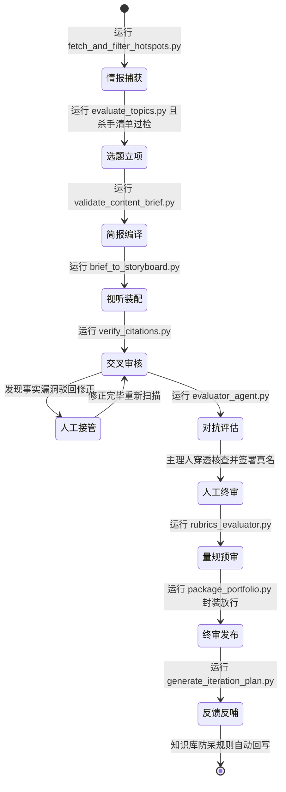
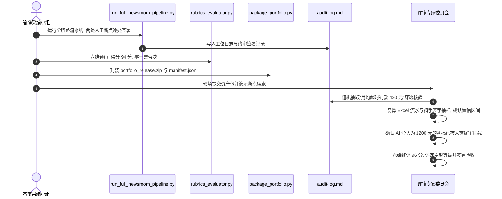

## 学习要点

- 掌握融媒体采编全链路流水线的端到端集成调度，具备脱离教师现场指导独立研发复杂融媒体产品的系统自足性。
- 理解一般系统论、认知目标分类、表现性评价与知识创造模型的理论脉络，能够用学理语言解释工程规程的成立依据。
- 熟练运用六维表现性评价量规对选题、信源、视听、审计、工程与反馈实施穿透式验收，独立运行量规自动化预审雷达。
- 掌握个人采编工程资产包的标准化封装技术，独立开发并运行 `run_full_newsroom_pipeline.py`、`rubrics_evaluator.py` 与 `package_portfolio.py` 三件工程工具。
- 确立智能传播时代新闻从业者与自媒体超级个体的技术主体性，把以道驭术、一手求真、真名签署沉淀为长期职业资产。

## 本章引言

走过人机协同采编工作台搭建、原子化知识库治理、账号逆向诊断、情报雷达监测、选题决策简报、多模态分镜渲染与事实穿透终审各道工序，《融合新闻产品策划与制作》进入收官关口：全流程运行、作品集验收与自主可控工作流交接。摆在采编团队面前的追问具体而尖锐。脱离教师现场指导与既定教学命题之后，这套人机协同流水线能否稳定支撑下一条真实深度调查报道的生产？作品集能否经受评审委员会的逐字穿透核验？个人积累的技能契约、脚本与知识卡片，能否在更换模型底座、更换创作平台、更换计算设备之后完整迁移？

生物学家路德维希·冯·贝塔朗菲（Ludwig von Bertalanffy）创立的一般系统论（General System Theory）给出了本章的总纲。系统的整体效能由要素之间的连接结构与状态流转决定，孤立要素的机械相加无法涌现出稳定、可复现的生产能力。零散的提示词技巧与单点工具操作属于要素级技能，现代融媒体生产能力体现在工序连接的确定性、证据流转的完整性与责任签署的可追溯性之上。本章沿着四重任务推进：全链路流水线的集成运行、出版级作品集的量规验收、工程资产包的标准化封装、技术主体性的长期交付。四者层层咬合，前者的产出物是后者的输入证据，共同构成卓越班融媒体采编教学的收官与交付基准。


**图 8-1 全流程收官阶段的四重任务结构**

## 第一节 全链路采编流水线的端到端集成运行

### 一、学理背景：一般系统论视野下的数字内容供应链

路德维希·冯·贝塔朗菲在 20 世纪 30 年代提出一般系统论的基本构想，1968 年出版的《一般系统论：基础、发展、应用》（*General System Theory: Foundations, Development, Applications*）把这套思想整理为跨学科的统一框架。其核心命题有四项。整体性（Wholeness）强调系统行为产生于要素之间的关联，考察整体时无法把要素拆开孤立处理。涌现性（Emergence）指出整体呈现出任何单个要素都不具备的新性质，这类性质只能从结构中生成。开放系统（Open System）强调生命系统与社会系统持续与环境交换物质、能量与信息，在动态均衡中维持有序状态。同构性（Isomorphism）主张不同学科中的系统遵循可类比的结构规律，生物学的机体概念可以平移到组织研究与工程研究之中。

这套命题落到融媒体采编工程上，解释力相当具体。采编流水线是一条开放系统：输入端接收线索、信源与数据，转换端完成采写、核验、装配与渲染，输出端交付作品与资产包，反馈端把传播数据回写进知识库，供下一轮生产调用。整体性对应这样一个判断：一名记者熟练编写提示词，一名美编熟练操作生图工具，两名成员各自达标，团队的报道质量依然可能失控，因为质量生成于工序之间的连接契约，包括文件命名规范、目录分层规则、状态流转时序与准入卡点。涌现性对应可复现性：单次生产的高质量作品带有偶然性，只有把偶然的高水平固化为流水线契约，质量才会作为系统性质稳定涌现。开放系统概念提醒采编团队，知识库必须持续吸收发布后反馈，封闭的流水线会随着时间推移失去对现实的解释力。

现代融媒体采编工程把整套流程建模为数字内容供应链（Digital Content Supply Chain），工序之间以机器可校验的文件契约咬合，形成一条有向无环的数据流转图：

- 情报雷达自动化捕获线索并执行四维初筛，产出三线表格式的待选表；
- 决策引擎依据受众雇佣需求（Jobs to Be Done，JTBD）生成结构化内容简报三件套；
- 视听模块依据参数化约束编译具备一致性锁定的分镜三线表；
- 审核模块通过对抗评估器实施事实穿透，人工终审签名后放行至发布目录；
- 监测模块抓取发布后反馈，反哺更新知识库与防呆规则。

工程前沿为这套流水线提供了协议层支撑。Anthropic 于 2024 年 12 月发布的智能体工程综述《构建高效智能体》（*Building Effective Agents*）把人机协同工作流归纳为提示链（Prompt Chaining）、路由（Routing）、并行化（Parallelization）、编排者与工作者（Orchestrator-Workers）、评估优化器（Evaluator-Optimizer）五类模式。本章的集成调度器对应编排者与工作者模式，事实穿透与对抗评估环节对应评估优化器回环。模型上下文协议（Model Context Protocol，MCP）于 2024 年 11 月 25 日发布，以开放标准统一智能体接入数据源与工具的契约，把工具调用从某一家模型厂商的私有接口中解放出来。采编团队按开放协议组织工具层，更换模型底座时无需重写工序脚本，这正是自主可控的协议层含义。严肃媒体的实践同样给出印证：美联社自 2014 年起把季度财报快讯这类模式化事务交给自动化流水线，深度调查与价值判断仍由记者主导；澎湃明查的核查栏目把求证规程沉淀为可执行的信源清单与核验动作；影视飓风、晚点 LatePost、差评等头部数字自媒体以极小团队跑出机构级产能，共同经验在于把个人能力沉淀为全链路工程资产。

### 二、底层机制与全链路状态机流转

整套系统以统一的状态机承载事件驱动。状态机由四类要素构成：状态（工位产出物的稳定形态）、迁移（触发状态转换的事件与脚本调用）、守卫条件（迁移必须满足的准入判据，例如杀手清单过检、引用闭环率达 100%）、动作（状态转换时写入的日志与断点记录）。状态机设计遵循两条工程纪律。幂等重跑指任一工位重复执行不产生重复副作用，中间产物以覆盖式写入，断点文件记录完成时间。失败即停指任一工位退出码非零或超时，流水线立即中止并保留现场，禁止带病推进到下一工位。



**图 8-2 全链路采编流水线状态机流转**

各工位的输入、产出物与准入卡点如表 8-1 所示。表中的守卫条件既是调度器的自动检查项，也是人工终审的抽查索引。

**表 8-1 全链路工位契约与准入卡点（三线表）**

| 工位 | 输入 | 产出物 | 准入卡点（守卫条件） | 责任人 |
| :--- | :--- | :--- | :--- | :--- |
| 情报捕获 | 公开信源接口 | `working/hotspot-watchlist.md` | 负向排除词库拦截生效，去重后线索 ≥ 8 条 | 值班编辑 |
| 选题立项 | 待选表、JTBD 调研 | `working/topic-candidates.md` | 四维加权分达标，杀手清单五项全过 | 主理人 |
| 简报编译 | 立项选题 | `working/briefs/` 简报三件套 | JTBD 与 Non-goals 边界齐备，证据清单逐条编号 | 主笔记者 |
| 视听装配 | 内容简报 | `working/storyboard.md` | 分镜三线表字段齐备，一致性锚点逐镜锁定 | 视听工程岗 |
| 交叉审核 | 稿件与证据库 | `working/citation-report.md` | 涉事实体断言与证据映射闭环率 100% | 核验岗 |
| 对抗评估 | 冷启动待审稿 | `working/evaluator-report.md` | 生成器与评估器上下文隔离，缺陷项逐条销号 | 评估智能体 |
| 人工终审 | 全部中间产物 | `audit-log.md` 签署条目 | 主理人键入确认口令，真名签署可署名责任 | 主理人 |
| 量规预审 | 工作区全量资产 | `working/rubric-report.json` | 六维总分 ≥ 75 分且零一票否决 | 自动化工具 |
| 封装放行 | 终审通过资产 | `manifest.json` 与交付包 | SHA-256 全量登记，必备资产零缺失 | 主理人 |

### 三、工程契约与全流程集成调度器开发

手动在各个文件夹之间依次切换脚本，产出的是一次性操作记忆，无法复现、无法审计、无法交接。全流程端到端集成调度脚本 `run_full_newsroom_pipeline.py` 把散落的工序固化为可重复运行的程序，其设计目标有五项：按时序自动调用工位脚本；以断点文件支持中断续跑；在事实终审与发布签署两处设立人工在环（Human-in-the-loop）断点；对非零退出码与超时严格拦截；全过程写入运行日志留痕。脚本仅使用 Python 标准库，教学环境零依赖即可运行，完整代码如下：

```python
#!/usr/bin/env python3
"""run_full_newsroom_pipeline.py: 融媒体采编全链路集成调度器。

按时序驱动情报抓取、简报准入、分镜编译、引用穿透、对抗评估与量规预审等工位,
在事实终审与发布签署两处设置人工在环断点, 支持断点续跑、演练模式与日志留痕。

用法示例::

    python run_full_newsroom_pipeline.py --root . --list-stages
    python run_full_newsroom_pipeline.py --root . --dry-run
    python run_full_newsroom_pipeline.py --root . --resume

退出码约定: 0 表示全链路完成, 1 表示工位失败或人工断点拒绝放行,
2 表示参数或工作区错误。
"""
from __future__ import annotations

import argparse
import json
import logging
import subprocess
import sys
from dataclasses import dataclass
from datetime import datetime
from pathlib import Path
from typing import Final, Sequence

LOGGER: Final[logging.Logger] = logging.getLogger("newsroom.pipeline")

STAGE_TIMEOUT_SECONDS: Final[int] = 1800
CHECKPOINT_FILENAME: Final[str] = ".pipeline_state.json"
GATE_MAX_ATTEMPTS: Final[int] = 3


class PipelineError(RuntimeError):
    """流水线调度过程中的基类异常。"""


class StageExecutionError(PipelineError):
    """工位脚本执行失败、超时或无法启动。"""


class HumanGateRejected(PipelineError):
    """人工在环断点确认失败, 流水线拒绝放行。"""


@dataclass(frozen=True)
class HumanGate:
    """人工在环断点契约: 责任角色、提示语与确认口令。"""

    role: str
    prompt: str
    confirm_token: str


@dataclass(frozen=True)
class StageSpec:
    """工位契约: 键名、标题、命令行、产出物与可选人工断点。"""

    key: str
    title: str
    command: tuple[str, ...]
    produces: tuple[str, ...] = ()
    gate: HumanGate | None = None


def build_stage_plan(python_bin: str) -> tuple[StageSpec, ...]:
    """按采编时序组装工位契约表, 命令统一使用当前解释器绝对路径。"""
    return (
        StageSpec(
            key="intelligence",
            title="多源情报抓取与清洗",
            command=(python_bin, "scripts/fetch_and_filter_hotspots.py"),
            produces=("working/hotspot-watchlist.md",),
        ),
        StageSpec(
            key="brief",
            title="选题简报三件套准入验证",
            command=(python_bin, "scripts/validate_content_brief.py"),
            produces=(
                "working/briefs/content-brief.md",
                "working/briefs/source-list.md",
            ),
        ),
        StageSpec(
            key="storyboard",
            title="文字简报向视听分镜三线表编译",
            command=(python_bin, "scripts/brief_to_storyboard.py"),
            produces=("working/storyboard.md",),
        ),
        StageSpec(
            key="citation",
            title="一手事实引用对齐与穿透检测",
            command=(python_bin, "scripts/verify_citations.py"),
            produces=("working/citation-report.md",),
        ),
        StageSpec(
            key="fact_review",
            title="涉事实体人工穿透终审",
            command=(),
            produces=("audit-log.md",),
            gate=HumanGate(
                role="主理人",
                prompt="请逐字核对涉事实体断言与证据映射, 确认智能体夸大表述已全部驳回",
                confirm_token="事实终审通过",
            ),
        ),
        StageSpec(
            key="adversarial",
            title="对抗式评估器冷启动挑错",
            command=(python_bin, "scripts/evaluator_agent.py"),
            produces=("working/evaluator-report.md",),
        ),
        StageSpec(
            key="rubric",
            title="六维表现性量规自动化预审",
            command=(python_bin, "scripts/rubrics_evaluator.py", "--root", "."),
            produces=("working/rubric-report.json",),
        ),
        StageSpec(
            key="release",
            title="发布签署与资产放行",
            command=(),
            gate=HumanGate(
                role="主理人",
                prompt="确认稿件可署名、深度合成标识齐全, 同意放行至发布目录",
                confirm_token="准予发布",
            ),
        ),
    )


def load_checkpoint(root: Path) -> dict[str, str]:
    """读取断点文件, 返回 工位键 -> 完成时间 映射; 文件缺失视为空记录。"""
    path = root / CHECKPOINT_FILENAME
    if not path.exists():
        return {}
    try:
        payload = json.loads(path.read_text(encoding="utf-8"))
    except json.JSONDecodeError as exc:
        raise PipelineError(f"断点文件损坏, 请人工核对后删除重跑: {path}") from exc
    completed = payload.get("completed", {})
    if not isinstance(completed, dict):
        raise PipelineError(f"断点文件结构异常: {path}")
    return {str(key): str(value) for key, value in completed.items()}


def save_checkpoint(root: Path, completed: dict[str, str]) -> None:
    """原子化写入断点文件: 先写临时文件再替换, 避免断电留下半截 JSON。"""
    path = root / CHECKPOINT_FILENAME
    payload = {
        "updated_at": datetime.now().isoformat(timespec="seconds"),
        "completed": completed,
    }
    tmp_path = path.with_name(path.name + ".tmp")
    tmp_path.write_text(json.dumps(payload, ensure_ascii=False, indent=2), encoding="utf-8")
    tmp_path.replace(path)


def run_stage(spec: StageSpec, root: Path, timeout: int) -> None:
    """执行单个工位命令, 非零退出码与超时一律视为失败并中止流水线。"""
    if not spec.command:
        LOGGER.info("工位 %s 为纯人工环节, 无脚本可调用。", spec.key)
        return
    LOGGER.info("执行工位 %s: %s", spec.key, " ".join(spec.command))
    try:
        result = subprocess.run(
            list(spec.command),
            cwd=root,
            capture_output=True,
            text=True,
            timeout=timeout,
        )
    except subprocess.TimeoutExpired as exc:
        raise StageExecutionError(f"工位 {spec.key} 超过 {timeout} 秒未完成。") from exc
    except OSError as exc:
        raise StageExecutionError(f"工位 {spec.key} 无法启动: {exc}") from exc
    if result.stdout.strip():
        LOGGER.info("工位 %s 标准输出:\n%s", spec.key, result.stdout.strip())
    if result.returncode != 0:
        stderr = result.stderr.strip() or "(无标准错误输出)"
        raise StageExecutionError(
            f"工位 {spec.key} 失败, 退出码 {result.returncode}:\n{stderr}"
        )
    LOGGER.info("工位 %s 顺利完成。", spec.key)


def pass_human_gate(gate: HumanGate) -> None:
    """在终端请求责任角色键入确认口令, 口令不匹配即拒绝放行, 终审权力保持在人。"""
    banner = "=" * 64
    print(f"\n{banner}\n【人工在环断点】责任角色: {gate.role}\n{gate.prompt}\n{banner}")
    for attempt in range(1, GATE_MAX_ATTEMPTS + 1):
        try:
            answer = input(f"请键入确认口令「{gate.confirm_token}」继续 (第 {attempt} 次): ").strip()
        except EOFError as exc:
            raise HumanGateRejected("终端不可交互, 人工断点无法确认, 流水线已中止。") from exc
        if answer == gate.confirm_token:
            LOGGER.info("人工断点已由责任角色「%s」确认放行。", gate.role)
            return
        print(f"[警告] 口令不匹配, 剩余尝试次数 {GATE_MAX_ATTEMPTS - attempt}。")
    raise HumanGateRejected(f"人工断点确认失败, 请由责任角色 {gate.role} 重新执行。")


def select_stages(
    stages: Sequence[StageSpec],
    completed: dict[str, str],
    from_stage: str | None,
) -> list[StageSpec]:
    """筛选待执行工位: 断点续跑跳过已完成项, 指定起始工位则忽略其前工位。"""
    selected = list(stages)
    if from_stage is not None:
        keys = [spec.key for spec in stages]
        if from_stage not in keys:
            raise PipelineError(f"未知工位键 {from_stage}, 可选值: {', '.join(keys)}")
        selected = selected[keys.index(from_stage):]
    if completed:
        selected = [spec for spec in selected if spec.key not in completed]
    return selected


def print_stage_plan(stages: Sequence[StageSpec], completed: dict[str, str]) -> None:
    """打印工位契约表与人工断点位置, 供演练模式与交接文档核对。"""
    print(f"{'工位键':<16}{'状态':<8}{'人工断点':<10}标题")
    print("-" * 72)
    for spec in stages:
        state = "已完成" if spec.key in completed else "待执行"
        gate = spec.gate.confirm_token if spec.gate else "无"
        print(f"{spec.key:<16}{state:<8}{gate:<10}{spec.title}")
        for product in spec.produces:
            print(f"{'':16}产出物: {product}")


def parse_args(argv: Sequence[str] | None = None) -> argparse.Namespace:
    """解析命令行参数。"""
    parser = argparse.ArgumentParser(description="融媒体采编全链路集成调度器")
    parser.add_argument("--root", type=Path, default=Path("."), help="采编工作区根目录")
    parser.add_argument("--list-stages", action="store_true", help="仅打印工位契约表")
    parser.add_argument("--dry-run", action="store_true", help="演练模式: 打印计划, 不执行脚本")
    parser.add_argument("--resume", action="store_true", help="断点续跑: 跳过已完成工位")
    parser.add_argument("--from-stage", metavar="KEY", help="从指定工位键开始执行")
    parser.add_argument(
        "--timeout", type=int, default=STAGE_TIMEOUT_SECONDS, help="单工位超时秒数"
    )
    return parser.parse_args(argv)


def main(argv: Sequence[str] | None = None) -> int:
    """调度主入口, 返回进程退出码。"""
    args = parse_args(argv)
    root: Path = args.root.resolve()
    if not root.is_dir():
        print(f"[错误] 工作区不存在: {root}", file=sys.stderr)
        return 2
    logging.basicConfig(
        level=logging.INFO,
        format="%(asctime)s %(levelname)s %(message)s",
    )
    stages = build_stage_plan(sys.executable)
    if args.list_stages:
        print_stage_plan(stages, {})
        return 0
    completed = load_checkpoint(root) if args.resume else {}
    try:
        selected = select_stages(stages, completed, args.from_stage)
    except PipelineError as exc:
        print(f"[错误] {exc}", file=sys.stderr)
        return 2
    if args.dry_run:
        print_stage_plan(selected, completed)
        print("[演练结束] 未调用任何脚本, 未触发任何人工断点。")
        return 0
    if not selected:
        print("[跳过] 断点记录显示全部工位已完成, 无需重复执行。")
        return 0
    LOGGER.info(">>> 启动融媒体采编全链路集成流水线, 工作区: %s <<<", root)
    try:
        for spec in selected:
            if spec.gate is not None:
                pass_human_gate(spec.gate)
            run_stage(spec, root, args.timeout)
            completed[spec.key] = datetime.now().isoformat(timespec="seconds")
            save_checkpoint(root, completed)
    except PipelineError as exc:
        LOGGER.error("%s", exc)
        print(f"[HALT] 流水线中止: {exc}", file=sys.stderr)
        return 1
    print("[SUCCESS] 全链路工位执行完毕, 作品具备进入发布目录的资格。")
    return 0


if __name__ == "__main__":
    sys.exit(main())
```

调度器的三个契约值得展开。断点文件 `.pipeline_state.json` 记录每个工位键的完成时间，写入采用临时文件加原子替换，异常断电后记录仍可恢复；`--resume` 依据断点跳过已完成工位，`--from-stage` 支持从指定工位重跑，二者配合使长达数小时的集成运行具备可中断性。人工在环断点要求责任角色键入完整确认口令，例如事实终审键入“事实终审通过”、发布放行键入“准予发布”，三次键入不匹配即中止流水线，终端不可交互时直接拒绝放行。演练模式 `--dry-run` 打印工位契约表与断点位置而不调用任何脚本，供交接双方在正式运行前核对计划。

### 四、边界约束：自动化边界的刚性卡点

全流程自动化承担的是格式转换、合规初筛与重复劳动，采编人员的判断责任未因自动化而缩减。流水线中的每一步状态流转日志对人类主理人完全透明，任何工位的失败现场必须保留至人工排查完毕。在三类枢纽节点上，人工确认具有不可让渡性：涉及价值导向的选题取舍，涉及敏感名誉指控与法律红线的事实定性，涉及署名责任的最终发布决策。这三类判断承载着法律后果与职业声誉，必须由具备专业资质的人类主理人做出并留下签署记录。

人因工程研究为此提供了反向证据。帕拉苏拉曼（Parasuraman）与莱利（Riley）在 1997 年关于人与自动化关系的研究中指出，对自动化的过度信任会导致监控松懈（Monitoring Failure）与技能退化（Skill Degradation），使人在系统真正需要接管时反应迟缓。融媒体流水线把人工断点设计为强制键入确认口令，就是要在自动化顺畅运行的路径上保持人的清醒参与。将终审权力让渡给无人值守脚本，等于把新闻产品的法律责任交给一段无法承担法律后果的代码。

## 第二节 出版级融媒体作品集验收与表现性评价量规

### 一、学理背景：布鲁姆认知目标分类与威金斯真实性表现性评价

教育心理学家本杰明·布鲁姆（Benjamin Bloom）于 1956 年主编的《教育目标分类学：教育目标的分类，手册一：认知领域》（*Taxonomy of Educational Objectives: The Classification of Educational Goals, Handbook I: Cognitive Domain*）把认知目标由低到高排列为记忆、理解、应用、分析、综合、评价六个层级。这套分类的核心洞察在于：教育测量如果停留在记忆与理解层级，就无法区分纸上谈兵的应试能力与真实情境中的专业实践能力。洛林·安德森（Lorin Anderson）与戴维·克拉斯沃尔（David Krathwohl）2001 年的修订版把认知过程维度重排为记忆、理解、应用、分析、评价、创造，把创造置于最高阶，同时补充事实性、概念性、程序性与元认知四类知识维度。融媒体结课作品集要求学习者在真实约束下完成分析、评价与创造：分析线索与信源的可信结构，评价证据链的牢固程度，创造一套可复现的报道作品与工程资产。

格兰特·威金斯（Grant Wiggins）在《教育性评价》（*Educative Assessment*）中系统阐述表现性评价（Performance Assessment）与真实性评价（Authentic Assessment）。其论点建立在几组可核验的对比之上。考核任务置于真实专业情境，学生面对的约束条件与职业现场一致；评价标准在任务启动前向被评价者公开，评分过程依据作品与过程的物理证据展开；评价本身服务于学习改进，评分结果附带可操作的改进指向。威金斯与杰伊·麦克泰格（Jay McTighe）在《追求理解的教学设计》（*Understanding by Design*）中给出 GRASPS 任务设计框架：目标（Goal）、角色（Role）、受众（Audience）、情境（Situation）、作品与表现（Product/Performance）、标准（Standards），并提出理解的六个侧面，包括解释、释义、应用、洞察、移情与自知。

卓越班六维量规把 GRASPS 框架转译为可校验的工程判据。目标对应选题的公共性增量，角色对应采编小组的分工契约与主理人责任，受众对应 JTBD 定义下的一手需求调研，情境对应真实平台规则与法律边界，作品对应特稿、视听母本与工程资产包，标准对应表 8-2 的量化锚点。量规在任务启动时即向全体学员公布，“优秀”一词从主观形容词变为可测量的物理判据。评价的信度由三重设计保障：锚定样例为每个分数区间提供对照作品，双评一致性要求两名评审独立打分后核对，过程证据要求每个得分点都能指向工作区内的具体文件。

### 二、卓越班六维表现性评价量规

验收严格对照六维量化评价量规实施穿透式评审，满分 100 分，如表 8-2 所示。表格遵循三线表规范，仅保留顶线、栏目线与底线，不设竖线。

**表 8-2 卓越班六维表现性评价量规（三线表）**

| 考核维度 | 权重分值 | 卓越标准（90% 至 100% 区间） | 良好标准（75% 至 89% 区间） | 不合格红线（低于 75% 或一票否决） |
| :--- | :--- | :--- | :--- | :--- |
| **1. 选题公共性与深度** | 15 分 | 选题紧扣重大公共利益与时代痛点，具备清晰的 JTBD 受众任务定义与 Non-goals 负面边界。 | 选题具备现实意义，切角稍显宽泛，负面边界不够清晰。 | 自娱自乐式宣泄、追逐恶俗商业热点或无实质公共增量。 |
| **2. 信源分级与一手穿透** | 25 分 | 一手信源（Tier-1）覆盖率 ≥ 80%，每项涉事实体断言均具备本地归档的物理文件哈希映射。 | 一手信源覆盖率达 60% 至 79%，多数断言具备依据，个别存在二手转述。 | 依赖单一匿名网络信源，存在虚假捏造或未核实指控（一票否决）。 |
| **3. 视听多模态工程规范** | 20 分 | 分镜三线表具备明确的景别、运镜、时长与参数化提示词，画面严格遵守一致性控制与 UI 安全区。 | 分镜结构完整，个别镜头提示词未锁定全局光学锚点，存在轻微风格漂移。 | 包含虚构合成的伪现场画面且未加注显著深度合成标识（一票否决）。 |
| **4. 人工终审与审计台账** | 20 分 | `audit-log.md` 详实记录机器初稿缺陷与人类纠偏痕迹，责任人以真实姓名签署可署名责任。 | 具备审核记录与主理人签名，修正过程痕迹记录略显简略。 | 无审核台账，或以“AI 免责声明”逃避署名责任（一票否决）。 |
| **5. 工程资产自主可控性** | 10 分 | 自定义 Skill 具备规范 YAML 元数据与输入输出指针，本地 Wiki 图谱零坏链，目录物理隔离严整。 | 具备自定义 Skill 与 Wiki，缺少自动化校验脚本，局部目录命名不规范。 | 代码无法独立运行，依赖未声明的绝对物理路径（一票否决）。 |
| **6. 反馈闭环与敏捷迭代** | 10 分 | 具备完整的 `feedback-log.md`，科学解耦三层证据，产出可测量量化指标的下一期迭代方案。 | 记录了受众反馈，迭代建议稍显泛化，量化验证指标不够明确。 | 彻底缺少发布后反馈追踪机制，把单次发布视为终点。 |

等级换算与红线判定如表 8-3 所示。评审委员会按维度打分后汇总，出现任一票否决项时直接终止评审流程，团队须先消除红线缺陷再重新申报。

**表 8-3 评分换算、等级判定与红线处置（三线表）**

| 综合得分 | 等级判定 | 处置方式 | 附加要求 |
| :--- | :--- | :--- | :--- |
| 90 至 100 分 | 卓越 | 推荐结课出版与对外参赛 | 须提交完整资产包与交接说明 |
| 75 至 89 分 | 良好 | 准予结课 | 针对扣分维度限期补齐 |
| 60 至 74 分 | 合格 | 限期整改后复审 | 复审前不得对外发布作品 |
| 低于 60 分 | 不合格 | 重做关键工序 | 重新走完全链路集成与终审 |
| 任一票否决项 | 红线终止 | 评审中止 | 消除缺陷后重新申报 |

### 三、工程契约与六维量规自动化预审雷达

人工评审委员会的终局裁决无法被工具替代，工具承担的是提交前的自动化预审，把低级缺陷在进入答辩之前清理干净。预审脚本 `rubrics_evaluator.py` 对工作区执行静态文件与文本审计，逐维给出预审分、检查明细与违规提示，输出三类产物：JSON 机器报告、Markdown 三线表报告与 SVG 雷达图。检查项与量规一一对应，得分按通过检查数占比折算，退出码区分通过与否决。脚本仅使用 Python 标准库，完整代码如下：

```python
#!/usr/bin/env python3
"""rubrics_evaluator.py: 六维表现性量规自动化预审雷达。

对结课作品集工作区执行静态文件审计, 按六维表现性量规给出预审分、
逐项检查证据与一票否决提示, 输出 JSON 报告、Markdown 报告与 SVG 雷达图。

用法示例::

    python rubrics_evaluator.py --root .
    python rubrics_evaluator.py --root . --fail-under 75

退出码约定: 0 表示达到准入线, 1 表示触发一票否决或低于准入分,
2 表示参数或工作区错误。
"""
from __future__ import annotations

import argparse
import json
import math
import re
import sys
from dataclasses import asdict, dataclass
from datetime import datetime
from pathlib import Path
from typing import Final, Sequence

ABSOLUTE_PATH_PATTERN: Final[re.Pattern[str]] = re.compile(
    r"(/Users/|/home/[A-Za-z0-9_]+/|[A-Z]:\\\\)"
)
SIGNATURE_PATTERN: Final[re.Pattern[str]] = re.compile(
    r"(责任签署人|签署人|主理人签署|导师签署)"
)
TIMESTAMP_PATTERN: Final[re.Pattern[str]] = re.compile(r"20\d{2}-\d{2}-\d{2}\s+\d{2}:\d{2}")
SHA256_PATTERN: Final[re.Pattern[str]] = re.compile(r"\b[0-9a-f]{64}\b")
QUANT_METRIC_PATTERN: Final[re.Pattern[str]] = re.compile(
    r"\d+(?:\.\d+)?\s*(?:%|条|篇|小时|分钟|次|分)"
)

WORKSPACE_DIRS: Final[tuple[str, ...]] = (
    "data/raw",
    "data/sanitized",
    "working",
    "published",
    ".workbuddy/skills",
)
VETO_MARK: Final[str] = "一票否决"
PASS_THRESHOLD: Final[float] = 75.0


@dataclass(frozen=True)
class CheckResult:
    """单项检查结果: 名称、通过与否、判据细节与证据指针。"""

    name: str
    passed: bool
    detail: str
    evidence: str = ""


@dataclass(frozen=True)
class DimensionReport:
    """单维度预审结果: 权重、得分、得分率、检查明细与违规提示。"""

    key: str
    label: str
    weight: float
    score: float
    ratio: float
    checks: tuple[CheckResult, ...]
    violations: tuple[str, ...]


def read_text(path: Path) -> str:
    """读取 UTF-8 文本文件, 读取失败返回空串, 交由上层按缺失处理。"""
    try:
        return path.read_text(encoding="utf-8")
    except OSError:
        return ""


def first_existing(root: Path, candidates: Sequence[str]) -> Path | None:
    """按候选路径顺序返回第一个存在的文件, 全部缺失返回 None。"""
    for relative in candidates:
        candidate = root / relative
        if candidate.is_file():
            return candidate
    return None


def _finalize(
    key: str,
    label: str,
    weight: float,
    checks: Sequence[CheckResult],
    violations: Sequence[str] = (),
) -> DimensionReport:
    """按通过检查数占比折算维度得分, 得分率保留两位小数。"""
    passed = sum(1 for item in checks if item.passed)
    ratio = (passed / len(checks)) if checks else 0.0
    return DimensionReport(
        key=key,
        label=label,
        weight=weight,
        score=round(weight * ratio, 1),
        ratio=round(ratio, 2),
        checks=tuple(checks),
        violations=tuple(violations),
    )


def _evaluate_topic(root: Path) -> DimensionReport:
    """选题公共性与深度: 核验内容简报的 JTBD 定义与 Non-goals 负面边界。"""
    weight = 15.0
    brief = first_existing(
        root, ("working/briefs/content-brief.md", "working/content-brief.md")
    )
    if brief is None:
        checks = [CheckResult("内容简报存在", False, "未找到 working/briefs/content-brief.md")]
        return _finalize("topic", "选题公共性与深度", weight, checks,
                         ("缺少内容简报, 选题公共性无法核验。",))
    text = read_text(brief)
    checks = [
        CheckResult("内容简报存在", True, str(brief), str(brief)),
        CheckResult(
            "JTBD 受众任务定义",
            "JTBD" in text or "受众任务" in text,
            "简报需声明受众雇佣需求（JTBD）。",
        ),
        CheckResult(
            "Non-goals 负面边界",
            ("Non-goal" in text) or ("负面边界" in text) or ("不做" in text),
            "简报需声明选题明确不做什么。",
        ),
        CheckResult(
            "公共价值论证",
            any(word in text for word in ("公共利益", "公共价值", "公共议题", "民生")),
            "简报需论证选题的公共利益增量。",
        ),
    ]
    return _finalize("topic", "选题公共性与深度", weight, checks)


def _evaluate_sources(root: Path) -> DimensionReport:
    """信源分级与一手穿透: 核验 Tier-1 覆盖、哈希映射与脱敏证据库。"""
    weight = 25.0
    source_list = first_existing(
        root, ("working/briefs/source-list.md", "working/source-list.md")
    )
    violations: list[str] = []
    if source_list is None:
        checks = [CheckResult("信源清单存在", False, "未找到 working/briefs/source-list.md")]
        violations.append(f"{VETO_MARK}: 缺少信源分级清单, 事实底座无法核验。")
        return _finalize("sources", "信源分级与一手穿透", weight, checks, violations)
    text = read_text(source_list)
    tier1_count = len(re.findall(r"Tier-1", text))
    hash_count = len(SHA256_PATTERN.findall(text))
    evidence_dir = root / "evidence_and_audits" / "sanitized_evidence"
    evidence_count = (
        sum(1 for item in evidence_dir.rglob("*") if item.is_file())
        if evidence_dir.is_dir()
        else 0
    )
    checks = [
        CheckResult("信源清单存在", True, str(source_list), str(source_list)),
        CheckResult(
            "Tier-1 一手信源 ≥ 4 处",
            tier1_count >= 4,
            f"清单中 Tier-1 标注出现 {tier1_count} 处。",
        ),
        CheckResult(
            "证据哈希映射 ≥ 3 条",
            hash_count >= 3,
            f"清单中 64 位十六进制摘要出现 {hash_count} 处。",
        ),
        CheckResult(
            "脱敏证据库非空且 ≥ 3 件",
            evidence_count >= 3,
            f"sanitized_evidence 下归档文件 {evidence_count} 件。",
        ),
    ]
    if tier1_count == 0:
        violations.append(f"{VETO_MARK}: 未登记任何 Tier-1 一手信源。")
    return _finalize("sources", "信源分级与一手穿透", weight, checks, violations)


def _evaluate_storyboard(root: Path) -> DimensionReport:
    """视听多模态工程规范: 核验分镜三线表字段、一致性锚点与合成标识。"""
    weight = 20.0
    storyboard = first_existing(
        root, ("working/storyboard.md", "working/briefs/storyboard.md")
    )
    violations: list[str] = []
    if storyboard is None:
        checks = [CheckResult("分镜三线表存在", False, "未找到 working/storyboard.md")]
        violations.append("缺少视听分镜三线表, 视听工程规范无法核验。")
        return _finalize("storyboard", "视听多模态工程规范", weight, checks, violations)
    text = read_text(storyboard)
    checks = [
        CheckResult("分镜三线表存在", True, str(storyboard), str(storyboard)),
        CheckResult(
            "表头含镜号与景别",
            ("镜号" in text) and ("景别" in text),
            "分镜表头须包含镜号、景别两列。",
        ),
        CheckResult(
            "参数化字段含运镜与时长",
            ("运镜" in text) and ("时长" in text),
            "分镜须逐镜声明运镜与时长。",
        ),
        CheckResult(
            "一致性锚点锁定",
            ("一致性" in text) or ("光学锚点" in text),
            "分镜须声明跨镜头一致性控制策略。",
        ),
        CheckResult(
            "UI 安全区声明",
            "安全区" in text,
            "分镜须声明跨平台 UI 安全区约束。",
        ),
        CheckResult(
            "深度合成标识要求",
            any(word in text for word in ("深度合成", "AI 生成", "合成标识")),
            "生成合成画面须声明显著标识义务。",
        ),
    ]
    if not any(word in text for word in ("深度合成", "AI 生成", "合成标识")):
        violations.append(f"{VETO_MARK}: 分镜未声明深度合成标识要求。")
    return _finalize("storyboard", "视听多模态工程规范", weight, checks, violations)


def _evaluate_audit(root: Path) -> DimensionReport:
    """人工终审与审计台账: 核验终审结论、真名签署与纠偏痕迹。"""
    weight = 20.0
    audit_file = first_existing(
        root,
        ("evidence_and_audits/audit-log.md", "audit-log.md", "working/audit-log.md"),
    )
    violations: list[str] = []
    if audit_file is None:
        checks = [CheckResult("审计台账存在", False, "未找到 audit-log.md")]
        violations.append(f"{VETO_MARK}: 缺少人工终审审计台账。")
        return _finalize("audit", "人工终审与审计台账", weight, checks, violations)
    text = read_text(audit_file)
    correction_count = len(re.findall(r"(纠偏|驳回|修正)", text))
    checks = [
        CheckResult("审计台账存在", True, str(audit_file), str(audit_file)),
        CheckResult("终审结论登记", "终审结论" in text, "台账须登记终审结论取值。"),
        CheckResult(
            "真名签署字段",
            SIGNATURE_PATTERN.search(text) is not None,
            "台账须登记责任签署人真实姓名。",
        ),
        CheckResult(
            "签署时间戳",
            TIMESTAMP_PATTERN.search(text) is not None,
            "台账须登记可追溯的签署时间。",
        ),
        CheckResult(
            "纠偏痕迹 ≥ 2 条",
            correction_count >= 2,
            f"台账中纠偏类记录出现 {correction_count} 处。",
        ),
    ]
    if SIGNATURE_PATTERN.search(text) is None:
        violations.append(f"{VETO_MARK}: 台账无可署名责任签署人。")
    return _finalize("audit", "人工终审与审计台账", weight, checks, violations)


def _evaluate_workspace(root: Path) -> DimensionReport:
    """工程资产自主可控性: 核验目录隔离、路径依赖与 Skill 元数据。"""
    weight = 10.0
    missing_dirs = [item for item in WORKSPACE_DIRS if not (root / item).is_dir()]
    script_files = [
        item
        for base in (root / "engineering" / "scripts", root / "scripts")
        if base.is_dir()
        for item in sorted(base.rglob("*.py"))
    ]
    absolute_hits = [
        str(item.relative_to(root))
        for item in script_files
        if ABSOLUTE_PATH_PATTERN.search(read_text(item))
    ]
    skill_files = [
        item
        for base in (root / ".workbuddy" / "skills", root / "engineering" / "skills")
        if base.is_dir()
        for item in sorted(base.rglob("*.md"))
    ]
    skill_ok = []
    for item in skill_files:
        head = read_text(item).split("---", 2)
        if len(head) >= 3 and ("name:" in head[1]) and ("description:" in head[1]):
            skill_ok.append(item)
    checks = [
        CheckResult(
            "四层物理隔离目录齐全",
            not missing_dirs,
            "缺失目录: " + ("、".join(missing_dirs) if missing_dirs else "无"),
        ),
        CheckResult(
            "脚本零绝对路径依赖",
            not absolute_hits,
            "命中绝对路径的脚本: " + ("、".join(absolute_hits) if absolute_hits else "无"),
        ),
        CheckResult(
            "Skill YAML 元数据齐备",
            bool(skill_files) and len(skill_ok) == len(skill_files),
            f"Skill 文件 {len(skill_files)} 个, 元数据合规 {len(skill_ok)} 个。",
        ),
    ]
    violations: list[str] = []
    if absolute_hits:
        violations.append(f"{VETO_MARK}: 脚本依赖未声明的绝对物理路径。")
    return _finalize("workspace", "工程资产自主可控性", weight, checks, violations)


def _evaluate_feedback(root: Path) -> DimensionReport:
    """反馈闭环与敏捷迭代: 核验反馈日志、证据解耦与量化迭代指标。"""
    weight = 10.0
    feedback_file = first_existing(
        root,
        ("evidence_and_audits/feedback-log.md", "feedback-log.md", "working/feedback-log.md"),
    )
    violations: list[str] = []
    if feedback_file is None:
        checks = [CheckResult("反馈日志存在", False, "未找到 feedback-log.md")]
        violations.append(f"{VETO_MARK}: 缺少发布后反馈追踪机制。")
        return _finalize("feedback", "反馈闭环与敏捷迭代", weight, checks, violations)
    text = read_text(feedback_file)
    plan_file = first_existing(
        root, ("working/iteration-plan.md", "evidence_and_audits/iteration-plan.md")
    )
    plan_text = read_text(plan_file) if plan_file is not None else ""
    metric_count = len(QUANT_METRIC_PATTERN.findall(plan_text))
    checks = [
        CheckResult("反馈日志存在", True, str(feedback_file), str(feedback_file)),
        CheckResult(
            "三层证据解耦标记",
            ("解耦" in text) or all(word in text for word in ("事实", "情绪", "噪声")),
            "反馈须区分事实指正、情绪表达与噪声干扰。",
        ),
        CheckResult(
            "迭代方案存在",
            plan_file is not None,
            "未找到 working/iteration-plan.md" if plan_file is None else str(plan_file),
        ),
        CheckResult(
            "量化指标 ≥ 2 项",
            metric_count >= 2,
            f"迭代方案中量化指标出现 {metric_count} 处。",
        ),
    ]
    return _finalize("feedback", "反馈闭环与敏捷迭代", weight, checks, violations)


def evaluate_portfolio(root: Path) -> dict:
    """执行六维预审并汇总为 JSON 可序列化报告。"""
    dimensions = [
        _evaluate_topic(root),
        _evaluate_sources(root),
        _evaluate_storyboard(root),
        _evaluate_audit(root),
        _evaluate_workspace(root),
        _evaluate_feedback(root),
    ]
    total_weight = round(sum(item.weight for item in dimensions), 1)
    total_score = round(sum(item.score for item in dimensions), 1)
    critical = [message for item in dimensions for message in item.violations]
    veto_messages = [message for message in critical if VETO_MARK in message]
    return {
        "generated_at": datetime.now().isoformat(timespec="seconds"),
        "project_root": str(root),
        "dimensions": [asdict(item) for item in dimensions],
        "total_weight": total_weight,
        "total_score": total_score,
        "critical_violations": critical,
        "veto_triggered": bool(veto_messages),
        "ready_for_defense": (not veto_messages) and total_score >= PASS_THRESHOLD,
    }


def render_markdown(report: dict) -> str:
    """把预审报告渲染为三线表规范的 Markdown 文本。"""
    lines = [
        "# 六维表现性量规预审报告",
        "",
        f"> 生成时间: {report['generated_at']}｜工作区: {report['project_root']}",
        "> 表格遵循三线表规范: 仅保留顶线、栏目线与底线, 不设竖线。",
        "",
        "表 1　六维预审得分雷达",
        "",
        "| 考核维度 | 权重 | 预审得分 | 得分率 | 未通过检查 |",
        "| :--- | ---: | ---: | ---: | :--- |",
    ]
    for item in report["dimensions"]:
        failed = "、".join(c["name"] for c in item["checks"] if not c["passed"]) or "无"
        lines.append(
            f"| {item['label']} | {item['weight']:.0f} | {item['score']:.1f} "
            f"| {item['ratio']:.0%} | {failed} |"
        )
    lines.append(
        f"| **合计** | **{report['total_weight']:.0f}** | **{report['total_score']:.1f}** | | |"
    )
    lines.extend(["", "## 一票否决与缺陷提示", ""])
    if report["critical_violations"]:
        lines.extend(f"- {message}" for message in report["critical_violations"])
    else:
        lines.append("- 未发现红线缺陷。")
    verdict = "具备答辩资格" if report["ready_for_defense"] else "未达准入线, 禁止提交"
    lines.extend(["", f"**预审结论**: {verdict}。"])
    return "\n".join(lines) + "\n"


def render_radar_svg(report: dict, output_path: Path) -> None:
    """把六维得分率渲染为 SVG 雷达图, 仅使用标准库字符串拼接。"""
    dimensions: list[dict] = report["dimensions"]
    count = len(dimensions)
    center_x, center_y, radius = 320.0, 270.0, 170.0

    def point(index: int, value: float) -> tuple[float, float]:
        angle = -math.pi / 2 + 2 * math.pi * index / count
        return (
            center_x + radius * value * math.cos(angle),
            center_y + radius * value * math.sin(angle),
        )

    rings = []
    for level in (0.25, 0.5, 0.75, 1.0):
        points = " ".join(
            f"{x:.1f},{y:.1f}" for x, y in (point(i, level) for i in range(count))
        )
        rings.append(
            f'<polygon points="{points}" fill="none" stroke="#c8d2dc" stroke-width="1"/>'
        )
    axes = []
    labels = []
    for index, item in enumerate(dimensions):
        x_end, y_end = point(index, 1.0)
        axes.append(
            f'<line x1="{center_x:.1f}" y1="{center_y:.1f}" x2="{x_end:.1f}" '
            f'y2="{y_end:.1f}" stroke="#c8d2dc" stroke-width="1"/>'
        )
        x_label, y_label = point(index, 1.18)
        anchor = "middle"
        if x_label > center_x + 8:
            anchor = "start"
        elif x_label < center_x - 8:
            anchor = "end"
        labels.append(
            f'<text x="{x_label:.1f}" y="{y_label:.1f}" text-anchor="{anchor}" '
            f'font-size="13" fill="#2f4858">{item["label"]}</text>'
        )
    values = [max(0.0, min(1.0, float(item["ratio"]))) for item in dimensions]
    data_points = " ".join(
        f"{x:.1f},{y:.1f}" for x, y in (point(i, v) for i, v in enumerate(values))
    )
    data_polygon = (
        f'<polygon points="{data_points}" fill="#4c7aa5" fill-opacity="0.35" '
        f'stroke="#2f4858" stroke-width="2"/>'
    )
    svg = (
        '<svg xmlns="http://www.w3.org/2000/svg" width="640" height="540" '
        'viewBox="0 0 640 540">\n'
        '<rect width="640" height="540" fill="#ffffff"/>\n'
        '<text x="320" y="34" text-anchor="middle" font-size="16" fill="#2f4858">'
        '六维表现性量规预审雷达</text>\n'
        + "\n".join(rings)
        + "\n"
        + "\n".join(axes)
        + "\n"
        + data_polygon
        + "\n"
        + "\n".join(labels)
        + "\n</svg>\n"
    )
    output_path.parent.mkdir(parents=True, exist_ok=True)
    output_path.write_text(svg, encoding="utf-8")


def parse_args(argv: Sequence[str] | None = None) -> argparse.Namespace:
    """解析命令行参数。"""
    parser = argparse.ArgumentParser(description="六维表现性量规自动化预审雷达")
    parser.add_argument("--root", type=Path, default=Path("."), help="作品集工作区根目录")
    parser.add_argument("--json-out", type=Path, default=Path("working/rubric-report.json"))
    parser.add_argument("--md-out", type=Path, default=Path("working/rubric-report.md"))
    parser.add_argument("--svg-out", type=Path, default=Path("working/rubric-radar.svg"))
    parser.add_argument("--fail-under", type=float, default=PASS_THRESHOLD, help="准入分数线")
    return parser.parse_args(argv)


def main(argv: Sequence[str] | None = None) -> int:
    """预审主入口, 返回进程退出码。"""
    args = parse_args(argv)
    root = args.root.resolve()
    if not root.is_dir():
        print(f"[错误] 工作区不存在: {root}", file=sys.stderr)
        return 2
    report = evaluate_portfolio(root)
    args.json_out.parent.mkdir(parents=True, exist_ok=True)
    args.json_out.write_text(
        json.dumps(report, ensure_ascii=False, indent=2), encoding="utf-8"
    )
    args.md_out.write_text(render_markdown(report), encoding="utf-8")
    render_radar_svg(report, args.svg_out)
    print(render_markdown(report))
    print(f"[输出] JSON: {args.json_out}｜Markdown: {args.md_out}｜雷达图: {args.svg_out}")
    if report["veto_triggered"]:
        print("[一票否决] 存在红线违规, 禁止进入答辩环节。", file=sys.stderr)
        return 1
    if report["total_score"] < args.fail_under:
        print(
            f"[未达标] 预审总分 {report['total_score']} 低于准入线 {args.fail_under}。",
            file=sys.stderr,
        )
        return 1
    print(f"[通过] 预审总分 {report['total_score']}, 具备进入人工终审与答辩的资格。")
    return 0


if __name__ == "__main__":
    sys.exit(main())
```

预审雷达的输出按维度给出得分率与未通过检查项，雷达图的六个顶点分别对应六维权重，图形收缩的方向直接暴露工作区的薄弱环节。脚本对每个得分点登记证据指针，评审委员可以顺着指针打开原始文件核对，预审结论因此具备可质询性。

### 四、边界约束：测量边界与唯数据论防线

作品集答辩与成绩评定严禁以播放量、点赞量或粉丝增长数作为唯一定量标准。这三类指标测量的是平台分发机制与情绪唤起强度，严谨的调查作品需要长周期沉淀发酵，短期内往往落后于追逐热点的轻内容。计量与考核理论早已证明，当一项测量指标直接变成考核目标，指标本身就会丧失原有的测量效力。把播放量设为唯一目标，团队会自然把资源投向刺激性选题与标题技巧，公共利益增量被系统性挤出。

预审雷达同样有其测量边界。脚本覆盖的是物理可校验项：文件是否存在、字段是否齐备、哈希是否登记、路径是否可移植。选题的公共性判断、法律风险的定性、署名责任的承担，依旧由评审委员会与主理人完成。工具把低级缺陷拦截在门外，把高质量判断留给人，这正是表现性评价的本义：评价证据来自完整作品与全过程痕迹，评价结论由具备专业资质的人做出。平台后台数据的截图可以伪造，工程证据链可以由第三方用同一套脚本独立复算，后者才是可质询的验收底座。

## 第三节 采编资产包封装与知识资产外化

### 一、学理背景：SECI 知识创造模型与知识资产螺旋

日本知识管理学家野中郁次郎（Ikujiro Nonaka）与竹内弘高（Hirotaka Takeuchi）在 1995 年出版的《知识创造的企业》（*The Knowledge-Creating Company*）中提出 SECI 知识转化模型。该模型的出发点是知识的两重形态：隐性知识存在于直觉、经验与身体习惯之中，难以用语言完整表达；显性知识存在于文档、代码与图表之中，可以编码、传输与重组。两类知识之间的持续转化构成知识创造的螺旋，具体展开为四种模式。

潜移默化（Socialization）实现隐性到隐性的传递，典型场景是并肩采访与师徒共事，新记者在现场观察资深记者如何提问、如何判断受访者的闪烁其词。外部明示（Externalization）实现隐性到显性的转化，把头脑中的排错经验、提示词约束与判断标准写成 Skill 契约、脚本注释与审核清单。汇总组合（Combination）实现显性到显性的重组，把零散文档整合为资产清单、知识图谱与操作手册，形成结构性知识。内部升华（Internalization）实现显性到隐性的吸收，下一届学员复现资产包并反复演练，把文档规程内化为职业直觉。野中郁次郎与绀野登（Noboru Konno）1998 年进一步提出“场”（Ba）的概念，知识创造需要共享情境作为载体，选题会、并肩采访与结课答辩正是本课程的三类知识共创场。

这套理论为结课资产包给出了明确的工程指向。八周高强度实践中摸索出的找线索技巧、排错规程与提示词约束，若停留在大脑潜意识中，会随着时间推移遗忘损耗。转化为字节的显性知识具备四项物理收益：可交接给下一届团队，可审计供评审委员会复核，可复算供第三方独立验证，可迁移至更换模型与平台后的新工作流。记忆会衰减，字节不会。资产管理研究把知识资产分为经验型、概念型、系统型与常规型四类，作品集资产包恰好覆盖后三类：简报与分镜属于概念型资产，手册、清单与 `manifest.json` 属于系统型资产，反复演练形成的作业习惯属于常规型资产。

### 二、个人采编资产包的标准工程架构

一个具备完整工程可移植性的融媒体作品集资产包，由五个核心容器化模块构成：

```text
portfolio-release-package/           # 结课验收资产包根目录
├── manifest.json                    # 【全资产清单】元数据声明与文件哈希校验和
├── README.md                        # 【交接说明书】团队人员、分工、作品简介与复现指南
├── artifacts/                       # 【作品母本库】
│   ├── published_article.md         # 终审通过的排版特稿
│   └── final_video_master.mp4       # 视听成片母本（或高清成片云端永久指针）
├── engineering/                     # 【技术资产库】
│   ├── skills/                      # 经过测试的 WorkBuddy 自定义 Skill 库
│   ├── scripts/                     # 独立开发的 Python 自动化脚本集
│   └── wiki/                        # 沉淀的原子化概念卡、配方卡与避坑卡
└── evidence_and_audits/             # 【审计与证据库】
    ├── audit-log.md                 # 全链路人工终审签名台账
    ├── feedback-log.md              # 真实传播反馈日志
    └── sanitized_evidence/          # 脱敏后的一手法定证据凭据
```

各模块的职责与验收判据如表 8-4 所示。命名与版本规范包含四条纪律：交付包采用语义化版本号，内容变更即递增版本并重新计算哈希；文件名使用小写英文与连字符，携带业务语义；证据凭据按《中华人民共和国个人信息保护法》的最小必要原则脱敏，身份证号、手机号与门牌住址一律掩码；全部时间戳采用 ISO 8601 格式，带时区偏移量。

**表 8-4 资产包模块职责与验收判据（三线表）**

| 模块 | 承载内容 | 职责 | 验收判据 |
| :--- | :--- | :--- | --- |
| `manifest.json` | 资产路径、角色、字节数、SHA-256 摘要 | 封装契约与防篡改清单 | 字段齐全，摘要与实物逐一对应 |
| `README.md` | 团队分工、作品简介、复现指南 | 责任交接说明书 | 第三方按文档可在 30 分钟内复现关键工位 |
| `artifacts/` | 特稿母本、视听母本 | 作品交付 | 特稿终审通过，视频带深度合成标识 |
| `engineering/` | Skill、脚本、知识卡片 | 技术资产外化 | 脚本零绝对路径依赖，知识卡零坏链 |
| `evidence_and_audits/` | 审计台账、反馈日志、脱敏证据 | 证据与责任留痕 | 台账真名签署，证据哈希与清单一致 |

### 三、工程契约与资产包标准化封装工具开发

资产打包工具 `package_portfolio.py` 承担四项职责：校验必备资产完整性，以流式方式计算全部受控文件的 SHA-256 摘要，生成 schema 化的 `manifest.json`，以固定时间戳与字典序封装可复现的 ZIP 交付包，并为收包方提供独立复核入口。SHA-256 属于密码学摘要算法，具备抗碰撞性与雪崩效应，输入字节的单比特差异会引发摘要约半数比特翻转，任何篡改在复核环节立即暴露。摘要计算采用 1 MiB 分块流式读取，音视频母本无论多大都不会撑爆内存。完整代码如下：

```python
#!/usr/bin/env python3
"""package_portfolio.py: 融媒体作品集工程资产包标准化封装工具。

以流式方式计算全部受控资产的 SHA-256 校验和, 生成 schema 化 manifest.json,
以固定时间戳与字典序输出可复现的 ZIP 交付包, 并支持收包方独立复核哈希。

用法示例::

    python package_portfolio.py build --root . --out dist/portfolio_release.zip \
        --version 1.0.0 --lead-author 杨志宏
    python package_portfolio.py verify --root . --manifest manifest.json

退出码约定: 0 成功, 1 校验差异, 2 封装前置条件缺失或参数错误。
"""
from __future__ import annotations

import argparse
import hashlib
import json
import shutil
import sys
import zipfile
from dataclasses import asdict, dataclass
from datetime import datetime
from pathlib import Path
from typing import Final, Sequence

SCHEMA_VERSION: Final[str] = "1.0"
HASH_CHUNK_BYTES: Final[int] = 1024 * 1024
FIXED_ZIP_TIMESTAMP: Final[tuple[int, int, int, int, int, int]] = (1980, 1, 1, 0, 0, 0)

REQUIRED_ASSETS: Final[tuple[tuple[str, str], ...]] = (
    ("README.md", "交接说明书"),
    ("artifacts/published_article.md", "作品母本: 终审排版特稿"),
    ("evidence_and_audits/audit-log.md", "人工终审审计台账"),
    ("evidence_and_audits/feedback-log.md", "传播反馈日志"),
)
PACKAGE_DIRS: Final[tuple[tuple[str, str], ...]] = (
    ("artifacts", "作品母本"),
    ("engineering", "技术资产"),
    ("evidence_and_audits", "审计与证据"),
)
EXCLUDE_NAMES: Final[frozenset[str]] = frozenset(
    {".DS_Store", "__pycache__", ".git", ".pipeline_state.json"}
)
EXCLUDE_SUFFIXES: Final[tuple[str, ...]] = (".pyc", ".pyo", ".tmp")


class PackagingError(RuntimeError):
    """封装前置条件不满足或清单结构异常。"""


@dataclass(frozen=True)
class AssetRecord:
    """单个受控资产的清单记录: 相对路径、角色、字节数与 SHA-256 摘要。"""

    path: str
    role: str
    size_bytes: int
    sha256: str


def calculate_sha256(file_path: Path) -> str:
    """以 1 MiB 分块流式计算文件的 SHA-256 十六进制摘要。"""
    digest = hashlib.sha256()
    with file_path.open("rb") as handle:
        for chunk in iter(lambda: handle.read(HASH_CHUNK_BYTES), b""):
            digest.update(chunk)
    return digest.hexdigest()


def _is_excluded(path: Path) -> bool:
    """判断文件是否属于缓存或临时产物, 此类文件不得进入交付包。"""
    return path.name in EXCLUDE_NAMES or path.suffix in EXCLUDE_SUFFIXES


def _role_for(relative: str) -> str:
    """为资产分配角色标签: 必备资产取专属角色, 其余按目录归属判定。"""
    for required_path, role in REQUIRED_ASSETS:
        if relative == required_path:
            return role
    for directory, role in PACKAGE_DIRS:
        if relative.startswith(f"{directory}/"):
            return role
    return "配套文件"


def collect_assets(root: Path) -> tuple[list[AssetRecord], list[str]]:
    """扫描受控目录, 返回按路径排序的资产记录与缺失的必备资产清单。"""
    if not root.is_dir():
        raise PackagingError(f"工作区不存在: {root}")
    candidates: list[Path] = [root / "README.md"]
    for directory, _role in PACKAGE_DIRS:
        base = root / directory
        if base.is_dir():
            candidates.extend(sorted(base.rglob("*")))
    records: list[AssetRecord] = []
    seen: set[str] = set()
    for file_path in candidates:
        if not file_path.is_file() or _is_excluded(file_path):
            continue
        relative = file_path.relative_to(root).as_posix()
        if relative in seen:
            continue
        seen.add(relative)
        records.append(
            AssetRecord(
                path=relative,
                role=_role_for(relative),
                size_bytes=file_path.stat().st_size,
                sha256=calculate_sha256(file_path),
            )
        )
    records.sort(key=lambda item: item.path)
    missing = [path for path, _role in REQUIRED_ASSETS if not (root / path).is_file()]
    return records, missing


def build_manifest(
    root: Path,
    records: Sequence[AssetRecord],
    missing: Sequence[str],
    *,
    package_version: str,
    lead_author: str,
    cohort: str,
    team: str,
) -> dict:
    """组装 manifest.json 载荷, 登记封装元数据、资产摘要与缺失项。"""
    return {
        "schema_version": SCHEMA_VERSION,
        "course_name": "融合新闻产品策划与制作",
        "cohort": cohort,
        "team": team,
        "lead_author": lead_author,
        "package_version": package_version,
        "packaged_at": datetime.now().astimezone().isoformat(timespec="seconds"),
        "hash_algorithm": "SHA-256",
        "generator": "package_portfolio.py",
        "missing_required_assets": list(missing),
        "summary": {
            "asset_count": len(records),
            "total_size_bytes": sum(item.size_bytes for item in records),
        },
        "assets": [asdict(item) for item in records],
    }


def write_package(
    root: Path,
    records: Sequence[AssetRecord],
    manifest: dict,
    output_zip: Path,
) -> None:
    """写出 manifest.json 并封装确定性 ZIP: 固定时间戳保证字节可复现。"""
    output_zip.parent.mkdir(parents=True, exist_ok=True)
    manifest_path = root / "manifest.json"
    manifest_path.write_text(
        json.dumps(manifest, ensure_ascii=False, indent=2) + "\n", encoding="utf-8"
    )
    entries: list[tuple[str, Path]] = [("manifest.json", manifest_path)]
    entries.extend((item.path, root / item.path) for item in records)
    with zipfile.ZipFile(output_zip, "w", compression=zipfile.ZIP_DEFLATED) as archive:
        for arcname, source in entries:
            info = zipfile.ZipInfo(arcname, date_time=FIXED_ZIP_TIMESTAMP)
            info.compress_type = zipfile.ZIP_DEFLATED
            info.external_attr = 0o644 << 16
            with archive.open(info, "w") as target, source.open("rb") as handle:
                shutil.copyfileobj(handle, target, length=HASH_CHUNK_BYTES)


def verify_package(root: Path, manifest_path: Path) -> list[str]:
    """独立复核清单中全部资产的 SHA-256, 返回差异清单, 空清单表示一致。"""
    if not manifest_path.is_file():
        raise PackagingError(f"未找到资产清单: {manifest_path}")
    try:
        manifest = json.loads(manifest_path.read_text(encoding="utf-8"))
    except json.JSONDecodeError as exc:
        raise PackagingError(f"资产清单不是合法 JSON: {manifest_path}") from exc
    problems: list[str] = []
    for entry in manifest.get("assets", []):
        target = root / entry["path"]
        if not target.is_file():
            problems.append(f"缺失文件: {entry['path']}")
            continue
        actual = calculate_sha256(target)
        if actual != entry.get("sha256"):
            problems.append(
                f"哈希不一致: {entry['path']} 期望 {entry.get('sha256')} 实际 {actual}"
            )
    return problems


def parse_args(argv: Sequence[str] | None = None) -> argparse.Namespace:
    """解析命令行参数, 提供 build 与 verify 两个子命令。"""
    parser = argparse.ArgumentParser(description="融媒体作品集工程资产包标准化封装工具")
    subparsers = parser.add_subparsers(dest="command", required=True)

    build = subparsers.add_parser("build", help="封装资产包并生成 manifest.json")
    build.add_argument("--root", type=Path, default=Path("."), help="作品集工作区根目录")
    build.add_argument(
        "--out", type=Path, default=Path("dist/portfolio_release.zip"), help="交付包输出路径"
    )
    build.add_argument("--version", default="1.0.0", help="语义化版本号")
    build.add_argument("--lead-author", default="杨志宏", help="主理导师姓名")
    build.add_argument("--cohort", default="2023级卓越新闻学实验班")
    build.add_argument("--team", default="结课答辩采编小组")
    build.add_argument(
        "--allow-missing", action="store_true", help="允许缺失必备资产并如实登记后封装"
    )

    verify = subparsers.add_parser("verify", help="独立复核清单中的 SHA-256 校验和")
    verify.add_argument("--root", type=Path, default=Path("."), help="作品集工作区根目录")
    verify.add_argument("--manifest", type=Path, default=Path("manifest.json"))
    return parser.parse_args(argv)


def main(argv: Sequence[str] | None = None) -> int:
    """封装主入口, 返回进程退出码。"""
    args = parse_args(argv)
    root: Path = args.root.resolve()
    try:
        if args.command == "build":
            records, missing = collect_assets(root)
            if missing and not args.allow_missing:
                for item in missing:
                    print(f"[缺失必备资产] {item}", file=sys.stderr)
                print("[中止] 必备资产缺失, 使用 --allow-missing 可登记后封装。", file=sys.stderr)
                return 2
            manifest = build_manifest(
                root,
                records,
                missing,
                package_version=args.version,
                lead_author=args.lead_author,
                cohort=args.cohort,
                team=args.team,
            )
            write_package(root, records, manifest, args.out.resolve())
            print(
                f"[OK] 交付包已生成: {args.out}｜受控资产 {len(records)} 个"
                f"｜缺失项 {len(missing)} 个"
            )
            return 0
        problems = verify_package(root, args.manifest.resolve())
        if problems:
            for problem in problems:
                print(f"[差异] {problem}", file=sys.stderr)
            print("[失败] 资产包完整性复核未通过。", file=sys.stderr)
            return 1
        print("[通过] manifest.json 中全部资产的 SHA-256 与工作区实物一致。")
        return 0
    except (PackagingError, OSError) as exc:
        print(f"[错误] {exc}", file=sys.stderr)
        return 2


if __name__ == "__main__":
    sys.exit(main())
```

生成的 `manifest.json` 采用固定 schema，收包方据此编写复核脚本，无需理解封装工具的内部实现：

```json
{
  "schema_version": "1.0",
  "course_name": "融合新闻产品策划与制作",
  "package_version": "1.0.0",
  "lead_author": "杨志宏",
  "packaged_at": "2026-10-28T17:05:31+08:00",
  "hash_algorithm": "SHA-256",
  "summary": { "asset_count": 12, "total_size_bytes": 48211937 },
  "assets": [
    {
      "path": "artifacts/published_article.md",
      "role": "作品母本: 终审排版特稿",
      "size_bytes": 31284,
      "sha256": "9f2c1a7e5b0d4c8a3e6f1b2d4a7c9e0b3d5f8a1c4e7b0d2f5a8c1e4b7d0a3f6c"
    }
  ]
}
```

### 四、边界约束：封装、校验与责任交接

封装完成仅是责任交接的起点。SHA-256 摘要自封装时刻起保证文件的完整性（Integrity），能够证明字节序列自登记以来未被改动。文件的真实性（Authenticity）需要另外两重机制支撑：主理导师的真名签署提供责任归属，可信时间戳与第三方存证提供存在性证明。把三者混为一谈，会导致团队误信一份被整体替换过的伪造资产包。收包方在接收交付包后必须执行 `verify` 子命令独立复算，摘要不一致的文件一律退回重交。内容修订走新版号并重新封装，禁止在已交付的 ZIP 内部手工修补文件。

## 第四节 技术主体性与自主可控工作流的长期交付

### 一、学理背景：技术哲学视野下的技术主体性与超级个体

技术哲学家唐·伊德（Don Ihde）在《技术与生活世界》（*Technology and the Lifeworld*）中把人与技术的关系整理为四种类型。具身关系（Embodiment）指技术延伸人的感知，相机成为记者眼睛的延伸。解释关系（Hermeneutics）指技术呈现符号供人解读，数据可视化把原始流水转为可读图景。他异关系（Alterity）指技术成为人的交互对象，聊天式生成界面让人面对一个会说话的工具。背景关系（Background）指技术退为环境，推荐算法与自动补全在人不察觉处塑造信息摄入。以道驭术的要义在于把工具稳定在具身关系与解释关系之中，人始终持有解读权与判断权；一旦工具滑入他异关系与背景关系，人开始把判断外包给不可见的生成机制与分发机制，主体性悄然流失。

全媒体时代的现实条件为这套分析提供了紧迫注脚。大模型商业模型的更迭以月为单位推进，模型版本迭代、接口关停、定价调整与平台规则变化构成创作者的日常环境。与此同时，自媒体超级个体（Super-individual）群体崛起：影视飓风以自建摄制与后期工程体系支撑高规格科技影像，晚点 LatePost 以深度采写与事实密度建立订阅信任，差评以科技内容产品化形成稳定受众。这些极小团队跑出机构级产能的共同经验在于，把个人能力沉淀为可复用的工程资产，把品牌信任锚定在一手求真之上。个体的议价能力随资产沉淀而增长，随平台绑定而衰减。

技术主体性由此获得可操作的定义：在工具快速更迭的环境中保持专业判断自主性的能力结构。它包含三个层面：价值判断自主，选题与把关标准由新闻专业主义确立；证据生产自主，事实底座由团队物理占有并可复算；责任承担自主，发布决策由真名签署的自然人完成。三者分别对应不变根基的三根支柱：以道驭术、一手求真、真名签署。商业模型会持续更迭，这三根支柱的物理约束长期稳定。

### 二、不变根基的三重结构：以道驭术、一手求真、真名签署

以道驭术处理的是价值与工具的主从关系。道指公共利益与专业伦理，术指工具、模型与自动化流程。落到工程决策上，工具选型执行四条标准：数据可导出，作品与证据随时能够迁出；格式开放，Markdown、JSON 与 CSV 优先于私有二进制格式；接口标准，工具层按模型上下文协议等开放规范组织，更换模型底座时无需重写工序；全程可审计，工具调用留下日志与断点。美联社把季度财报快讯交给自动化流水线，深度调查与价值定性保留给记者主导，这正是把道的判断留给人、把术的执行交给机器的行业范例。

一手求真处理的是事实底座的物理占有。生成式模型的输出属于待核陈述，证据效力为零，直至团队把原始凭证归档进本地证据库。证据的可复算性由三件套支撑：原始数据文件、清洗与统计脚本、带时间戳的运行日志。第七周建立的循环引证防线在此收口，所有涉事实体断言最终落到本地归档的物理文件与哈希指纹之上。求真的物理判据可以写成一句朴素的检验：把网络断开，仅凭本地资产包，能否向评审委员会完整证明报道中的每一项核心数据。

真名签署处理的是责任的归属链条。《中华人民共和国民法典》人格权编对名誉权与隐私权提供保护，《中华人民共和国个人信息保护法》规定个人信息处理的最小必要原则，《人工智能生成合成内容标识办法》自 2025 年 9 月 1 日起施行，要求生成合成内容添加显式标识与隐式标识。在这样的法律环境下，署名是权利更是责任。以“AI 生成”“工具自动发布”为由的免责声明无法把侵权责任转移给模型服务商，法院审查的落点依旧是发布者是否尽到合理专业审慎义务。真名签署同时积累声誉资本，每一次经受住穿透核验的署名作品，都在为下一次报道的信源配合与公众信任加分。三重根基的判断标准、日常训练与失效征兆如表 8-5 所示。

**表 8-5 不变根基的三重结构（三线表）**

| 不变根基 | 核心判断 | 日常训练 | 失效征兆 |
| :--- | :--- | :--- | :--- |
| 以道驭术 | 工具服务于公共利益，价值判断留在人 | 每季度做一次工具迁移演练，验证数据可导出 | 选题跟着平台流量规则走，工具更换即停工 |
| 一手求真 | 事实结论可回溯到物理证据与复算过程 | 证据三件套入库，核心数据双人独立复算 | 稿件大量引用二手转述，原始凭证需临时补找 |
| 真名签署 | 发布决策由具名自然人承担终局责任 | 台账逐条登记纠偏痕迹与签署时间 | 以“AI 免责声明”替代署名，回避审核留痕 |

### 三、底层机制与自主可控工作流的维护清单

自主可控工作流需要周期性维护才能保持可用。商业模型更迭的冲击形态与稳态策略如表 8-6 所示，策略的共同原则是把可变的依赖压缩到工具层，把不变的资产锚定在本地文件与开放协议之上。

**表 8-6 商业模型更迭的冲击形态与稳态策略（三线表）**

| 冲击形态 | 典型表现 | 稳态策略 | 工程承载 |
| :--- | :--- | :--- | :--- |
| 模型版本迭代 | 输出风格与能力边界突变 | 提示词与判据写入 Skill 契约，版本变更跑回归比对 | `engineering/skills/` 契约文件 |
| 接口关停与限流 | 工位脚本调用失败，流水线停摆 | 工具层按开放协议抽象，备用供应商热备 | MCP 服务端与调度器命令表 |
| 定价调整 | 单位生成成本翻倍 | 重活本地化，模型调用集中于高价值工序 | 调度器工位清单与成本台账 |
| 平台规则变化 | 分发口径、标识义务更新 | 规则条目进入知识库，触发量规判据修订 | `engineering/wiki/` 规则卡 |

维护清单包含五项周期动作。季度迁移演练：更换模型底座或模拟接口关停，用同一套脚本重跑关键工位，比对产出物哈希与量规预审分，差异写入 `audit-log.md`。格式年检：扫描资产包中的私有格式占比，逐一导出为开放格式副本。断点清点：核对 `.pipeline_state.json` 与运行日志的完整性，防止流水线在无人察觉处长期处于半完成状态。坏链扫描：运行知识库校验脚本，把 Wiki 图谱的坏链数压回零。签署抽查：随机抽取三条台账条目，顺着证据指针核对原件哈希与签署时间。

### 四、边界约束：技术主体性的责任归宿

技术主体性拒绝两种极端姿态。工具拜物教把最新的模型能力当作专业能力，把商业发布会的演示效果当作生产现实；技术宿命论把人视为算法的附属，把把关权默认让渡给平台分发机制与生成模型。两者的共同缺陷在于放弃了议程把关权的归属判断。新闻编辑部的把关权属于承担署名责任的专业人员，算法工程师与模型服务商提供的是工具能力，超级个体的产能越庞大，公共责任越沉重。以道驭术的最终检验标准落在受众一侧：工具链的每一次升级，是否让公众获得更可靠的事实、更清晰的判断与更充分的知情权。

## 本章深度案例研析

### 一、背景与采编任务设定

2026 年秋季学期末，卓越班某优秀采编小组申报结课答辩。选题缘起于平台算法治理的公共议题：2020 年《人物》杂志的报道《外卖骑手，困在系统里》把外卖骑手的算法困境推入公共议程，小组把研究推进到本地化实证层面，完成深度调查特稿与数据可视化报道《算法缝隙中的劳动博弈：基于兰州市 2200 名外卖骑手配送轨迹与超时罚单的实证调查》。

小组的数据底盘由三组材料构成：2200 名骑手的脱敏配送轨迹（含接单时间、路径里程与超时标记），32 份骑手手写签字的超时罚单原件，以及有效样本 1180 份的分层抽样问卷（覆盖工作时长、罚款金额与申诉结果三组指标）。答辩要求现场放映视听作品与排版特稿，展示完整的工作区目录树、Git 提交历史、自动化清洗脚本源码、原件凭据库，以及记录 6 次重大事实驳回纠偏的 `audit-log.md` 审核台账。评审委员会由资深调查记者与高校教授组成，验收方式为随机抽取核心数据做穿透式核验。

### 二、全链路工程推演

答辩评审委员会对小组的资产包展开穿透式核验，运行时序如下：



**图 8-3 结课答辩的全链路核验时序**

流水线运行日志摘录如表 8-7 所示，每条记录均可在 `.pipeline_state.json` 与工位日志中找到对应条目。

**表 8-7 全链路运行日志摘录（三线表）**

| 时间 | 工位 | 运行结果 | 留痕摘要 |
| :--- | :--- | :--- | :--- |
| 2026-10-26 09:12 | intelligence | 通过 | 待选表入库 12 条有效线索 |
| 2026-10-26 10:40 | brief | 通过 | 简报三件套签发，Non-goals 边界 3 条 |
| 2026-10-26 14:05 | storyboard | 通过 | 分镜三线表 14 镜，一致性锚点逐镜锁定 |
| 2026-10-26 16:22 | citation | 驳回后通过 | 断言与证据闭环率由 82% 升至 100% |
| 2026-10-27 09:30 | fact_review | 人工拦截 | 拦截“强制超长工时”断言，触发分层重抽样 |
| 2026-10-27 15:10 | adversarial | 通过 | 对抗评估报告缺陷 7 项，逐条销号 |
| 2026-10-28 10:05 | rubric | 通过 | 六维预审 94 分，零一票否决 |
| 2026-10-28 16:50 | release | 签署放行 | 主理导师签署，资产包封装 v1.0.0 |

### 三、人工终审与核验台账

在项目推进至第 4 周时，智能体依据贴吧个案发声，概率拟合生成了“兰州市所有外卖骑手每日工作时长均强制超过 16 小时”的极端定性断言。主理人果断执行人工拦截，指出该断言属于严重以偏概全的虚假定性，随后组织小组设计分层抽样问卷，把结论修正为样本均值 11.2 小时、95% 置信区间 10.6 至 11.8 小时的统计表述。特稿初稿写作阶段，智能体把“骑手月均超时罚款 420 元”夸大为“1200 元”，主理人顺着数据指针复算 Excel 流水与骑手签字抽样记录，恢复 420 元原值并附上置信区间。视听装配阶段，智能体在分镜中自动生成“骑手逆行发生惨烈车祸”的血腥噱头镜头，主理人整镜剔除，以路线热力图替代，并按《人工智能生成合成内容标识办法》为全部生成画面加注显著标识。

评审委员会对三处纠错过程给予高度评价，主理导师在 `audit-log.md` 结课终审栏目签署最终验收意见，台账内容如表 8-8 所示。

**表 8-8 audit-log.md 结课验收台账（三线表）**

| 字段名称 | 真实采编记录内容 |
| :--- | :--- |
| **审计条目编号** | `AUDIT-CAPSTONE-20261028-FINAL` |
| **结课申报作品** | 《算法缝隙中的劳动博弈：基于兰州市 2200 名外卖骑手配送轨迹与超时罚单的实证调查》 |
| **全链路工程资产** | 1 篇 9000 字精排调查特稿、1 条 5 分钟数据可视化视频、4 个自定义 WorkBuddy Skill 源码、1 套 35 篇原子卡片的本地 Wiki 知识库，以及 100% 映射的一手抽样调研凭证。 |
| **历史重大纠偏** | 阻断“强制超长工时”虚假极端断言，以分层抽样对齐客观现实；拦截 420 元被夸大为 1200 元的数据失实；剔除 AI 生成的血腥车祸噱头镜头，以路线热力图替代并加注深度合成标识。 |
| **量规综合评审得分** | 综合得分 96 分，评定卓越等级。选题具备现实公共关怀，一手信源覆盖率达 88%，多模态资产完全自主可控，审计台账真实完整。 |
| **最终审核结论** | 准予结课并推荐出版。全链路证据闭环，代码与文档具备极高复现性，已签署完全的可署名责任。 |
| **主理导师签署** | 杨志宏（签发时间：2026-10-28 17:30） |

六维评审得分明细如表 8-9 所示。评审委员会对照锚定样例独立打分后核对，两名评审的维度分差均在 1 分以内。

**表 8-9 六维评审得分明细（三线表）**

| 考核维度 | 权重 | 得分 | 评审意见摘要 |
| :--- | ---: | ---: | :--- |
| 选题公共性与深度 | 15 | 15 | 公共性切口精准，JTBD 与负面边界齐备 |
| 信源分级与一手穿透 | 25 | 22 | 一手覆盖 88%，个别访谈材料存在二手转述 |
| 视听多模态工程规范 | 20 | 19 | 一个镜头未锁定全局光学锚点，扣 1 分 |
| 人工终审与审计台账 | 20 | 20 | 6 次重大纠偏留痕完整，签署可追责 |
| 工程资产自主可控性 | 10 | 10 | 4 个 Skill 与 35 张知识卡零坏链，脚本零绝对路径 |
| 反馈闭环与敏捷迭代 | 10 | 10 | 迭代方案含 5 项可测量量化指标 |
| **合计** | **100** | **96** | 卓越等级，准予结课并推荐出版 |

## 关键概念辨析矩阵

**表 8-10 关键概念辨析矩阵（三线表）**

| 概念名称 | 学科理论渊源 | 工程承载实体 | 常见操作误读 | 专业判定基准 |
| :--- | :--- | :--- | :--- | :--- |
| **全链路集成流水线** | 一般系统论（贝塔朗菲，1968）与软件工程持续集成思想 | `run_full_newsroom_pipeline.py` 调度器 | 以为流水线是几个脚本凑在一起手动跑 | 具备有向无环流转时序、断点续跑与刚性人工断点 |
| **人工在环断点** | 人因工程（帕拉苏拉曼，1997）与可署名责任 | 调度器确认口令与 `audit-log.md` | 以为人工断点只是点击确认的过场 | 键入确认口令方可放行，终审权力保持在具名人 |
| **表现性评价量规** | 表现性评价（威金斯，1998）与认知目标分类（布鲁姆，1956） | 六维量规与锚定样例 | 以为验收只看作品播放量高低 | 穿透考核选题、证据链、视听语法、审计纠偏与工程自主 |
| **六维预审雷达** | 教育测量学与静态程序审计 | `rubrics_evaluator.py` 与 SVG 雷达图 | 以为预审分数即最终成绩 | 预审拦截物理缺陷，终评由评审委员会独立裁决 |
| **SECI 知识外化** | 知识创造理论（野中郁次郎，1995）与“场”（1998） | Skill 契约、脚本、Wiki 与 `manifest.json` | 以为脑子里学会了就等于掌握 | 个人经验显性化为可独立调度的代码、文档与清单 |
| **防篡改校验和** | 密码学摘要与数字存证技术 | SHA-256 与 `manifest.json` | 以为打包压缩成 ZIP 就完成归档 | 逐文件登记摘要，收包方独立复算，篡改即刻暴露 |
| **技术主体性** | 技术哲学（伊德，1990）与新闻专业主义 | 以道驭术的工具选型标准与迁移演练 | 以为会用几个 AI 按钮就成了超级个体 | 价值判断、证据生产、责任承担三重自主俱全 |
| **真名签署** | 民法人格权与新闻伦理 | 台账签署字段与发布时间戳 | 以为“AI 免责声明”可以转移侵权责任 | 发布决策由具名自然人承担终局法律与职业责任 |

## 本章思考与工程实训

### 一、学术思辨题

1. 在融媒体采编全流程深度接入大语言模型与自主智能体之后，新闻编辑部内部的权力关系正在深刻重构。算法工程师、大模型服务商与一线专业记者之间，究竟谁在真正行使最后的议程把关权？请结合皮埃尔·布尔迪厄（Pierre Bourdieu）的文化生产场域理论，探讨高校新闻传播卓越人才培养应当如何重塑未来记者的技术主体性与专业尊严。
2. 自媒体超级个体以极小团队实现机构级产能，个人偏好与公共判断的边界随之模糊。当一个人就是整个编辑部，应当建立哪些制度化的自我约束机制，防止个人趣味替代公共利益成为选题标准？请结合本章三重不变根基给出可操作的设计方案。

### 二、案例诊断题

1. 某大学融媒体创新创业团队提交了一套结课材料：自动爬取各大短视频平台热门文案，由大模型自动重写并生成数字人口播视频的全自动脚本，声称“实现全流程无人化自主运转，每日自动生成并发布 500 条短视频”。请运用本章六维表现性评价量规与可署名责任准则，对该项目展开专业诊断，指出其在新闻伦理、数据安全与专业价值上的根本缺陷。
2. 某团队为提升验收得分，批量购买播放量与点赞数据，并把后台截图附入作品集。请运用本章的测量边界论述，说明这类数据为何无法通过验收，并设计一套能够识别人工刷量的证据核验流程。

### 三、工程实训题

1. 在本地工作区运行 `run_full_newsroom_pipeline.py --dry-run` 查看工位契约表，随后以真实工作区完整运行一次，在两处人工断点键入确认口令，检查 `.pipeline_state.json` 的断点记录，并演练一次 `--resume` 断点续跑。
2. 运行 `rubrics_evaluator.py` 对结课大作业执行六维预审，查看 JSON 报告、三线表报告与 SVG 雷达图，记录雷达图收缩最明显的两个维度。
3. 针对预审暴露的薄弱项逐一补齐，确保工作区四层物理隔离完整、`audit-log.md` 包含清晰的主理人签名与事实纠偏记录、`working/storyboard.md` 声明深度合成标识要求，再次运行预审直至零一票否决。
4. 运行 `package_portfolio.py build` 封装标准化交付包 `portfolio_release.zip`，核对 `manifest.json` 中的资产条目与摘要，随后运行 `package_portfolio.py verify` 完成一次独立复算，并撰写合格的交接说明 `README.md`。
5. 依据表 8-6 的维护清单设计并执行一次季度迁移演练：更换或模拟更换模型底座，用同一套脚本重跑关键工位，把产出物哈希与预审分差异登记进 `audit-log.md`。

## 参考文献与延伸阅读

本节参考文献依 GB/T 7714—2015《信息与文献 参考文献著录规则》著录，文献类型与载体标识采用 [M]、[J]、[EB/OL]、[Z/OL]、[S] 五类。

[1] 贝塔朗菲（Bertalanffy L von）. General System Theory: Foundations, Development, Applications[M]. New York: George Braziller, 1968: 30-53.

[2] 布鲁姆（Bloom B S）. Taxonomy of Educational Objectives: The Classification of Educational Goals, Handbook I: Cognitive Domain[M]. New York: Longmans, Green, 1956: 62-104.

[3] 安德森（Anderson L W）, 克拉斯沃尔（Krathwohl D R）. A Taxonomy for Learning, Teaching, and Assessing: A Revision of Bloom's Taxonomy of Educational Objectives[M]. New York: Longman, 2001: 25-68.

[4] 威金斯（Wiggins G）. Educative Assessment: Designing Assessments to Inform and Improve Student Performance[M]. San Francisco: Jossey-Bass, 1998: 43-86.

[5] 威金斯（Wiggins G）, 麦克泰格（McTighe J）. Understanding by Design[M]. 2nd ed. Alexandria, VA: ASCD, 2005: 13-52.

[6] 野中郁次郎（Nonaka I）, 竹内弘高（Takeuchi H）. The Knowledge-Creating Company: How Japanese Companies Create the Dynamics of Innovation[M]. Oxford: Oxford University Press, 1995: 56-90.

[7] 野中郁次郎（Nonaka I）, 绀野登（Konno N）. The Concept of "Ba": Building a Foundation for Knowledge Creation[J]. California Management Review, 1998, 40(3): 40-54.

[8] 伊德（Ihde D）. Technology and the Lifeworld: From Garden to Earth[M]. Bloomington: Indiana University Press, 1990: 72-108.

[9] 帕拉苏拉曼（Parasuraman R）, 莱利（Riley V）. Humans and Automation: Use, Misuse, Disuse, Abuse[J]. Human Factors, 1997, 39(2): 230-253.

[10] 史蒂芬·平克（Pinker S）. The Sense of Style: The Thinking Person's Guide to Writing in the 21st Century[M]. New York: Penguin Books, 2014: 178-220.

[11] 皮埃尔·布尔迪厄（Bourdieu P）. On Television[M]. New York: The New Press, 1998: 19-52.

[12] 施伦茨（Schluntz E）, 张（Zhang B）. Building Effective Agents[EB/OL]. (2024-12-19)[2026-09-28]. https://www.anthropic.com/engineering/building-effective-agents.

[13] Anthropic. Introducing the Model Context Protocol[EB/OL]. (2024-11-25)[2026-09-28]. https://www.anthropic.com/news/model-context-protocol.

[14] 美联社（Associated Press）. A Leap Forward in Quarterly Earnings Stories[EB/OL]. (2014-07-01)[2026-09-28]. https://www.ap.org/the-definitive-source/announcements/a-leap-forward-in-quarterly-earnings-stories/.

[15] 国家互联网信息办公室, 工业和信息化部, 公安部, 国家广播电视总局. 人工智能生成合成内容标识办法[Z/OL]. (2025-03-14)[2026-09-28]. https://www.cac.gov.cn/2025-03/14/c_1743654685899683.htm.

[16] 全国人民代表大会常务委员会. 中华人民共和国个人信息保护法[Z/OL]. (2021-08-20)[2026-09-28]. http://www.npc.gov.cn/.

[17] 全国人民代表大会. 中华人民共和国民法典[Z/OL]. (2020-05-28)[2026-09-28]. http://www.npc.gov.cn/.

[18] 彭兰. 网络传播概论[M]. 4版. 北京: 中国人民大学出版社, 2017: 215-268.

[19] 全国信息与文献标准化技术委员会. 信息与文献 参考文献著录规则: GB/T 7714—2015[S]. 北京: 中国标准出版社, 2015.
