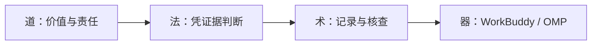
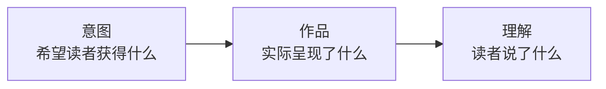

第一小节 · 从已有账号出发

# 把账号印象变成事实材料

先说清发生了什么，再解释为什么。

本节留下：一份账号说明，一份可核查的作品样本。

<!--
请学生打开自己的已有账号，不另起账号，也不要求马上重写定位。追问：“如果现在请别人判断你的账号，你能拿出哪些材料？”先收两种回答，说明今天先把愿望、记录和解释分开。依据讲义第1—20、45—56行；本页与后四页组成第一个10分钟段。
建议用时：1分钟
-->

---
layout: default
---

教学虚构 · P03《活动报名信息整理》

# 80次阅读，不能说明读者不需要

可核对的记录

同一虚构图文平台，P03发布后24小时：80次阅读。

尚未证实的解释

“读者不需要这个选题。”

没有证据，不能定位原因。

<!--
打开操作材料中的虚构样本，指给学生看P03编号、阅读次数和24小时窗口，而非展示并不存在的后台截图。追问：“这个数能排除触达、发布时间、标题或统计窗口的影响吗？”请学生把右边的话改称假设。真实记录还须保留采集时间和凭据；本例不是平台规律。依据讲义54—58、117—128行。
建议用时：2分钟
-->

---
layout: default
---

# 工具承接动作，不能替人负责

会操作工具，不等于判断有依据。

<!--
沿图解释同一件事的四个层面，不让学生背四个孤立定义。追问：“模型说应该追热点，谁来判断是否损害事实或被报道者？”强调对事实负责、尊重读者与被报道者、承认不确定性，不能用涨粉替代。今天器只辅助记录，后续再让Agent读取材料。依据讲义22—41行。
建议用时：2分钟
-->

---
layout: default
---

# 账号价值，不只有实用信息

理解与判断

报道：理解公共问题。

评论：比较不同理由。

看见与陪伴

摄影：看见被忽略的景象。

生活记录：建立陪伴感。

说清“谁获得什么”，不把所有作品改成攻略。

<!--
请学生用一句话描述自己某条作品希望带来的变化，不接受只有“获得价值”的空话。追问：“花了很久的工作，具体帮助作品完成了什么目的？”制作耗时本身既不能证明有价值，也不能证明浪费。屏幕列的是可能成立的价值，不是替学生宣布需求已得到验证。依据讲义58—60行。
建议用时：2分钟
-->

---
layout: default
---

# 把我的意图，与读者理解分开看

- 意图看本人说明；作品看标题、画面、正文与来源。
- 理解看原话和实际动作，不能由作者代答。

发现差异，先找线索；不要直接宣布定位失败。

<!--
让学生指认一条自己的作品，说出“我希望……”与“作品里能看到……”各一句；此时不要请作者代替读者回答第三项。追问：“你认定读者这样理解，有原话还是只有猜测？”说明箭头表示检查顺序，不是已经证实的因果关系，理解差异也不自动等于失败。依据讲义62—71行；至此累计10分钟。
建议用时：3分钟
-->

---
layout: default
---

# 先建三类输入，今天完成前两类

| 文件 | 记录什么 |
| --- | --- |
| `account-profile.md` | 已有内容、方向假设、现有条件 |
| `samples.md` | 作品、凭据、数据与时间 |
| `feedback-log.md` | 下节记录反馈原话与观察 |

本人先写账号说明，不让AI猜自己的账号。

<a class="material-link" href="./materials/index.html" target="_blank">打开完整操作材料</a>

<!--
现场打开账号说明模板，指明已发布内容与“希望服务谁”写法不同；没有核实的方向标假设，资源与时间由本人填写依据。展示个人项目目录，不合并全班账号；第三个文件留待下一节采集，不能现在编造反馈。提醒不写登录凭据，权限仅限本次目录，不登录、不发布、不覆盖输入。依据讲义73—103行。
建议用时：4分钟
-->

---
layout: default
---

# 连续五条看习惯，代表作解释方向

- 最近连续五条：不足就如实记录，不补造。
- 另选一条代表作：若已在五条中，沿用编号、不重复。

这是课堂便利取样，不是统计充分的样本。

只给标题，就只能判断标题；不能评价完整作品。

<!--
请学生按发布时间找最近连续作品，而非只挑表现好的作品。打开样本模板，示范从原作品保留编号、链接或本地凭据、标题与摘要；补齐发布和采集时间、平台指标原名、工时及来源。截图先做脱敏副本，移除私信、用户名列表、手机号与凭据；本地文件被云模型读取仍可能进入请求。依据讲义105—111行。
建议用时：3分钟
-->

---
layout: default
---

# 比较前，先确认数的是同一件事

是什么

同一平台、同一指标定义？

“阅读次数”不等于“独立人数”。

怎样采集

同一观察窗口、同类内容形式？

保留发布时间与数据采集时间。

口径未对齐：先不直接比较。

<!--
让学生在自己的后台或已有导出中找到指标原名，不要求交出账号权限。追问：“这个平台显示的是曝光、播放、阅读，还是观看人数？”再让学生找到采集时间；若只有当前累计值，不得伪写成发布后24小时。不同平台或定义不明时先标不可直接比较，不急着排好坏。依据讲义109、113—115行；本段累计10分钟。
建议用时：3分钟
-->

---
layout: default
---

教学虚构 · P03 · 同一图文平台 · 发布后24小时

# 4÷80算的是收藏次数与阅读次数之比

$$
\frac{\text{收藏次数 }4}{\text{阅读次数 }80}=5\%
$$

- 不是“5%的独立读者收藏”。
- 更不能推出“读者最喜欢信息整理”。

报告比例时，把分子、分母一起说出来。

<!--
重新指向虚构样本P03，不把收藏数换成收藏人数。请一位学生完整读出公式的两个指标名称，再追问：“我们有没有独立读者数据？有没有比较题材所需的其他证据？”答案都是否。5%是这个口径下的计算结果，不是受众偏好结论，也不能为来源核查免责。依据讲义123、128、134、541行。
建议用时：2分钟
-->

---
layout: default
---

教学虚构 · P05《今天的自习记录》· 发布后24小时

# 分母为零，比例就不可计算

原始记录

收藏次数：0

阅读次数：0

比例字段

0 ÷ 0 → 不可计算

不能填成0%。

<!--
指向P05的两个零，追问：“填0%会让后面的人误以为什么？”强调原始零值照实保留，只有比例不可计算；不能为了让表格整齐而补一个比例。后面做单篇比例平均时，P05也不能冒充一个0%参与。依据讲义125、130、132行。
建议用时：1分钟
-->

---
layout: default
---

教学虚构 · P04《一款学习软件的使用体验》

# 工时未知，就保留未知

制作小时：未知

- 不能填0，也不能拿其他作品的平均数补上。
- 涉及工时的效率比较：当前不能做。

缺失值不是失败，暗中补值才会误导判断。

<!--
打开样本工时字段，说明本例其他工时是虚构作者自报，P04没有记录。追问：“如果填平均数，我们是在恢复记录，还是制造记录？”让学生检查自己的工时来源，是记录、回忆估计还是未知；估计也须注明依据，不能伪装成实测。依据讲义124、130、508行。
建议用时：1分钟
-->

---
layout: default
---

教学虚构 · 最近作品与历史代表作

# R01单列，不混进最近作品的汇总

P01—P05

最近连续五条

观察窗口：发布后24小时

R01

特意选出的历史代表作

观察窗口：发布后7天

窗口不同，选样方式也不同：不能直接比高低。

<!--
让学生在虚构样本中圈出R01窗口，追问：“即使都是阅读次数，7天与24小时能直接排名吗？”再追问代表作为什么被选中，指出它不是最近连续取样的一部分。R01仍有解释账号方向的用途，但不混入最近五条汇总；不要为了多一个样本牺牲可比性。依据讲义107、126、130行。
建议用时：2分钟
-->

---
layout: default
---

教学虚构 · 只汇总P01—P05 · 发布后24小时

# 合并比值，先合并次数再相除

$$
\frac{\text{收藏合计 }9}{\text{阅读合计 }500}=1.8\%
$$

- 回答：这批作品的收藏总次数，相当于阅读总次数的多少？
- 按阅读次数加权；不是给每条作品相同权重。

只描述本批材料，不据此判定哪个选题更好。

<!--
教师展示完整虚构样本表，让学生核对最近五条合计500次阅读、9次收藏，确认没有混入R01。说明P05原始的零次数可在次数合计中保留，这不等于它有可计算的单篇比例。追问：“这个合计能排除题材、发布时间、形式同时变化吗？”不能。依据讲义119—134行。
建议用时：2分钟
-->

---
layout: default
---

教学虚构 · P01—P04的可计算比例 · P05排除

# 单篇比例平均，让每条作品权重相同

$$
\frac{2\%+0\%+5\%+2.5\%}{4}=2.375\%
$$

- 回答：这四条可计算作品的比例，平均是多少？
- 不同于合并比值1.8%；报告必须写明算法。

两个数回答不同问题，不能为好看而切换算法。

<!--
指明公式依次对应P01、P02、P03、P04，P05分母为零，不能当成0%加入平均。追问：“如果改用这个数，报告应补哪句话？”应说明平均的是哪些作品、为何排除P05、每条等权，而不是只换结果。提醒两种算法都不是选题优劣的因果证据。依据讲义128—134行；至此三个讲授段共30分钟。
建议用时：2分钟
-->

---
layout: default
---

15分钟实践 · 本页制作14分钟，末1分钟转出口检查

# 在自己的项目里，留下第一版事实材料

完成账号说明与作品样本；至少一条证据记录完整。

- 前4分钟：写已有内容、方向假设、条件与权限边界。
- 接着10分钟：录入连续作品与代表作，补凭据和采集口径。
- 来不及补齐的字段，明确标“待补”或“未知”。

<a class="material-link" href="./materials/index.html" target="_blank">打开完整操作材料</a>

<!--
启动15分钟活动计时，本页停留14分钟，最后1分钟翻到出口检查，活动总时长不另加。先展示完整模板与一条真实材料的填写过程，只用教师自己的或已获授权且脱敏的材料，不把虚构样本当学生作业。巡回追问“凭据在哪、何时采集、这句是事实还是愿望”。不足五条如实记；不代学生补数据。依据讲义88—111、136行。
建议用时：14分钟
-->

---
layout: default
---

实践末1分钟 · 保存后交接

# 能找到证据，才算完成第一版

- 打开两份文件：事实与方向假设能分清吗？
- 任指一条：能找到作品凭据、发布与采集时间、指标原名吗？
- 查边界：未知未补造，代表作未重复，敏感内容已脱敏吗？

下一节：先听同伴怎么理解，不先替账号作解释。

<!--
请学生保存account-profile.md和samples.md，实际点开一条凭据，而非只口头说已完成。窗口无法恢复的如实标明；其余待补字段列出，不要求赶出完整假表。最后问“哪句话还需要读者原话才能判断”，把问题带入无提示走查，本节不编造feedback-log。此页是15分钟实践的最后1分钟，全节45分钟。依据讲义103—111、136及学习要点11—12行。
建议用时：1分钟
-->
