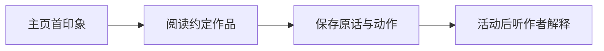
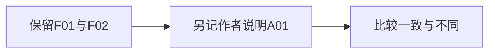

第2小节 · 45分钟

# 先听人，再请AI

没有你的讲解，同伴从页面里读出了什么？

带上已有主页与一条作品，留下可追溯的 `feedback-log.md`。

先暂缓解释，不把自己的意图告诉观察者。

<!--
承接上一小节已有的账号说明和样本，不重讲数据录入。请学生打开已获授权的主页与一条约定作品，暂时收起写有方向假设的账号说明。今天不评选好账号，只观察页面传达了什么，并留下下节Agent可用的记录。来源：讲义140—146、171行。
建议用时：1分钟
-->

---
layout: default
---

# 同伴的理解，只代表这次观察

我们正在做

无提示同伴走查

先看材料，再听作者解释。

我们没有做

不是双盲实验。

同班同学不代表目标用户。

记下谁看了什么，不宣布“受众已经验证”。

<!--
参与者通常认识彼此，本活动不是双盲，也不保证消除偏差。请学生把反馈者类别写为课堂同伴，是否属于目标用户未核实就保留未知。不能用一次课堂观察概括全部受众；后面也不计算理解偏差率。来源：讲义144行、教案158—160行。
建议用时：1分钟
-->

---
layout: default
---

# 先看主页，再看约定作品

- 主页约半分钟：主要有什么内容？从哪里看出？
- 作品给足阅读时间；只看片段，就注明范围。

先留下解释前的记录，再开始对照。

<!--
半分钟是课堂组织安排，不是注意力阈值。作者只帮助打开页面，不带对方寻找预设答案。作品超过本轮时间时，共同限定片段并写“未完整浏览”。若同伴停住，问“你现在看到了什么？”而不是代答；解释统一放到20分钟活动结束后。来源：讲义150—154行、教案169—173行。
建议用时：1分钟
-->

---
layout: default
---

# 问位置，不把原因塞进问题

避免诱导

“是不是封面不够吸引人？”

问题已经替对方选好了原因。

改为中性追问

“你刚才先看了哪里？”

请对方指出具体句子或画面。

不用凑三个缺点；没有明显障碍也可以如实记录。

<!--
示范语气保持平稳，不在问句后补“我觉得这里不清楚”。可继续问“哪一处让你不明白？”“如果需要用到信息，你还会核实什么？”学生只说好或不好时，请其指出位置；仍无问题就记录未遇明显障碍，不硬凑缺点。来源：讲义156—158行、教案175—184行。
建议用时：1分钟
-->

---
layout: default
---

# 11人都要观察，也都要被观察

4个双人组 ＋ 1个三人循环组 ＝ 11人

双人组 · 每轮10分钟

A看B，B记录；再交换。

每人得到一份账号记录。

三人组 · 每轮约6分钟

A看B、C记 B看C、A记 C看A、B记

三轮18分钟，另留2分钟切换。

<!--
当场确认四组双人和一组三人，并让三人组指认A、B、C，避免误以为每人要看完另外两人。三人组每人各一次观察、被观察和记录。先征得记录同意，只记必要的脱敏身份与材料。确认所有人知道自己首轮角色后开始统一计时。来源：讲义146、171行，教案169—172行。
建议用时：1分钟
-->

---
layout: default
---

活动 · 停留本页20分钟

# 先留下现场记录，暂不解释意图

每轮按此顺序

① 主页：首印象与线索。

② 作品：原话、动作、范围。

③ 核对：不补答，不改原意。

按上一页的分组轮换

双人：10分钟后交换。

三人：三轮各6分钟； 另留2分钟切换。

每个账号存一份 feedback-log.md；未完整浏览须标明。

<a class="material-link" href="./materials/index.html" target="_blank">打开完整操作材料</a>

<!--
本页持续投影20分钟，不提前翻到作者解释。双人组第10分钟交换；三人组每轮约6分钟，三轮共18分钟，累计留2分钟切换。巡回问“你从哪里看出来？”“这里想让你知道什么？”不替学生回答。卡住可指出当前阅读位置；作品过长就注明片段，打不开只协助操作。无法逐字记全时请同伴复述核对，不凭记忆润色成引语。无障碍也如实记；未观察的内容不补写。末尾检查每人都有自己的账号记录。来源：教案164—173行，讲义150—171行。
建议用时：20分钟
-->

---
layout: default
---

# 把说出的、看见的、想到的分开

先保留现场事实

原话：对方实际说了什么。

观察：记录者看见了什么动作。

再写解释

作者意图：原本希望表达什么。

记录者推测：为什么可能如此。

解释另栏保存，不能冒充原话或可见行为。

<!--
活动结束，先交换记录，请反馈者确认有没有误记。再让作者补充意图。问全班“停留很久”与“没有兴趣”分别属于什么：前者仍须有实际观察，后者是推测。没有可见行为可以留空，不从表情猜心理。后续用同一教学虚构案例练习分栏。来源：讲义160—171行、教案186行。
建议用时：2分钟
-->

---
layout: default
---

教学虚构 · demo-campus · F01

# F01记录理解，不直接判定原因

> “我以为这是校园生活记录，没看出固定的信息主题。”

- 材料：主页首印象；本练习没有主页截图。
- 边界：一位模拟同伴的理解，不是全体读者结论。

不能据此直接归因于简介或封面。

<!--
明确说明F01是编写的练习记录，没有开展真实访谈。请学生找出能确认的只有模拟同伴说了什么；当前没有主页截图，无法核对其线索，更不能直接断言封面失败。中性追问应是“你从哪里看出校园生活记录？”本案例未提供回答，不能让AI补造。来源：讲义164、518—521行。
建议用时：2分钟
-->

---
layout: default
---

教学虚构 · demo-campus · F02 / P03

# 找原页面的提问，不证明来源不存在

> “这条报名信息的原页面在哪里？”

观察 F02

模拟同伴看完P03后，询问原始页面。

当前材料边界

只有局部摘要，未提供原始说明与网址。

下一步核对来源位置与可访问性，不先判“没有信源”。

<!--
P03仍是审定案例中的活动报名信息整理，不能当作已取得完整作品。提问是原话；看完后询问是观察；“来源不醒目”则仍属解释。问学生“链接在未展开区域，能否也出现这条反馈？”让其保留可能性，不把假设写成已发生事实。来源：讲义165、504—507、523—527、541行。
建议用时：2分钟
-->

---
layout: default
---

教学虚构 · demo-campus · A01

# 作者的说明要追加，不能倒填

> “我原本希望给新生提供有用的信息。”

A01说明作者意图，不证明新生确有此需求。

<!--
让作者现在说明意图，但不要把原先的首印象改成“原来是新生信息服务”。解释后同伴有了新理解，可另记时间与阶段，原记录仍保留。若学生想“帮作者写得准确些”，提醒记录任务不是替作者修辞。A01为教学虚构，不是现场学生的真实愿望。来源：讲义154、166、529—532行。
建议用时：2分钟
-->

---
layout: default
---

# 对照理解差异，不给同伴打分

在自己的记录旁标出：一致、不同、尚不清楚。

- 用原话和作品位置说明你为何这样标。
- 作者解释后新增的理解，另记为讨论后反馈。
- 没有证据就保留未知，不强行判对或判错。

保留差异，不计算“理解一致率”或“偏差率”。

<!--
用两分钟让每人核对一条记录，并与同伴确认。可问“哪句话支持你说一致？”“不同的是内容主题还是下一步操作？”学生卡住时回到具体句子，不要求立即给出运营建议。如果双方仍说不清，就标尚不清楚并写待核问题。此时不把同伴当目标用户，不用百分比制造精度。来源：教案166—167行，讲义173—186行。
建议用时：2分钟
-->

---
layout: default
---

教学虚构 · 从F01与A01提出问题

# 一条线索，至少保留另一种解释

支持线索

F01首印象与A01意图不同。

待核：主页是否清楚表达信息服务方向？

其他解释

同伴未必属于目标受众。

只浏览了少量作品。

下一步：核对主页线索，请实际目标读者再看。

<!--
先让学生说这条线索支持什么，再问不能支持什么。不要跳到“账号定位失败”，也不默认只改简介就有效。请每人照此结构口头提出自己的一个问题：线索、其他解释、下一步补证。卡住时只选最能定位的一条原话；证据不够就提出需要取得的材料，不要求硬凑多个原因。来源：讲义167、173—180、537行。
建议用时：4分钟
-->

---
layout: default
---

# 保存的是证据链，不是一段好评

记录能追溯

反馈编号、账号代号、材料编号与浏览范围。

日期时间、反馈者脱敏代号与类别。

内容能区分

原话、可见动作；作者解释另记。

记录者解释、待核问题与局限。

更新并保存 feedback-log.md；让同伴核对一条记录。

<a class="material-link" href="./materials/index.html" target="_blank">打开完整操作材料</a>

<!--
给学生实际整理保存的时间，不把本页变成字段背诵。使用操作包完整模板，不把示例原话复制成自己的现场访谈。请同伴核对材料范围、原话和观察时间；不能确认逐字准确的内容标为转述，不加引号。只保留征得同意的必要身份信息。若引用评论，也需保留对应内容与上下文。来源：讲义169—171行、教案186行。
建议用时：4分钟
-->

---
layout: default
---

# 带着一个待验证问题交给Agent

先圈出：一条事实、一条解释、一个未知。

- 同伴检查：有没有把解释或未知写成事实？
- 文件齐备：账号说明、作品样本、现场反馈。
- 下节任务：让Agent依据材料起草诊断，再由人核查。

AI可以整理记录，不能编造“真实用户评价”。

<!--
抽取自愿分享的一条记录，追问它能支持什么、不能支持什么；其他学生完成三处标记。出口看是否有原话、对应材料、局限和一个可核问题，不要求得出账号改版结论。告诉学生下节把已有三个输入交给Agent；模拟角色可以帮助列待问问题，却不能顶替真实的人看过作品。来源：讲义169、186、535行，教案167行。
建议用时：2分钟
-->
