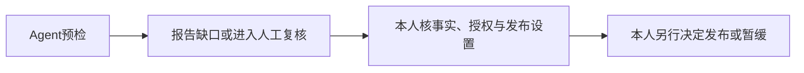
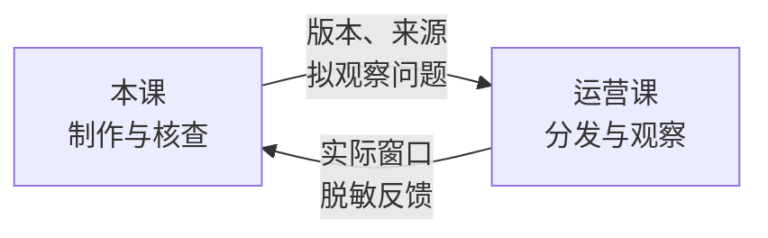

<div class="eyebrow">第4小节 · 45分钟</div>

# 只决定下一步

<div class="lead">诊断可以由工具起草，优先问题由本人选择。</div>

本节留下：一张行动卡，一条本人确认记录。

<div class="takeaway">不必重写整个账号；证据不足，先补证。</div>

<!--
承接上一节已核查的诊断草稿，请每人打开自己的材料，而不是重新让模型评价整个账号。说明本节只决定一个可继续工作的下一步，不要求换号、改定位或新设栏目。行动卡与本人确认记录是本节产物，作品发布仍是另一项决定。出处：讲义第四小节第1、2点。
建议用时：1分钟
-->

---
layout: default
class: lesson-slide
---

# 把“提高专业性”改成检查动作

<div class="pair">
<div>
<div class="label">愿望</div>
<p>提高专业性。</p>
<p>没有说明下一步做什么。</p>
</div>
<div>
<div class="label">动作</div>
<p>公共信息作品附原始页面、发布日期和适用范围。</p>
<p>发布前请同伴找到它们。</p>
</div>
</div>

<div class="takeaway">选最妨碍目的、证据较充分、目前有条件处理的问题。</div>

<!--
请学生比较两种说法：哪一种能让同伴知道该检查什么？这里的动作来自讲义第四小节开头，不是要求所有题材都变成公共信息指南。邀请人数和本次安排还需作者决定，屏幕没有替全班约定。若材料仍不足以确定问题，就将动作改为补证。
建议用时：1分钟
-->

---
layout: default
class: lesson-slide
---

<div class="eyebrow">教学虚构 · P03 / F02 · 未开展真实调查</div>

# P03先核对来源，不先改方向

- **F02原话**：“这条报名信息的原页面在哪里？”
- **材料现状**：练习未提供原始说明、网址、发布日期或适用范围。
- **下一步**：请作者打开原作品，核对来源位置与可访问性。

<div class="takeaway">当前材料不足以核查，不等于作品已经证实没有来源。</div>

<!--
沿用讲义实践示例中的P03与F02，不混入教案另一组样本。请学生指出“未提供原页面”和“没有来源”的差别。我们没有看到完整作品，也没有开展真实访谈，因此只能提出核对动作，不能说已查明问题，更不能据此要求账号停止生活内容。
建议用时：1分钟
-->

---
layout: default
class: lesson-slide
---

<div class="eyebrow">教学虚构 · P03来源核对</div>

# 一个问题，要能区分两种解释

<div class="lead">P03是否标出可核查来源，读者能否找到？</div>

<div class="pair">
<div>
<div class="label">解释一 · 待核</div>
<p>作品没有标来源。</p>
</div>
<div>
<div class="label">解释二 · 待核</div>
<p>来源已标出，但不容易找到。</p>
</div>
</div>

<div class="takeaway">先检查原作品；具备材料后，再观察读者如何找来源。</div>

<!--
出处为讲义实践示例中的合格诊断。请学生说出哪项新材料能够区分两种解释：首先需要原作品及其来源位置记录。若原作品仍不可取得，两种解释都应保留。之后的读者观察还应记录身份与浏览范围，不把一次课堂提问推广到所有目标用户。
建议用时：1分钟
-->

---
layout: default
class: lesson-slide
---

<div class="eyebrow">教学虚构 · 行动卡字段①② · 选择示范，不是已确认决定</div>

# 行动卡先写保留，再写调整

<div class="pair">
<div>
<div class="label">① 保留</div>
<p>暂不改变账号方向。</p>
<p>不因当前材料缺口推倒重来。</p>
</div>
<div>
<div class="label">② 调整或暂缓</div>
<p>本轮先补P03来源材料。</p>
<p>取得原作品后，再判断是否调整来源呈现。</p>
</div>
</div>

<div class="takeaway">暂缓要有复查点，不把低数据内容永久停做。</div>

<!--
这是待本人选择的写法示范，不是替虚构作者作出的决定。依据讲义第四小节行动卡字段与确认示例，请学生先说保留项的价值依据，再写本轮调整范围。若要暂停某项工作，应交代什么新材料出现时复查；不能只写“以后不做”。
建议用时：1分钟
-->

---
layout: default
class: lesson-slide
---

<div class="eyebrow">教学虚构 · 行动卡字段③④ · P03</div>

# 缺什么就写缺什么，不让AI代填安排

- **③ 验证问题**：来源是否标出、是否便于找到？
- **④ 材料与时间**：原作品、原始说明及必要授权：待取得、待核。
- **未提供的安排**：本次预算、邀请人数、观察时限、判断规则：待本人确认。

<div class="takeaway">每周可用时间 ≠ 本次预算；设想中的素材 ≠ 已取得的材料。</div>

<!--
出处为讲义第四小节行动卡任务。提醒学生材料字段还需说明由谁取得、从哪里核对；不得编造采访、学校政策或已获授权。案例账号的每周时间不能自动换成本次预算。若模型自定人数、时限或通过线，应直接改正对应字段，不能仅在结尾追加免责声明。
建议用时：1分钟
-->

---
layout: default
class: lesson-slide
---

<div class="eyebrow">教学虚构 · 行动卡字段⑤⑥ · P03</div>

# 观察写行为，确认写责任人

<div class="pair">
<div>
<div class="label">⑤ 观察办法</div>
<p>记录读者指出的来源位置、原话及浏览范围。</p>
<p>时间、比较对象：待本人确认。</p>
</div>
<div>
<div class="label">⑥ 人工确认</div>
<p>写确认人、日期、范围及待核事项。</p>
<p>本人核事实与授权；发布另行批准。</p>
</div>
</div>

<div class="takeaway">找到来源的质性线索，不能直接证明流量改善。</div>

<!--
请学生尝试说出自己实际能观察的行为，而不是先定“合格率”。讲义要求保留可能的其他解释，并写清观察窗口与指标定义；若使用平台指标，还需保留原名、分母和可比窗口。人工确认仅覆盖明确写出的范围，确认行动卡不代表事实、授权和发布全部通过。
建议用时：1分钟
-->

---
layout: default
class: lesson-slide
---

# MVP缩小范围，不降低真实性要求

<div class="pair">
<div>
<div class="label">可以减少</div>
<p>与本次验证无关的统一包装。</p>
<p>整季选题与自动发布系统。</p>
</div>
<div>
<div class="label">不能减少</div>
<p>必要采访与事实核查。</p>
<p>授权、隐私和准确性要求。</p>
</div>
</div>

<div class="takeaway">先做一期能检验核心想法的完整作品，不做缺核查的半成品。</div>

<!--
用讲义第四小节的最小可行产品思路解释：最小的是试验范围，不是新闻真实性。它只在确实需要试做作品时帮助控制范围，并非人人必须开微栏目。若目前只能补证，补证就是下一步；不能为交出所谓最小产品而声称采访已经完成或省略来源核对。
建议用时：1分钟
-->

---
layout: default
class: lesson-slide
---

<div class="eyebrow">教学虚构 · P03确认示范 · 任务节选，完整文件见操作包</div>

# 先发本人确认，再请Agent生成

> 我优先核对 P03 的来源是否便于读者找到，暂不改变账号方向。

```text
若我尚未确认优先问题，只列候选并等待，不替我选择。
生成 output/action-card-draft.md；如文件存在先停下。
不要修改输入、发布作品或更新长期规则。
```

<a class="material-link" href="./materials/index.html" target="_blank">打开完整操作材料</a>

<!--
出处为讲义第四小节任务与确认示例。先由学生用自己的证据表达选择，不要求复制P03结论。沿用当前WorkBuddy或OMP，提供账号说明、样本、反馈和诊断草稿，再发送操作包完整任务；屏幕节选不是完整替代。已有输出先停止，等待本人指定新输出名，不覆盖批注版本。
建议用时：1分钟
-->

---
layout: default
class: lesson-slide
---

# 预检只报缺口，批准必须由人做



- 人工检查：事实有据、表达可懂、权利与隐私、材料能否支持结论。
- 材料不足：补材料或缩小结论，暂不发布。

<div class="takeaway">“可以进入人工复核”不等于“已经安全、准确、获准发布”。</div>

<!--
按讲义第四小节第3点讲解。Agent可能打不开来源、误读引文，也不知道授权是否真实，不能用高分代替逐项复核。让学生指出流程中谁承担最终决定。获本人批准后，也由本人在平台发布并留存版本；本次课堂行动卡任务没有获得平台操作权限。
建议用时：1分钟
-->

---
layout: default
class: lesson-slide
---

<div class="eyebrow">当堂活动 · 15分钟 · 停留本页操作</div>

# 做一张能继续工作的行动卡

1. **选问题**：对照诊断与材料编号，本人发出优先问题确认。
2. **写草稿**：发送完整任务，或按同一字段人工填写行动卡。
3. **互查并保存**：只验证一个问题；未知不代填；本人确认范围写入日志。

<div class="practice-box">打开实际的 output/action-card-draft.md；在 audit-log.md 保存确认与待核事项。</div>

<a class="material-link" href="./materials/index.html" target="_blank">打开完整操作材料</a>

<!--
完整保留十五分钟活动，不另加课外计时。开始先确认问题，再沿用当前工具生成；工具不可用时按操作包模板人工填写。巡回查看真实输出，重点查材料编号、复查点、素材与授权、预算人数时限和判断规则。同伴检查后由本人决定修订，未定事项仍写待确认。末段保存行动卡与日志，不以聊天回复代替文件。
建议用时：15分钟
-->

---
layout: default
class: lesson-slide
---

<div class="eyebrow">全员汇报 · 11人 × 1分钟 = 11分钟</div>

# 每人一分钟，说清四句话

> 我保留什么；
>
> 我依据哪条材料调整什么；
>
> 下一次观察什么；
>
> 什么还不知道。

<div class="takeaway">说材料编号和下一步，不用一分钟重讲整个账号。</div>

<!--
依讲义第四小节当堂操作，给十一名学生每人一分钟，按座位顺序计时。听众只记录需要澄清的证据、其他解释或责任边界，集中到下一页处理，不挤占后面同学时间。允许报告“本轮不调整，先补证”，不把口才、账号流量或选题相同当作诊断质量。
建议用时：11分钟
-->

---
layout: default
class: lesson-slide
---

<div class="eyebrow">汇报机动 · 4分钟 · 切换、共性追问与修订</div>

# 共性问题，只追问证据和边界

- 这一步由哪条材料支持，还保留什么解释？
- 哪些素材尚未取得，哪些安排尚未由本人确认？
- 谁核事实与授权，什么材料出现后再判断？

<div class="practice-box">把需要补充的内容写回行动卡，不在现场强行定案。</div>

<!--
这四分钟属于十五分钟汇报段内的机动，用于切换、共性追问和提醒修订，不是另加活动。优先处理把来源缺口写成事实、擅定预算人数与通过线、把预检当发布批准等共性问题。若没有切换延误，留给学生修订与确认；教师不统一裁决换号，不为赶结课编出未知答案。
建议用时：4分钟
-->

---
layout: default
class: lesson-slide
---

# 规则写清适用范围，才值得留到下次

<div class="eyebrow">教学虚构 · 候选规则示范，待本人确认</div>

> 本轮涉及时效性公共信息的作品，发布前核对原页面与更新时间。

- **适用范围**：本轮时效性公共信息，不扩展成所有作品的增长公式。
- **日志记录**：决定日期、适用范围、依据、本人确认、复查条件。

<div class="takeaway">先存 audit-log.md；下一次明确要求读取，不假定工具自动记住。</div>

<!--
出处为讲义第四小节第4点。强调屏幕是候选写法，不能假装学生已经认可。让学生在日志写本人实际确认的经验，并说明出现什么新材料时重新检查；未定复查条件就保留待本人确认。产品记忆、自动加载上下文与普通文件不是同一机制；自动加载要另查设置并用新会话确认。
建议用时：2分钟
-->

---
layout: default
class: lesson-slide
---

# 两门课接续同一条作品的证据链



- 准备发布时交已确认版本；分发不能夸大材料支持的结论。
- 反馈回填 `feedback-log.md`，判断变化记入 `audit-log.md`。

<div class="takeaway">截止时间、作业互认与成绩折算：须由任课教师确认。</div>

<!--
讲义第四小节第5点按相对节点交接，不预设另一门课星期几。制作前先交优先问题、行动卡与素材缺口；准备发布时再交版本、来源及标题封面方案。观察后带回发布时间、指标原名、观察时间和脱敏反馈，不混比不同窗口，不把一次波动变永久规则，也不宣称本次提交已抵扣另一门作业。
建议用时：2分钟
-->

---
layout: default
class: lesson-slide
---

# 本次交一套材料，不另写一篇论文

<div class="pair">
<div>
<div class="label">材料与诊断</div>
<p>账号说明、样本、走查记录。</p>
<p>有材料编号的诊断草稿。</p>
</div>
<div>
<div class="label">行动与核验</div>
<p>行动卡：一个下一步与待核项。</p>
<p>日志：一次人工核验与纠错记录、本人确认。</p>
</div>
</div>

<div class="takeaway">真实资料不足列缺口；虚构练习不能替代真实作业。不强迫改号。</div>

<a class="material-link" href="./materials/index.html" target="_blank">打开完整操作材料</a>

<!--
只收束讲义基础练习，不增加进阶论文或新建栏目任务。提醒文件沿用前面三节加本节产物；若上一节未发现错误，保留已完成的缺失信息测试及核查记录，不捏造纠错。真实作业使用脱敏材料，提交渠道与截止时间待教师确认。下一次选题从行动卡接续，不要求重建账号。
建议用时：1分钟
-->
